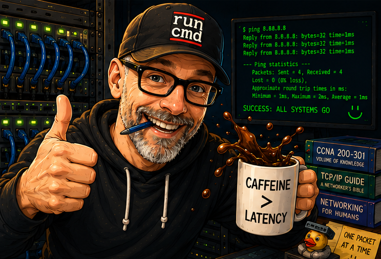
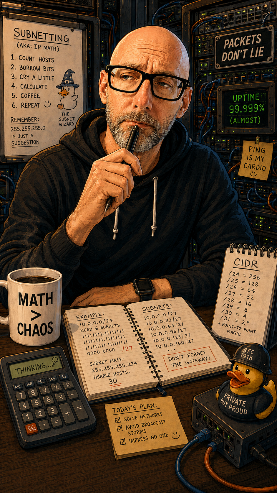
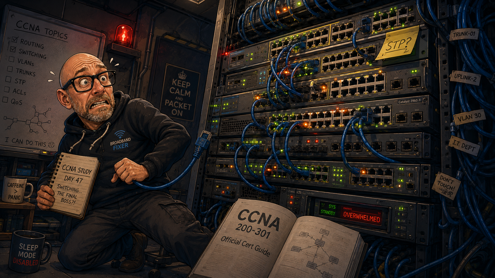
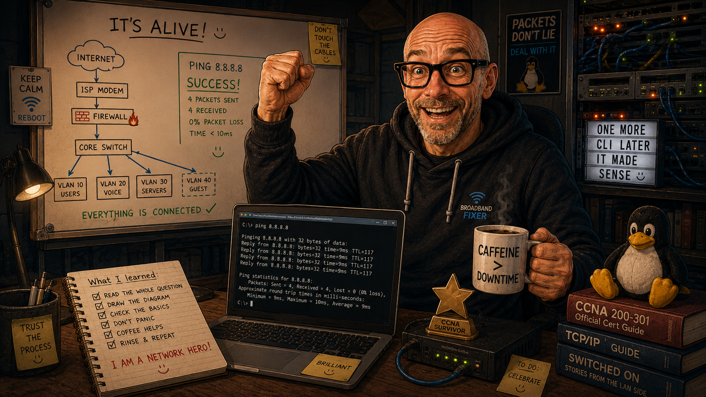

# CCNA Learning Journal

<table>
<tr>
<td valign="top">

### This journal documents my hands-on learning journey while studying for the Cisco CCNA certification. It tracks progress, challenges, troubleshooting experiences, and key technical concepts learned through practical lab work.

</td>
</tr>

<tr>

<td align="center">

</td>

</tr>
</table>

---

## Start of Journey (May 2026)

### I have begun building a structured lab portfolio to reinforce networking theory through practical configuration and troubleshooting using Cisco IOS.

The goal is to develop strong foundational knowledge in:
- Switching and VLANs
- Routing (static and dynamic)
- Network troubleshooting methodologies
- CLI fluency and confidence
- Understanding real-world network behaviour

---

## Initial Focus Areas

At the start of my labs, I am focusing on:

- Basic switch configuration
- Cisco IOS command-line navigation
- Interface configuration and verification
- Understanding VLAN 1 management
- Saving and verifying configurations

---

## Early Observations

- CLI navigation requires repetition to become fluent
- Verification commands are just as important as configuration
- Small misconfigurations (e.g. missing `no shutdown`) can break connectivity
- Structured troubleshooting is essential rather than random command use

---

<table>
<tr>
<td valign="top">

## Lab Progress

- CLI navigation and command use is improving
- Understanding of the practical transit of data is deepening
- OSI model becoming clearer
- Beginnings of exploration in to securing networks
- Populating, interrogating and controlling the CAM table
- ARP requests and IP ping
- Locating devices within LAN from IP address starting point

</td>

<td align="center">

</td>

</tr>
</table>

## Three Weeks In

### My thoughts on progress so far..

- #### Having completed the initial phase of learning, I wanted to pause to reflect on the process up to this point. If I'm really honest, I am  feeling really quite over-whelmed by the vastness of the subject.

- #### Networking is such a huge topic. It touches on so many aspects of every day life with so many complexities, frameworks, protocols, and acronyms (**bloody acronyms**) to understand that it really is too easy to feel like learning it all will forever be beyond me.

- #### To try to get my anxieties under control I have decided to list out what I have actually learned so far though, so that, with any luck, I will be able to look back on this at a later date with pride at how far I have developed. 

- #### Equally, if any other **CCNA** students are reading this, I hope that my situation might feel familiar to you and you might be somewhat reassured that you are not alone in how you're feeling.

- #### So here we go! My learnings so far:
    - #### I have learned about the existence of Packet Tracer, EVE-NG and GNS3. If you haven't come across these three yet, check them out. They are all free ways to practice putting networks together without the expense of physical equipment and they give you plenty of chance to try to understand the CLI
    - #### Speaking of that, I have learned about and used the CLI (Cisco IOS Command-Line Interface) which is used for configuring, monitoring, and maintaining Cisco devices. *BTW if you're confused by the mention of IOS, go ahead and google Cisco and Apple, it was a whole thing a little while back apparently.*
    - #### I am able to move between User EXEC, Privileged EXEC, and Global Configuration modes in the CLI and I know how to password protect devices. I can even "hash" those passwords so they can't be discovered too easily. Alongside this I can carry out other basic tasks like assigning an IP address to an interface, setting a default gateway, how to ping IP addresses and I'm learning to use terminal on Windows more.
    - #### Yesterday I added more RAM to my laptop to help it cope with the extra demands I'm placing upon it (never done that before!). I then, almost immediately, installed Ubuntu and Kali Linux so I can start teaching myself about the wonders of the Linux world too - I'm not sure things are going to get any easier for this poor old laptop any time soon 
    - #### I know what the OSI and TCP/IP models are and am developing a good understanding of the various layers. *I definitely recognise a layer 8 problem*
    - #### My ability to interrogate CAM and ARP tables so I can discover which device connects where is improving. Related to that, I know what a MAC address is and I know that the hexadecimal numbering system consists of the numbers 0-9 and the letters A - F.
    - #### My understanding of a broadcast storm is pretty good (I know what one is and what causes one - next challenge is to learn how to stop one)

## Overall, I think I'm doing ok. 
### I know that this stuff will sound like nothing to many of you out there but getting to this point is a genuine success for a novice like me. 
### I still have a **looooong** way to go but I will stick to it and I'll soon be looking back on these small steps as a great start to a really exciting journey.  
### I will keep you posted