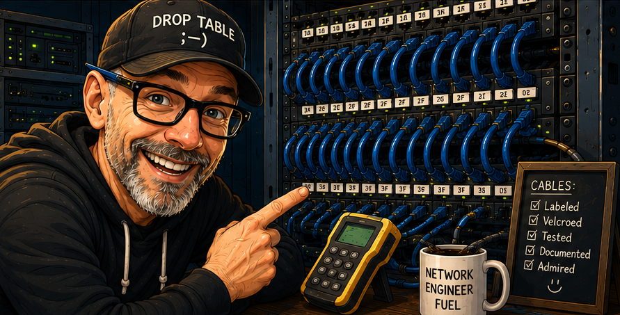

# Network Engineering Labs

### Hands-on Cisco CCNA networking labs, troubleshooting exercises, and learning journal.

  

## Lab Workflow

<table>
<tr>
<td valign="top">

Each lab follows this structure:

1. Create lab folder in `/labs`
2. Copy `templates/lab-template.md`
3. Complete configuration in Cisco CLI (Packet Tracer / emulator)
4. Document commands + explanations
5. Add topology diagrams / screenshots
6. Commit changes with descriptive messages
7. Push to GitHub

</td>

<td valign="top">

</td>

</tr>
</table>

## Skills Demonstrated

- Cisco IOS CLI configuration
- VLAN creation and management
- Switch and router interface configuration
- Network troubleshooting methodology
- Documentation of technical processes

  
  

