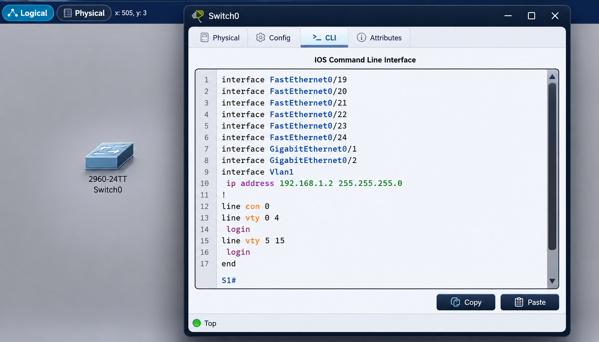

# Lab 001 - Basic Switch Configuration

<p class="back-link">
  <a href="../../Lab-index.html">← Back to Lab Index</a>
</p>

<table>
<tr>
<td colspan="2" valign="top">

<h1>Objective</h1>

<ul>
  <li><h3>Learn and apply basic Cisco switch configuration using the IOS CLI.</h3></li>
  <li><h3>Move between user EXEC, privileged EXEC and global configuration modes.</h3></li>
  <li><h3>Configure a switch hostname so the device is easy to identify.</h3></li>
  <li><h3>Disable DNS lookup to avoid delays after mistyped commands.</h3></li>
  <li><h3>Protect privileged EXEC mode with an enable secret.</h3></li>
  <li><h3>Configure a management SVI so the switch can be managed using an IP address.</h3></li>
  <li><h3>Save the running configuration so the changes survive a reload.</h3></li>
  <li><h3>Use verification commands to confirm the final configuration.</h3></li>
</ul>

</td>
</tr>

<tr>
<td valign="top">

</td>
</tr>
</table>

---

## Scenario

This was the first basic Cisco switch configuration lab.

The aim was to take a default Cisco 2960 switch and apply a simple management configuration. This included setting the hostname, preventing DNS lookup delays, securing privileged mode, assigning a management IP address and saving the configuration.

The workflow was:

```text
Enter privileged mode → Enter global config → Set hostname → Disable DNS lookup → Set enable secret → Configure management SVI → Save → Verify
```

This lab forms the foundation for later switch configuration work. The commands are simple, but they introduce the core IOS workflow used throughout the rest of the labs.

---

## Devices Used

| Device            | Role                    |
| ----------------- | ----------------------- |
| Cisco 2960 switch | Device being configured |
| PC                | Management/test device  |

---

## Final Configuration Summary

| Item                 | Final Setting    |
| -------------------- | ---------------- |
| Hostname             | `S1`             |
| DNS lookup           | Disabled         |
| Enable secret        | Configured       |
| Management interface | `Vlan1`          |
| Management IP        | `192.168.1.2/24` |
| Configuration saved  | Yes              |

---

# Configuration Steps

---

## Step 1 - Enter Privileged EXEC Mode

```bash
enable
```

### Explanation

Cisco devices usually begin in user EXEC mode:

```text
Switch>
```

The `enable` command moves into privileged EXEC mode:

```text
Switch#
```

Privileged EXEC mode allows access to more powerful verification and configuration commands.

---

## Step 2 - Enter Global Configuration Mode

```bash
configure terminal
```

### Explanation

Global configuration mode is where device-wide configuration changes are made.

After entering this command, the prompt changes to:

```text
Switch(config)#
```

This confirms that the switch is ready to accept configuration commands.

---

## Step 3 - Set the Hostname

```bash
hostname S1
```

### Explanation

The hostname changes the device prompt from the default name to something easier to identify:

```text
S1(config)#
```

This is a small but important habit. In larger labs or real networks, meaningful hostnames help prevent accidentally configuring the wrong device.

---

## Step 4 - Disable DNS Lookup

```bash
no ip domain-lookup
```

### Explanation

By default, some Cisco devices try to resolve mistyped commands as hostnames. This can cause annoying delays while the switch attempts DNS lookup.

Disabling DNS lookup makes the CLI more forgiving during lab work. If a command is mistyped, the switch returns control more quickly.

---

## Step 5 - Configure the Enable Secret

```bash
enable secret class
```

### Explanation

The enable secret protects privileged EXEC mode.

This matters because privileged EXEC mode gives access to sensitive commands such as:

```bash
show running-config
configure terminal
write memory
reload
```

For a public GitHub portfolio, I would usually redact real secrets, for example:

```bash
enable secret <redacted>
```

---

## Step 6 - Configure the Management SVI

```bash
interface vlan 1
ip address 192.168.1.2 255.255.255.0
no shutdown
```

### Explanation

A Layer 2 switch uses a Switch Virtual Interface, or SVI, for management IP access.

In this lab, the management SVI was:

```bash
interface vlan 1
```

The switch was assigned:

```text
192.168.1.2/24
```

The `no shutdown` command enables the SVI. Without it, the interface may remain administratively down and the switch may not be reachable using its management IP.

---

## Step 7 - Save the Configuration

```bash
write memory
```

### Explanation

Configuration changes are first stored in the running configuration.

The `write memory` command saves the running configuration to startup configuration so the settings are retained after a reload.

Without this step, the switch could return to its previous configuration after being restarted.

---

# Verification

## Recommended Verification Commands

```bash
show ip interface brief
show running-config
```

---

## Management Interface Verification

```bash
show ip interface brief
```

Expected result:

```text
Interface              IP-Address      OK? Method Status                Protocol
Vlan1                  192.168.1.2     YES manual up                    up
```

The key things to confirm are:

| Field      | Expected      |
| ---------- | ------------- |
| Interface  | `Vlan1`       |
| IP address | `192.168.1.2` |
| Status     | `up`          |
| Protocol   | `up`          |

If the interface shows `administratively down`, it likely needs:

```bash
no shutdown
```

---

## Running Configuration Verification

```bash
show running-config
```

Useful items to check:

```text
hostname S1
no ip domain-lookup
enable secret
interface Vlan1
 ip address 192.168.1.2 255.255.255.0
```

This confirms that the intended base configuration is present.

---

# Troubleshooting

## Issue 1 - VLAN 1 interface stayed down

### What happened

The management interface did not come up as expected.

### Diagnosis

The issue was identified using:

```bash
show ip interface brief
```

This command showed that the VLAN interface was not active.

### Fix

The SVI was enabled using:

```bash
interface vlan 1
no shutdown
```

### Lesson

Assigning an IP address is not always enough. Interfaces, including virtual interfaces, may also need to be enabled with `no shutdown`.

---

## Issue 2 - Typo in the IP address caused connectivity failure

### What happened

A mistyped IP address prevented the expected management connectivity.

### Diagnosis

The configured IP address was checked using:

```bash
show ip interface brief
```

### Fix

The incorrect address was corrected under the VLAN interface.

### Lesson

Verification commands are essential. A small typo in an IP address can completely break connectivity, but it is usually easy to spot with the right show command.

---

# Key Learnings

* `enable` moves from user EXEC mode to privileged EXEC mode.
* `configure terminal` enters global configuration mode.
* Hostnames make devices easier to identify.
* `no ip domain-lookup` prevents delays after mistyped commands.
* `enable secret` protects privileged EXEC access.
* A Layer 2 switch uses an SVI for management IP addressing.
* `no shutdown` is required to enable an administratively disabled interface.
* `write memory` saves the running configuration.
* `show ip interface brief` is one of the most useful first verification commands.

---

# Improvements for Next Time

* Verify each configuration section immediately after applying it.
* Use a consistent checklist for basic switch setup.
* Record both the configuration commands and the verification outputs.
* Redact passwords and secrets before publishing configs publicly.
* Add a short note explaining the difference between physical switchports and an SVI.
* Include a screenshot of `show ip interface brief` once the management interface is working.

---

# Final Result

This lab successfully applied a basic Cisco switch configuration.

The switch was renamed `S1`, DNS lookup was disabled, privileged mode was protected with an enable secret, and VLAN 1 was configured with the management IP address `192.168.1.2/24`.

The main takeaway was that even a simple base configuration follows a repeatable structure:

```text
Identify the device → Secure access → Configure management → Save → Verify
```

This workflow became the foundation for the later switching and troubleshooting labs.
