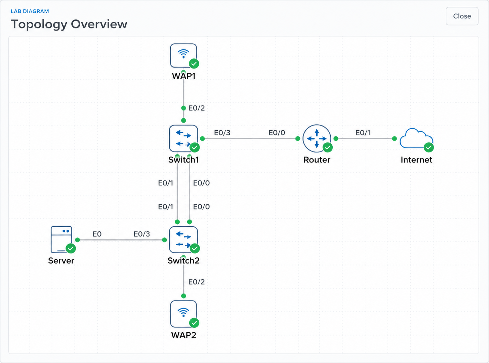

# Lab 002 - Cisco Base Configuration

<p class="back-link">
  <a href="../../Lab-index.html">← Back to Lab Index</a>
</p>

<table>
<tr>
<td colspan="2" valign="top">

<h1>Objective</h1>

<ul>
  <li><h3>Apply a base configuration to a Cisco switch.</h3></li>
  <li><h3>Rename the switch so the device prompt clearly identifies its role.</h3></li>
  <li><h3>Configure a message-of-the-day banner for access warning.</h3></li>
  <li><h3>Protect privileged EXEC, console and VTY access.</h3></li>
  <li><h3>Enable password encryption for locally stored passwords.</h3></li>
  <li><h3>Configure a management SVI on VLAN 1.</h3></li>
  <li><h3>Add a useful interface description to the uplink port.</h3></li>
  <li><h3>Save the running configuration so the changes survive a reload.</h3></li>
</ul>

</td>
</tr>

<tr>
<td valign="top">

</td>

</tr>
</table>

---

## Scenario

This lab covers the first layer of configuration I would expect to apply to a new Cisco switch before it is put into service.

The goal was to take a default switch and give it a basic operational identity, local access protection, remote access controls, a management IP address and a labelled uplink.

The workflow was:

```text
Enter privileged mode → Enter global config → Set identity → Secure access → Configure management SVI → Label uplink → Save configuration
```

This is not a complex topology lab, but it is an important one. These base steps make the device easier to identify, safer to access and easier to manage later.

---

## Devices Used

| Device        | Role                          |
| ------------- | ----------------------------- |
| `Cafe-01-SW1` | Cisco switch being configured |
| `PC`          | Management/test endpoint      |

---

## Final Configuration Summary

| Item                 | Final Setting                 |
| -------------------- | ----------------------------- |
| Hostname             | `Cafe-01-SW1`                 |
| MOTD banner          | Unauthorised access warning   |
| Enable secret        | Configured                    |
| Console access       | Password protected            |
| VTY access           | Password protected            |
| Remote transport     | SSH only                      |
| Password encryption  | Enabled                       |
| Management interface | `Vlan1`                       |
| Management IP        | `192.168.10.10/24`            |
| Uplink interface     | `Ethernet0/0`                 |
| Uplink description   | `Uplink-to-Core-Distribution` |
| Configuration saved  | Yes                           |

---

# Configuration Steps

---

## Step 1 - Enter Privileged EXEC and Global Configuration Mode

```bash
enable
configure terminal
```

### Explanation

The switch starts in user EXEC mode:

```text
Switch>
```

The `enable` command moves into privileged EXEC mode:

```text
Switch#
```

From there, `configure terminal` enters global configuration mode:

```text
Switch(config)#
```

This is where most device-wide configuration changes are made.

---

## Step 2 - Configure the Switch Hostname

```bash
hostname Cafe-01-SW1
```

### Explanation

The hostname changes the CLI prompt from a generic default name to something meaningful:

```text
Cafe-01-SW1(config)#
```

This makes it much easier to confirm which device is being configured, especially when working across multiple consoles or terminal windows.

---

## Step 3 - Configure the MOTD Banner

```bash
banner motd ^Unauthorized access ends badly. Authorized Castle Rysen engineers only.^
```

### Explanation

The message-of-the-day banner displays when someone connects to the device.

In a real environment, banners are used to make it clear that access is restricted to authorised users. In this lab, the banner also fits the Castle Rysen theme while still representing a standard network security practice.

---

## Step 4 - Protect Privileged EXEC Mode

```bash
enable secret C4stleRysen!
```

### Explanation

The enable secret protects privileged EXEC mode.

This matters because privileged EXEC mode gives access to powerful show, copy, reload and configuration commands.

For a public GitHub portfolio, I would normally redact the actual secret, for example:

```bash
enable secret <redacted>
```

---

## Step 5 - Configure Console Access

```bash
line con 0
password VaultAccess
login
```

### Explanation

The console line controls local physical/console access to the switch.

The `password` command sets the console password, and `login` tells the switch to actually require that password.

Without `login`, the password may be present in the configuration but not enforced.

---

## Step 6 - Enable Password Encryption

```bash
service password-encryption
```

### Explanation

This command encrypts plain-text passwords in the running configuration.

It is not the same as using strong password hashing, but it does prevent casual viewing of line passwords in plain text when someone runs:

```bash
show running-config
```

This is a basic hardening step and commonly appears in introductory Cisco labs.

---

## Step 7 - Configure VTY Remote Access

```bash
line vty 0 4
password ShelterAccess
login
transport input ssh
exit
```

### Explanation

The VTY lines control remote terminal access to the switch.

This configuration does three things:

| Command                  | Purpose                                  |
| ------------------------ | ---------------------------------------- |
| `password ShelterAccess` | Sets the VTY line password               |
| `login`                  | Requires authentication on the VTY lines |
| `transport input ssh`    | Restricts remote access to SSH only      |

The key security improvement here is:

```bash
transport input ssh
```

This avoids allowing insecure Telnet access.

For a production-quality SSH configuration, I would also expect a domain name, local username, RSA keys and SSH version 2. This lab introduced the idea of restricting VTY access, and later labs build on that.

---

## Step 8 - Configure the Management SVI

```bash
interface vlan1
ip address 192.168.10.10 255.255.255.0
no shutdown
```

### Explanation

A Layer 2 switch does not normally receive its management IP on a physical access port. Instead, it uses a Switch Virtual Interface, or SVI.

In this lab, the SVI was:

```bash
interface vlan1
```

The IP address assigned was:

```text
192.168.10.10/24
```

The `no shutdown` command enables the SVI so it can be used for switch management.

This was the part that was initially unclear: “enable the SVI” means bring the virtual interface up with:

```bash
no shutdown
```

The SVI will only become fully usable if VLAN 1 is active and there is at least one relevant active port in that VLAN.

---

## Step 9 - Label the Uplink Interface

```bash
interface ethernet0/0
description Uplink-to-Core-Distribution
```

### Explanation

Interface descriptions are simple but very useful.

This description tells anyone checking the switch later that `Ethernet0/0` is intended to connect upstream towards the core/distribution part of the network.

Instead of seeing only:

```text
Ethernet0/0
```

an engineer can see:

```text
Ethernet0/0 - Uplink-to-Core-Distribution
```

That saves time during troubleshooting.

---

## Step 10 - Save the Configuration

```bash
copy running-config startup-config
```

### Explanation

Cisco devices keep active changes in the running configuration.

The command above saves those changes to startup configuration, meaning the switch should keep them after a reload.

Without this step, the configuration could be lost if the device restarts.

---

# Verification

## Recommended Verification Commands

```bash
show ip interface brief
show running-config
```

---

## What to Check

### Management SVI

```bash
show ip interface brief
```

Expected result:

```text
Vlan1    192.168.10.10    YES manual    up    up
```

or at minimum, the SVI should show the correct IP address and should not be administratively down.

### Hostname

```bash
show running-config | include hostname
```

Expected result:

```text
hostname Cafe-01-SW1
```

### Banner

```bash
show running-config | section banner
```

Expected result should include the configured MOTD text.

### Uplink Description

```bash
show running-config interface ethernet0/0
```

Expected result should include:

```text
description Uplink-to-Core-Distribution
```

### Password Encryption

```bash
show running-config
```

Expected result: line passwords should not appear in plain text after `service password-encryption` has been applied.

---

# Troubleshooting

## Issue 1 - I was unsure what “enable the SVI” meant

### What happened

The lab asked for the SVI to be enabled for management, but I was initially unsure what this meant.

### Diagnosis

On a switch, the management IP is applied to an SVI such as:

```bash
interface vlan1
```

Like physical interfaces, this virtual interface can be administratively shut down or enabled.

### Fix

The SVI was enabled using:

```bash
no shutdown
```

### Lesson

An SVI is a virtual Layer 3 interface for switch management. To make it usable, it needs an IP address and must not be shut down.

---

## Issue 2 - Console password was entered incorrectly at first

### What happened

The command line showed an interrupted entry while setting the console password:

```text
password VaultAccessCafe-01-SW1(config-line)# ^C
```

### Diagnosis

The command prompt became mixed into the password entry, so the password command needed to be re-entered cleanly.

### Fix

The password was correctly entered again:

```bash
password VaultAccess
login
```

### Lesson

If a command entry becomes messy or interrupted, it is better to cancel and re-enter it cleanly rather than risk saving an unintended value.

---

# Key Learnings

* A hostname makes the device prompt meaningful and reduces the chance of configuring the wrong device.
* MOTD banners are a standard part of basic device access control and warning.
* `enable secret` protects privileged EXEC mode.
* Console access requires both a password and the `login` command.
* VTY lines control remote CLI access.
* `transport input ssh` restricts remote access to SSH.
* `service password-encryption` hides plain-text line passwords in the running configuration.
* A switch management IP is configured on an SVI, not directly on a normal access port.
* `no shutdown` is used to enable both physical and virtual interfaces.
* Interface descriptions are useful documentation built directly into the device config.
* Configuration must be saved if it needs to survive a reload.

---

# Improvements for Next Time

* Use placeholders for secrets when publishing configurations publicly.
* Verify each section immediately after configuring it.
* Add SSH support more completely by including:

  * local username
  * domain name
  * RSA key generation
  * SSH version 2
* Add `show interfaces description` to confirm interface labels.
* Add `show startup-config` or reload testing if the lab requires proof that the configuration survived.
* Be clearer on the difference between enabling an SVI and enabling a physical uplink.

---

# Final Result

This lab successfully applied a base configuration to a Cisco switch.

The switch was renamed `Cafe-01-SW1`, given a warning banner, protected with local access controls, configured for SSH-only VTY transport, assigned a management IP address on `Vlan1`, and given a labelled uplink interface.

The lab introduced the first practical building blocks of Cisco device administration:

```text
Identity → Access control → Management IP → Interface documentation → Save configuration
```

These steps form a useful baseline for later, more advanced switch and router configuration labs.
