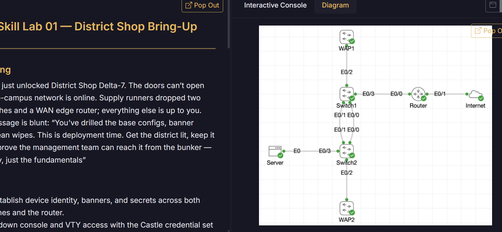

# Lab 003 - Small Network Config: Micro Campus

<p class="back-link">
  <a href="../../Lab-index.html">← Back to Lab Index</a>
</p>

<table>
<tr>
<td colspan="2" valign="top">

<h1>Objective</h1>

<ul>
  <li><h3>Re-establish device identity across two switches and one router.</h3></li>
  <li><h3>Configure hostnames, warning banners and privileged access secrets.</h3></li>
  <li><h3>Secure console and VTY access using local credentials and SSH-only remote access.</h3></li>
  <li><h3>Configure management addressing for both switches and the router inside interface.</h3></li>
  <li><h3>Add useful interface descriptions to document the physical topology.</h3></li>
  <li><h3>Save the configuration and verify management connectivity between the switches and router.</h3></li>
</ul>

</td>
</tr>

<tr>
<td valign="top">

</td>

</tr>
</table>

---

## Scenario

This lab simulates bringing a small “micro campus” network back into a controlled and documented state.

The network contains two switches and one router. The goal was to apply a consistent basic configuration to each device, secure local and remote access, configure management IP addressing, and verify that the switches could reach the router.

This lab is a good foundation exercise because it combines several day-one networking tasks:

```text
Device identity → Access security → SSH preparation → Management IPs → Interface descriptions → Verification → Save configuration
```

---

## Devices Used

| Device       | Role                    |
| ------------ | ----------------------- |
| `DS-07-RTR1` | Router / inside gateway |
| `DS-07-SW1`  | Primary switch          |
| `DS-07-SW2`  | Secondary switch        |

---

## Addressing Plan

| Device       | Interface | IP Address         | Purpose           |
| ------------ | --------- | ------------------ | ----------------- |
| `DS-07-RTR1` | `E0/0`    | `192.168.10.1/24`  | Inside gateway    |
| `DS-07-SW1`  | `Vlan1`   | `192.168.10.11/24` | Switch management |
| `DS-07-SW2`  | `Vlan1`   | `192.168.10.12/24` | Switch management |

---

## Final Device Roles

```text
DS-07-RTR1 E0/0
      |
      | 192.168.10.1/24
      |
DS-07-SW1 Vlan1 - 192.168.10.11/24
      |
      |
DS-07-SW2 Vlan1 - 192.168.10.12/24
```

---

# Configuration Steps

---

## Step 1 - Configure Device Identity on DS-07-SW1

```bash
enable
configure terminal
hostname DS-07-SW1
banner motd ^Castle Rysen Ops: Authorised engineers only.^
enable secret CrC0ffee!
```

### Explanation

The hostname was changed so the prompt clearly identified the switch being configured.

The banner gives a visible warning when someone connects to the device, and the enable secret protects privileged EXEC mode.

---

## Step 2 - Configure Device Identity on DS-07-SW2

```bash
enable
configure terminal
hostname DS-07-SW2
banner motd ^Castle Rysen Ops: Authorised Engineers only.^
enable secret CrC0ffee!
```

### Explanation

The same identity and privileged access standards were applied to the second switch.

Using consistent naming and security controls across all devices makes the network easier to manage and reduces confusion when moving between consoles.

---

## Step 3 - Configure Device Identity on DS-07-RTR1

```bash
enable
configure terminal
hostname DS-07-RTR1
banner motd ^Castle Rysen Ops: Authorised engineers only.^
enable secret CrC0ffee!
```

### Explanation

The router was also given a meaningful hostname, warning banner and enable secret.

At this stage, all three network devices had clear identity and protected privileged access.

---

## Step 4 - Secure Console Access on DS-07-SW1

```bash
line con 0
password VaultAccess
login
exit
```

### Explanation

The console line controls local access to the device.

This configuration requires the console password before someone can use the switch from the console connection.

---

## Step 5 - Enable Password Encryption on DS-07-SW1

```bash
service password-encryption
```

### Explanation

This command encrypts plain-text passwords in the running configuration.

I initially entered:

```bash
service password encryption
```

This failed because the correct IOS command uses a hyphen:

```bash
service password-encryption
```

This was a useful reminder that IOS syntax is precise, especially with hyphenated commands.

---

## Step 6 - Configure Local User and SSH-Only VTY Access on DS-07-SW1

```bash
username admin secret ShelterAccess
line vty 0 4
login local
transport input ssh
exec-timeout 10 0
exit
ip ssh version 2
ip domain name castle.local
crypto key generate rsa
2048
```

### Explanation

A local user account was created for remote login.

The VTY lines were configured to use the local user database and accept SSH only:

```bash
login local
transport input ssh
```

SSH version 2 was enabled because it is more secure than older SSH versions.

The domain name was needed before generating RSA keys, because IOS uses the hostname and domain name to create the key label.

The `exec-timeout 10 0` setting was applied under the VTY lines so idle remote sessions time out after 10 minutes.

---

## Step 7 - Configure DS-07-SW1 Management IP

```bash
interface vlan1
ip address 192.168.10.11 255.255.255.0
no shutdown
exit
ip default-gateway 192.168.10.1
```

### Explanation

Because `DS-07-SW1` is a Layer 2 switch, its management IP was configured on an SVI:

```bash
interface vlan1
```

The default gateway points the switch towards the router:

```text
DS-07-SW1 → 192.168.10.1
```

This allows the switch to communicate beyond its local subnet if required.

---

## Step 8 - Add Interface Descriptions on DS-07-SW1

```bash
interface et0/3
description Uplink-to-Router
no shutdown

interface e0/2
description WAP1-Feed
no shutdown

interface e0/1
description Link-to-DS-07-SW2
no shutdown

interface e0/0
description 2nd-Link-to-DS-07-SW2
no shutdown

end
write memory
```

### Explanation

Interface descriptions were added so the physical layout could be understood from the switch CLI.

This is a small but useful operational habit. A future engineer can run `show interfaces description` and immediately understand what each link is intended to connect to.

I initially tried:

```bash
interface en0/3
```

That failed because the correct interface abbreviation was `et0/3` or `e0/3`.

---

## Step 9 - Secure Console Access on DS-07-SW2

```bash
line con 0
password VaultAccess
login
exit
service password-encryption
```

### Explanation

The same console password and password encryption approach was applied to `DS-07-SW2`.

Again, the correct command was:

```bash
service password-encryption
```

not:

```bash
service password encryption
```

---

## Step 10 - Configure Local User and SSH-Only VTY Access on DS-07-SW2

```bash
username admin secret ShelterAccess
line vty 0 4
login local
transport input ssh
exec-timeout 10 0
exit
ip ssh version 2
ip domain name castle.local
crypto key generate rsa
2048
```

### Explanation

`DS-07-SW2` was configured with the same remote access security model as `DS-07-SW1`.

The goal was consistency:

| Setting                     | Purpose                         |
| --------------------------- | ------------------------------- |
| `username admin secret ...` | Local login account             |
| `login local`               | Use the local user database     |
| `transport input ssh`       | Allow SSH, block Telnet         |
| `ip ssh version 2`          | Use SSHv2                       |
| `crypto key generate rsa`   | Generate RSA keys needed by SSH |

---

## Step 11 - Configure DS-07-SW2 Management IP

```bash
interface vlan1
ip address 192.168.10.12 255.255.255.0
no shutdown
exit
ip default-gateway 192.168.10.1
```

### Explanation

`DS-07-SW2` was assigned the second switch management address:

```text
192.168.10.12/24
```

The switch uses the same router gateway:

```text
192.168.10.1
```

---

## Step 12 - Add Interface Descriptions on DS-07-SW2

```bash
interface e0/0
description Link-to-DS-07-SW1
no shutdown

interface e0/1
description 2nd-Link-to-DS-07-SW1
no shutdown

interface e0/2
description WAP2-link
no shutdown

interface e0/3
description Drop-to-Server
no shutdown

exit
exit
write memory
```

### Explanation

Descriptions were added to the second switch to show its links back to `DS-07-SW1`, plus its WAP and server-facing connections.

This made the topology easier to understand directly from device output.

---

## Step 13 - Configure Router Access Security

```bash
hostname DS-07-RTR1
banner motd ^Castle Rysen Ops: Authorised engineers only.^
enable secret CrC0ffee!

line con 0
password VaultAccess
login
exit

service password-encryption
username admin secret ShelterAccess
ip ssh version 2
ip domain name castle.local
crypto key generate rsa
2048

line vty 0 4
login local
transport input ssh
exec-timeout 10 0
exit
```

### Explanation

The router was secured using the same access model as the switches:

* console password for local access
* enable secret for privileged access
* local username for remote access
* SSH-only VTY access
* SSH version 2
* RSA keys for SSH
* encrypted stored passwords

This gave all three devices a consistent baseline configuration.

---

## Step 14 - Configure Router Inside Interface

```bash
interface e0/0
description Link-to-DS-07-SW1
no shutdown
ip address 192.168.10.1 255.255.255.0
end
write memory
```

### Explanation

The router’s inside interface was configured as the gateway for the switch management subnet:

```text
192.168.10.1/24
```

I initially tried to configure `interface vlan1` on the router, but the router did not support that interface in this context.

The correct approach was to assign the IP address directly to the router’s physical Ethernet interface:

```bash
interface e0/0
ip address 192.168.10.1 255.255.255.0
```

---

# Verification

---

## DS-07-SW1 Ping Test

```bash
ping 192.168.10.1
```

### Observed Output

```text
.!!!!
Success rate is 80 percent (4/5)
```

A second test returned:

```text
!!!!!
Success rate is 100 percent (5/5)
```

### Explanation

The first failed packet was likely due to ARP resolution. The second ping confirmed stable connectivity from `DS-07-SW1` to the router gateway.

---

## DS-07-SW2 Ping Test

```bash
ping 192.168.10.1
```

### Observed Output

```text
.!!!!
Success rate is 80 percent (4/5)
```

A second test returned:

```text
!!!!!
Success rate is 100 percent (5/5)
```

### Explanation

`DS-07-SW2` also successfully reached the router gateway after ARP resolution.

This confirmed both switches had working management IP settings and could reach:

```text
DS-07-RTR1 192.168.10.1
```

---

## Recommended Verification Commands

```bash
show ip interface brief
show running-config
ping 192.168.10.1
ping 192.168.10.11
ping 192.168.10.12
show interfaces description
show ip ssh
```

---

## Expected Final Addressing

| Device       | Expected IP        | Gateway        |
| ------------ | ------------------ | -------------- |
| `DS-07-RTR1` | `192.168.10.1/24`  | N/A            |
| `DS-07-SW1`  | `192.168.10.11/24` | `192.168.10.1` |
| `DS-07-SW2`  | `192.168.10.12/24` | `192.168.10.1` |

---

# Troubleshooting

## Issue 1 - Password encryption command syntax

### What happened

I entered:

```bash
service password encryption
```

This produced an invalid input error.

### Diagnosis

The command requires a hyphen between `password` and `encryption`.

### Fix

The correct command was:

```bash
service password-encryption
```

### Lesson

IOS syntax is exact. Hyphens matter.

---

## Issue 2 - Exec-timeout entered in the wrong mode

### What happened

I entered:

```bash
exec-timeout 10 0
```

from global configuration mode, and IOS rejected it.

### Diagnosis

`exec-timeout` is a line configuration command, so it needs to be entered under a line such as:

```bash
line vty 0 4
```

### Fix

The command was applied under the VTY lines:

```bash
line vty 0 4
exec-timeout 10 0
```

### Lesson

The prompt is important. Some commands are only valid in specific configuration modes.

---

## Issue 3 - Wrong interface abbreviation

### What happened

I tried:

```bash
interface en0/3
```

This failed.

### Diagnosis

The interface abbreviation was not recognised.

### Fix

I used the valid Ethernet interface form:

```bash
interface et0/3
```

or:

```bash
interface e0/3
```

### Lesson

Interface abbreviations are flexible, but only if IOS recognises them. If one abbreviation fails, use the fuller interface name or check with `?`.

---

## Issue 4 - Tried to configure VLAN1 on the router

### What happened

I attempted to configure the router IP address under `interface vlan1`.

This failed because the router did not support that switch-style SVI configuration in this lab context.

### Diagnosis

A Layer 2 switch uses an SVI for management, but the router needed its IP address on the physical inside interface.

### Fix

The IP address was assigned to the router’s Ethernet interface:

```bash
interface e0/0
ip address 192.168.10.1 255.255.255.0
```

### Lesson

Switches and routers handle management/gateway interfaces differently. A Layer 2 switch uses an SVI for management, while the router’s gateway IP belongs on the routed interface.

---

## Issue 5 - Incomplete IP address command

### What happened

I entered:

```bash
ip address 192.168.10.1
```

IOS returned:

```text
% Incomplete command.
```

### Diagnosis

The subnet mask was missing.

### Fix

The full command was:

```bash
ip address 192.168.10.1 255.255.255.0
```

### Lesson

An IPv4 interface address on IOS requires both the IP address and subnet mask.

---

# Key Learnings

* Configure hostnames early so prompts are clear.
* Use banners and enable secrets as part of a basic security baseline.
* `service password-encryption` requires a hyphen.
* SSH requires a domain name and RSA keys.
* VTY lines can be restricted to SSH using `transport input ssh`.
* `exec-timeout` belongs under line configuration mode.
* Layer 2 switches use an SVI for management IP addressing.
* Routers usually take their gateway IP directly on a routed physical interface.
* Default gateways are required on Layer 2 switches for management traffic beyond the local subnet.
* Interface descriptions make small networks much easier to understand later.
* Always save configuration changes with `write memory`.

---

# Improvements for Next Time

* Build a small checklist for basic device hardening so the steps become faster and more automatic.
* Check the current IOS mode before entering line-specific or interface-specific commands.
* Use `?` more often when unsure of an interface name or command syntax.
* Verify SSH with `show ip ssh` and, if possible, a remote login test.
* Capture `show running-config` snippets showing encrypted passwords, SSH settings and interface descriptions.
* Be consistent with banner spelling and capitalisation across devices.
* Consider using named VLANs and a dedicated management VLAN in future labs rather than relying on VLAN 1.

---

# Final Result

This lab successfully configured a small three-device network with consistent identity, local access security, SSH-ready remote access, management IP addressing and interface documentation.

The final management addressing was:

```text
DS-07-RTR1  192.168.10.1/24
DS-07-SW1   192.168.10.11/24
DS-07-SW2   192.168.10.12/24
```

Both switches successfully reached the router gateway at `192.168.10.1`, confirming that the management addressing was operational.

The lab also reinforced several important fundamentals: command modes matter, router and switch interfaces behave differently, SSH requires preparation, and small syntax details such as hyphens and subnet masks are easy to miss but important to correct.
