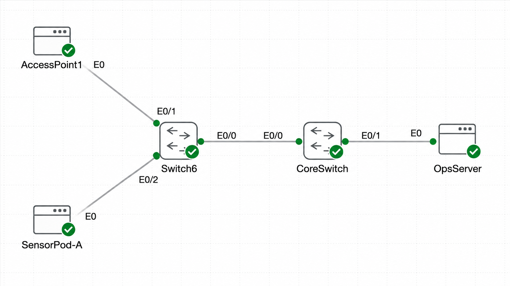

# Lab 005 - Exploring Switch CAM Tables

<table>
<tr>
<td colspan="2" valign="top">

## Objective
For this deployment to be successful, you must complete the following:
- Stage the endpoints so their Layer 2 identities are easy to spot from the switch.
- Trigger ARP-initiated traffic between PCs on the same VLAN to populate the CAM table.
- Inspect, clear, and repopulate the MAC address table to validate how the switch learns.

</td>
</tr>

<tr>
<td valign="top">

</td>

<td valign="top">

</td>

</tr>
</table>

---

## Devices Used
- OpsServer
- CoreSwitch
- Switch 6
- PC1 / PC2

---

## Configuration Steps

### Step 1 - Basic setup
```bash
Connecting to console for PC1

Core Linux
pc1 login: cisco
Password: 
   ( '>')
  /) TC (\   Core is distributed with ABSOLUTELY NO WARRANTY.
 (/-_--_-\)           www.tinycorelinux.net

cisco@pc1:~$ ifconfig eth0
eth0      Link encap:Ethernet  HWaddr 52:54:00:5E:61:BD  
          inet addr:192.168.1.50  Bcast:192.168.1.255  Mask:255.255.255.0
          inet6 addr: fe80::5054:ff:fe5e:61bd/64 Scope:Link
          UP BROADCAST RUNNING MULTICAST  MTU:1500  Metric:1
          RX packets:5 errors:0 dropped:1 overruns:0 frame:0
          TX packets:21 errors:0 dropped:0 overruns:0 carrier:0
          collisions:0 txqueuelen:1000 
          RX bytes:1428 (1.3 KiB)  TX bytes:4054 (3.9 KiB)

cisco@pc1:~$ route -n
Kernel IP routing table
Destination     Gateway         Genmask         Flags Metric Ref    Use Iface
0.0.0.0         192.168.1.1     0.0.0.0         UG    0      0        0 eth0
127.0.0.1       0.0.0.0         255.255.255.255 UH    0      0        0 lo
192.168.1.0     0.0.0.0         255.255.255.0   U     0      0        0 eth0
cisco@pc1:~$ 


Connecting to console for PC2

Core Linux
pc2 login: cisco
Password: 
   ( '>')
  /) TC (\   Core is distributed with ABSOLUTELY NO WARRANTY.
 (/-_--_-\)           www.tinycorelinux.net

cisco@pc2:~$ ifconfig eth0
eth0      Link encap:Ethernet  HWaddr 52:54:00:EB:72:52  
          inet addr:192.168.1.51  Bcast:192.168.1.255  Mask:255.255.255.0
          inet6 addr: fe80::5054:ff:feeb:7252/64 Scope:Link
          UP BROADCAST RUNNING MULTICAST  MTU:1500  Metric:1
          RX packets:22 errors:0 dropped:1 overruns:0 frame:0
          TX packets:37 errors:0 dropped:0 overruns:0 carrier:0
          collisions:0 txqueuelen:1000 
          RX bytes:7242 (7.0 KiB)  TX bytes:9254 (9.0 KiB)

cisco@pc2:~$ route -n
Kernel IP routing table
Destination     Gateway         Genmask         Flags Metric Ref    Use Iface
0.0.0.0         192.168.1.1     0.0.0.0         UG    0      0        0 eth0
127.0.0.1       0.0.0.0         255.255.255.255 UH    0      0        0 lo
192.168.1.0     0.0.0.0         255.255.255.0   U     0      0        0 eth0
cisco@pc2:~$ 
```

### Explanation
Verify the PCs are addressed exactly as shown so any CAM table entries you see later are easy to recognize.
- Steps:
    - Log into PC1 with username cisco and password cisco, then verify its primary interface reports 192.168.1.50/24 with a default gateway of 192.168.1.1.
    - Repeat the verification on PC2 and confirm it shows 192.168.1.51/24 with the same default gateway.
    - Note which switch ports each PC uses (Et0/1 for PC1 and Et0/2 for PC2) so you can map MAC entries back to real cables.

---

### Step 2 - Main configuration
```bash
cisco@pc1:~$ ping 192.168.1.51
PING 192.168.1.51 (192.168.1.51): 56 data bytes
64 bytes from 192.168.1.51: seq=25 ttl=64 time=0.844 ms
64 bytes from 192.168.1.51: seq=26 ttl=64 time=0.923 ms
64 bytes from 192.168.1.51: seq=27 ttl=64 time=0.862 ms
64 bytes from 192.168.1.51: seq=28 ttl=64 time=0.830 ms
64 bytes from 192.168.1.51: seq=29 ttl=64 time=0.914 ms
^C
--- 192.168.1.51 ping statistics ---
30 packets transmitted, 30 packets received, 0% packet loss
round-trip min/avg/max = 0.811/0.909/1.541 ms
cisco@pc1:~$ arp -a
? (192.168.1.51) at 52:54:00:eb:72:52 [ether]  on eth0
cisco@pc1:~$ 

Switch6>en
Switch6#conf t
Enter configuration commands, one per line.  End with CNTL/Z.
Switch6(config)#show mac address-table
                  ^
% Invalid input detected at '^' marker.

Switch6(config)#^Z
Switch6#show mac address-table
          Mac Address Table
-------------------------------------------

Vlan    Mac Address       Type        Ports
----    -----------       --------    -----
  10    5254.005e.61bd    DYNAMIC     Et0/1
  10    5254.00eb.7252    DYNAMIC     Et0/2
  10    5a5a.1c1c.0d0d    STATIC      Et0/1 
  10    7c7c.b2b2.2020    STATIC      Et0/2 
  99    40a6.b77d.aa01    STATIC      Et0/0 
  99    40a6.b77d.bb02    STATIC      Et0/0 
Total Mac Addresses for this criterion: 6
Switch6#

Switch6#clear mac address-table dynamic
Switch6#show mac address-table         
          Mac Address Table
-------------------------------------------

Vlan    Mac Address       Type        Ports
----    -----------       --------    -----
  10    5a5a.1c1c.0d0d    STATIC      Et0/1 
  10    7c7c.b2b2.2020    STATIC      Et0/2 
  99    40a6.b77d.aa01    STATIC      Et0/0 
  99    40a6.b77d.bb02    STATIC      Et0/0 
Total Mac Addresses for this criterion: 4
Switch6#

cisco@pc1:~$ ping -c 5 192.168.1.51
PING 192.168.1.51 (192.168.1.51): 56 data bytes
64 bytes from 192.168.1.51: seq=0 ttl=64 time=0.823 ms
64 bytes from 192.168.1.51: seq=1 ttl=64 time=0.927 ms
64 bytes from 192.168.1.51: seq=2 ttl=64 time=0.786 ms
64 bytes from 192.168.1.51: seq=3 ttl=64 time=0.871 ms
64 bytes from 192.168.1.51: seq=4 ttl=64 time=0.827 ms

--- 192.168.1.51 ping statistics ---
5 packets transmitted, 5 packets received, 0% packet loss
round-trip min/avg/max = 0.786/0.846/0.927 ms
cisco@pc1:~$ 

Switch6#show mac address-table
          Mac Address Table
-------------------------------------------

Vlan    Mac Address       Type        Ports
----    -----------       --------    -----
  10    5254.005e.61bd    DYNAMIC     Et0/1
  10    5254.00eb.7252    DYNAMIC     Et0/2
  10    5a5a.1c1c.0d0d    STATIC      Et0/1 
  10    7c7c.b2b2.2020    STATIC      Et0/2 
  99    40a6.b77d.aa01    STATIC      Et0/0 
  99    40a6.b77d.bb02    STATIC      Et0/0 
Total Mac Addresses for this criterion: 6
Switch6#

```

### Explanation
#### Task 1 — Generate the ARP Conversation
Use PC1 to reach PC2 so you can watch the ARP request bloom into the switch’s CAM table entries.
- Steps:

    - From the desktop shell on PC1, prepare a connectivity test targeting PC2’s IP address.
    - Run the test once so PC1 is forced to resolve PC2’s MAC address before sending payload traffic.
    - Observe that the initial attempt takes slightly longer than subsequent tries because of the ARP exchange.

#### Task 2 — Inspect the Switch CAM Table
Pivot to Switch6 and confirm the MAC address table records both PCs and the uplink partner.
- Steps:
    - Open the console on Switch6 and reach the privileged prompt.
    - Display the switch’s MAC address table and note the entries tied to Et0/1, Et0/2, and Et0/0.
    - Match the listed MAC addresses with the devices you labeled earlier so you can identify PC1, PC2, and the uplink to CoreSwitch.

#### Task 3 — Flush and Re-Learn Entries
Clear the dynamic table and repopulate it to prove you control what the switch remembers.
- Steps:
    - While still on Switch6, remove the learned CAM entries without touching static mappings tied to interface descriptions.
    - Immediately re-run PC1’s connectivity test so ARP traffic rebuilds the table.
    - Confirm the switch once again records MAC entries on the correct interfaces after the traffic flows.

---

## Verification

#### Completion Check
- PC1 and PC2 display the correct static IP configurations and their ARP caches reveal one another after the test.
- Switch6’s CAM table shows distinct entries on Et0/1, Et0/2, and Et0/0 that map to PC1, PC2, and the uplink.
- Clearing the dynamic table and generating new traffic rebuilds the expected MAC address entries without manual intervention.

---

## Troubleshooting

### Issue 1
What went wrong?
- Forgot to limit the number of packets I sent with the ping command

### Diagnosis
How you found the problem.
- 30 packets sent and received instead of the expected 4

### Fix
How you resolved it.
- Found commands for cancelling a process and limiting packet numbers

---

## Key Learnings
- What you learned
    - How to interrogate, wipe and rebuild CAM tables
- What improved
    - My understanding of command line functions
- What to remember next time
    - Be more specific in making requests

---

## Improvements for Next Time
- What you would do differently
    - Ensure I have a better knowledge of command line
