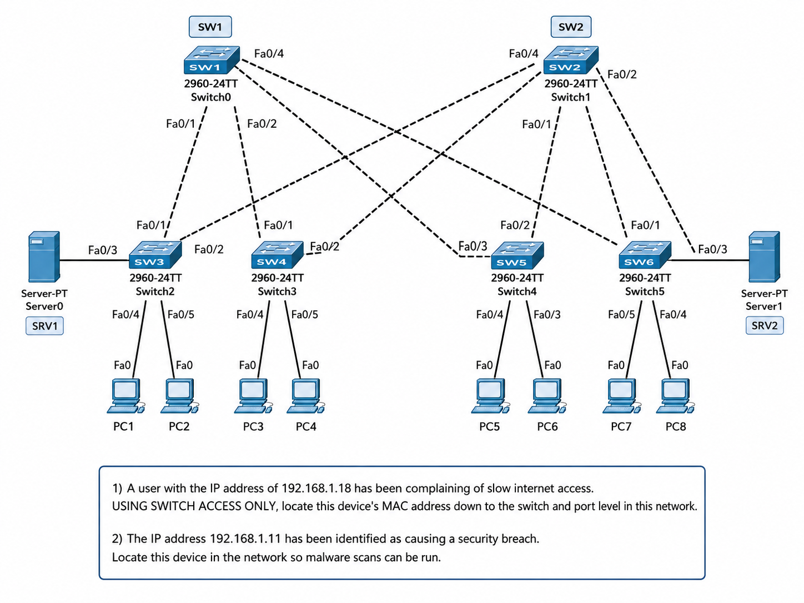

# Lab 006 - Finding Devices

<table>
<tr>
<td colspan="2" valign="top">

# Objective

* ### Locate a slow user device using only switch access and a reported IP address.
* ### Translate IP addresses into MAC addresses using ARP.
* ### Use the CAM/MAC address table to trace devices through the switching path.
* ### Identify the final switchport for a slow client device and a device linked to a security breach.
* ### Practise a calm, methodical Layer 2 investigation workflow.

</td>
</tr>

<tr>
<td valign="top">

</td>

<td valign="top">

</td>

</tr>
</table>

---

## Scenario

This lab simulates a support/security investigation where only IP addresses are initially known.

Two devices needed to be located:

| Report                  | IP Address     | Required Action                                |
| ----------------------- | -------------- | ---------------------------------------------- |
| Slow internet complaint | `192.168.1.18` | Locate the user device down to switch and port |
| Security breach alert   | `192.168.1.11` | Locate the device so malware scans can be run  |

The restriction was important:

> **Use switch access only.**

That means no checking the end devices directly. The investigation had to be performed from the network infrastructure using ARP, MAC/CAM tables and neighbour information.

---

## Devices Used

| Device Type | Devices                                                |
| ----------- | ------------------------------------------------------ |
| Switches    | `SW1`, `SW2`, `SW3`, `SW4`, `SW5`, `SW6`               |
| PCs         | `PC1`, `PC2`, `PC3`, `PC4`, `PC5`, `PC6`, `PC7`, `PC8` |
| Servers     | `SV1`, `SV2`                                           |

---

## Investigation Workflow

The main process was:

```text id="w3cxad"
Ping target IP → Check ARP → Identify MAC address → Check CAM table → Follow switchport/uplink → Repeat on next switch
```

In plainer terms:

1. Ping the reported IP address so the switch learns or refreshes the ARP entry.
2. Use `show arp` to match the IP address to a MAC address.
3. Use `show mac address-table` to find the port where that MAC was learned.
4. If that port is an uplink to another switch, move to the next switch and repeat.
5. Stop when the MAC appears on an access-facing port.

---

## Discovery Summary

| Report                 | IP Address     | MAC Address      | Final Finding   |
| ---------------------- | -------------- | ---------------- | --------------- |
| Slow user device       | `192.168.1.18` | `0005.5E5D.B43C` | Traced to `PC4` |
| Security breach device | `192.168.1.11` | `0005.5E3C.0DC1` | Traced to `PC6` |

---

# Investigation Steps - Part 1: Slow User Device

---

## Step 1 - Access the First Switch

```bash id="xbvd2o"
Switch>enable
Switch#
```

### Explanation

The investigation started from switch access. Because only infrastructure access was allowed, I needed to use switch-side tools rather than checking the endpoint directly.

---

## Step 2 - Ping the Reported Slow Device

```bash id="3j0gad"
ping 192.168.1.18
```

### Observed Output

```text id="49uxf4"
Type escape sequence to abort.
Sending 5, 100-byte ICMP Echos to 192.168.1.18, timeout is 2 seconds:
.!!!!
Success rate is 80 percent (4/5), round-trip min/avg/max = 0/0/0 ms
```

### Explanation

The device at `192.168.1.18` responded.

The first timeout is not necessarily a problem. It commonly happens while ARP resolution completes. The successful replies confirmed that the device was online and reachable.

The ping also helped populate the ARP table so I could identify the device’s MAC address.

---

## Step 3 - Use ARP to Translate IP to MAC

```bash id="si837h"
show arp
```

### Observed Output

```text id="2v490z"
Protocol  Address          Age (min)  Hardware Addr   Type   Interface
Internet  192.168.1.3             -   00D0.58BA.EC62  ARPA   Vlan1
Internet  192.168.1.18            0   0005.5E5D.B43C  ARPA   Vlan1
```

### Explanation

This converted the reported IP address into a MAC address:

```text id="7qlgyr"
192.168.1.18 → 0005.5E5D.B43C
```

This is the key handoff point in the investigation. IP tells me who I am looking for; the MAC table tells me where the device is connected.

---

## Step 4 - Check the MAC Address Table

```bash id="fym0qd"
show mac address-table
```

### Observed Output

```text id="uih34t"
Vlan    Mac Address       Type        Ports
----    -----------       --------    -----
   1    0001.64eb.5401    DYNAMIC     Fa0/1
   1    0005.5e5d.b43c    DYNAMIC     Fa0/1
   1    0030.f204.9503    DYNAMIC     Fa0/2
```

### Explanation

The target MAC appeared on:

```text id="t3yw2y"
Fa0/1
```

However, other MAC addresses were also present through the switching path, so I needed to establish whether this was a final endpoint port or an uplink leading to another switch.

---

## Step 5 - Inspect the Interface

```bash id="jq8jmo"
show interface fa0/1
```

### Observed Output Summary

```text id="fuk3xf"
FastEthernet0/1 is up, line protocol is up (connected)
Full-duplex, 100Mb/s
0 input errors
0 CRC
0 output errors
```

### Explanation

The interface was up/up and looked healthy from an error-counter perspective.

The lab goal was device location rather than performance diagnosis, so the important point was that `Fa0/1` was active and forwarding traffic.

---

## Step 6 - Check CDP Neighbours

```bash id="lubcoe"
show cdp neighbors
```

### Observed Output

```text id="iwhsmw"
Device ID    Local Intrfce   Holdtme    Capability   Platform    Port ID
Switch       Fas 0/2          121            S       2960        Fas 0/3
Switch       Fas 0/1          121            S       2960        Fas 0/1
```

### Explanation

CDP showed neighbouring switches, but the exercise files had generic switch names. This made the output less helpful than usual because multiple devices appeared simply as `Switch`.

In a better-labelled network, CDP would quickly tell me exactly which switch was connected to each uplink. In this lab, I had to keep working manually through the CAM tables.

---

## Step 7 - Move to the Next Switch and Repeat the Process

```bash id="xw0v7s"
show mac address-table
ping 192.168.1.18
show arp
show mac address-table
```

### Observed Output

```text id="hnzqba"
Protocol  Address          Age (min)  Hardware Addr   Type   Interface
Internet  192.168.1.1             -   000C.CF02.70D0  ARPA   Vlan1
Internet  192.168.1.18            0   0005.5E5D.B43C  ARPA   Vlan1
```

```text id="pg8aal"
Vlan    Mac Address       Type        Ports
----    -----------       --------    -----
   1    0005.5e5d.b43c    DYNAMIC     Fa0/2
   1    000d.bd18.9083    DYNAMIC     Fa0/4
   1    0060.3e1c.4902    DYNAMIC     Fa0/3
   1    00e0.a30d.a801    DYNAMIC     Fa0/2
   1    00e0.b0d6.4402    DYNAMIC     Fa0/4
   1    00e0.f917.4d01    DYNAMIC     Fa0/1
```

### Explanation

The target MAC was now seen on:

```text id="4wpb26"
Fa0/2
```

Because multiple MACs were still visible on the switch, this still looked like part of the path rather than the final endpoint location. I continued walking the MAC address through the network.

---

## Step 8 - Continue to the Next Switch

```bash id="bmwlpm"
show mac address-table
```

### Observed Output

```text id="cjmjdq"
Vlan    Mac Address       Type        Ports
----    -----------       --------    -----
   1    0001.64eb.5402    DYNAMIC     Fa0/1
   1    0005.5e5d.b43c    DYNAMIC     Fa0/4
   1    000c.cf02.70d0    DYNAMIC     Fa0/1
   1    000d.bd18.9083    DYNAMIC     Fa0/1
   1    0030.f204.9504    DYNAMIC     Fa0/2
```

### Explanation

The target MAC appeared on:

```text id="e2nxoz"
Fa0/4
```

At this point, the investigation narrowed the slow user device down to the endpoint path associated with `PC4`.

---

## Part 1 Result - Slow User Device

| Field        | Result                                           |
| ------------ | ------------------------------------------------ |
| Reported IP  | `192.168.1.18`                                   |
| MAC Address  | `0005.5E5D.B43C`                                 |
| Final Device | `PC4`                                            |
| Method Used  | Ping → ARP → MAC table → repeated switch tracing |

---

# Investigation Steps - Part 2: Security Breach Device

---

## Step 9 - Ping the Security Alert IP

```bash id="o74lx6"
ping 192.168.1.11
```

### Observed Output

```text id="95z7pn"
Type escape sequence to abort.
Sending 5, 100-byte ICMP Echos to 192.168.1.11, timeout is 2 seconds:
.!!!!
Success rate is 80 percent (4/5), round-trip min/avg/max = 0/0/1 ms
```

### Explanation

The device at `192.168.1.11` responded. Again, the first timeout was likely caused by ARP resolution.

This confirmed the suspicious device was online and available for switch-side tracing.

---

## Step 10 - Use ARP to Identify the Security Device MAC

```bash id="dugfq7"
show arp
```

### Observed Output

```text id="jbalew"
Protocol  Address          Age (min)  Hardware Addr   Type   Interface
Internet  192.168.1.4             -   00D0.FFC4.BDA8  ARPA   Vlan1
Internet  192.168.1.11            0   0005.5E3C.0DC1  ARPA   Vlan1
```

### Explanation

This identified the MAC address of the suspicious device:

```text id="x7uy8d"
192.168.1.11 → 0005.5E3C.0DC1
```

Now I could trace that MAC through the switching topology.

---

## Step 11 - Check the MAC Address Table

```bash id="al8c5b"
show mac address-table
```

### Observed Output

```text id="axd4ic"
Vlan    Mac Address       Type        Ports
----    -----------       --------    -----
   1    0001.64eb.5402    DYNAMIC     Fa0/1
   1    0005.5e3c.0dc1    DYNAMIC     Fa0/1
   1    0030.f204.9504    DYNAMIC     Fa0/2
```

### Explanation

The suspicious device MAC was first seen on:

```text id="ch1gcu"
Fa0/1
```

As with the previous investigation, this still needed to be followed through the network to confirm the final physical device.

---

## Step 12 - Continue Following the MAC Address

```bash id="ipgl1i"
show mac address-table
```

### Observed Output

```text id="jqugqo"
Vlan    Mac Address       Type        Ports
----    -----------       --------    -----
   1    0005.5e3c.0dc1    DYNAMIC     Fa0/3
   1    0060.3e1c.4902    DYNAMIC     Fa0/3
   1    00d0.ffc4.bda8    DYNAMIC     Fa0/2
   1    00e0.a30d.a801    DYNAMIC     Fa0/2
   1    00e0.b0d6.4402    DYNAMIC     Fa0/4
   1    00e0.f917.4d01    DYNAMIC     Fa0/1
```

### Explanation

On the next switch, the suspicious MAC appeared on:

```text id="nyukgj"
Fa0/3
```

This showed that the device was further along the switching path.

---

## Step 13 - Confirm the Final Path for the Security Device

```bash id="qz7mkn"
show mac address-table
```

### Observed Output

```text id="bngcos"
Vlan    Mac Address       Type        Ports
----    -----------       --------    -----
   1    0001.64eb.5403    DYNAMIC     Fa0/2
   1    0005.5e3c.0dc1    DYNAMIC     Fa0/4
   1    0030.f204.9501    DYNAMIC     Fa0/1
   1    00d0.ffc4.bda8    DYNAMIC     Fa0/2
```

### Explanation

The target MAC eventually appeared on:

```text id="86qob4"
Fa0/4
```

From the lab topology and traced path, this identified the security alert device as `PC6`.

---

## Part 2 Result - Security Breach Device

| Field           | Result                                           |
| --------------- | ------------------------------------------------ |
| Reported IP     | `192.168.1.11`                                   |
| MAC Address     | `0005.5E3C.0DC1`                                 |
| Final Device    | `PC6`                                            |
| Required Action | Run malware/security scans                       |
| Method Used     | Ping → ARP → MAC table → repeated switch tracing |

---

# Verification

## Final Device Location Summary

| Investigation          | IP Address     | MAC Address      | Final Device |
| ---------------------- | -------------- | ---------------- | ------------ |
| Slow user device       | `192.168.1.18` | `0005.5E5D.B43C` | `PC4`        |
| Security breach device | `192.168.1.11` | `0005.5E3C.0DC1` | `PC6`        |

---

## Commands Used for Verification

```bash id="ys9mya"
ping <target-ip>
show arp
show mac address-table
show cdp neighbors
show interface <interface-id>
```

---

## Why These Commands Matter

| Command                  | Purpose                                                 |
| ------------------------ | ------------------------------------------------------- |
| `ping`                   | Confirms the device is reachable and helps populate ARP |
| `show arp`               | Maps IP addresses to MAC addresses                      |
| `show mac address-table` | Maps MAC addresses to switchports                       |
| `show cdp neighbors`     | Shows directly connected neighbouring switches          |
| `show interface`         | Confirms whether a physical interface is up and healthy |

---

# Troubleshooting

## Issue 1 - CDP neighbour output was not very helpful

### What happened

`show cdp neighbors` showed neighbouring switches, but they were all named generically as `Switch`.

### Diagnosis

The exercise files did not have unique switch hostnames configured, so CDP output could not clearly identify each neighbour by role or location.

### Fix

I continued the investigation manually by checking CAM tables on multiple switches and following the target MAC address through the topology.

### Lesson

In a real network, meaningful hostnames make troubleshooting much faster. If names are missing or generic, the investigation is still possible, but it requires a more careful and methodical approach.

---

## Issue 2 - Mistyped MAC address table command

### What happened

I entered:

```bash id="fvgc3t"
show mac addresss-table
```

This produced an invalid input error because `addresss` had an extra `s`.

### Fix

The correct command was:

```bash id="gwmoji"
show mac address-table
```

### Lesson

Small CLI typing errors happen. The important thing is to read the caret marker, correct the syntax, and continue calmly.

---

## Issue 3 - The first ping only returned 80 percent

### What happened

The first ping to each target returned:

```text id="1kkrt6"
.!!!!
Success rate is 80 percent
```

### Diagnosis

The first ICMP packet likely timed out while ARP resolution completed.

### Fix

No fix was required. The later replies confirmed that the devices were reachable.

### Lesson

Do not overreact to the first dot in a ping output. Read the full result and understand what the switch is doing in the background.

---

# Key Learnings

* ARP is used to map IP addresses to MAC addresses.
* The CAM/MAC address table is used to map MAC addresses to switchports.
* If a target MAC appears on a port with multiple downstream MAC addresses, it may be an uplink rather than the final device port.
* CDP is helpful, but only if devices have useful names.
* Poor naming makes troubleshooting slower, but not impossible.
* Methodical tracing is more reliable than guessing.
* The best workflow is:

```text id="kir417"
IP address → ARP table → MAC address → CAM table → switchport → repeat if needed
```

---

# Improvements for Next Time

* Record findings in a table as soon as each IP-to-MAC mapping is discovered.
* Use targeted MAC table searches where available, such as:

```bash id="bogzi4"
show mac address-table address <mac-address>
```

* Rename lab switches where allowed so CDP output is easier to interpret.
* Capture screenshots of each final CAM table result for portfolio evidence.
* Keep calm when the topology is not labelled clearly; the data is still there, it just takes more patience to follow.

---

# Final Result

This lab successfully located two devices using only switch-side tools.

The slow user device at `192.168.1.18` was mapped to MAC address `0005.5E5D.B43C` and traced to `PC4`.

The security breach device at `192.168.1.11` was mapped to MAC address `0005.5E3C.0DC1` and traced to `PC6`.

The lab reinforced a practical Layer 2 device-tracing workflow that is directly useful in real support and security investigations.
