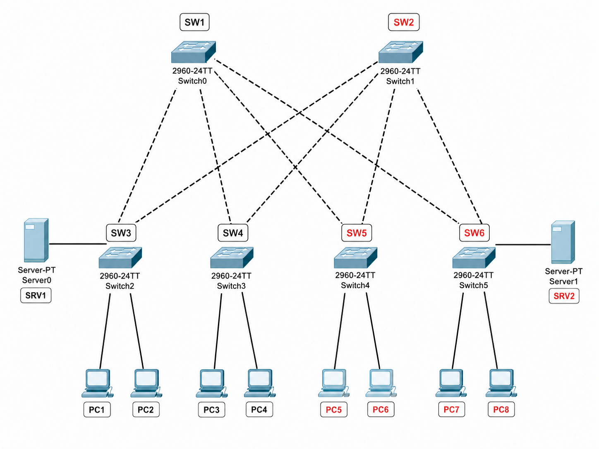
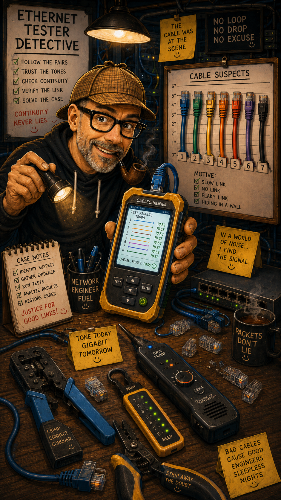

# Lab 007 - Tracking Devices with the CAM Table

<p class="back-link">
  <a href="../../Lab-index.html">← Back to Lab Index</a>
</p>

<table>
<tr>
<td colspan="2" valign="top">

<h1>Objective</h1>

<ul>
  <li><h3>Translate IP-only reports into MAC addresses using switch-side ARP information.</h3></li>
  <li><h3>Use the CAM/MAC address table to trace those MAC addresses to physical switchports.</h3></li>
  <li><h3>Follow MAC addresses across the topology from <code>CoreSwitch</code> to <code>Switch6</code>.</h3></li>
  <li><h3>Confirm the physical location of both a poorly performing user PC and a suspicious server.</h3></li>
  <li><h3>Document the results clearly so support or security teams can act quickly.</h3></li>
</ul>

</td>
</tr>

<tr>
<td valign="top" width="60%">

</td>

<td valign="bottom" width="40%">

</td>
</tr>
</table>

---

## Scenario

This lab simulates a common network support task: being given only an IP address and needing to identify where that device is physically connected.

Two reports needed investigation:

| Report Type    | IP Address      | Task                                         |
| -------------- | --------------- | -------------------------------------------- |
| User complaint | `192.168.1.118` | Locate the poorly performing PC              |
| Security alert | `192.168.1.111` | Locate the suspicious server for containment |

The key workflow was:

```text
Ping the IP → Check ARP → Convert IP to MAC → Check MAC/CAM table → Identify switchport → Follow uplinks if needed
```

This is a useful process because switches make forwarding decisions using MAC addresses, not IP addresses. So the IP address is only the starting point; the real tracing begins once the MAC address is known.

---

## Devices Used

| Device Type | Devices                                                             |
| ----------- | ------------------------------------------------------------------- |
| Switches    | `CoreSwitch`, `Switch2`, `Switch3`, `Switch4`, `Switch5`, `Switch6` |
| PCs         | `PC1`, `PC2`, `PC3`, `PC4`, `PC5`, `PC6`, `PC7`, `PC8`              |
| Servers     | `SV1`, `SV2`                                                        |

---

## Addressing and Discovery Summary

| Device / Report          | IP Address      | MAC Address      | Switch       | Interface | VLAN |
| ------------------------ | --------------- | ---------------- | ------------ | --------- | ---: |
| User complaint / PC7     | `192.168.1.118` | `5254.00d3.fdbb` | `Switch6`    | `Et0/1`   |   10 |
| Security alert / Server2 | `192.168.1.111` | `5254.0030.1887` | `CoreSwitch` | `Et0/1`   |   10 |

---

## Final Topology Findings

```text
CoreSwitch
├── Et0/0 → Uplink to Switch6
│           ├── Et0/1 → PC7 / 192.168.1.118 / 5254.00d3.fdbb
│           └── Et0/2 → Other VLAN 10 device / 5254.002c.5005
│
└── Et0/1 → Server2 / 192.168.1.111 / 5254.0030.1887
```

---

# Investigation Steps

---

## Step 1 - Access the Core Switch

```bash
CoreSwitch>
CoreSwitch>enable
CoreSwitch#
```

### Explanation

I started from `CoreSwitch` because it was the central point in the topology. Beginning at the core switch gives the best chance of seeing where traffic is being forwarded next.

---

## Step 2 - Generate Traffic to the Reported User Device

```bash
ping 192.168.1.118
```

### Observed Output

```text
Type escape sequence to abort.
Sending 5, 100-byte ICMP Echos to 192.168.1.118, timeout is 2 seconds:
.!!!!
Success rate is 80 percent (4/5), round-trip min/avg/max = 1/1/1 ms
```

### Explanation

The ping confirmed that `192.168.1.118` was reachable.

The first packet timed out, which is common when ARP needs to resolve the MAC address before ICMP can fully succeed. The following replies confirmed that the device was online.

This also helped populate the ARP table with the IP-to-MAC mapping.

---

## Step 3 - Check the Core Switch MAC Address Table

```bash
show mac address-table
```

### Observed Output

```text
Vlan    Mac Address       Type        Ports
----    -----------       --------    -----
  10    5254.002c.5005    DYNAMIC     Et0/0
  10    5254.0030.1887    DYNAMIC     Et0/1
  10    5254.00d3.fdbb    DYNAMIC     Et0/0
  10    aabb.cc00.0100    DYNAMIC     Et0/0
```

### Explanation

The MAC table showed several VLAN 10 MAC addresses.

At this point, I could see that some MAC addresses were learned on `Et0/0`, while one was learned on `Et0/1`.

However, I still needed to know which MAC belonged to the reported IP address.

---

## Step 4 - Use ARP to Match IP Address to MAC Address

```bash
show arp
```

### Observed Output

```text
Protocol  Address          Age (min)  Hardware Addr   Type   Interface
Internet  192.168.1.1             -   aabb.cc80.0200  ARPA   Vlan10
Internet  192.168.1.118           0   5254.00d3.fdbb  ARPA   Vlan10
```

### Explanation

This translated the reported IP address into a MAC address:

```text
192.168.1.118 → 5254.00d3.fdbb
```

Now that I had the MAC address, I could use the MAC/CAM table to trace the device to a switchport.

---

## Step 5 - Confirm the Neighbour Switch

```bash
show cdp neighbors
```

### Observed Output

```text
Device ID        Local Intrfce     Holdtme    Capability  Platform  Port ID
Switch6          Eth 0/0           176             R S I  Linux Uni Eth 0/0
```

### Explanation

CDP confirmed that:

```text
CoreSwitch Et0/0 → Switch6 Et0/0
```

This was important because the MAC address for `192.168.1.118` was learned on `CoreSwitch Et0/0`.

Since `Et0/0` is the uplink to `Switch6`, the device was not directly connected to the core switch. It was somewhere beyond `Switch6`.

---

## Step 6 - Investigate the Security Alert IP

```bash
ping 192.168.1.111
```

### Observed Output

```text
Type escape sequence to abort.
Sending 5, 100-byte ICMP Echos to 192.168.1.111, timeout is 2 seconds:
.!!!!
Success rate is 80 percent (4/5), round-trip min/avg/max = 1/1/1 ms
```

### Explanation

This confirmed that the second reported IP address, `192.168.1.111`, was also reachable.

Again, the first failed packet was likely due to ARP resolution.

---

## Step 7 - Check ARP Again for the Security Alert IP

```bash
show arp
```

### Observed Output

```text
Protocol  Address          Age (min)  Hardware Addr   Type   Interface
Internet  192.168.1.1             -   aabb.cc80.0200  ARPA   Vlan10
Internet  192.168.1.111           0   5254.0030.1887  ARPA   Vlan10
Internet  192.168.1.118           5   5254.00d3.fdbb  ARPA   Vlan10
```

### Explanation

This identified the MAC address for the suspicious server:

```text
192.168.1.111 → 5254.0030.1887
```

Now both target IPs had known MAC addresses.

---

## Step 8 - Recheck the Core Switch MAC Table

```bash
show mac address-table
```

### Observed Output

```text
Vlan    Mac Address       Type        Ports
----    -----------       --------    -----
  10    5254.002c.5005    DYNAMIC     Et0/0
  10    5254.0030.1887    DYNAMIC     Et0/1
  10    5254.00d3.fdbb    DYNAMIC     Et0/0
  10    aabb.cc00.0100    DYNAMIC     Et0/0
```

### Explanation

The MAC table now clearly showed:

| IP Address      | MAC Address      | CoreSwitch Port | Meaning                            |
| --------------- | ---------------- | --------------- | ---------------------------------- |
| `192.168.1.118` | `5254.00d3.fdbb` | `Et0/0`         | Behind `Switch6`                   |
| `192.168.1.111` | `5254.0030.1887` | `Et0/1`         | Directly connected to `CoreSwitch` |

This identified the suspicious server quickly:

```text
192.168.1.111 → 5254.0030.1887 → CoreSwitch Et0/1
```

---

## Step 9 - Move to Switch6

```bash
Switch6>
Switch6>enable
Switch6#
```

### Explanation

The MAC address for `192.168.1.118` was learned by the core switch over the uplink to `Switch6`, so the next step was to continue the trace on `Switch6`.

This is the important part of “walking” the MAC address through the network.

---

## Step 10 - Check Switch6 ARP Behaviour

```bash
show arp
ping 192.168.1.118
```

### Observed Output

```text
Switch6#show arp
Switch6#ping 192.168.1.118
% Unrecognized host or address, or protocol not running.
```

### Explanation

`Switch6` did not have useful ARP information and could not ping the target IP directly.

That is not a dead end. For a switch recon task, the MAC address table is still the key tool. Since the MAC had already been discovered from `CoreSwitch`, I could search for that MAC on `Switch6`.

---

## Step 11 - Check the Switch6 MAC Address Table

```bash
show mac address-table
```

### Observed Output

```text
Vlan    Mac Address       Type        Ports
----    -----------       --------    -----
  10    5254.002c.5005    DYNAMIC     Et0/2
  10    5254.0030.1887    DYNAMIC     Et0/0
  10    5254.00d3.fdbb    DYNAMIC     Et0/1
  10    aabb.cc80.0200    DYNAMIC     Et0/0
```

### Explanation

This confirmed the physical location of the poorly performing user device:

```text
192.168.1.118 → 5254.00d3.fdbb → Switch6 Et0/1
```

The core switch saw this MAC via `Et0/0`, which was the uplink to `Switch6`. Once on `Switch6`, the same MAC was learned directly on `Et0/1`.

---

# Verification

## Target 1 - User Complaint

| Field             | Result                                       |
| ----------------- | -------------------------------------------- |
| Reported IP       | `192.168.1.118`                              |
| Identified MAC    | `5254.00d3.fdbb`                             |
| VLAN              | 10                                           |
| CoreSwitch result | Learned via `Et0/0`                          |
| Next hop switch   | `Switch6`                                    |
| Final access port | `Switch6 Et0/1`                              |
| Conclusion        | PC7 is directly connected to `Switch6 Et0/1` |

---

## Target 2 - Security Alert

| Field             | Result                                              |
| ----------------- | --------------------------------------------------- |
| Reported IP       | `192.168.1.111`                                     |
| Identified MAC    | `5254.0030.1887`                                    |
| VLAN              | 10                                                  |
| CoreSwitch result | Learned directly on `Et0/1`                         |
| Final access port | `CoreSwitch Et0/1`                                  |
| Conclusion        | Server2 is directly connected to `CoreSwitch Et0/1` |

---

## Final Verification Summary

| Device / Issue             | IP Address      | MAC Address      | Final Location     |
| -------------------------- | --------------- | ---------------- | ------------------ |
| PC7 / sluggish user device | `192.168.1.118` | `5254.00d3.fdbb` | `Switch6 Et0/1`    |
| Server2 / security alert   | `192.168.1.111` | `5254.0030.1887` | `CoreSwitch Et0/1` |

---

# Troubleshooting Notes

## Issue 1 - First ping only returned 80 percent

### What happened

The first pings to both target IPs returned:

```text
.!!!!
Success rate is 80 percent
```

### Diagnosis

The first ping likely timed out while the switch resolved the destination MAC address using ARP.

### Fix

No configuration change was required. The remaining replies succeeded, which confirmed the devices were reachable.

### Lesson

A first failed ping packet is often normal when ARP resolution needs to happen. The important thing is to read the full result rather than assuming the device is down.

---

## Issue 2 - Switch6 could not ping the target

### What happened

From `Switch6`, this command failed:

```bash
ping 192.168.1.118
```

Output:

```text
% Unrecognized host or address, or protocol not running.
```

### Diagnosis

`Switch6` did not have the required Layer 3/IP configuration or protocol support to perform that ping in this context.

### Fix

I continued the investigation using the MAC address table instead.

### Lesson

If a switch cannot ping a target, that does not prevent Layer 2 tracing. Once the MAC address is known, the CAM table can still identify the physical port.

---

## Issue 3 - Target MAC appeared on a core uplink

### What happened

The MAC for `192.168.1.118` appeared on `CoreSwitch Et0/0`.

### Diagnosis

CDP showed that `Et0/0` led to `Switch6`, so the device was not directly connected to the core switch.

### Fix

I moved to `Switch6` and checked its MAC table.

### Lesson

When a target MAC appears on an uplink, follow that uplink to the next switch and continue tracing.

---

# Key Learnings

* ARP maps IP addresses to MAC addresses.
* The MAC/CAM table maps MAC addresses to switchports.
* CDP helps identify which neighbouring switch sits behind an uplink.
* A MAC address learned on an uplink usually means the endpoint is further downstream.
* The correct tracing workflow is methodical:

```text
IP → ARP → MAC → MAC table → switchport → follow uplink if needed
```

* Do not guess the endpoint location from the IP address alone.
* Always confirm the final switchport with evidence from the MAC address table.

---

# Improvements for Next Time

* Record target IPs, MAC addresses and switchports in a table as the investigation progresses.
* Use targeted MAC lookups where possible, for example:

```bash
show mac address-table address 5254.00d3.fdbb
```

* Capture final screenshots of the MAC table on both the core and downstream switch.
* Add interface descriptions once the endpoint locations are confirmed, if the lab permits changes.
* Work steadily from the core outward rather than jumping between devices too quickly.

---

# Final Result

This lab successfully traced two reported IP addresses to their physical network locations.

The user complaint device at `192.168.1.118` was identified as MAC address `5254.00d3.fdbb` and traced through the core switch uplink to `Switch6 Et0/1`.

The suspicious server at `192.168.1.111` was identified as MAC address `5254.0030.1887` and confirmed as directly connected to `CoreSwitch Et0/1`.

The lab reinforced a practical Layer 2 troubleshooting workflow:

```text
Start with the IP, use ARP to find the MAC, use the CAM table to find the port, then follow the topology until the endpoint is found.
```
