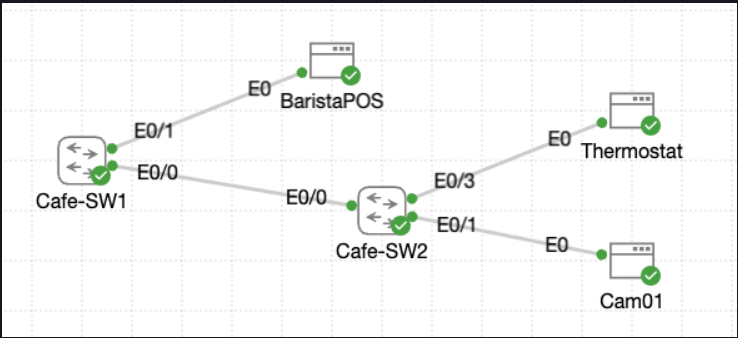

# Lab 010 - Configuring Switch Interfaces

<p class="back-link">
  <a href="../../Lab-index.html">← Back to Lab Index</a>
</p>

<table>
<tr>
<td colspan="2" valign="top">

<h1>Objective</h1>

<h4>Configure and document live switch interfaces on two coffee house access switches.</h4>

<h4>Demonstrate practical Layer 2 switchport administration, including descriptions, duplex settings, trunking, VLAN creation and SVI management access.</h4>

<h4>Prove that both switches can communicate across the management VLAN using successful ICMP testing.</h4>

<h4>Include troubleshooting evidence around command mode errors and SVI state behaviour before trunking was completed.</h4>

</td>
</tr>

<tr>
<td valign="top" width="50%">

</td>

</tr>
</table>

---

## Scenario

This lab simulates the final switch preparation stage for a small coffee house deployment called **Coffee House Beta** at **Roastery West**.

Two switches were already cabled:

* `Cafe-SW1` on the main floor.
* `Cafe-SW2` in the back office.

The live switchports were still using mostly default settings, so the goal was to document the connected ports, normalise duplex settings on the required links, create a management VLAN, assign management IP addresses, and prove that the two switches could reach each other over the management subnet.

The main workflow was:

```text
Identify live ports → Label interfaces → Normalise duplex → Create management VLAN → Configure trunk → Verify SVI reachability
```

In plain English:

> I was preparing two connected switches for production use by clearly labelling the active ports, making the important links easier to troubleshoot, and enabling management access between the switches over VLAN 42.

---

## Devices Used

| Device     | Role                                      |
| ---------- | ----------------------------------------- |
| `Cafe-SW1` | Main floor switch / management endpoint   |
| `Cafe-SW2` | Back office switch / management endpoint  |
| `Et0/0`    | Inter-switch uplink on both switches      |
| `Et0/1`    | Barista POS on `Cafe-SW1`; camera on `Cafe-SW2` |
| `Et0/3`    | Thermostat circuit on `Cafe-SW2`          |

---

## Addressing and VLAN Plan

| VLAN | Name   | Purpose            | Subnet             | Gateway          |
| ---: | ------ | ------------------ | ------------------ | ---------------- |
|   42 | `MGMT` | Switch management  | `192.168.42.0/24`  | `192.168.42.254` |

| Device     | SVI      | Management IP    | Subnet Mask       | Default Gateway   |
| ---------- | -------- | ---------------- | ----------------- | ----------------- |
| `Cafe-SW1` | `Vlan42` | `192.168.42.1`   | `255.255.255.0`   | `192.168.42.254`  |
| `Cafe-SW2` | `Vlan42` | `192.168.42.2`   | `255.255.255.0`   | `192.168.42.254`  |

---

## Interface / Port Plan

| Device     | Interface | Connected To / Purpose | VLAN / Role      |
| ---------- | --------- | ---------------------- | ---------------- |
| `Cafe-SW1` | `Et0/0`   | `Cafe-SW2` uplink      | Trunk / VLAN 42  |
| `Cafe-SW1` | `Et0/1`   | Barista POS handoff    | Access / VLAN 1  |
| `Cafe-SW2` | `Et0/0`   | `Cafe-SW1` uplink      | Trunk / VLAN 42  |
| `Cafe-SW2` | `Et0/1`   | Camera feed            | Access / VLAN 1  |
| `Cafe-SW2` | `Et0/3`   | Thermostat circuit     | Access / VLAN 1  |

---

## Final Topology

```text
          Management VLAN 42
        192.168.42.0/24

+----------------+       Trunk Et0/0       +----------------+
|   Cafe-SW1     |=========================|   Cafe-SW2     |
|  Vlan42        |                         |  Vlan42        |
| 192.168.42.1   |                         | 192.168.42.2   |
+----------------+                         +----------------+
        |                                           |       |
      Et0/1                                       Et0/1   Et0/3
        |                                           |       |
   Barista POS                                  Camera  Thermostat
```

---

# Configuration and Investigation Steps

---

## Step 1 - Access the switches

```bash
Username: cisco
Password:
enable
Password:
configure terminal
```

### Explanation

I accessed each switch using the provided console credentials and entered privileged EXEC mode with the enable password.

From there, I moved into global configuration mode so that I could apply interface descriptions, duplex settings, VLAN configuration and management SVI settings.

| Switch | Prompt Confirmed |
| ------ | ---------------- |
| `Cafe-SW1` | `Cafe-SW1(config)#` |
| `Cafe-SW2` | `Cafe-SW2(config)#` |

---

## Step 2 - Label active ports on Cafe-SW1

```bash
interface et0/0
description "## Cafe-SW2 Uplink"
interface et0/1
description "## BaristaPOS"
```

### Explanation

I labelled the live ports on `Cafe-SW1` so that the interface purpose would be visible directly in the switch configuration and interface summaries.

This is useful because a future engineer can immediately see which port is the uplink and which port serves the point-of-sale device without needing to physically trace the cable first.

| Interface | Description Applied |
| --------- | ------------------- |
| `Et0/0`   | `"## Cafe-SW2 Uplink"` |
| `Et0/1`   | `"## BaristaPOS"` |

---

## Step 3 - Label active ports on Cafe-SW2

```bash
interface et0/0
description "## Cafe-SW1 Uplink"
interface et0/1
description "## Camera Feed"
interface et0/3
description "## Thermostat"
```

### Explanation

I repeated the same documentation process on `Cafe-SW2`.

This labelled the back office switch uplink, camera feed and thermostat circuit. These descriptions make the switch easier to operate and troubleshoot because the port purpose appears in verification commands such as `show interfaces description` and `show interface status`.

| Interface | Description Applied |
| --------- | ------------------- |
| `Et0/0`   | `"## Cafe-SW1 Uplink"` |
| `Et0/1`   | `"## Camera Feed"` |
| `Et0/3`   | `"## Thermostat"` |

---

## Step 4 - Verify interface descriptions

```bash
show interfaces description
```

### Explanation

This command confirmed that the descriptions had been applied to the intended interfaces.

| Device     | Interface | Expected Description      | Confirmed |
| ---------- | --------- | ------------------------- | --------- |
| `Cafe-SW1` | `Et0/0`   | Cafe-SW2 Uplink           | Yes       |
| `Cafe-SW1` | `Et0/1`   | BaristaPOS                | Yes       |
| `Cafe-SW2` | `Et0/0`   | Cafe-SW1 Uplink           | Yes       |
| `Cafe-SW2` | `Et0/1`   | Camera Feed               | Yes       |
| `Cafe-SW2` | `Et0/3`   | Thermostat                | Yes       |

---

## Step 5 - Normalise duplex settings

### Cafe-SW1

```bash
interface et0/0
duplex full
```

### Cafe-SW2

```bash
interface et0/0
duplex full
interface et0/1
duplex full
interface et0/3
duplex full
```

### Explanation

The lab objective was to remove duplex negotiation uncertainty from the busiest or most important ports.

I configured full duplex on the inter-switch uplink on both switches. I also configured full duplex on the camera and thermostat drops on `Cafe-SW2`.

Full duplex allows a link to send and receive at the same time. In practical troubleshooting terms, this matters because duplex mismatches can cause poor performance, collisions, late collisions and general link instability.

---

## Step 6 - Verify duplex and interface status

```bash
show interfaces status
```

### Explanation

This command confirmed that the relevant ports were connected and operating at full duplex.

| Device     | Interface | Role              | Status    | Duplex |
| ---------- | --------- | ----------------- | --------- | ------ |
| `Cafe-SW1` | `Et0/0`   | Uplink to SW2     | Connected | Full   |
| `Cafe-SW1` | `Et0/1`   | Barista POS       | Connected | Full   |
| `Cafe-SW2` | `Et0/0`   | Uplink to SW1     | Connected | Full   |
| `Cafe-SW2` | `Et0/1`   | Camera Feed       | Connected | Full   |
| `Cafe-SW2` | `Et0/3`   | Thermostat        | Connected | Full   |

---

## Step 7 - Check interface error and collision counters

```bash
show interfaces ethernet0/0 | include duplex|collisions|reset|error|CRC
show interfaces ethernet0/1 | include duplex|collisions|reset|error|CRC
show interfaces ethernet0/3 | include duplex|collisions|reset|error|CRC
```

### Explanation

I checked selected interface counters to confirm that the links were healthy after the duplex changes.

The key items I was looking for were:

* Full-duplex operation.
* Zero input errors.
* Zero CRC errors.
* Zero output errors.
* Zero collisions.

The outputs showed full duplex and no input, CRC, output or collision errors on the checked links.

One interface reset was visible on the checked ports. In this lab context, that was not treated as a current fault because the important error and collision counters remained at zero during verification.

| Check              | Expected Result | Actual Result |
| ------------------ | --------------- | ------------- |
| Duplex             | Full            | Full          |
| Input errors       | 0               | 0             |
| CRC errors         | 0               | 0             |
| Output errors      | 0               | 0             |
| Collisions         | 0               | 0             |
| Interface resets   | Stable / no increase | 1 shown on checked ports |

---

## Step 8 - Create VLAN 42 and configure management SVI on Cafe-SW1

```bash
vlan 42
name MGMT
interface vlan 42
description "## MGMT"
ip address 192.168.42.1 255.255.255.0
no shutdown
exit
ip default-gateway 192.168.42.254
```

### Explanation

I created VLAN 42 and configured `Vlan42` as the management SVI on `Cafe-SW1`.

The SVI gives the Layer 2 switch an IP address for management traffic. This does not turn the switch into a router; it simply allows the switch itself to be reached over the network for management purposes.

The default gateway was also configured so the switch would know where to send management traffic destined for networks outside its local subnet.

---

## Step 9 - Create VLAN 42 and configure management SVI on Cafe-SW2

```bash
vlan 42
name MGMT
interface vlan 42
description "## MGMT"
ip address 192.168.42.2 255.255.255.0
no shutdown
exit
ip default-gateway 192.168.42.254
```

### Explanation

I mirrored the management VLAN and SVI configuration on `Cafe-SW2`.

This placed both switches in the same management subnet:

```text
Cafe-SW1 Vlan42 → 192.168.42.1/24
Cafe-SW2 Vlan42 → 192.168.42.2/24
```

At this point, both SVIs initially showed as `down/down`. This was expected because VLAN 42 had been created and the SVI had been configured, but the VLAN did not yet have an active forwarding path across the inter-switch link.

---

## Step 10 - Convert the uplinks to Dot1Q trunks and allow VLAN 42

### Cafe-SW1

```bash
interface et0/0
switchport trunk encapsulation dot1q
switchport mode trunk
switchport trunk allowed vlan add 42
no shutdown
```

### Cafe-SW2

```bash
interface et0/0
switchport trunk encapsulation dot1q
switchport mode trunk
switchport trunk allowed vlan add 42
no shutdown
```

### Explanation

I converted the inter-switch uplink on each switch into an 802.1Q trunk and explicitly allowed VLAN 42.

This was the key step that allowed the management VLAN to exist across the link between `Cafe-SW1` and `Cafe-SW2`.

After trunking was configured, both `Vlan42` interfaces changed to `up/up`.

| Device     | Interface | Role             | Result |
| ---------- | --------- | ---------------- | ------ |
| `Cafe-SW1` | `Et0/0`   | Trunk to SW2     | Up/up  |
| `Cafe-SW2` | `Et0/0`   | Trunk to SW1     | Up/up  |
| `Cafe-SW1` | `Vlan42`  | Management SVI   | Up/up  |
| `Cafe-SW2` | `Vlan42`  | Management SVI   | Up/up  |

---

## Step 11 - Verify management reachability

### From Cafe-SW1

```bash
ping 192.168.42.2
```

### From Cafe-SW2

```bash
ping 192.168.42.1
```

### Explanation

I tested management connectivity in both directions.

The first ping from `Cafe-SW1` returned 80% success, with the first packet lost. This is common when ARP resolution has to happen before ICMP traffic can be forwarded successfully.

A second ping from `Cafe-SW1` achieved 100% success. The ping from `Cafe-SW2` to `Cafe-SW1` also achieved 100% success.

| Source     | Destination    | Expected | Result |
| ---------- | -------------- | -------- | ------ |
| `Cafe-SW1` | `192.168.42.2` | Success  | 80% first attempt, then 100% |
| `Cafe-SW2` | `192.168.42.1` | Success  | 100% |

---

# Verification

## Device Verification

```bash
show interfaces description
show interfaces status
show ip interface brief
show interfaces ethernet0/0 | include duplex|collisions|reset|error|CRC
```

### Expected / Confirmed Results

| Check                            | Result |
| -------------------------------- | ------ |
| Interface descriptions configured | Yes    |
| Uplink ports connected            | Yes    |
| Uplink ports operating full duplex | Yes    |
| VLAN 42 created                   | Yes    |
| `Cafe-SW1` management IP configured | Yes  |
| `Cafe-SW2` management IP configured | Yes  |
| `Vlan42` up/up on both switches   | Yes    |
| Management ping successful        | Yes    |
| Collision counters zero           | Yes    |

---

## Connectivity Verification

```bash
ping 192.168.42.2
ping 192.168.42.1
```

### Results

| Source     | Destination    | Expected | Result |
| ---------- | -------------- | -------- | ------ |
| `Cafe-SW1` | `Cafe-SW2 Vlan42` / `192.168.42.2` | Success | Success |
| `Cafe-SW2` | `Cafe-SW1 Vlan42` / `192.168.42.1` | Success | Success |

---

## Feature-Specific Verification

```bash
show interfaces description
show interfaces status
show ip interface brief
show interfaces ethernet0/0 | include duplex|collisions|reset|error|CRC
```

### Summary

| Feature                 | Verification Command | Result |
| ----------------------- | -------------------- | ------ |
| Interface descriptions  | `show interfaces description` | Correct labels present |
| Duplex configuration    | `show interfaces status` | Required ports show full duplex |
| Error counters          | `show interfaces ethernet0/x \| include duplex\|collisions\|reset\|error\|CRC` | Errors and collisions show zero |
| Management SVI          | `show ip interface brief` | `Vlan42` up/up on both switches |
| Management connectivity | `ping` | Bidirectional ping successful |

---

# Troubleshooting

## Issue 1 - Show command entered from configuration mode

### What happened

After applying interface descriptions on `Cafe-SW1`, I tried to run a verification command while still in global configuration mode.

```bash
Cafe-SW1(config)#show interfaces description
                   ^
% Invalid input detected at '^' marker.
```

### Diagnosis

The caret marker appeared under the command and the prompt showed:

```bash
Cafe-SW1(config)#
```

This confirmed I was still in configuration mode, where that show command was not accepted on this platform.

### Fix

I exited back to privileged EXEC mode and ran the command again.

```bash
end
show interfaces description
```

### Lesson

The CLI prompt matters. Some verification commands need to be run from privileged EXEC mode rather than configuration mode.

---

## Issue 2 - Vlan42 initially showed down/down

### What happened

After creating VLAN 42 and configuring the management SVI on both switches, `show ip interface brief` showed the SVI as down/down.

```bash
Vlan42                 192.168.42.1    YES manual down                  down
Vlan42                 192.168.42.2    YES manual down                  down
```

### Diagnosis

The SVI was configured and administratively enabled, but VLAN 42 did not yet have an active Layer 2 forwarding path across the switch uplink.

The uplink was still operating as a normal access link at that point.

### Fix

I configured `Et0/0` as a Dot1Q trunk on both switches and explicitly allowed VLAN 42.

```bash
interface et0/0
switchport trunk encapsulation dot1q
switchport mode trunk
switchport trunk allowed vlan add 42
no shutdown
```

### Lesson

An SVI needs the VLAN to exist and have an active Layer 2 path before it will come up. Creating the SVI alone is not always enough.

---

## Issue 3 - First ping returned 80% success

### What happened

The first ping from `Cafe-SW1` to `Cafe-SW2` returned one failed packet followed by four successful replies.

```bash
Success rate is 80 percent (4/5)
```

### Diagnosis

The second ping succeeded with 100%, and the reverse ping from `Cafe-SW2` to `Cafe-SW1` also succeeded with 100%.

This suggests the initial failed packet was most likely caused by normal first-time address resolution rather than a persistent connectivity fault.

### Fix

I repeated the ping test.

```bash
ping 192.168.42.2
```

The second test succeeded.

### Lesson

The first ping across a newly configured path can sometimes lose the first packet while ARP resolves the destination MAC address. Repeating the test helps confirm whether there is an actual fault.

---

## Issue 4 - Minor CLI typo while checking Cafe-SW2 interfaces

### What happened

While checking interface counters on `Cafe-SW2`, the prompt showed shortened or corrupted command text:

```bash
Cafe-SW2#$aces ethernet0/1 | include duplex|collisions|reset|error|CRC
```

### Diagnosis

The command output still returned the expected filtered interface statistics, so this appeared to be a terminal input/display artefact rather than a configuration issue.

### Fix

The intended command format was:

```bash
show interfaces ethernet0/1 | include duplex|collisions|reset|error|CRC
show interfaces ethernet0/3 | include duplex|collisions|reset|error|CRC
```

### Lesson

When documenting lab evidence, it is worth cleaning up obvious terminal artefacts in the polished write-up while keeping the raw CLI output separately for transparency.

---

# Key Learnings

* Interface descriptions are a simple but important operational habit because they make switchports easier to identify later.
* `show interfaces description` is useful for confirming labels and link state together.
* `show interfaces status` provides a compact view of port status, VLAN role, duplex and speed.
* Full-duplex links should not show collision problems during healthy operation.
* A management SVI can be configured correctly but still remain down/down until the VLAN has an active Layer 2 path.
* Trunking the inter-switch uplink allowed VLAN 42 to pass between the switches.
* A first ping failure does not always mean the configuration is wrong; ARP resolution can cause the first ICMP packet to fail.
* The CLI mode matters when entering verification commands.

---

# Improvements for Next Time

* Run `show interfaces description` before and after changing descriptions to capture clearer comparison evidence.
* Check `show vlan brief` after creating VLAN 42 to prove the VLAN exists in the VLAN database.
* Add `show interfaces trunk` after trunk configuration to verify allowed VLANs more directly.
* Save the final configuration with `copy running-config startup-config`.
* Capture screenshots of the final `show ip interface brief`, `show interfaces status`, and successful ping tests.
* Avoid using quotation marks in interface descriptions unless they are specifically wanted in the displayed output.

---

# Final Result

This lab successfully prepared two coffee house switches for production review. The active ports were labelled, the required links were normalised to full duplex, VLAN 42 was created for management access, the inter-switch uplink was converted to an 802.1Q trunk, and both management SVIs came up successfully.

The final verification proved that `Cafe-SW1` and `Cafe-SW2` could reach each other using their management IP addresses:

```text
Cafe-SW1 Vlan42 192.168.42.1 ↔ Cafe-SW2 Vlan42 192.168.42.2
```

The main practical workflow reinforced by this lab was:

```text
Plan → Configure → Verify → Troubleshoot → Document
```

---

# Raw CLI Dump

The raw CLI evidence for this lab has been separated into:

```text
evidence/raw-cli-output.md
```
