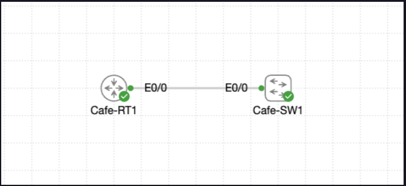

# Lab 011 - Configuring Router Interfaces

<p class="back-link">
  <a href="../../Lab-index.html">← Back to Lab Index</a>
</p>

<table>
<tr>
<td colspan="2" valign="top">

<h1>Objective</h1>

<h4>Configure and secure the <code>Cafe-RT1</code> router for the Coffee House Beta deployment.</h4>

<h4>Demonstrate router baseline hardening, interface inspection, LAN interface activation, interface documentation, neighbour discovery and management reachability testing.</h4>

<h4>Prove that <code>Cafe-RT1</code> can reach <code>Cafe-SW1</code> across the management subnet.</h4>

<h4>Preserve the working configuration after successful verification.</h4>

</td>
</tr>

<tr>
<td valign="top" width="50%">

</td>

<td valign="bottom" width="50%">

</td>
</tr>
</table>

---

## Scenario

This lab simulates bringing the Coffee House Beta router online after the switching layer had already been prepared.

The router, `Cafe-RT1`, needed to be secured with local credentials, inspected to confirm the available Ethernet interfaces, configured with a live LAN-facing interface, and documented so that the future WAN hand-off was clearly identified.

The main workflow was:

```text
Secure router access → Inspect interfaces → Configure LAN port → Label WAN reserve port → Discover neighbour → Test connectivity → Save configuration
```

In plain English:

> I was preparing the site router for production by securing access, bringing the LAN interface online, documenting the future WAN port, and proving that the router could see and reach the connected switch across the management subnet.

---

## Devices Used

| Device     | Role                                      |
| ---------- | ----------------------------------------- |
| `Cafe-RT1` | Router / LAN gateway / secured management device |
| `Cafe-SW1` | Connected switch / management reachability target |
| `Et0/0`    | Active LAN-facing router interface         |
| `Et0/1`    | Reserved WAN-facing router interface       |

---

## Addressing and VLAN Plan

| Device     | Interface | Purpose          | IP Address       | Subnet Mask       |
| ---------- | --------- | ---------------- | ---------------- | ----------------- |
| `Cafe-RT1` | `Et0/0`   | Coffee House LAN | `192.168.42.1`   | `255.255.255.0`   |
| `Cafe-SW1` | Management address discovered by CDP | Switch management | `192.168.42.2` | `255.255.255.0` |

> Note: This router lab used the same `192.168.42.0/24` management subnet as the switch management lab.

---

## Interface / Port Plan

| Device     | Interface | Connected To / Purpose | Status / Role |
| ---------- | --------- | ---------------------- | ------------- |
| `Cafe-RT1` | `Et0/0`   | Coffee House LAN / `Cafe-SW1` | Active LAN interface |
| `Cafe-RT1` | `Et0/1`   | Future WAN hand-off | Shutdown / reserved |
| `Cafe-RT1` | `Et0/2`   | Unused | Shutdown |
| `Cafe-RT1` | `Et0/3`   | Unused | Shutdown |
| `Cafe-RT1` | `Et1/0`   | Unused | Shutdown |
| `Cafe-RT1` | `Et1/1`   | Unused | Shutdown |
| `Cafe-RT1` | `Et1/2`   | Unused | Shutdown |
| `Cafe-RT1` | `Et1/3`   | Unused | Shutdown |

---

## Final Topology

```text
+----------------+
|    Cafe-RT1    |
| Et0/0          |
| 192.168.42.1   |
+-------+--------+
        |
        | Ethernet0/0
        |
+-------+--------+
|    Cafe-SW1    |
| Mgmt address   |
| 192.168.42.2   |
+----------------+

Et0/1 on Cafe-RT1 = WAN-Pending / administratively down
```

---

# Configuration and Investigation Steps

---

## Step 1 - Access the router and enter configuration mode

```bash
enable
configure terminal
```

### Explanation

I connected to `Cafe-RT1`, entered privileged EXEC mode, and then moved into global configuration mode.

This gave me access to the router-wide configuration commands needed to apply local credentials, console and VTY settings, the enable secret, interface descriptions and IP addressing.

---

## Step 2 - Apply the router security baseline

```bash
hostname Cafe-RT1
username cisco secret cisco
line con 0
login local
logging synchronous
exit
line vty 0 4
login local
transport input ssh telnet
exit
enable secret CrC0ffee!
end
write memory
```

### Explanation

This step applied the basic security baseline for the router.

The local username allowed console and VTY lines to authenticate against the router’s local user database. The enable secret protected privileged EXEC mode, and `logging synchronous` helped keep console messages from interrupting typed commands.

The configuration was then saved with `write memory` so the baseline would survive a reload.

| Setting | Configured Value |
| ------- | ---------------- |
| Hostname | `Cafe-RT1` |
| Local username | `cisco` |
| Console login | Local authentication |
| VTY login | Local authentication |
| Remote access | SSH and Telnet permitted |
| Enable secret | `CrC0ffee!` |
| Baseline saved | Yes |

> For a production network, SSH-only access would usually be preferred over allowing Telnet. In this training lab, Telnet was permitted because the task requested standard lab access behaviour.

---

## Step 3 - Inspect available router interfaces

```bash
show ip interface brief
show interfaces description
```

### Explanation

Before activating any ports, I checked the router’s interface summary.

This confirmed that the router had eight Ethernet interfaces available:

```text
Ethernet0/0 - Ethernet0/3
Ethernet1/0 - Ethernet1/3
```

All interfaces were initially administratively down, and no descriptions were present.

| Interface Range | Initial State |
| --------------- | ------------- |
| `Et0/0` - `Et0/3` | Administratively down |
| `Et1/0` - `Et1/3` | Administratively down |

This gave a clean starting point before enabling only the interface required for the lab.

---

## Step 4 - Activate the LAN-facing interface

```bash
configure terminal
interface ethernet0/0
description ## CoffeeHouse-LAN
ip address 192.168.42.1 255.255.255.0
no shutdown
exit
```

### Explanation

I configured `Ethernet0/0` as the active LAN-facing interface.

The description documents the purpose of the interface, the IP address places the router into the `192.168.42.0/24` management subnet, and `no shutdown` brings the interface out of its default administratively down state.

| Item | Result |
| ---- | ------ |
| Interface | `Ethernet0/0` |
| Description | `## CoffeeHouse-LAN` |
| IP address | `192.168.42.1/24` |
| Final state | Up/up |

---

## Step 5 - Label the WAN-facing interface but leave it shut down

```bash
interface ethernet 0/1
description ## WAN-Pending
shutdown
exit
end
```

### Explanation

I labelled `Ethernet0/1` as the future WAN hand-off but intentionally left it administratively down.

This keeps the port safe and inactive until the carrier circuit is ready, while still making its intended purpose clear to future field engineers.

| Interface | Description | State |
| --------- | ----------- | ----- |
| `Ethernet0/1` | `## WAN-Pending` | Administratively down |

---

## Step 6 - Verify interface state after configuration

```bash
show ip interface brief
```

### Explanation

This confirmed that `Ethernet0/0` had been successfully configured and brought online, while the WAN-pending interface and unused interfaces remained shut down.

| Interface | IP Address | Expected State | Confirmed State |
| --------- | ---------- | -------------- | --------------- |
| `Et0/0`   | `192.168.42.1` | Up/up | Up/up |
| `Et0/1`   | Unassigned | Administratively down/down | Administratively down/down |
| `Et0/2` - `Et1/3` | Unassigned | Administratively down/down | Administratively down/down |

---

## Step 7 - Discover the connected switch with CDP

```bash
show cdp neighbors detail
```

### Explanation

I used CDP to confirm what device was connected to `Cafe-RT1` on `Ethernet0/0`.

The output discovered `Cafe-SW1`, confirmed that the local router interface was `Ethernet0/0`, and showed the switch management address as `192.168.42.2`.

| CDP Field | Result |
| --------- | ------ |
| Neighbour device | `Cafe-SW1` |
| Local interface | `Ethernet0/0` |
| Remote port ID | `Ethernet0/0` |
| Neighbour management IP | `192.168.42.2` |
| Reported duplex | Full |

This proved that the router was physically/logically connected to the expected switch.

---

## Step 8 - Test management reachability

```bash
ping 192.168.42.2
```

### Explanation

I tested connectivity from `Cafe-RT1` to the management address of `Cafe-SW1`.

The ping result was:

```text
.!!!!
Success rate is 80 percent (4/5)
```

The first packet failed, but the following four succeeded. This is a common result when the first ICMP packet is sent before ARP resolution has completed.

| Source     | Destination    | Expected | Result |
| ---------- | -------------- | -------- | ------ |
| `Cafe-RT1` | `192.168.42.2` | Success | 80% success, then reachable |

This confirmed that the router could reach the connected switch across the management subnet.

---

## Step 9 - Save the verified configuration

```bash
write memory
```

### Explanation

After successful connectivity verification, I saved the working configuration.

This ensures the router keeps the security baseline, interface descriptions, IP address and interface state after a reload.

| Save Action | Result |
| ----------- | ------ |
| `write memory` | `[OK]` |

---

# Verification

## Device Verification

```bash
show ip interface brief
show interfaces description
show cdp neighbors detail
write memory
```

### Expected / Confirmed Results

| Check | Result |
| ----- | ------ |
| Hostname configured as `Cafe-RT1` | Yes |
| Local username configured | Yes |
| Console login uses local credentials | Yes |
| VTY login uses local credentials | Yes |
| Enable secret configured | Yes |
| `Ethernet0/0` configured with `192.168.42.1/24` | Yes |
| `Ethernet0/0` up/up | Yes |
| `Ethernet0/1` labelled as WAN pending | Yes |
| `Ethernet0/1` remains administratively down | Yes |
| Other unused interfaces remain administratively down | Yes |
| CDP discovers `Cafe-SW1` | Yes |
| Ping to `192.168.42.2` succeeds after initial ARP resolution | Yes |
| Configuration saved | Yes |

---

## Connectivity Verification

```bash
ping 192.168.42.2
```

### Results

| Source     | Destination | Expected | Result |
| ---------- | ----------- | -------- | ------ |
| `Cafe-RT1` | `Cafe-SW1` management IP `192.168.42.2` | Success | 80% success, with replies after initial timeout |

---

## Feature-Specific Verification

```bash
show ip interface brief
show interfaces description
show cdp neighbors detail
```

### Summary

| Feature | Verification Command | Result |
| ------- | -------------------- | ------ |
| Interface state | `show ip interface brief` | `Et0/0` up/up; unused ports shutdown |
| Interface documentation | `show interfaces description` | Initial state captured; WAN/LAN descriptions configured |
| Neighbour discovery | `show cdp neighbors detail` | `Cafe-SW1` discovered on `Et0/0` |
| Management reachability | `ping 192.168.42.2` | Ping succeeds after initial timeout |
| Configuration persistence | `write memory` | Configuration saved successfully |

---

# Troubleshooting

## Issue 1 - All router interfaces initially administratively down

### What happened

The first interface summary showed every Ethernet interface as administratively down.

```bash
Ethernet0/0            unassigned      YES TFTP   administratively down down
Ethernet0/1            unassigned      YES TFTP   administratively down down
```

### Diagnosis

This was expected default behaviour for the lab router. No interfaces had been activated yet.

### Fix

I configured only the required LAN-facing interface and brought it online.

```bash
interface ethernet0/0
description ## CoffeeHouse-LAN
ip address 192.168.42.1 255.255.255.0
no shutdown
```

### Lesson

Router interfaces are often shutdown by default. An IP address alone is not enough; `no shutdown` is required to activate the interface.

---

## Issue 2 - WAN interface intentionally left down

### What happened

`Ethernet0/1` remained administratively down after configuration.

```bash
Ethernet0/1            unassigned      YES TFTP   administratively down down
```

### Diagnosis

This was not a fault. The task required `Ethernet0/1` to be reserved for a future WAN hand-off and kept shut down until the carrier circuit is ready.

### Fix

I labelled the interface and explicitly left it shut down.

```bash
interface ethernet 0/1
description ## WAN-Pending
shutdown
```

### Lesson

Not every administratively down interface is a problem. Sometimes a shutdown state is the correct design choice for unused or pending circuits.

---

## Issue 3 - First ping packet failed

### What happened

The ping from `Cafe-RT1` to `Cafe-SW1` returned one timeout followed by four successful replies.

```bash
.!!!!
Success rate is 80 percent (4/5)
```

### Diagnosis

Because the remaining packets succeeded with 1 ms round-trip times, the first failure was most likely caused by ARP resolving the destination MAC address.

### Fix

The ping result was accepted as successful for the lab objective because reachability was confirmed after the initial timeout.

A repeat ping would be useful as extra evidence next time:

```bash
ping 192.168.42.2
```

### Lesson

The first ping across a newly established path can lose one packet while ARP completes. The full pattern matters more than a single lost first packet.

---

# Key Learnings

* Router interfaces may start administratively down and need `no shutdown` before they can pass traffic.
* Interface descriptions are useful on routers as well as switches.
* It is good practice to label a future WAN hand-off even before the circuit is live.
* Local authentication can be used to secure console and VTY access.
* The enable secret protects privileged EXEC mode.
* CDP is useful for confirming the directly connected neighbour, local interface, remote port and neighbour management address.
* A successful ping after an initial timeout can still prove connectivity when ARP resolution explains the first failure.
* Saving the configuration after verification protects the working state.

---

# Improvements for Next Time

* Run `show interfaces description` again after applying the LAN and WAN descriptions to capture final description evidence.
* Repeat the ping after the initial ARP-related timeout to show a clean 100% result.
* Add `show running-config | section line con` and `show running-config | section line vty` to prove the authentication configuration.
* Add `show running-config interface ethernet0/0` and `show running-config interface ethernet0/1` to prove the final interface configuration.
* Prefer SSH-only remote access in a more realistic production-hardening lab.
* Capture final screenshots of `show ip interface brief`, `show cdp neighbors detail`, the ping result and the saved configuration confirmation.

---

# Final Result

This lab successfully secured and activated the `Cafe-RT1` router for the Coffee House Beta deployment. Console and VTY access were configured to use local credentials, privileged access was protected with an enable secret, the LAN-facing `Ethernet0/0` interface was configured with `192.168.42.1/24` and brought up, and the future WAN-facing `Ethernet0/1` interface was clearly labelled while remaining shutdown.

CDP confirmed that `Cafe-RT1` was connected to `Cafe-SW1`, and the router successfully reached the switch management address at `192.168.42.2`.

The main practical workflow reinforced by this lab was:

```text
Secure → Inspect → Configure → Discover → Test → Save
```

---

# Raw CLI Dump

The raw CLI evidence for this lab has been separated into:

```text
evidence/raw-cli-output.md
```
