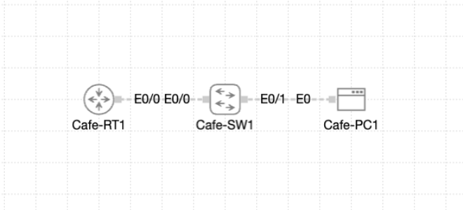

# Lab 012 - Reading Interface Counters

<p class="back-link">
  <a href="../../Lab-index.html">← Back to Lab Index</a>
</p>

<table>
<tr>
<td colspan="2" valign="top">

<h1>Objective</h1>

<h4>Capture and interpret key interface counters on <code>Cafe-RT1</code> <code>Ethernet0/0</code>.</h4>

<h4>Confirm that the router LAN link to <code>Cafe-SW1</code> is healthy by checking errors, CRCs, collisions, resets, traffic rates and load values.</h4>

<h4>Correlate the router interface MAC address with the switch MAC address table.</h4>

<h4>Compare the healthy lab output with a sample duplex mismatch so the warning signs can be recognised in future troubleshooting.</h4>

</td>
</tr>

<tr>
<td valign="top" width="50%">

</td>

</tr>
</table>

---

## Scenario

This lab simulates a post-turn-up health check on the Coffee House Beta router LAN uplink.

The router is already passing traffic, but the link needs to be validated using interface counters rather than simply assuming it is healthy because it is up/up. The task was to capture the router’s interface statistics, confirm which switchport learned the router MAC address, and compare healthy counters with a duplex mismatch example.

The main workflow was:

```text
Capture router interface counters → Identify router MAC → Check switch MAC table → Compare healthy vs mismatch counters → Document findings
```

In plain English:

> I was checking whether the router-to-switch LAN link was genuinely healthy by reading the interface counters, confirming where the router appeared in the switch MAC table, and learning which counters would normally spike during a duplex mismatch.

---

## Devices Used

| Device     | Role                                      |
| ---------- | ----------------------------------------- |
| `Cafe-RT1` | Router with LAN interface under review    |
| `Cafe-SW1` | Access switch connected to the router     |
| `Et0/0` on `Cafe-RT1` | Router LAN uplink to `Cafe-SW1` |
| `Et0/0` on `Cafe-SW1` | Switchport learning the router MAC |
| `Cafe-PC1` | Traffic target for embedded IP SLA echo   |

---

## Addressing and VLAN Plan

| Device     | Interface | IP Address       | Subnet Mask       | Purpose |
| ---------- | --------- | ---------------- | ----------------- | ------- |
| `Cafe-RT1` | `Et0/0`   | `192.168.10.1`   | `255.255.255.0`   | LAN gateway / uplink to `Cafe-SW1` |
| `Cafe-PC1` | Host NIC  | `192.168.10.100` | Not shown in CLI   | IP SLA echo target |

| VLAN | Device / Table | MAC Address | Port |
| ---: | -------------- | ----------- | ---- |
| 10 | `Cafe-SW1` MAC table | `aabb.cc00.0200` | `Et0/0` |
| 10 | `Cafe-SW1` MAC table | `5254.0053.9eb2` | `Et0/1` |

---

## Interface / Port Plan

| Device     | Interface | Connected To / Purpose | Final State |
| ---------- | --------- | ---------------------- | ----------- |
| `Cafe-RT1` | `Et0/0`   | Uplink to `Cafe-SW1` `Et0/0` | Up/up |
| `Cafe-SW1` | `Et0/0`   | Learns router MAC address | Active switchport |
| `Cafe-SW1` | `Et0/1`   | Learns second VLAN 10 MAC, likely host-side device | Active switchport |

---

## Final Topology

```text
+----------------+
|    Cafe-RT1    |
| Et0/0          |
| 192.168.10.1   |
| MAC aabb.cc00.0200
+-------+--------+
        |
        | Uplink to Cafe-SW1 E0/0
        |
+-------+--------+
|    Cafe-SW1    |
| Et0/0          |
| Learns router  |
| MAC aabb.cc00.0200
+-------+--------+
        |
       Et0/1
        |
     Cafe-PC1
```

---

# Configuration and Investigation Steps

---

## Step 1 - Access Cafe-RT1 and inspect Ethernet0/0

```bash
show interface ethernet0/0
```

### Explanation

I started by checking the full interface output for `Cafe-RT1` `Ethernet0/0`.

This command gives a detailed health view of the link, including:

* Interface state.
* Line protocol state.
* Hardware MAC address.
* Interface description.
* IP address.
* Bandwidth and delay values.
* Reliability and load.
* Input and output rates.
* Packet and byte counters.
* Error, CRC, collision and reset counters.

The interface was up/up and had the expected LAN IP address.

| Item | Observed Value |
| ---- | -------------- |
| Interface | `Ethernet0/0` |
| Status | Up |
| Line protocol | Up |
| MAC address | `aabb.cc00.0200` |
| Description | `Uplink to Cafe-SW1 E0/0` |
| IP address | `192.168.10.1/24` |
| Reliability | `255/255` |
| TX load | `1/255` |
| RX load | `1/255` |

---

## Step 2 - Record baseline traffic rates and packet counters

```bash
show interface ethernet0/0
```

### Explanation

The five-minute traffic rates showed light traffic on the interface.

This matched the lab note that an embedded IP SLA echo to `Cafe-PC1` kept traffic flowing even when no manual traffic was generated.

| Counter | Baseline Value |
| ------- | -------------- |
| 5 minute input rate | `1000 bits/sec`, `1 packets/sec` |
| 5 minute output rate | `1000 bits/sec`, `1 packets/sec` |
| Packets input | `77` |
| Bytes input | `7423` |
| Packets output | `63` |
| Bytes output | `8044` |
| Received broadcasts | `36` |
| Output broadcasts | `16` |

This gave a baseline that could be compared with later checks.

---

## Step 3 - Record baseline error, CRC, collision and reset counters

```bash
show interface ethernet0/0
```

### Explanation

The important health counters were clean.

| Counter | Baseline Value | Interpretation |
| ------- | -------------- | -------------- |
| Input errors | `0` | Healthy |
| CRC errors | `0` | Healthy |
| Frame errors | `0` | Healthy |
| Overruns | `0` | Healthy |
| Ignored packets | `0` | Healthy |
| Output errors | `0` | Healthy |
| Collisions | `0` | Healthy |
| Late collisions | `0` | Healthy |
| Lost carrier | `0` | Healthy |
| No carrier | `0` | Healthy |
| Output drops | `0` | Healthy |
| Interface resets | `2` | Present, but not increasing in later filtered check |
| Unknown protocol drops | `1` | Not enough evidence of an active fault |

The link showed no active input errors, CRCs, output errors or collisions. That is the most important evidence that the link was healthy at the time of the check.

---

## Step 4 - Clear counters after the baseline

```bash
clear counters
```

### Explanation

After capturing the baseline, I cleared the interface counters.

This is useful when monitoring whether counters continue to increase after a change or during a troubleshooting window.

The router asked for confirmation:

```bash
Clear "show interface" counters on all interfaces [confirm]
```

After this point, future counter checks would be easier to interpret because they would reflect newer activity rather than older accumulated values.

---

## Step 5 - Check the switch MAC address table

```bash
show mac address-table
```

### Explanation

I moved to `Cafe-SW1` and checked the MAC address table.

The router MAC address from `Cafe-RT1` `Ethernet0/0` was:

```text
aabb.cc00.0200
```

The switch MAC table showed this MAC address on `Cafe-SW1` `Et0/0`.

| VLAN | MAC Address | Type | Switch Port |
| ---: | ----------- | ---- | ----------- |
| 10 | `aabb.cc00.0200` | Dynamic | `Et0/0` |
| 10 | `5254.0053.9eb2` | Dynamic | `Et0/1` |

This confirmed that `Cafe-SW1` was learning the router’s MAC address on the expected port.

---

## Step 6 - Document the router MAC to switchport mapping

```text
Router MAC present on Et0/0 on Cafe-SW1
```

### Explanation

This is a useful site-log entry because it ties together the router’s local interface view and the switch’s forwarding table.

| Router | Router Interface | Router MAC | Switch | Switch Port |
| ------ | ---------------- | ---------- | ------ | ----------- |
| `Cafe-RT1` | `Et0/0` | `aabb.cc00.0200` | `Cafe-SW1` | `Et0/0` |

This means future troubleshooting can begin with known data rather than guessing which switchport the router uses.

---

## Step 7 - Run a focused healthy-counter check

```bash
show interface ethernet0/0 | include line protocol|duplex|collisions|crc|resets
```

### Explanation

I ran a filtered version of the interface command to focus on the most relevant duplex and error indicators.

The captured output showed:

```text
Ethernet0/0 is up, line protocol is up
0 output errors, 0 collisions, 0 interface resets
```

Because the filtered command used lowercase `crc`, the output did not show the earlier uppercase `CRC` line. The full baseline output had already confirmed:

```text
0 input errors, 0 CRC
```

| Counter | Healthy Lab Result |
| ------- | ------------------ |
| Line protocol | Up |
| Output errors | 0 |
| Collisions | 0 |
| Interface resets after clearing | 0 |
| CRC from full baseline | 0 |

---

## Step 8 - Compare healthy output with duplex mismatch symptoms

### Healthy lab output

```text
Ethernet0/0 is up, line protocol is up
0 input errors, 0 CRC
0 output errors, 0 collisions, 0 interface resets
```

### Sample mismatch output

```text
Ethernet0/0 is up, line protocol is up (half-duplex)
0 input errors, 56 CRC, 89 collisions, 0 late collision
7 interface resets
```

### Explanation

The live lab output showed a healthy link. The sample mismatch output showed warning signs that would be concerning on a real network.

The key difference is not just that the link is up. A duplex mismatch can still show the interface as up/up while traffic performance is poor.

| Indicator | Healthy Lab Output | Sample Duplex Mismatch |
| --------- | ------------------ | ---------------------- |
| Line state | Up/up | Up/up |
| Duplex clue | Healthy full-duplex behaviour expected | Half-duplex shown in sample |
| CRC errors | 0 | 56 |
| Collisions | 0 | 89 |
| Late collisions | 0 | 0 in sample, but could appear in real mismatch cases |
| Interface resets | 0 after clear / 2 in earlier baseline | 7 |
| Interpretation | Link appears healthy | Link has mismatch symptoms |

---

# Verification

## Device Verification

```bash
show interface ethernet0/0
show mac address-table
show interface ethernet0/0 | include line protocol|duplex|collisions|crc|resets
```

### Expected / Confirmed Results

| Check | Result |
| ----- | ------ |
| `Cafe-RT1` `Et0/0` is up/up | Yes |
| `Cafe-RT1` `Et0/0` has IP `192.168.10.1/24` | Yes |
| Router MAC address captured | Yes |
| Five-minute input/output rates captured | Yes |
| Packet and byte counters captured | Yes |
| CRC counter is zero | Yes |
| Input error counter is zero | Yes |
| Collision counter is zero | Yes |
| Router MAC found on `Cafe-SW1` | Yes |
| Router MAC mapped to `Cafe-SW1 Et0/0` | Yes |
| Duplex mismatch symptoms documented | Yes |

---

## Connectivity Verification

This lab focused on interface health and MAC learning rather than direct ping testing.

However, the interface counters showed live traffic, and the lab briefing noted that an embedded IP SLA echo to `Cafe-PC1` at `192.168.10.100` was keeping light traffic flowing.

| Evidence | Result |
| -------- | ------ |
| `Et0/0` line protocol | Up |
| Input traffic rate | `1000 bits/sec`, `1 packets/sec` |
| Output traffic rate | `1000 bits/sec`, `1 packets/sec` |
| Interface packet counters | Increasing / populated |
| MAC learning on switch | Router MAC learned on `Et0/0` |

---

## Feature-Specific Verification

```bash
show interface ethernet0/0
show mac address-table
clear counters
```

### Summary

| Feature | Verification Command | Result |
| ------- | -------------------- | ------ |
| Interface health | `show interface ethernet0/0` | Up/up, clean errors and CRCs |
| Traffic baseline | `show interface ethernet0/0` | Light traffic observed |
| MAC correlation | `show mac address-table` | Router MAC learned on `Cafe-SW1 Et0/0` |
| Counter reset | `clear counters` | Counters cleared for future monitoring |
| Duplex mismatch awareness | Sample comparison | CRCs, collisions and resets identified as warning signs |

---

# Troubleshooting

## Issue 1 - A link can be up/up but still unhealthy

### What happened

The lab interface was up/up and healthy, but the sample mismatch output showed that an interface can still report as up while counters indicate a problem.

### Diagnosis

The sample mismatch showed:

```text
56 CRC
89 collisions
7 interface resets
```

These counters suggest a physical or Layer 1/Layer 2 issue such as a duplex mismatch, cabling problem, or negotiation problem.

### Fix

In a real duplex mismatch scenario, the fix would be to check both ends of the link and make sure speed and duplex settings match.

Example approach:

```bash
show interface ethernet0/0
show interfaces status
```

Then either allow both sides to auto-negotiate correctly or manually match both sides if the design requires fixed settings.

### Lesson

Do not rely only on `up/up`. Interface counters explain whether the link is actually clean.

---

## Issue 2 - The filtered command did not show the CRC line

### What happened

The filtered command used lowercase `crc`:

```bash
show interface ethernet0/0 | include line protocol|duplex|collisions|crc|resets
```

The full interface output showed `CRC` in uppercase, so the filtered output did not display that line.

### Diagnosis

Cisco IOS output filtering can be case-sensitive depending on the platform and command behaviour. In this case, the filter did not catch the uppercase `CRC` text.

### Fix

Use uppercase `CRC` in the filter, or include both versions if needed.

```bash
show interface ethernet0/0 | include line protocol|duplex|collisions|CRC|resets
```

### Lesson

When filtering IOS output, match the exact text shown in the full command output.

---

## Issue 3 - Interface resets appeared in the baseline

### What happened

The full baseline showed:

```bash
0 output errors, 0 collisions, 2 interface resets
```

### Diagnosis

The resets were present in the accumulated baseline, but after clearing counters the focused check showed:

```bash
0 output errors, 0 collisions, 0 interface resets
```

There was no evidence that resets were continuing to increase during the verification period.

### Fix

No immediate fix was needed. Clearing counters and rechecking gave a clearer view of current behaviour.

### Lesson

Accumulated counters need context. A non-zero historical counter is less concerning if it does not continue increasing and current error counters are clean.

---

# Key Learnings

* `show interface ethernet0/0` gives a detailed health view of a link.
* An interface being `up/up` does not automatically prove it is healthy.
* CRC errors, input errors, collisions and interface resets are important warning signs.
* Duplex mismatches can show as CRCs, collisions and resets while the link still appears up.
* The MAC address in the router interface output can be matched against the switch MAC address table.
* `show mac address-table` is useful for confirming which switchport has learned a device.
* Clearing counters after a baseline makes later changes easier to spot.
* IOS output filtering needs careful matching, including capitalisation such as `CRC`.

---

# Improvements for Next Time

* Capture `show interfaces status` on `Cafe-SW1` to confirm switch-side speed and duplex.
* Use `show interface ethernet0/0 | include line protocol|duplex|collisions|CRC|resets` with uppercase `CRC`.
* Capture a second full `show interface ethernet0/0` after clearing counters and allowing traffic to run.
* Run `show mac address-table address aabb.cc00.0200` if supported, to target the router MAC directly.
* Add a ping or traffic generation test before and after clearing counters.
* Save before-and-after counter values in a small table for easier portfolio reading.

---

# Final Result

This lab successfully captured and interpreted interface counters on `Cafe-RT1` `Ethernet0/0`. The router LAN interface was up/up with IP address `192.168.10.1/24`, light traffic was visible, and the key health counters showed no input errors, CRCs, output errors or collisions.

The router MAC address `aabb.cc00.0200` was confirmed in the `Cafe-SW1` MAC address table on switchport `Et0/0`, proving the router-to-switch connection point. The lab also documented how a duplex mismatch would differ from the healthy output, with CRCs, collisions and resets acting as major warning signs.

The main practical workflow reinforced by this lab was:

```text
Read counters → Map MAC address → Compare symptoms → Clear counters → Recheck health
```

---

# Raw CLI Dump

The raw CLI evidence for this lab has been separated into:

```text
evidence/raw-cli-output.md
```
