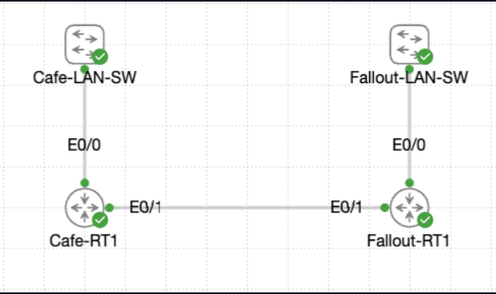
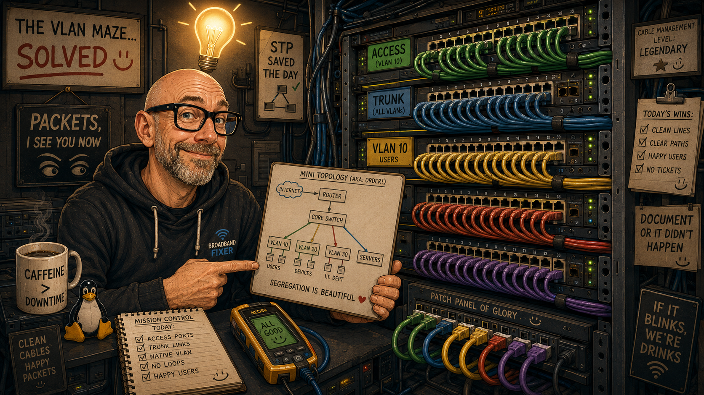

# Lab 013 - Coffee House to Fallout Local Routing

<table>
<tr>
<td colspan="2" valign="top">

# Objective

#### Configure local routing between the Coffee House and Fallout LANs using two routers and a point-to-point link.
#### Demonstrate router baseline verification, LAN gateway activation, point-to-point addressing, static routing and end-to-end reachability testing.
#### Confirm both routers preserve their interface descriptions, run IOS XE 17.16, use type 9 secrets, and require local authentication.
#### Save the validated configurations after successful routing and connectivity verification.

</td>
</tr>

<tr>
<td valign="top" width="50%">

</td>

<td valign="bottom" width="50%">

</td>

</tr>
</table>

---

## Scenario

This lab connects the Coffee House network to the Fallout shelter floor before the main WAN cutover.

Both routers already had baseline credentials and interface descriptions, but the required ports were still shut down. The task was to activate the LAN-facing interfaces, bring up a point-to-point router link, configure static routes between the two LANs, and prove that traffic could cross between the sites.

The main workflow was:

```text
Verify baseline → Activate LAN gateways → Build point-to-point link → Add static routes → Test end-to-end reachability → Save configuration
```

In plain English:

> I was joining two small routed networks together by configuring each router’s LAN interface, building a direct router-to-router link, adding static routes, and proving that each side could reach the other side’s LAN gateway.

---

## Devices Used

| Device        | Role                                      |
| ------------- | ----------------------------------------- |
| `Cafe-RT1`    | Coffee House router / LAN gateway         |
| `Fallout-RT1` | Fallout shelter router / LAN gateway      |
| `Et0/0`       | LAN-facing interface on each router       |
| `Et0/1`       | Point-to-point inter-router link          |

---

## Addressing and VLAN Plan

| Site / Link | Device        | Interface | IP Address      | Subnet Mask         | Purpose |
| ----------- | ------------- | --------- | --------------- | ------------------- | ------- |
| Coffee House LAN | `Cafe-RT1` | `Et0/0` | `192.168.42.1` | `255.255.255.0` | Coffee House LAN gateway |
| Fallout LAN | `Fallout-RT1` | `Et0/0` | `192.168.84.1` | `255.255.255.0` | Fallout LAN gateway |
| Point-to-point | `Cafe-RT1` | `Et0/1` | `10.8.0.1` | `255.255.255.252` | Link to `Fallout-RT1` |
| Point-to-point | `Fallout-RT1` | `Et0/1` | `10.8.0.2` | `255.255.255.252` | Link to `Cafe-RT1` |

---

## Static Route Plan

| Router | Destination Network | Mask | Next Hop | Exit Path |
| ------ | ------------------- | ---- | -------- | --------- |
| `Cafe-RT1` | `192.168.84.0` | `/24` | `10.8.0.2` | `Ethernet0/1` |
| `Fallout-RT1` | `192.168.42.0` | `/24` | `10.8.0.1` | `Ethernet0/1` |

---

## Interface / Port Plan

| Device        | Interface | Connected To / Purpose | Final Address | Final State |
| ------------- | --------- | ---------------------- | ------------- | ----------- |
| `Cafe-RT1`    | `Et0/0`   | Coffee House LAN        | `192.168.42.1/24` | Up/up |
| `Cafe-RT1`    | `Et0/1`   | Point-to-point to Fallout | `10.8.0.1/30` | Up/up |
| `Fallout-RT1` | `Et0/0`   | Fallout Shelter LAN     | `192.168.84.1/24` | Up/up |
| `Fallout-RT1` | `Et0/1`   | Point-to-point to Coffee House | `10.8.0.2/30` | Up/up |

---

## Final Topology

```text
Coffee House LAN                         Fallout Shelter LAN
192.168.42.0/24                          192.168.84.0/24

      Gateway                                   Gateway
   192.168.42.1                              192.168.84.1
+----------------+       10.8.0.0/30       +----------------+
|    Cafe-RT1    |=========================|   Fallout-RT1  |
| Et0/0          | Et0/1             Et0/1 |          Et0/0 |
| 192.168.42.1   | 10.8.0.1     10.8.0.2  |   192.168.84.1 |
+----------------+                         +----------------+
```

---

# Configuration and Investigation Steps

---

## Step 1 - Verify the baseline configuration on Cafe-RT1

```bash
show running-config
```

### Explanation

I checked the existing configuration on `Cafe-RT1` before making interface changes.

The output confirmed that the router was running version `17.16`, had `login on-success log` enabled, used type 9 secrets, and had local authentication configured on the console and VTY lines.

Important baseline items confirmed:

| Item | Confirmed Value |
| ---- | --------------- |
| Hostname | `Cafe-RT1` |
| IOS version | `17.16` |
| Enable secret type | Type 9 |
| Local username secret type | Type 9 |
| Console authentication | `login local` |
| VTY authentication | `login local` |
| Successful login logging | `login on-success log` |
| Existing `Et0/0` description | `## Coffee House LAN - configure during lab` |
| Existing `Et0/1` description | `## P2P-to-Fallout - configure during lab` |

---

## Step 2 - Verify the baseline configuration on Fallout-RT1

```bash
show running-config
```

### Explanation

I repeated the baseline check on `Fallout-RT1`.

The output confirmed that this router was also running version `17.16`, had type 9 secrets, used local console and VTY authentication, and had successful login event logging enabled.

Important baseline items confirmed:

| Item | Confirmed Value |
| ---- | --------------- |
| Hostname | `Fallout-RT1` |
| IOS version | `17.16` |
| Enable secret type | Type 9 |
| Local username secret type | Type 9 |
| Console authentication | `login local` |
| VTY authentication | `login local` |
| Successful login logging | `login on-success log` |
| Existing `Et0/0` description | `## Fallout Shelter LAN - configure during lab` |
| Existing `Et0/1` description | `## P2P-to-CoffeeHouse - configure during lab` |
| Existing `Et0/2` description | `## Spare module - keep shutdown` |

---

## Step 3 - Activate the Coffee House LAN gateway

```bash
configure terminal
interface ethernet0/0
ip address 192.168.42.1 255.255.255.0
no shutdown
exit
exit
show ip interface brief
show interfaces description
```

### Explanation

I configured `Cafe-RT1` `Ethernet0/0` with the Coffee House LAN gateway address and brought the interface out of shutdown.

The verification output showed `Ethernet0/0` as `up/up` with the expected IP address. The interface description was still present, proving that the interface was activated without overwriting the existing annotation.

| Check | Expected | Confirmed |
| ----- | -------- | --------- |
| `Et0/0` IP address | `192.168.42.1/24` | Yes |
| `Et0/0` status | Up/up | Yes |
| Description preserved | Yes | Yes |
| `Et0/1` still shutdown | Yes | Yes |

---

## Step 4 - Activate the Fallout LAN gateway

```bash
configure terminal
interface ethernet0/0
ip address 192.168.84.1 255.255.255.0
no shutdown
end
show ip interface brief
show interfaces description
```

### Explanation

I configured `Fallout-RT1` `Ethernet0/0` with the Fallout LAN gateway address and brought it online.

The verification output showed `Ethernet0/0` as `up/up` with the expected IP address. The existing LAN description was preserved, and the point-to-point interface was still administratively down at this stage.

| Check | Expected | Confirmed |
| ----- | -------- | --------- |
| `Et0/0` IP address | `192.168.84.1/24` | Yes |
| `Et0/0` status | Up/up | Yes |
| Description preserved | Yes | Yes |
| `Et0/1` still shutdown | Yes | Yes |

---

## Step 5 - Configure the Cafe side of the point-to-point link

```bash
configure terminal
interface ethernet0/1
ip address 10.8.0.1 255.255.255.252
no shutdown
end
show interfaces description
show ip interface brief
show interfaces ethernet0/1 | include line protocol
```

### Explanation

I configured the `Cafe-RT1` side of the router-to-router point-to-point link.

The `/30` subnet provides two usable host addresses, which is suitable for a simple point-to-point link:

```text
10.8.0.0/30
Usable hosts: 10.8.0.1 and 10.8.0.2
```

After applying the IP address and `no shutdown`, `Cafe-RT1` showed `Ethernet0/1` as up/up. The interface description was still intact.

| Check | Expected | Confirmed |
| ----- | -------- | --------- |
| `Et0/1` IP address | `10.8.0.1/30` | Yes |
| `Et0/1` status | Up/up | Yes |
| Line protocol | Up | Yes |
| Description preserved | Yes | Yes |

---

## Step 6 - Configure the Fallout side of the point-to-point link

```bash
configure terminal
interface ethernet0/1
ip address 10.8.0.2 255.255.255.252
no shutdown
end
show interfaces description
show ip interface brief
show interfaces ethernet0/1 | include line protocol
```

### Explanation

I configured the `Fallout-RT1` side of the point-to-point link with the second usable address in the `/30` subnet.

The verification output confirmed that both the LAN interface and point-to-point interface were up/up, and the existing description remained in place.

| Check | Expected | Confirmed |
| ----- | -------- | --------- |
| `Et0/1` IP address | `10.8.0.2/30` | Yes |
| `Et0/1` status | Up/up | Yes |
| Line protocol | Up | Yes |
| Description preserved | Yes | Yes |

---

## Step 7 - Configure the static route on Cafe-RT1

```bash
configure terminal
ip route 192.168.84.0 255.255.255.0 10.8.0.2
end
```

### Explanation

`Cafe-RT1` already knew about its directly connected networks:

* `192.168.42.0/24`
* `10.8.0.0/30`

It did not automatically know how to reach the Fallout LAN, so I added a static route pointing `192.168.84.0/24` traffic towards the Fallout router’s point-to-point IP address.

```text
Destination: 192.168.84.0/24
Next hop:    10.8.0.2
```

---

## Step 8 - Test reachability from Cafe-RT1 to the Fallout LAN gateway

```bash
ping 192.168.84.1
```

### Explanation

I tested from `Cafe-RT1` to the remote Fallout LAN gateway.

The ping succeeded with 100% success:

```text
!!!!!
Success rate is 100 percent (5/5)
```

This proved that `Cafe-RT1` could send traffic across the point-to-point link towards the Fallout LAN gateway.

| Source | Destination | Expected | Result |
| ------ | ----------- | -------- | ------ |
| `Cafe-RT1` | `192.168.84.1` | Success | 100% success |

---

## Step 9 - Verify the Cafe-RT1 routing table

```bash
show ip route
```

### Explanation

The routing table confirmed the static route to the Fallout LAN:

```text
S 192.168.84.0/24 [1/0] via 10.8.0.2
```

It also showed the directly connected Coffee House LAN and point-to-point subnet.

| Route Type | Network | Next Hop / Interface |
| ---------- | ------- | -------------------- |
| Connected | `10.8.0.0/30` | `Ethernet0/1` |
| Local | `10.8.0.1/32` | `Ethernet0/1` |
| Connected | `192.168.42.0/24` | `Ethernet0/0` |
| Local | `192.168.42.1/32` | `Ethernet0/0` |
| Static | `192.168.84.0/24` | via `10.8.0.2` |

---

## Step 10 - Configure and verify the reverse route on Fallout-RT1

```bash
ip route 192.168.42.0 255.255.255.0 10.8.0.1
ping 192.168.42.1
show ip route
```

### Explanation

`Fallout-RT1` needed a return path to the Coffee House LAN.

The routing table confirmed a static route to `192.168.42.0/24` via `10.8.0.1`, and the ping to the Coffee House LAN gateway succeeded with 100% success.

| Source | Destination | Expected | Result |
| ------ | ----------- | -------- | ------ |
| `Fallout-RT1` | `192.168.42.1` | Success | 100% success |

| Route Type | Network | Next Hop / Interface |
| ---------- | ------- | -------------------- |
| Connected | `10.8.0.0/30` | `Ethernet0/1` |
| Local | `10.8.0.2/32` | `Ethernet0/1` |
| Static | `192.168.42.0/24` | via `10.8.0.1` |
| Connected | `192.168.84.0/24` | `Ethernet0/0` |
| Local | `192.168.84.1/32` | `Ethernet0/0` |

---

## Step 11 - Review final interface statistics

```bash
show interfaces ethernet0/0
show interfaces ethernet0/1
```

### Explanation

I checked the interface statistics on both routers after the routing tests.

The important results were:

* Interfaces were up/up.
* IP addresses were correct.
* Descriptions remained in place.
* No input errors.
* No CRC errors.
* No output errors.
* No collisions.
* No output drops.

The interface reset counter showed `2` on the checked links, but the live error, collision and carrier counters were clean, so there was no evidence of an ongoing link fault.

| Device | Interface | Input Errors | CRC | Output Errors | Collisions | Drops |
| ------ | --------- | ------------ | --- | ------------- | ---------- | ----- |
| `Cafe-RT1` | `Et0/0` | 0 | 0 | 0 | 0 | 0 |
| `Cafe-RT1` | `Et0/1` | 0 | 0 | 0 | 0 | 0 |
| `Fallout-RT1` | `Et0/0` | 0 | 0 | 0 | 0 | 0 |
| `Fallout-RT1` | `Et0/1` | 0 | 0 | 0 | 0 | 0 |

---

## Step 12 - Confirm CDP neighbours

### Cafe-RT1

```bash
show cdp neighbors detail
```

### Fallout-RT1

```bash
show cdp neighbors detail
```

### Explanation

CDP confirmed that each router saw the other router across the point-to-point link.

| Local Router | Neighbour | Local Interface | Neighbour Address | Reported Duplex |
| ------------ | --------- | --------------- | ----------------- | --------------- |
| `Cafe-RT1` | `Fallout-RT1` | `Ethernet0/1` | `10.8.0.2` | Full |
| `Fallout-RT1` | `Cafe-RT1` | `Ethernet0/1` | `10.8.0.1` | Full |

This reinforced that the inter-router link was correctly cabled, active and discovering the expected peer.

---

## Step 13 - Save the final configurations

### Cafe-RT1

```bash
copy running-config startup-config
```

### Fallout-RT1

```bash
copy running-config startup-config
```

### Explanation

I saved the working configuration on both routers after the interface, routing and reachability checks passed.

| Device | Save Command | Result |
| ------ | ------------ | ------ |
| `Cafe-RT1` | `copy running-config startup-config` | `[OK]` |
| `Fallout-RT1` | `copy running-config startup-config` | `[OK]` |

---

# Verification

## Device Verification

```bash
show running-config
show ip interface brief
show interfaces description
show interfaces ethernet0/0
show interfaces ethernet0/1
show cdp neighbors detail
copy running-config startup-config
```

### Expected / Confirmed Results

| Check | Result |
| ----- | ------ |
| `Cafe-RT1` hostname confirmed | Yes |
| `Fallout-RT1` hostname confirmed | Yes |
| IOS version `17.16` confirmed | Yes |
| Type 9 enable secrets present | Yes |
| Type 9 local user secrets present | Yes |
| Console uses local authentication | Yes |
| VTY uses local authentication | Yes |
| Successful login logging enabled | Yes |
| LAN interfaces up/up | Yes |
| Point-to-point interfaces up/up | Yes |
| Interface descriptions preserved | Yes |
| Static routes installed | Yes |
| Cross-site pings successful | Yes |
| Interface counters clean | Yes |
| Final configurations saved | Yes |

---

## Connectivity Verification

```bash
ping 192.168.84.1
ping 192.168.42.1
```

### Results

| Source | Destination | Expected | Result |
| ------ | ----------- | -------- | ------ |
| `Cafe-RT1` | `Fallout-RT1` LAN gateway `192.168.84.1` | Success | 100% success |
| `Fallout-RT1` | `Cafe-RT1` LAN gateway `192.168.42.1` | Success | 100% success |

---

## Feature-Specific Verification

```bash
show ip route
show cdp neighbors detail
show interfaces description
show interfaces ethernet0/0
show interfaces ethernet0/1
```

### Summary

| Feature | Verification Command | Result |
| ------- | -------------------- | ------ |
| Baseline security | `show running-config` | Version 17.16, type 9 secrets, local login confirmed |
| Interface addressing | `show ip interface brief` | Expected IPs and up/up states confirmed |
| Interface documentation | `show interfaces description` | Existing descriptions preserved |
| Static routing | `show ip route` | Static routes installed via point-to-point next hops |
| Neighbour discovery | `show cdp neighbors detail` | Routers discover each other on `Et0/1` |
| Interface health | `show interfaces ethernet0/x` | No input errors, CRCs, output errors or collisions |
| Persistence | `copy running-config startup-config` | Saved successfully on both routers |

---

# Troubleshooting

## Issue 1 - LAN and point-to-point interfaces started shutdown

### What happened

The baseline configurations showed the relevant interfaces with `shutdown` configured and no IP addresses.

```bash
interface Ethernet0/0
 description ## Coffee House LAN - configure during lab
 no ip address
 shutdown
```

### Diagnosis

This was expected because the lab started with baseline-secured routers but inactive interfaces.

### Fix

I assigned the required IP addresses and used `no shutdown` on the required interfaces.

```bash
interface ethernet0/0
ip address 192.168.42.1 255.255.255.0
no shutdown
```

### Lesson

A baseline configuration may already include useful descriptions and security settings, but interfaces still need to be addressed and explicitly enabled.

---

## Issue 2 - Static routing required a route in both directions

### What happened

Each router only knew about its directly connected networks at first.

For example, `Cafe-RT1` knew about:

* `192.168.42.0/24`
* `10.8.0.0/30`

But it needed a route to the remote Fallout LAN.

### Diagnosis

Routers only automatically learn directly connected networks unless a routing method is configured. Since this lab used local static routing, each router needed a manual route to the other LAN.

### Fix

I configured mirrored static routes.

```bash
Cafe-RT1(config)#ip route 192.168.84.0 255.255.255.0 10.8.0.2
Fallout-RT1(config)#ip route 192.168.42.0 255.255.255.0 10.8.0.1
```

### Lesson

For two-way communication, the outbound path and the return path both matter. Static routes often need to be configured on both routers.

---

## Issue 3 - Interface reset counters were not zero

### What happened

The final interface statistics showed `2 interface resets` on the checked interfaces.

### Diagnosis

The more important live fault indicators were clean:

* `0 input errors`
* `0 CRC`
* `0 output errors`
* `0 collisions`
* `0 lost carrier`
* `0 no carrier`
* `0 output drops`

The resets appeared stable and did not coincide with active errors or failed connectivity.

### Fix

No immediate fix was required for the lab, because connectivity worked and the active error counters were clean.

### Lesson

Do not judge an interface from one counter alone. Look at the full set of interface statistics and the current connectivity result before deciding whether there is a fault.

---

# Key Learnings

* Baseline router hardening can be verified from `show running-config`.
* Type 9 secrets provide stronger password hashing than older secret types.
* Interface descriptions should be preserved when applying IP addresses and enabling ports.
* A `/30` subnet is well suited to a simple point-to-point routed link because it provides two usable host addresses.
* Static routes tell a router how to reach networks that are not directly connected.
* Both directions need routing for successful end-to-end communication.
* `show ip route` is essential for proving whether a static route was installed.
* `show cdp neighbors detail` is useful for confirming the directly connected router and its management address.
* Interface counters should be checked after traffic flows, not just immediately after a link comes up.
* Saving the configuration is the final step after validation, not before.

---

# Improvements for Next Time

* Capture `show ip interface brief` before any changes on both routers for a clearer before-and-after comparison.
* Capture pre-activation interface statistics before enabling the LAN and point-to-point interfaces.
* Use `show ip route 192.168.84.0` and `show ip route 192.168.42.0` to provide more targeted static route evidence.
* Capture `show arp` or `show ip arp` after the ping tests to document neighbour table updates.
* Add end-hosts on both LANs and test beyond the router gateways.
* Include a text diagram at the start of the lab notes before configuring any interfaces.
* Consider practising the same topology later with a dynamic routing protocol such as OSPF.

---

# Final Result

This lab successfully connected the Coffee House and Fallout LANs using local static routing. `Cafe-RT1` was configured as the `192.168.42.1/24` gateway, `Fallout-RT1` was configured as the `192.168.84.1/24` gateway, and the inter-router point-to-point link was brought online using `10.8.0.0/30`.

Static routes were installed in both directions, cross-site pings succeeded with 100% success, CDP confirmed the expected router neighbour on each side, interface counters showed no active error or collision problems, and both final configurations were saved.

The main practical workflow reinforced by this lab was:

```text
Verify → Address → Enable → Route → Test → Save
```

---

# Raw CLI Dump

The raw CLI evidence for this lab has been separated into:

```text
evidence/raw-cli-output.md
```
