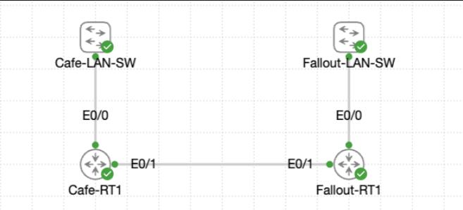

# Lab 014 - Configuring Local Routing

<p class="back-link">
  <a href="../../Lab-index.html">← Back to Lab Index</a>
</p>

<table>
<tr>
<td colspan="2" valign="top">

<h1>Objective</h1>

<h4>Configure local routing awareness on two routers by activating their LAN and point-to-point interfaces.</h4>

<h4>Demonstrate how directly connected routes appear automatically in the routing table once interfaces are correctly addressed and up/up.</h4>

<h4>Validate the point-to-point link between <code>Cafe-RT1</code> and <code>Fallout-RT1</code> using ICMP tests.</h4>

<h4>Save the working configuration so the lab can be used as a baseline for the next static routing exercise.</h4>

</td>
</tr>

<tr>
<td valign="top" width="50%">

</td>

</tr>
</table>

---

## Scenario

This lab represents the stage where the Coffee House router and Fallout Shelter router have been physically or virtually connected, but only need to understand their own directly connected networks.

No static routes or dynamic routing protocols were configured in this lab. The purpose was to bring the local interfaces online and prove that each router automatically installed its connected and local routes.

The main workflow was:

```text
Inspect interfaces → Configure LAN interfaces → Configure point-to-point link → Verify connected routes → Test P2P reachability → Save
```

In plain English:

> I was preparing two routers for a future routing lesson by configuring each router’s local LAN and the shared point-to-point link, then confirming that the routers could see their directly connected networks in the routing table.

---

## Devices Used

| Device        | Role                                      |
| ------------- | ----------------------------------------- |
| `Cafe-RT1`    | Coffee House router / LAN gateway         |
| `Fallout-RT1` | Fallout Shelter router / LAN gateway      |
| `Et0/0`       | LAN-facing interface on each router       |
| `Et0/1`       | Point-to-point link between routers       |
| `Et0/2`       | Unused interface on `Fallout-RT1`         |

---

## Addressing and VLAN Plan

| Network | Device | Interface | IP Address | Subnet Mask | Purpose |
| ------- | ------ | --------- | ---------- | ----------- | ------- |
| Coffee House LAN | `Cafe-RT1` | `Et0/0` | `192.168.1.1` | `255.255.255.0` | Coffee House LAN gateway |
| Point-to-point link | `Cafe-RT1` | `Et0/1` | `192.168.2.1` | `255.255.255.252` | Link to `Fallout-RT1` |
| Point-to-point link | `Fallout-RT1` | `Et0/1` | `192.168.2.2` | `255.255.255.252` | Link to `Cafe-RT1` |
| Fallout Shelter LAN | `Fallout-RT1` | `Et0/0` | `192.168.3.1` | `255.255.255.0` | Fallout Shelter LAN gateway |

---

## Interface / Port Plan

| Device        | Interface | Connected To / Purpose | Final Address | Final State |
| ------------- | --------- | ---------------------- | ------------- | ----------- |
| `Cafe-RT1`    | `Et0/0`   | Coffee House LAN        | `192.168.1.1/24` | Up/up |
| `Cafe-RT1`    | `Et0/1`   | P2P link to `Fallout-RT1` | `192.168.2.1/30` | Up/up |
| `Cafe-RT1`    | `Et0/2`   | Unused                  | Unassigned | Admin down/down |
| `Cafe-RT1`    | `Et0/3`   | Unused                  | Unassigned | Admin down/down |
| `Fallout-RT1` | `Et0/0`   | Fallout Shelter LAN     | `192.168.3.1/24` | Up/up |
| `Fallout-RT1` | `Et0/1`   | P2P link to `Cafe-RT1`  | `192.168.2.2/30` | Up/up |
| `Fallout-RT1` | `Et0/2`   | Unused                  | Unassigned | Admin down/down |
| `Fallout-RT1` | `Et0/3`   | Unused                  | Unassigned | Admin down/down |

---

## Final Topology

```text
Coffee House LAN                         Fallout Shelter LAN
192.168.1.0/24                           192.168.3.0/24

      Gateway                                   Gateway
   192.168.1.1                               192.168.3.1
+----------------+       192.168.2.0/30    +----------------+
|    Cafe-RT1    |=========================|   Fallout-RT1  |
| Et0/0          | Et0/1             Et0/1 |          Et0/0 |
| 192.168.1.1    | 192.168.2.1 192.168.2.2|    192.168.3.1 |
+----------------+                         +----------------+
```

---

# Configuration and Investigation Steps

---

## Step 1 - Access Cafe-RT1 and inspect the starting state

```bash
show ip int brief
```

### Explanation

I first checked the interface summary on `Cafe-RT1`.

The output showed that all four Ethernet interfaces were present and initially administratively down.

| Interface | Starting IP | Starting State |
| --------- | ----------- | -------------- |
| `Et0/0` | Unassigned | Administratively down/down |
| `Et0/1` | Unassigned | Administratively down/down |
| `Et0/2` | Unassigned | Administratively down/down |
| `Et0/3` | Unassigned | Administratively down/down |

This confirmed that the router had a clean starting point before the LAN and point-to-point interfaces were configured.

---

## Step 2 - Configure the Cafe-RT1 LAN interface

```bash
configure terminal
interface ethernet0/0
description ## Coffee House LAN
ip address 192.168.1.1 255.255.255.0
no shutdown
```

### Explanation

I configured `Ethernet0/0` as the Coffee House LAN gateway.

The IP address `192.168.1.1/24` places the router on the Coffee House LAN and would normally act as the default gateway for hosts in the `192.168.1.0/24` subnet.

The `no shutdown` command brought the interface out of its default administratively down state.

| Item | Result |
| ---- | ------ |
| Interface | `Ethernet0/0` |
| Description | `## Coffee House LAN` |
| IP address | `192.168.1.1/24` |
| State | Up/up |

---

## Step 3 - Configure the Cafe-RT1 point-to-point interface

```bash
interface ethernet0/1
description ## P2P Link to Fallout-RT1
ip address 192.168.2.1 255.255.255.252
no shutdown
```

### Explanation

I configured `Ethernet0/1` as the Coffee House side of the point-to-point link.

The `/30` subnet provides two usable IP addresses, which is ideal for a simple router-to-router connection:

```text
192.168.2.0/30
Usable hosts: 192.168.2.1 and 192.168.2.2
```

| Item | Result |
| ---- | ------ |
| Interface | `Ethernet0/1` |
| Description | `## P2P Link to Fallout-RT1` |
| IP address | `192.168.2.1/30` |
| State | Up/up |

---

## Step 4 - Verify Cafe-RT1 interface state and descriptions

```bash
show ip int brief
show interfaces description
write memory
```

### Explanation

The interface summary confirmed that both configured interfaces were up/up.

The descriptions also appeared correctly, proving that the interfaces were not just active but documented.

| Interface | IP Address | Status | Protocol | Description |
| --------- | ---------- | ------ | -------- | ----------- |
| `Et0/0` | `192.168.1.1` | Up | Up | `## Coffee House LAN` |
| `Et0/1` | `192.168.2.1` | Up | Up | `## P2P Link to Fallout-RT1` |
| `Et0/2` | Unassigned | Admin down | Down | None |
| `Et0/3` | Unassigned | Admin down | Down | None |

The configuration was then saved with `wr`.

---

## Step 5 - Access Fallout-RT1 and inspect the starting state

```bash
show ip interface brief
```

### Explanation

I repeated the starting-state check on `Fallout-RT1`.

All four Ethernet interfaces were initially administratively down, which meant the LAN and point-to-point interfaces still needed to be addressed and enabled.

| Interface | Starting IP | Starting State |
| --------- | ----------- | -------------- |
| `Et0/0` | Unassigned | Administratively down/down |
| `Et0/1` | Unassigned | Administratively down/down |
| `Et0/2` | Unassigned | Administratively down/down |
| `Et0/3` | Unassigned | Administratively down/down |

---

## Step 6 - Configure the Fallout-RT1 point-to-point interface

```bash
configure terminal
interface ethernet0/1
description ## P2P Link to Cafe-RT1
ip address 192.168.2.2 255.255.255.252
no shutdown
```

### Explanation

I configured `Ethernet0/1` as the Fallout side of the point-to-point link.

This used the second usable address in the `192.168.2.0/30` subnet.

| Item | Result |
| ---- | ------ |
| Interface | `Ethernet0/1` |
| Description | `## P2P Link to Cafe-RT1` |
| IP address | `192.168.2.2/30` |
| State | Up/up |

---

## Step 7 - Configure the Fallout-RT1 LAN interface

```bash
interface ethernet0/0
description ## Shelter LAN
ip address 192.168.3.1 255.255.255.0
no shutdown
```

### Explanation

I configured `Ethernet0/0` as the Fallout Shelter LAN gateway.

The IP address `192.168.3.1/24` places the router on the Fallout LAN and would normally act as the default gateway for hosts in the `192.168.3.0/24` subnet.

| Item | Result |
| ---- | ------ |
| Interface | `Ethernet0/0` |
| Description | `## Shelter LAN` |
| IP address | `192.168.3.1/24` |
| State | Up/up |

The configuration was saved after the interface configuration.

---

## Step 8 - Inspect connected routes on Cafe-RT1

```bash
show ip route
```

### Explanation

The routing table on `Cafe-RT1` showed connected and local routes for the interfaces that were up/up.

Important entries included:

```text
C 192.168.1.0/24 is directly connected, Ethernet0/0
L 192.168.1.1/32 is directly connected, Ethernet0/0
C 192.168.2.0/30 is directly connected, Ethernet0/1
L 192.168.2.1/32 is directly connected, Ethernet0/1
```

| Route Type | Network | Interface |
| ---------- | ------- | --------- |
| Connected | `192.168.1.0/24` | `Ethernet0/0` |
| Local | `192.168.1.1/32` | `Ethernet0/0` |
| Connected | `192.168.2.0/30` | `Ethernet0/1` |
| Local | `192.168.2.1/32` | `Ethernet0/1` |

This proved that `Cafe-RT1` understood its own LAN and the point-to-point subnet.

---

## Step 9 - Inspect connected routes on Fallout-RT1

```bash
show ip route
```

### Explanation

The routing table on `Fallout-RT1` also showed connected and local routes for its active interfaces.

Important entries included:

```text
C 192.168.2.0/30 is directly connected, Ethernet0/1
L 192.168.2.2/32 is directly connected, Ethernet0/1
C 192.168.3.0/24 is directly connected, Ethernet0/0
L 192.168.3.1/32 is directly connected, Ethernet0/0
```

| Route Type | Network | Interface |
| ---------- | ------- | --------- |
| Connected | `192.168.2.0/30` | `Ethernet0/1` |
| Local | `192.168.2.2/32` | `Ethernet0/1` |
| Connected | `192.168.3.0/24` | `Ethernet0/0` |
| Local | `192.168.3.1/32` | `Ethernet0/0` |

This proved that `Fallout-RT1` understood its own LAN and the shared point-to-point subnet.

---

## Step 10 - Understand what is not yet routed

```text
Cafe-RT1 does not yet know about 192.168.3.0/24.
Fallout-RT1 does not yet know about 192.168.1.0/24.
```

### Explanation

This was an important boundary of the lab.

The routers had connected routes only. That meant they understood:

* Their own LAN.
* The shared point-to-point link.

They did not yet have routes to the remote LANs.

This is why LAN-to-LAN testing was saved for the next lesson, where static or dynamic routing would be added.

---

## Step 11 - Test the point-to-point link from Cafe-RT1

```bash
ping 192.168.2.2
ping 192.168.2.2
```

### Explanation

I tested from `Cafe-RT1` to the Fallout side of the point-to-point link.

The first ping returned:

```text
.!!!!
Success rate is 80 percent (4/5)
```

The second ping returned:

```text
!!!!!
Success rate is 100 percent (5/5)
```

The first dropped packet was most likely caused by ARP resolving the neighbour address. The second test proved the link was working cleanly.

| Source | Destination | Expected | Result |
| ------ | ----------- | -------- | ------ |
| `Cafe-RT1` | `192.168.2.2` | Success | 80% first attempt, then 100% |

---

## Step 12 - Test the point-to-point link from Fallout-RT1

```bash
ping 192.168.2.1
```

### Explanation

I tested the reverse direction from `Fallout-RT1` to the Cafe side of the point-to-point link.

The ping succeeded with 100% success:

```text
!!!!!
Success rate is 100 percent (5/5)
```

| Source | Destination | Expected | Result |
| ------ | ----------- | -------- | ------ |
| `Fallout-RT1` | `192.168.2.1` | Success | 100% success |

---

## Step 13 - Save the final configurations

### Cafe-RT1

```bash
write memory
```

### Fallout-RT1

```bash
write memory
```

### Explanation

After connected routes and point-to-point reachability were verified, I saved both configurations.

This preserved the interface addressing and descriptions for the next lab, where remote LAN routing would be added.

| Device | Save Command | Result |
| ------ | ------------ | ------ |
| `Cafe-RT1` | `wr` | `[OK]` |
| `Fallout-RT1` | `wr` | `[OK]` |

---

# Verification

## Device Verification

```bash
show ip interface brief
show interfaces description
show ip route
write memory
```

### Expected / Confirmed Results

| Check | Result |
| ----- | ------ |
| `Cafe-RT1` `Et0/0` configured as `192.168.1.1/24` | Yes |
| `Cafe-RT1` `Et0/1` configured as `192.168.2.1/30` | Yes |
| `Cafe-RT1` active interfaces up/up | Yes |
| `Cafe-RT1` connected routes present | Yes |
| `Fallout-RT1` `Et0/0` configured as `192.168.3.1/24` | Yes |
| `Fallout-RT1` `Et0/1` configured as `192.168.2.2/30` | Yes |
| `Fallout-RT1` active interfaces up/up | Yes |
| `Fallout-RT1` connected routes present | Yes |
| Point-to-point pings successful | Yes |
| Configurations saved | Yes |

---

## Connectivity Verification

```bash
ping 192.168.2.2
ping 192.168.2.1
```

### Results

| Source | Destination | Expected | Result |
| ------ | ----------- | -------- | ------ |
| `Cafe-RT1` | `Fallout-RT1` P2P IP `192.168.2.2` | Success | 80% first attempt, then 100% |
| `Fallout-RT1` | `Cafe-RT1` P2P IP `192.168.2.1` | Success | 100% |

---

## Feature-Specific Verification

```bash
show ip interface brief
show interfaces description
show ip route
```

### Summary

| Feature | Verification Command | Result |
| ------- | -------------------- | ------ |
| Interface activation | `show ip interface brief` | Required LAN and P2P interfaces up/up |
| Interface documentation | `show interfaces description` | Cafe descriptions confirmed; Fallout descriptions configured in CLI |
| Connected routing | `show ip route` | Connected and local routes installed automatically |
| Point-to-point reachability | `ping` | Pings across `192.168.2.0/30` succeeded |
| Configuration persistence | `write memory` | Saved successfully on both routers |

---

# Troubleshooting

## Issue 1 - Interfaces started administratively down

### What happened

Both routers initially showed all Ethernet interfaces as administratively down.

```bash
Ethernet0/0            unassigned      YES TFTP   administratively down down
Ethernet0/1            unassigned      YES TFTP   administratively down down
```

### Diagnosis

This was expected because no active interface configuration had been applied yet.

### Fix

I applied IP addresses and used `no shutdown` on the required LAN and point-to-point interfaces.

```bash
interface ethernet0/0
ip address 192.168.1.1 255.255.255.0
no shutdown
```

### Lesson

An interface must be both correctly addressed and administratively enabled before it can create a connected route in the routing table.

---

## Issue 2 - First Cafe-to-Fallout ping was only 80%

### What happened

The first ping from `Cafe-RT1` to `192.168.2.2` showed one failed packet followed by four successful replies.

```bash
.!!!!
Success rate is 80 percent (4/5)
```

### Diagnosis

The second ping succeeded with 100%. This strongly suggests the first lost packet was caused by ARP resolution rather than a real connectivity fault.

### Fix

I repeated the ping.

```bash
ping 192.168.2.2
```

The second test succeeded fully.

### Lesson

A first ping can lose one packet while ARP resolves the destination MAC address. Repeating the ping is a useful verification habit.

---

## Issue 3 - No remote LAN routes yet

### What happened

`Cafe-RT1` showed connected routes for `192.168.1.0/24` and `192.168.2.0/30`, but not for `192.168.3.0/24`.

`Fallout-RT1` showed connected routes for `192.168.3.0/24` and `192.168.2.0/30`, but not for `192.168.1.0/24`.

### Diagnosis

This was not a fault. The lab was specifically about local routing and connected routes only. Static or dynamic routing had not yet been configured.

### Fix

No fix was required in this lab.

The next lesson should add routes such as:

```bash
Cafe-RT1(config)#ip route 192.168.3.0 255.255.255.0 192.168.2.2
Fallout-RT1(config)#ip route 192.168.1.0 255.255.255.0 192.168.2.1
```

### Lesson

Connected routes only cover networks attached directly to the router. Remote LAN reachability requires static routes or a dynamic routing protocol.

---

# Key Learnings

* A router automatically installs connected routes when an interface has an IP address and is up/up.
* A local `/32` route is also created for the router’s own interface address.
* The routing table only showed directly connected networks because no static or dynamic routing had been configured yet.
* A `/30` subnet is suitable for point-to-point links because it provides two usable host addresses.
* `show ip interface brief` is the fastest way to confirm IP address and interface state together.
* `show ip route` proves which networks the router currently knows how to reach.
* Point-to-point pings test the link itself, not full LAN-to-LAN routing.
* The first ping may fail while ARP resolves the neighbour MAC address.
* Saving the configuration after validation preserves the lab as a baseline for the next exercise.

---

# Improvements for Next Time

* Capture `show interfaces description` on `Fallout-RT1` after configuration to prove the final interface labels.
* Capture `show ip interface brief` after configuring `Fallout-RT1` to clearly show both active interfaces up/up.
* Use `show ip route connected` to focus specifically on connected routes.
* Use `show ip route 192.168.1.0`, `show ip route 192.168.2.0`, and `show ip route 192.168.3.0` for targeted route evidence.
* Capture `show arp` after the ping tests to document neighbour resolution.
* Add a small note in the lab intro that LAN-to-LAN pings are intentionally not expected yet.
* Save screenshots of the final route tables and successful point-to-point pings.

---

# Final Result

This lab successfully configured local routing foundations between `Cafe-RT1` and `Fallout-RT1`. The Coffee House LAN interface was configured as `192.168.1.1/24`, the Fallout Shelter LAN interface was configured as `192.168.3.1/24`, and the point-to-point link was configured using `192.168.2.0/30`.

Both routers installed the expected connected and local routes automatically once their interfaces were addressed and up/up. Point-to-point pings succeeded in both directions, confirming the router-to-router link was working and ready for the next lesson on static routing.

The main practical workflow reinforced by this lab was:

```text
Address → Enable → Verify connected routes → Test local link → Save
```

---

# Raw CLI Dump

The raw CLI evidence for this lab has been separated into:

```text
evidence/raw-cli-output.md
```
