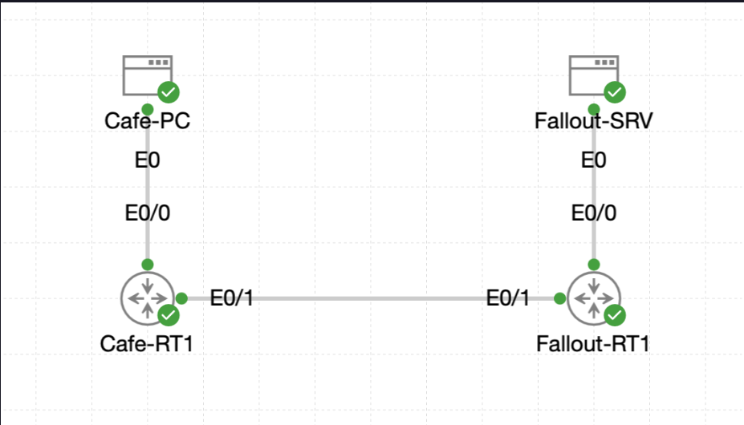
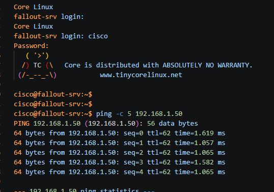

# Lab 015 - Configuring Static Routing

<table>
<tr>
<td colspan="2" valign="top">

# Objective

#### Configure static routing between two remote LANs.

#### Verify that both routers can reach their directly connected networks before adding routes.

#### Add a static route on each router so traffic can travel between the Coffee House LAN and the Fallout Shelter LAN.

#### Confirm end-to-end connectivity using router and server ping tests.

#### Save the validated configurations so the static routes persist after reload.

</td>
</tr>

<tr>
<td valign="top">

</td>

<td valign="bottom">

</td>

</tr>
</table>

---

## Scenario

This lab represents two small sites connected by a point-to-point WAN link.

The Coffee House site uses the `192.168.1.0/24` LAN, while the Fallout Shelter site uses the `192.168.3.0/24` LAN. The routers are already connected to each other over the `192.168.2.0/30` point-to-point network, but neither router initially has a route to the other site's LAN.

The task was to inspect the existing router interfaces, confirm that the directly connected networks were active, configure static routes in both directions, test full end-to-end reachability, and save the working configuration.

---

## Devices Used

* `Cafe-RT1`
* `Fallout-RT1`
* `Fallout-SRV`
* Coffee House LAN host: `192.168.1.50`
* Fallout Shelter server: `192.168.3.100`

---

## Addressing Table

| Device            |     Interface |       IP Address | Purpose                     |
| ----------------- | ------------: | ---------------: | --------------------------- |
| `Cafe-RT1`        | `Ethernet0/0` | `192.168.1.1/24` | Coffee House LAN gateway    |
| `Cafe-RT1`        | `Ethernet0/1` | `192.168.2.1/30` | Point-to-point WAN link     |
| `Fallout-RT1`     | `Ethernet0/0` | `192.168.3.1/24` | Fallout Shelter LAN gateway |
| `Fallout-RT1`     | `Ethernet0/1` | `192.168.2.2/30` | Point-to-point WAN link     |
| `Fallout-SRV`     |           NIC |  `192.168.3.100` | Fallout LAN test server     |
| Coffee House host |           NIC |   `192.168.1.50` | Coffee House LAN test host  |

---

## Configuration Steps

### Step 1 - Verify the Cafe Router Baseline

The first step was to confirm that `Cafe-RT1` already knew about its directly connected networks.

```bash
show ip route
show ip interface brief
```

### Explanation

Before adding static routes, it is important to confirm that the local LAN and WAN interfaces are already operational.

`Cafe-RT1` showed two connected networks:

* `192.168.1.0/24` directly connected via `Ethernet0/0`
* `192.168.2.0/30` directly connected via `Ethernet0/1`

Both relevant interfaces were confirmed as `up/up`.

---

### Step 2 - Verify the Fallout Router Baseline

The same checks were then carried out on `Fallout-RT1`.

```bash
show ip route
show ip interface brief
```

### Explanation

`Fallout-RT1` showed two connected networks:

* `192.168.3.0/24` directly connected via `Ethernet0/0`
* `192.168.2.0/30` directly connected via `Ethernet0/1`

Both relevant interfaces were also confirmed as `up/up`.

At this stage, each router could reach only its own LAN and the shared point-to-point WAN link. Neither router yet had a route to the remote LAN.

---

### Step 3 - Configure Static Route on Cafe-RT1

A static route was added on `Cafe-RT1` so that it could reach the Fallout Shelter LAN.

```bash
conf t
ip route 192.168.3.0 255.255.255.0 192.168.2.2
end
```

### Explanation

This route tells `Cafe-RT1`:

> To reach the `192.168.3.0/24` network, forward the traffic to the next-hop router at `192.168.2.2`.

The next-hop address is the WAN-facing interface of `Fallout-RT1`.

---

### Step 4 - Verify Static Route on Cafe-RT1

The routing table was checked again.

```bash
show ip route
```

The new static route appeared successfully:

```bash
S     192.168.3.0/24 [1/0] via 192.168.2.2
```

### Explanation

The `S` code confirms that the route is static.

The route tells `Cafe-RT1` that traffic destined for the Fallout LAN should be sent towards `192.168.2.2`.

---

### Step 5 - Configure Static Route on Fallout-RT1

A matching return route was then configured on `Fallout-RT1`.

```bash
conf t
ip route 192.168.1.0 255.255.255.0 192.168.2.1
end
```

### Explanation

This route tells `Fallout-RT1`:

> To reach the `192.168.1.0/24` network, forward the traffic to the next-hop router at `192.168.2.1`.

The next-hop address is the WAN-facing interface of `Cafe-RT1`.

This return route is essential. Without it, traffic from the Coffee House side might reach the Fallout LAN, but replies would not know how to get back.

---

### Step 6 - Verify Static Route on Fallout-RT1

The routing table was checked on `Fallout-RT1`.

```bash
show ip route
```

The static route appeared successfully:

```bash
S     192.168.1.0/24 [1/0] via 192.168.2.1
```

### Explanation

This confirmed that `Fallout-RT1` now had a valid static route back to the Coffee House LAN.

---

### Step 7 - Test Router-to-Server Connectivity

A ping was sent from `Cafe-RT1` to the Fallout server.

```bash
ping 192.168.3.100
```

The ping succeeded:

```bash
Success rate is 100 percent (5/5), round-trip min/avg/max = 1/1/2 ms
```

### Explanation

This confirmed that `Cafe-RT1` could now forward traffic across the WAN link and reach a device inside the remote Fallout LAN.

---

### Step 8 - Test End-to-End Host Connectivity

The `Fallout-SRV` console was opened, and a ping was sent to the Coffee House LAN host.

```bash
ping -c 5 192.168.1.50
```

The ping succeeded:

```bash
5 packets transmitted, 5 packets received, 0% packet loss
```

### Explanation

This was the strongest confirmation test because it proved full end-to-end connectivity from a real host on one LAN to a real host on the other LAN.

It also confirmed that the return route was working correctly.

---

### Step 9 - Save Router Configurations

The running configurations were saved on both routers.

```bash
copy running-config startup-config
```

### Explanation

This stores the validated configuration in NVRAM so the static routes remain in place after a reload.

---

## Verification

### Cafe-RT1 Interface Verification

```bash
Cafe-RT1#show ip interface brief
Interface              IP-Address      OK? Method Status                Protocol
Ethernet0/0            192.168.1.1     YES TFTP   up                    up      
Ethernet0/1            192.168.2.1     YES TFTP   up                    up      
Ethernet0/2            unassigned      YES unset  administratively down down    
Ethernet0/3            unassigned      YES unset  administratively down down 
```

### Fallout-RT1 Interface Verification

```bash
Fallout-RT1#show ip interface brief
Interface              IP-Address      OK? Method Status                Protocol
Ethernet0/0            192.168.3.1     YES TFTP   up                    up      
Ethernet0/1            192.168.2.2     YES TFTP   up                    up      
Ethernet0/2            unassigned      YES unset  administratively down down    
Ethernet0/3            unassigned      YES unset  administratively down down    
```

### Cafe-RT1 Static Route Verification

```bash
S     192.168.3.0/24 [1/0] via 192.168.2.2
```

### Fallout-RT1 Static Route Verification

```bash
S     192.168.1.0/24 [1/0] via 192.168.2.1
```

### Cafe-RT1 Ping to Fallout Server

```bash
Cafe-RT1#ping 192.168.3.100
Type escape sequence to abort.
Sending 5, 100-byte ICMP Echos to 192.168.3.100, timeout is 2 seconds:
!!!!!
Success rate is 100 percent (5/5), round-trip min/avg/max = 1/1/2 ms
```

### Fallout-SRV Ping to Coffee House Host

```bash
cisco@fallout-srv:~$ ping -c 5 192.168.1.50
PING 192.168.1.50 (192.168.1.50): 56 data bytes
64 bytes from 192.168.1.50: seq=0 ttl=62 time=1.619 ms
64 bytes from 192.168.1.50: seq=1 ttl=62 time=1.057 ms
64 bytes from 192.168.1.50: seq=2 ttl=62 time=1.065 ms
64 bytes from 192.168.1.50: seq=3 ttl=62 time=1.582 ms
64 bytes from 192.168.1.50: seq=4 ttl=62 time=1.065 ms

--- 192.168.1.50 ping statistics ---
5 packets transmitted, 5 packets received, 0% packet loss
round-trip min/avg/max = 1.057/1.277/1.619 ms
```

---

## Troubleshooting

### Issue 1 - Enable Password Entered at Privileged Prompt

While accessing `Cafe-RT1`, the router was already at the privileged `#` prompt. The privileged password was accidentally entered as though it were a command.

```bash
Cafe-RT1#CrC0ffee!
% Bad IP address or host name% Unknown command or computer name, or unable to find computer address
```

### Diagnosis

The prompt already showed `Cafe-RT1#`, meaning privileged EXEC mode was already active.

The password was therefore interpreted as a command rather than as authentication input.

### Fix

No fix was required. The router was already in privileged mode, so configuration and verification could continue normally.

---

### Issue 2 - Username Timeout on Fallout-RT1

When connecting to `Fallout-RT1`, the login prompt timed out twice before the username was entered.

```bash
% Username:  timeout expired!
```

### Diagnosis

This was a console login timing issue rather than a configuration problem.

### Fix

The username and password were entered again successfully.

```bash
Username: cisco
Password:
Fallout-RT1#
```

---

## Key Learning Points

* A router only knows about directly connected networks unless additional routes are configured.
* Static routes can be used to manually define paths to remote networks.
* A working route is needed in both directions for successful end-to-end communication.
* The next-hop IP should usually be the neighbouring router’s interface on the shared link.
* `show ip route` confirms whether the route has been installed.
* `ping` from routers and end hosts confirms practical reachability.
* `copy running-config startup-config` is required to preserve the working configuration.

---

## Final Outcome

The lab was completed successfully.

`Cafe-RT1` was configured with a static route to the Fallout LAN:

```bash
ip route 192.168.3.0 255.255.255.0 192.168.2.2
```

`Fallout-RT1` was configured with a static route to the Coffee House LAN:

```bash
ip route 192.168.1.0 255.255.255.0 192.168.2.1
```

Both static routes appeared correctly in the routing tables, router-to-server connectivity succeeded, host-to-host connectivity succeeded, and both router configurations were saved.

---

# Raw CLI Data

## Cafe-RT1 Initial Login and Baseline Checks

```bash
Connecting to console for Cafe-RT1


User Access Verification

Username: cisco
Password: 
Cafe-RT1#
*Jun  6 11:26:06.857: %SEC_LOGIN-5-LOGIN_SUCCESS: Login Success [user: cisco] [Source: LOCAL] [localport: 0] at 11:26:06 UTC Sat Jun 6 2026
Cafe-RT1#en
Cafe-RT1#CrC0ffee!
% Bad IP address or host name% Unknown command or computer name, or unable to find computer address
Cafe-RT1#
*Jun  6 11:26:13.994: %PNP-6-PNP_SAVING_TECH_SUMMARY: Saving PnP tech summary (/pnp-tech/pnp-tech-discovery-summary)... Please wait. Do not interrupt.
Cafe-RT1#
*Jun  6 11:26:14.096: %SYS-5-CONFIG_P: Configured programmatically by process PnP Agent Discovery from console as vty0
*Jun  6 11:26:14.096: %SYS-5-CONFIG_P: Configured programmatically by process PnP Agent Discovery from console as vty0
*Jun  6 11:26:14.204: %SYS-5-CONFIG_P: Configured programmatically by process PnP Agent Discovery from console as vty0
Cafe-RT1#
*Jun  6 11:26:14.305: %PNP-6-PNP_TECH_SUMMARY_SAVED_OK: PnP tech summary (/pnp-tech/pnp-tech-discovery-summary) saved successfully (elapsed time: 1 seconds).
*Jun  6 11:26:14.306: %PNP-6-PNP_DISCOVERY_STOPPED: PnP Discovery stopped (Config Wizard)
Cafe-RT1#
Cafe-RT1#
Cafe-RT1#show ip route      
Codes: L - local, C - connected, S - static, R - RIP, M - mobile, B - BGP
       D - EIGRP, EX - EIGRP external, O - OSPF, IA - OSPF inter area 
       N1 - OSPF NSSA external type 1, N2 - OSPF NSSA external type 2
       E1 - OSPF external type 1, E2 - OSPF external type 2, m - OMP
       n - NAT, Ni - NAT inside, No - NAT outside, Nd - NAT DIA
       i - IS-IS, su - IS-IS summary, L1 - IS-IS level-1, L2 - IS-IS level-2
       ia - IS-IS inter area, * - candidate default, U - per-user static route
       H - NHRP, G - NHRP registered, g - NHRP registration summary
       o - ODR, P - periodic downloaded static route, l - LISP
       a - application route
       + - replicated route, % - next hop override, p - overrides from PfR
       & - replicated local route overrides by connected

Gateway of last resort is not set

      192.168.1.0/24 is variably subnetted, 2 subnets, 2 masks
C        192.168.1.0/24 is directly connected, Ethernet0/0
L        192.168.1.1/32 is directly connected, Ethernet0/0
      192.168.2.0/24 is variably subnetted, 2 subnets, 2 masks
C        192.168.2.0/30 is directly connected, Ethernet0/1
L        192.168.2.1/32 is directly connected, Ethernet0/1
Cafe-RT1#
Cafe-RT1#
Cafe-RT1#show ip interface brief
Interface              IP-Address      OK? Method Status                Protocol
Ethernet0/0            192.168.1.1     YES TFTP   up                    up      
Ethernet0/1            192.168.2.1     YES TFTP   up                    up      
Ethernet0/2            unassigned      YES unset  administratively down down    
Ethernet0/3            unassigned      YES unset  administratively down down 
```

## Fallout-RT1 Initial Login and Baseline Checks

```bash
Connecting to console for Fallout-RT1


User Access Verification

Username: 
% Username:  timeout expired!
Username: 
% Username:  timeout expired!
Username: cisco
Password: 
Fallout-RT1#
*Jun  6 11:27:23.002: %SEC_LOGIN-5-LOGIN_SUCCESS: Login Success [user: cisco] [Source: LOCAL] [localport: 0] at 11:27:23 UTC Sat Jun 6 2026
Fallout-RT1#en
Fallout-RT1#
*Jun  6 11:27:27.856: %PNP-6-PNP_SAVING_TECH_SUMMARY: Saving PnP tech summary (/pnp-tech/pnp-tech-discovery-summary)... Please wait. Do not interrupt.
Fallout-RT1#
*Jun  6 11:27:27.958: %SYS-5-CONFIG_P: Configured programmatically by process PnP Agent Discovery from console as vty0
*Jun  6 11:27:27.958: %SYS-5-CONFIG_P: Configured programmatically by process PnP Agent Discovery from console as vty0
*Jun  6 11:27:28.064: %SYS-5-CONFIG_P: Configured programmatically by process PnP Agent Discovery from console as vty0
Fallout-RT1#
*Jun  6 11:27:28.164: %PNP-6-PNP_TECH_SUMMARY_SAVED_OK: PnP tech summary (/pnp-tech/pnp-tech-discovery-summary) saved successfully (elapsed time: 1 seconds).
*Jun  6 11:27:28.164: %PNP-6-PNP_DISCOVERY_STOPPED: PnP Discovery stopped (Config Wizard)
Fallout-RT1#show ip route
Codes: L - local, C - connected, S - static, R - RIP, M - mobile, B - BGP
       D - EIGRP, EX - EIGRP external, O - OSPF, IA - OSPF inter area 
       N1 - OSPF NSSA external type 1, N2 - OSPF NSSA external type 2
       E1 - OSPF external type 1, E2 - OSPF external type 2, m - OMP
       n - NAT, Ni - NAT inside, No - NAT outside, Nd - NAT DIA
       i - IS-IS, su - IS-IS summary, L1 - IS-IS level-1, L2 - IS-IS level-2
       ia - IS-IS inter area, * - candidate default, U - per-user static route
       H - NHRP, G - NHRP registered, g - NHRP registration summary
       o - ODR, P - periodic downloaded static route, l - LISP
       a - application route
       + - replicated route, % - next hop override, p - overrides from PfR
       & - replicated local route overrides by connected

Gateway of last resort is not set

      192.168.2.0/24 is variably subnetted, 2 subnets, 2 masks
C        192.168.2.0/30 is directly connected, Ethernet0/1
L        192.168.2.2/32 is directly connected, Ethernet0/1
      192.168.3.0/24 is variably subnetted, 2 subnets, 2 masks
C        192.168.3.0/24 is directly connected, Ethernet0/0
L        192.168.3.1/32 is directly connected, Ethernet0/0
Fallout-RT1#
Fallout-RT1#
Fallout-RT1#show ip interface brief
Interface              IP-Address      OK? Method Status                Protocol
Ethernet0/0            192.168.3.1     YES TFTP   up                    up      
Ethernet0/1            192.168.2.2     YES TFTP   up                    up      
Ethernet0/2            unassigned      YES unset  administratively down down    
Ethernet0/3            unassigned      YES unset  administratively down down    
Fallout-RT1#
Fallout-RT1#
```

## Static Route Configuration on Cafe-RT1

```bash
Cafe-RT1#conf t
Enter configuration commands, one per line.  End with CNTL/Z.
Cafe-RT1(config)#ip route 192.168.3.0 255.255.255.0 192.168.2.2
Cafe-RT1(config)#
Cafe-RT1(config)#^Z
Cafe-RT1#s
*Jun  6 11:29:02.668: %SYS-5-CONFIG_I: Configured from console by cisco on console
Cafe-RT1#show ip route
Codes: L - local, C - connected, S - static, R - RIP, M - mobile, B - BGP
       D - EIGRP, EX - EIGRP external, O - OSPF, IA - OSPF inter area 
       N1 - OSPF NSSA external type 1, N2 - OSPF NSSA external type 2
       E1 - OSPF external type 1, E2 - OSPF external type 2, m - OMP
       n - NAT, Ni - NAT inside, No - NAT outside, Nd - NAT DIA
       i - IS-IS, su - IS-IS summary, L1 - IS-IS level-1, L2 - IS-IS level-2
       ia - IS-IS inter area, * - candidate default, U - per-user static route
       H - NHRP, G - NHRP registered, g - NHRP registration summary
       o - ODR, P - periodic downloaded static route, l - LISP
       a - application route
       + - replicated route, % - next hop override, p - overrides from PfR
       & - replicated local route overrides by connected

Gateway of last resort is not set

      192.168.1.0/24 is variably subnetted, 2 subnets, 2 masks
C        192.168.1.0/24 is directly connected, Ethernet0/0
L        192.168.1.1/32 is directly connected, Ethernet0/0
      192.168.2.0/24 is variably subnetted, 2 subnets, 2 masks
C        192.168.2.0/30 is directly connected, Ethernet0/1
L        192.168.2.1/32 is directly connected, Ethernet0/1
S     192.168.3.0/24 [1/0] via 192.168.2.2
Cafe-RT1#
Cafe-RT1#
Cafe-RT1#
```

## Static Route Configuration on Fallout-RT1

```bash
Fallout-RT1#conf t
Enter configuration commands, one per line.  End with CNTL/Z.
Fallout-RT1(config)#ip route 192.168.1.0 255.255.255.0 192.168.2.1
Fallout-RT1(config)#^Z
Fallout-RT1#show
*Jun  6 11:30:45.161: %SYS-5-CONFIG_I: Configured from console by cisco on console
Fallout-RT1#show ip route
Codes: L - local, C - connected, S - static, R - RIP, M - mobile, B - BGP
       D - EIGRP, EX - EIGRP external, O - OSPF, IA - OSPF inter area 
       N1 - OSPF NSSA external type 1, N2 - OSPF NSSA external type 2
       E1 - OSPF external type 1, E2 - OSPF external type 2, m - OMP
       n - NAT, Ni - NAT inside, No - NAT outside, Nd - NAT DIA
       i - IS-IS, su - IS-IS summary, L1 - IS-IS level-1, L2 - IS-IS level-2
       ia - IS-IS inter area, * - candidate default, U - per-user static route
       H - NHRP, G - NHRP registered, g - NHRP registration summary
       o - ODR, P - periodic downloaded static route, l - LISP
       a - application route
       + - replicated route, % - next hop override, p - overrides from PfR
       & - replicated local route overrides by connected

Gateway of last resort is not set

S     192.168.1.0/24 [1/0] via 192.168.2.1
      192.168.2.0/24 is variably subnetted, 2 subnets, 2 masks
C        192.168.2.0/30 is directly connected, Ethernet0/1
L        192.168.2.2/32 is directly connected, Ethernet0/1
      192.168.3.0/24 is variably subnetted, 2 subnets, 2 masks
C        192.168.3.0/24 is directly connected, Ethernet0/0
L        192.168.3.1/32 is directly connected, Ethernet0/0
Fallout-RT1#
Fallout-RT1#
```

## Connectivity Test from Cafe-RT1 to Fallout-SRV

```bash
Cafe-RT1#
Cafe-RT1#ping 192.168.3.100
Type escape sequence to abort.
Sending 5, 100-byte ICMP Echos to 192.168.3.100, timeout is 2 seconds:
!!!!!
Success rate is 100 percent (5/5), round-trip min/avg/max = 1/1/2 ms
Cafe-RT1#
Cafe-RT1#
```

## Connectivity Test from Fallout-SRV to Coffee House Host

```bash
Connecting to console for Fallout-SRV
Connected to CML terminalserver.

Core Linux
fallout-srv login: 
Core Linux
fallout-srv login: cisco
Password: 
   ( '>')
  /) TC (\   Core is distributed with ABSOLUTELY NO WARRANTY.
 (/-_--_-\)           www.tinycorelinux.net

cisco@fallout-srv:~$ 
cisco@fallout-srv:~$ 
cisco@fallout-srv:~$ ping -c 5 192.168.1.50
PING 192.168.1.50 (192.168.1.50): 56 data bytes
64 bytes from 192.168.1.50: seq=0 ttl=62 time=1.619 ms
64 bytes from 192.168.1.50: seq=1 ttl=62 time=1.057 ms
64 bytes from 192.168.1.50: seq=2 ttl=62 time=1.065 ms
64 bytes from 192.168.1.50: seq=3 ttl=62 time=1.582 ms
64 bytes from 192.168.1.50: seq=4 ttl=62 time=1.065 ms

--- 192.168.1.50 ping statistics ---
5 packets transmitted, 5 packets received, 0% packet loss
round-trip min/avg/max = 1.057/1.277/1.619 ms
cisco@fallout-srv:~$
```

## Saving the Router Configurations

```bash
Cafe-RT1#copy running-config startup-config
Destination filename [startup-config]? 
Building configuration...
[OK]
Cafe-RT1#
```

```bash
Fallout-RT1#copy running-config startup-config
Destination filename [startup-config]? 
Building configuration...
[OK]
Fallout-RT1#
```
