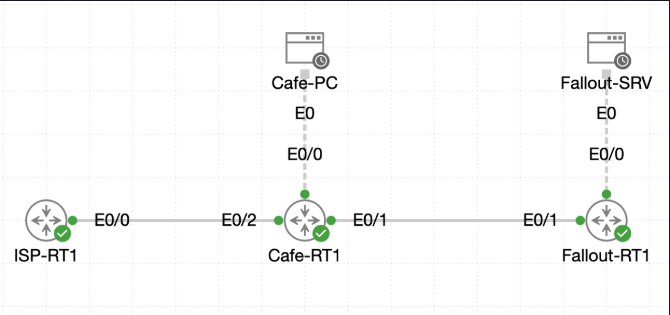

# Lab 016 - Configuring Default Routing

<table>
<tr>
<td valign="top">

# Objective

#### Configure a default route on `Cafe-RT1` so traffic for unknown destinations is forwarded towards the ISP.

#### Prepare and verify the public uplink interface using the ISP-provided addressing.

#### Confirm the router has an active gateway of last resort.

#### Validate external reachability from the Coffee House LAN.

#### Save the completed configuration so the default route persists after reload.

</td>
</tr>

<tr>
<td valign="top">

</td>

</tr>
</table>

---

## Scenario

This lab continues from the previous static routing deployment.

The Coffee House router, `Cafe-RT1`, already has connectivity to the Fallout Shelter network through a static route. However, it does not yet have a path for traffic destined for unknown external networks.

To complete the site’s wider connectivity, an ISP uplink was configured on `Ethernet0/2` using the public point-to-point address `216.0.5.2/30`. A default route was then added so that any traffic without a more specific route would be forwarded to the ISP next-hop address `216.0.5.1`.

The final verification was performed from `Cafe-PC` by pinging the simulated Internet test address `8.8.8.8`.

---

## Devices Used

* `Cafe-RT1`
* `Cafe-PC`
* ISP router / next-hop: `216.0.5.1`
* Simulated Internet test address: `8.8.8.8`

---

## Addressing Table

| Device              |      Interface |       IP Address | Purpose                             |
| ------------------- | -------------: | ---------------: | ----------------------------------- |
| `Cafe-RT1`          |  `Ethernet0/0` | `192.168.1.1/24` | Coffee House LAN gateway            |
| `Cafe-RT1`          |  `Ethernet0/1` | `192.168.2.1/30` | Branch / Fallout Shelter link       |
| `Cafe-RT1`          |  `Ethernet0/2` |   `216.0.5.2/30` | ISP public uplink                   |
| ISP next-hop        |        Unknown |   `216.0.5.1/30` | Provider-side gateway               |
| Fallout Shelter LAN | Remote network | `192.168.3.0/24` | Existing remote branch network      |
| Internet test host  | Remote address |        `8.8.8.8` | Simulated external test destination |

---

## Existing Routing State

Before the ISP uplink and default route were configured, `Cafe-RT1` already knew about:

* The local Coffee House LAN: `192.168.1.0/24`
* The point-to-point branch link: `192.168.2.0/30`
* The Fallout Shelter LAN via static route: `192.168.3.0/24`

However, the router did **not** yet have a gateway of last resort.

```bash
Gateway of last resort is not set
```

This meant that traffic to unknown destinations, such as public Internet addresses, had no route.

---

## Configuration Steps

### Step 1 - Verify the Initial Routing Table

The routing table was checked before making any changes.

```bash
show ip route
```

### Explanation

This confirmed that `Cafe-RT1` already had connected routes for its LAN and branch interfaces, plus the existing static route to the Fallout Shelter LAN.

At this stage, there was no default route installed.

---

### Step 2 - Verify the Initial Interface State

The router interfaces were checked.

```bash
show ip interface brief
```

The initial output showed:

```bash
Ethernet0/0            192.168.1.1     YES TFTP   up                    up      
Ethernet0/1            192.168.2.1     YES TFTP   up                    up      
Ethernet0/2            unassigned      YES unset  administratively down down    
Ethernet0/3            unassigned      YES unset  administratively down down
```

### Explanation

`Ethernet0/0` and `Ethernet0/1` were already active.

`Ethernet0/2`, which would be used as the public ISP uplink, was still unassigned and administratively down.

---

### Step 3 - Configure the ISP Uplink Interface

`Ethernet0/2` was configured with the ISP-provided IP address.

```bash
conf t
interface et0/2
description ## Public Uplink
ip address 216.0.5.2 255.255.255.252
no shutdown
end
```

### Explanation

This configured `Ethernet0/2` as the public uplink interface.

The `/30` subnet mask provides a small point-to-point network between the Coffee House router and the ISP router:

* `216.0.5.1` - ISP next-hop
* `216.0.5.2` - `Cafe-RT1` public uplink

The `no shutdown` command brought the interface online.

---

### Step 4 - Verify the ISP Uplink Interface

The interface summary was checked again.

```bash
show ip interface brief
```

The updated output confirmed that `Ethernet0/2` was now active:

```bash
Ethernet0/2            216.0.5.2       YES manual up                    up
```

### Explanation

The `up/up` state confirms that both the physical interface and line protocol are operational.

This means the router is ready to use the ISP link as a forwarding path.

---

### Step 5 - Configure the Default Route

A default static route was added to send unknown traffic towards the ISP next-hop.

```bash
conf t
ip route 0.0.0.0 0.0.0.0 216.0.5.1
end
```

### Explanation

The route `0.0.0.0 0.0.0.0` represents all destinations that do not match a more specific route.

This tells `Cafe-RT1`:

> If no better route exists, send the traffic to `216.0.5.1`.

This is commonly known as the router’s **gateway of last resort**.

---

### Step 6 - Verify the Gateway of Last Resort

The routing table was checked for the default route.

```bash
show ip route | include Gateway
```

The output confirmed:

```bash
Gateway of last resort is 216.0.5.1 to network 0.0.0.0
```

### Explanation

This confirms that `Cafe-RT1` now has a default forwarding path for unknown destinations.

---

### Step 7 - Verify Static Routes

The static routes were checked.

```bash
show ip route static
```

The output showed:

```bash
S*    0.0.0.0/0 [1/0] via 216.0.5.1
S     192.168.3.0/24 [1/0] via 192.168.2.2
```

### Explanation

Two static routes are now present:

* `S* 0.0.0.0/0` - the default route to the ISP
* `S 192.168.3.0/24` - the existing static route to the Fallout Shelter LAN

The `*` next to the default route indicates that it is the candidate default route.

---

### Step 8 - Test Internet Reachability from Cafe-PC

The Coffee House PC was used to test reachability to the simulated Internet address.

```bash
ping -c 5 8.8.8.8
```

The ping succeeded:

```bash
5 packets transmitted, 5 packets received, 0% packet loss
```

### Explanation

This confirmed that traffic from the Coffee House LAN could now reach an external destination through `Cafe-RT1` and the ISP uplink.

The successful ping proved that the default route was working correctly.

---

## Verification

### Interface Verification

```bash
Cafe-RT1#show ip interface brief
Interface              IP-Address      OK? Method Status                Protocol
Ethernet0/0            192.168.1.1     YES TFTP   up                    up      
Ethernet0/1            192.168.2.1     YES TFTP   up                    up      
Ethernet0/2            216.0.5.2       YES manual up                    up      
Ethernet0/3            unassigned      YES unset  administratively down down
```

### Default Route Verification

```bash
Cafe-RT1#show ip route | include Gateway
Gateway of last resort is 216.0.5.1 to network 0.0.0.0
```

### Static Route Verification

```bash
S*    0.0.0.0/0 [1/0] via 216.0.5.1
S     192.168.3.0/24 [1/0] via 192.168.2.2
```

### Internet Reachability Test

```bash
cisco@cafe-pc:~$ ping -c 5 8.8.8.8
PING 8.8.8.8 (8.8.8.8): 56 data bytes
64 bytes from 8.8.8.8: seq=0 ttl=254 time=1.421 ms
64 bytes from 8.8.8.8: seq=1 ttl=254 time=1.005 ms
64 bytes from 8.8.8.8: seq=2 ttl=254 time=1.143 ms
64 bytes from 8.8.8.8: seq=3 ttl=254 time=1.138 ms
64 bytes from 8.8.8.8: seq=4 ttl=254 time=1.117 ms

--- 8.8.8.8 ping statistics ---
5 packets transmitted, 5 packets received, 0% packet loss
round-trip min/avg/max = 1.005/1.164/1.421 ms
```

---

## Troubleshooting

### Issue 1 - Public Uplink Initially Administratively Down

Before configuration, `Ethernet0/2` was unassigned and administratively down.

```bash
Ethernet0/2            unassigned      YES unset  administratively down down
```

### Diagnosis

The ISP uplink interface had not yet been configured with an IP address and had not been enabled.

### Fix

The interface was configured with the ISP-provided address and brought online.

```bash
interface et0/2
description ## Public Uplink
ip address 216.0.5.2 255.255.255.252
no shutdown
```

After this, the interface changed to `up/up`.

---

### Issue 2 - No Gateway of Last Resort Initially Present

The initial routing table showed:

```bash
Gateway of last resort is not set
```

### Diagnosis

The router had routes to known internal and branch networks, but no default route for unknown destinations.

### Fix

A default route was added pointing to the ISP next-hop.

```bash
ip route 0.0.0.0 0.0.0.0 216.0.5.1
```

After configuration, the routing table showed:

```bash
Gateway of last resort is 216.0.5.1 to network 0.0.0.0
```

---

## Key Learning Points

* A default route is used when no more specific route exists.
* `0.0.0.0 0.0.0.0` represents all possible destination networks.
* The gateway of last resort is the router’s fallback forwarding path.
* A router can have both specific static routes and a default static route at the same time.
* Specific routes are preferred over the default route.
* Public or external connectivity usually requires a default route towards the ISP.
* `show ip route static` is useful for checking manually configured routes.
* `show ip route | include Gateway` quickly confirms whether a default route is active.

---

## Final Outcome

The lab was completed successfully.

`Ethernet0/2` on `Cafe-RT1` was configured as the public uplink:

```bash
interface et0/2
description ## Public Uplink
ip address 216.0.5.2 255.255.255.252
no shutdown
```

A default route was added pointing to the ISP next-hop:

```bash
ip route 0.0.0.0 0.0.0.0 216.0.5.1
```

The routing table confirmed the gateway of last resort:

```bash
Gateway of last resort is 216.0.5.1 to network 0.0.0.0
```

External reachability was successfully verified from `Cafe-PC` to `8.8.8.8` with `0% packet loss`.

The Coffee House router now has both branch connectivity and a working default route for external destinations.
