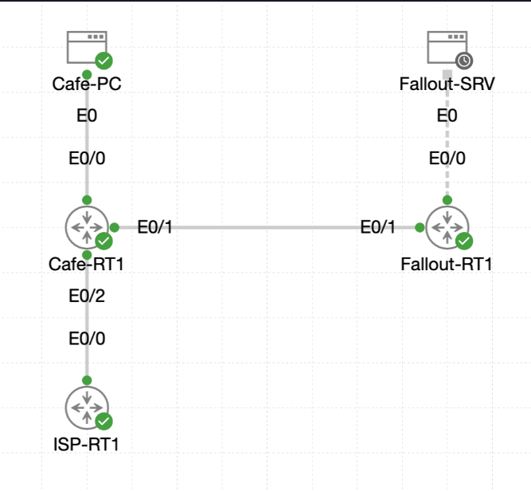

# Lab 017 - Configuring EIGRP Dynamic Routing

<table width="100%">
<tr>
<td valign="top">

# Objective

#### Replace manual LAN-to-LAN static routes with EIGRP dynamic routing.

#### Remove the previous static routes between the Coffee House and Fallout Shelter LANs.

#### Configure EIGRP autonomous system 1 on both routers.

#### Advertise the correct LAN and point-to-point WAN networks.

#### Verify EIGRP neighbour formation, route exchange, and end-to-end connectivity.

#### Save the completed configurations for future use.

</td>
</tr>

<tr>
<td valign="top">

</td>

</tr>
</table>

---

## Scenario

This lab builds on the previous static routing configuration between the Coffee House and Fallout Shelter networks.

Previously, both routers used manually configured static routes to reach each other’s LANs. In this lab, those LAN-to-LAN static routes were removed and replaced with EIGRP dynamic routing.

The goal was to allow the routers to discover each other automatically, exchange route information, and restore end-to-end connectivity without manually defining every remote network.

The default routes remained in place. Only the static routes between the Coffee House LAN and Fallout Shelter LAN were removed.

---

## Devices Used

* `Cafe-RT1`
* `Fallout-RT1`
* `Cafe-PC`
* `Fallout-SRV`

---

## Addressing Table

| Device        |     Interface |       IP Address | Purpose                             |
| ------------- | ------------: | ---------------: | ----------------------------------- |
| `Cafe-RT1`    | `Ethernet0/0` | `192.168.1.1/24` | Coffee House LAN gateway            |
| `Cafe-RT1`    | `Ethernet0/1` | `192.168.2.1/30` | Point-to-point link to Fallout      |
| `Cafe-RT1`    | `Ethernet0/2` |   `216.0.5.2/30` | ISP public uplink                   |
| `Fallout-RT1` | `Ethernet0/0` | `192.168.3.1/24` | Fallout Shelter LAN gateway         |
| `Fallout-RT1` | `Ethernet0/1` | `192.168.2.2/30` | Point-to-point link to Coffee House |
| `Cafe-PC`     |           NIC |   `192.168.1.50` | Coffee House test host              |
| `Fallout-SRV` |           NIC |  `192.168.3.100` | Fallout Shelter test server         |

---

## Existing Routing State

Before EIGRP was configured, both routers still had static routes from the previous labs.

On `Cafe-RT1`, the running configuration showed:

```bash
ip route 0.0.0.0 0.0.0.0 216.0.5.1
ip route 192.168.3.0 255.255.255.0 192.168.2.2
```

On `Fallout-RT1`, the running configuration showed:

```bash
ip route 0.0.0.0 0.0.0.0 192.168.2.1
ip route 192.168.1.0 255.255.255.0 192.168.2.1
```

The LAN-to-LAN static routes needed to be removed so that EIGRP could take over the routing between the two internal networks.

---

## Configuration Steps

### Step 1 - Identify Existing Static Routes on Cafe-RT1

The existing static routes were checked on `Cafe-RT1`.

```bash
show running-config | include ip route
```

### Explanation

This showed two static routes:

* A default route to the ISP: `0.0.0.0/0` via `216.0.5.1`
* A LAN-to-LAN static route to `192.168.3.0/24` via `192.168.2.2`

Only the LAN-to-LAN static route was removed. The default route was left in place.

---

### Step 2 - Remove the Static Route on Cafe-RT1

```bash
conf t
no ip route 192.168.3.0 255.255.255.0 192.168.2.2
end
```

### Explanation

This removed the manual static route from `Cafe-RT1` to the Fallout Shelter LAN.

After removal, the routing table no longer showed the `192.168.3.0/24` static route.

---

### Step 3 - Verify Cafe-RT1 Routing Table After Removal

```bash
show ip route
```

The routing table showed the default route and directly connected networks, but no route to `192.168.3.0/24`.

```bash
S*    0.0.0.0/0 [1/0] via 216.0.5.1
C     192.168.1.0/24 is directly connected, Ethernet0/0
C     192.168.2.0/30 is directly connected, Ethernet0/1
C     216.0.5.0/30 is directly connected, Ethernet0/2
```

### Explanation

This confirmed that the static LAN route had been successfully removed from `Cafe-RT1`.

---

### Step 4 - Identify Existing Static Routes on Fallout-RT1

The existing static routes were checked on `Fallout-RT1`.

```bash
show running-config | include ip route
```

The output showed:

```bash
ip route 0.0.0.0 0.0.0.0 192.168.2.1
ip route 192.168.1.0 255.255.255.0 192.168.2.1
```

### Explanation

Again, only the LAN-to-LAN static route was removed. The default route remained in place.

---

### Step 5 - Remove the Static Route on Fallout-RT1

```bash
conf t
no ip route 192.168.1.0 255.255.255.0 192.168.2.1
end
```

### Explanation

This removed the manual static route from `Fallout-RT1` back to the Coffee House LAN.

---

### Step 6 - Verify Fallout-RT1 Routing Table After Removal

```bash
show ip route
```

The routing table showed the default route and directly connected networks, but no route to `192.168.1.0/24`.

```bash
S*    0.0.0.0/0 [1/0] via 192.168.2.1
C     192.168.2.0/30 is directly connected, Ethernet0/1
C     192.168.3.0/24 is directly connected, Ethernet0/0
```

### Explanation

This confirmed that the static return route had been removed successfully.

At this stage, the LANs would not have direct learned routes to each other until EIGRP was configured.

---

### Step 7 - Configure EIGRP on Cafe-RT1

```bash
conf t
router eigrp 1
network 192.168.1.0 0.0.0.255
network 192.168.2.0 0.0.0.3
end
```

### Explanation

This enabled EIGRP using autonomous system `1`.

The following networks were advertised:

* `192.168.1.0/24` - Coffee House LAN
* `192.168.2.0/30` - point-to-point WAN link between the routers

The ISP-facing network `216.0.5.0/30` was not advertised, keeping the service provider link outside the internal EIGRP process.

---

### Step 8 - Check EIGRP Neighbours on Cafe-RT1

```bash
show ip eigrp neighbors
```

At this point, no neighbour was listed yet because `Fallout-RT1` had not been configured for EIGRP.

```bash
EIGRP-IPv4 Neighbors for AS(1)
```

### Explanation

EIGRP requires both routers on the shared link to run the same autonomous system before an adjacency can form.

---

### Step 9 - Configure EIGRP on Fallout-RT1

```bash
conf t
router eigrp 1
network 192.168.3.0 0.0.0.255
network 192.168.2.0 0.0.0.3
end
```

### Explanation

This enabled EIGRP autonomous system `1` on `Fallout-RT1`.

The following networks were advertised:

* `192.168.3.0/24` - Fallout Shelter LAN
* `192.168.2.0/30` - point-to-point WAN link between routers

Once this was configured, an EIGRP neighbour relationship formed with `Cafe-RT1`.

---

### Step 10 - Verify EIGRP Neighbour Formation on Fallout-RT1

```bash
show ip eigrp neighbors
```

The neighbour table showed:

```bash
0   192.168.2.1             Et0/1                    13 00:00:20    1   100  0  3
```

### Explanation

This confirmed that `Fallout-RT1` had formed an EIGRP adjacency with `Cafe-RT1` at `192.168.2.1`.

The routers could now exchange route information dynamically.

---

### Step 11 - Verify EIGRP Route on Fallout-RT1

```bash
show ip route eigrp
```

The output showed:

```bash
D     192.168.1.0/24 [90/307200] via 192.168.2.1, 00:00:45, Ethernet0/1
```

### Explanation

The `D` route code means the route was learned through EIGRP.

`Fallout-RT1` had dynamically learned the Coffee House LAN route via `192.168.2.1`.

---

### Step 12 - Verify EIGRP Route on Cafe-RT1

```bash
show ip route eigrp
```

The output showed:

```bash
D     192.168.3.0/24 [90/307200] via 192.168.2.2, 00:02:02, Ethernet0/1
```

### Explanation

`Cafe-RT1` had dynamically learned the Fallout Shelter LAN route via EIGRP.

The next-hop address was `192.168.2.2`, which is the WAN-facing interface of `Fallout-RT1`.

---

### Step 13 - Test Connectivity from Cafe-PC to Fallout-SRV

From `Cafe-PC`, a ping was sent to the Fallout server.

```bash
ping -c 5 192.168.3.100
```

The ping succeeded:

```bash
5 packets transmitted, 5 packets received, 0% packet loss
```

### Explanation

This proved that `Cafe-PC` could reach the Fallout Shelter LAN using the EIGRP-learned route.

---

### Step 14 - Test Connectivity from Fallout-SRV to Cafe-PC

From `Fallout-SRV`, a ping was sent back to the Coffee House host.

```bash
ping -c 5 192.168.1.50
```

The ping succeeded:

```bash
5 packets transmitted, 5 packets received, 0% packet loss
```

### Explanation

This confirmed two-way LAN-to-LAN connectivity.

Both routers had successfully exchanged routes through EIGRP, and return traffic was working correctly.

---

### Step 15 - Save the Router Configurations

The configurations were saved on both routers.

```bash
write memory
```

### Explanation

This saved the running configuration to startup configuration so that EIGRP remains configured after a reload.

---

## Verification

### Cafe-RT1 Static Route Removal

```bash
Cafe-RT1#show running-config | include ip route
ip route 0.0.0.0 0.0.0.0 216.0.5.1
ip route 192.168.3.0 255.255.255.0 192.168.2.2
```

The route to `192.168.3.0/24` was then removed:

```bash
no ip route 192.168.3.0 255.255.255.0 192.168.2.2
```

---

### Fallout-RT1 Static Route Removal

```bash
Fallout-RT1#show running-config | include ip route
ip route 0.0.0.0 0.0.0.0 192.168.2.1
ip route 192.168.1.0 255.255.255.0 192.168.2.1
```

The route to `192.168.1.0/24` was then removed:

```bash
no ip route 192.168.1.0 255.255.255.0 192.168.2.1
```

---

### EIGRP Configuration on Cafe-RT1

```bash
router eigrp 1
network 192.168.1.0 0.0.0.255
network 192.168.2.0 0.0.0.3
```

---

### EIGRP Configuration on Fallout-RT1

```bash
router eigrp 1
network 192.168.3.0 0.0.0.255
network 192.168.2.0 0.0.0.3
```

---

### Fallout-RT1 EIGRP Neighbour Verification

```bash
Fallout-RT1#show ip eigrp neighbors
EIGRP-IPv4 Neighbors for AS(1)
H   Address                 Interface              Hold Uptime   SRTT   RTO  Q  Seq
                                                   (sec)         (ms)       Cnt Num
0   192.168.2.1             Et0/1                    13 00:00:20    1   100  0  3
```

---

### Fallout-RT1 EIGRP Route Verification

```bash
D     192.168.1.0/24 [90/307200] via 192.168.2.1, 00:00:45, Ethernet0/1
```

---

### Cafe-RT1 EIGRP Route Verification

```bash
D     192.168.3.0/24 [90/307200] via 192.168.2.2, 00:02:02, Ethernet0/1
```

---

### Cafe-PC to Fallout-SRV Connectivity Test

```bash
cisco@cafe-pc:~$ ping -c 5 192.168.3.100
PING 192.168.3.100 (192.168.3.100): 56 data bytes
64 bytes from 192.168.3.100: seq=0 ttl=62 time=2.233 ms
64 bytes from 192.168.3.100: seq=1 ttl=62 time=1.067 ms
64 bytes from 192.168.3.100: seq=2 ttl=62 time=1.166 ms
64 bytes from 192.168.3.100: seq=3 ttl=62 time=1.036 ms
64 bytes from 192.168.3.100: seq=4 ttl=62 time=1.174 ms

--- 192.168.3.100 ping statistics ---
5 packets transmitted, 5 packets received, 0% packet loss
round-trip min/avg/max = 1.036/1.335/2.233 ms
```

---

### Fallout-SRV to Cafe-PC Connectivity Test

```bash
cisco@fallout-srv:~$ ping -c 5 192.168.1.50
PING 192.168.1.50 (192.168.1.50): 56 data bytes
64 bytes from 192.168.1.50: seq=0 ttl=62 time=1.127 ms
64 bytes from 192.168.1.50: seq=1 ttl=62 time=1.154 ms
64 bytes from 192.168.1.50: seq=2 ttl=62 time=1.119 ms
64 bytes from 192.168.1.50: seq=3 ttl=62 time=1.152 ms
64 bytes from 192.168.1.50: seq=4 ttl=62 time=1.133 ms

--- 192.168.1.50 ping statistics ---
5 packets transmitted, 5 packets received, 0% packet loss
round-trip min/avg/max = 1.119/1.137/1.154 ms
```

---

## Troubleshooting

### Issue 1 - Static Routes Needed to Be Removed Before Testing EIGRP

The routers initially still had manual LAN-to-LAN static routes from the earlier lab.

### Diagnosis

If these static routes remained, they would be preferred over EIGRP because static routes have a lower administrative distance than EIGRP internal routes.

### Fix

The LAN-to-LAN static routes were removed:

```bash
no ip route 192.168.3.0 255.255.255.0 192.168.2.2
no ip route 192.168.1.0 255.255.255.0 192.168.2.1
```

---

### Issue 2 - No EIGRP Neighbour Shown on Cafe-RT1 Initially

After configuring EIGRP on `Cafe-RT1`, the neighbour table was empty.

```bash
Cafe-RT1#show ip eigrp neighbors
EIGRP-IPv4 Neighbors for AS(1)
```

### Diagnosis

Only one side of the point-to-point link had been configured for EIGRP at that stage.

### Fix

EIGRP was configured on `Fallout-RT1` with the same autonomous system number and matching WAN network statement.

After that, the adjacency formed successfully.

---

## Key Learning Points

* Static routes can be replaced by dynamic routing protocols when networks need to scale.
* EIGRP uses the route code `D` in the routing table.
* Both routers must use the same EIGRP autonomous system number to become neighbours.
* EIGRP neighbours form across interfaces included by matching `network` statements.
* Wildcard masks define which interfaces participate in the EIGRP process.
* Static routes normally have a lower administrative distance than EIGRP, so they must be removed when proving EIGRP route learning.
* The ISP-facing network was deliberately excluded from EIGRP.
* End-to-end ping tests are still essential after routing table verification.

---

## Final Outcome

The lab was completed successfully.

The previous LAN-to-LAN static routes were removed from both routers.

EIGRP autonomous system `1` was configured on `Cafe-RT1`:

```bash
router eigrp 1
network 192.168.1.0 0.0.0.255
network 192.168.2.0 0.0.0.3
```

EIGRP autonomous system `1` was configured on `Fallout-RT1`:

```bash
router eigrp 1
network 192.168.3.0 0.0.0.255
network 192.168.2.0 0.0.0.3
```

The routers formed an EIGRP neighbour relationship over the `192.168.2.0/30` point-to-point link.

`Cafe-RT1` dynamically learned the Fallout Shelter LAN:

```bash
D     192.168.3.0/24 [90/307200] via 192.168.2.2
```

`Fallout-RT1` dynamically learned the Coffee House LAN:

```bash
D     192.168.1.0/24 [90/307200] via 192.168.2.1
```

End-to-end pings succeeded in both directions, proving that EIGRP successfully restored LAN-to-LAN connectivity.

Both router configurations were saved using:

```bash
write memory
```
