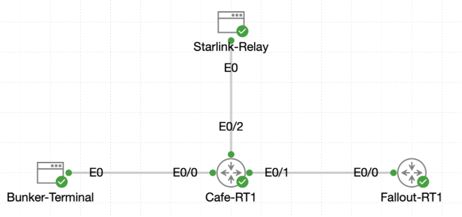

# Lab 018 - Routing Table Concepts and Route Selection

<p class="back-link">
  <a href="../../Lab-index.html">← Back to Lab Index</a>
</p>

<table>
<tr>
<td colspan="2" valign="top">

<h1>Objective</h1>

<h4>Interpret the routing table on <code>Cafe-RT1</code>.</h4>

<h4>Identify how Cisco IOS displays connected, local, static, default, and EIGRP-learned routes.</h4>

<h4>Compare administrative distance and metric values to understand route preference.</h4>

<h4>Demonstrate how static routes can temporarily override dynamic routes.</h4>

<h4>Use loopback interfaces to observe variably subnetted route entries and local host routes.</h4>

</td>
</tr>

<tr>
<td valign="top" width="50%">

</td>

<td valign="bottom" width="50%">

</td>
</tr>
</table>

---

## Scenario

This lab focused on reading and interpreting the routing table on `Cafe-RT1`.

The router already had working connectivity to the Fallout Shelter network through an EIGRP-learned route. The goal was not simply to prove reachability, but to understand how the router describes that reachability inside its routing table.

The lab also tested route selection by temporarily adding a static route to the same destination. This allowed comparison between EIGRP and static routing, showing how administrative distance affects which route becomes active.

Finally, temporary loopback interfaces were used to show how Cisco IOS reports variably subnetted networks and automatically generated local host routes.

---

## Devices Used

* `Cafe-RT1`
* Existing routed link to neighbour router
* Existing EIGRP routing process
* Temporary loopback interfaces:

  * `Loopback1`
  * `Loopback2`

---

## Addressing Observed

| Network / Address | Purpose                            | Routing Table Behaviour        |
| ----------------- | ---------------------------------- | ------------------------------ |
| `0.0.0.0/0`       | Default route                      | Static candidate default route |
| `192.168.1.0/24`  | Local Cafe LAN                     | Connected route                |
| `192.168.1.1/32`  | Cafe router interface address      | Local host route               |
| `192.168.2.0/30`  | Point-to-point router link         | Connected route                |
| `192.168.2.1/32`  | Cafe router point-to-point address | Local host route               |
| `192.168.3.0/24`  | Fallout Shelter LAN                | EIGRP route via `192.168.2.2`  |
| `216.0.5.0/30`    | ISP / upstream link                | Connected route                |
| `216.0.5.2/32`    | Cafe router ISP-facing address     | Local host route               |
| `10.0.0.0/24`     | Temporary loopback network         | Connected route                |
| `10.0.0.1/32`     | Temporary loopback host route      | Local host route               |

---

## Configuration Steps

### Step 1 - Display the routing table

```bash
show ip route
```

### Explanation

The routing table was displayed on `Cafe-RT1` to inspect all currently known routes.

The key route for this lab was:

```bash
D     192.168.3.0/24 [90/409600] via 192.168.2.2, 00:00:35, Ethernet0/1
```

This line shows that traffic for `192.168.3.0/24` is being routed dynamically through EIGRP.

---

## Routing Table Entry Breakdown

```bash
D     192.168.3.0/24 [90/409600] via 192.168.2.2, 00:00:35, Ethernet0/1
```

| Field             | Meaning                                   |
| ----------------- | ----------------------------------------- |
| `D`               | The route was learned through EIGRP       |
| `192.168.3.0/24`  | Destination network and prefix length     |
| `[90/409600]`     | Administrative distance / metric          |
| `90`              | EIGRP internal administrative distance    |
| `409600`          | EIGRP metric value                        |
| `via 192.168.2.2` | Next-hop router                           |
| `00:00:35`        | Time since the route was last updated     |
| `Ethernet0/1`     | Exit interface used to reach the next hop |

---

## Step 2 - Add a temporary static route

```bash
conf t
ip route 192.168.3.0 255.255.255.0 192.168.2.2
end
```

### Explanation

A static route was added for the same destination network already being learned through EIGRP.

The static route used the same next-hop address, `192.168.2.2`, but because static routes have a lower administrative distance than EIGRP, the static route became the preferred route.

---

## Step 3 - Verify static route preference

```bash
show ip route 192.168.3.0
```

### Output Observed

```bash
Routing entry for 192.168.3.0/24
  Known via "static", distance 1, metric 0
  Routing Descriptor Blocks:
  * 192.168.2.2
      Route metric is 0, traffic share count is 1
```

### Explanation

The route changed from EIGRP to static.

This happened because Cisco IOS selects the route with the lowest administrative distance when multiple routing sources offer a route to the same destination.

| Route Type     | Administrative Distance | Preferred?                    |
| -------------- | ----------------------: | ----------------------------- |
| Static         |                       1 | Yes                           |
| EIGRP internal |                      90 | No, while static route exists |

Even though the EIGRP route was still available, the router preferred the static route because its administrative distance was lower.

---

## Step 4 - Remove the temporary static route

```bash
conf t
no ip route 192.168.3.0 255.255.255.0 192.168.2.2
end
```

### Explanation

The static route was removed to restore the original dynamic routing behaviour.

---

## Step 5 - Verify that EIGRP returned as the active route

```bash
show ip route 192.168.3.0
```

### Output Observed

```bash
Routing entry for 192.168.3.0/24
  Known via "eigrp 50", distance 90, metric 409600, precedence routine (0), type internal
  Redistributing via eigrp 50
  Last update from 192.168.2.2 on Ethernet0/1, 00:00:13 ago
  Routing Descriptor Blocks:
  * 192.168.2.2, from 192.168.2.2, 00:00:13 ago, via Ethernet0/1
      Route metric is 409600, traffic share count is 1
      Total delay is 6000 microseconds, minimum bandwidth is 10000 Kbit
      Reliability 255/255, minimum MTU 1500 bytes
      Loading 1/255, Hops 1
```

### Explanation

After removing the static route, the EIGRP route returned as the active route.

This confirmed that the EIGRP path was still valid and that it had only been hidden by the more trusted static route.

---

## Step 6 - Create temporary loopback interfaces

```bash
conf t
interface loopback 1
ip address 10.0.0.1 255.255.255.0
no shutdown
interface loopback 2
ip address 10.0.1.0 255.255.255.0
no shutdown
end
```

### Explanation

Temporary loopback interfaces were created to demonstrate how IOS adds connected and local routes to the routing table.

`Loopback1` was successfully assigned:

```bash
10.0.0.1 255.255.255.0
```

`Loopback2` produced an error:

```bash
Bad mask /24 for address 10.0.1.0
```

This happened because `10.0.1.0/24` is the network address for that subnet, not a valid host address. A valid host address would have been something like:

```bash
10.0.1.1 255.255.255.0
```

---

## Step 7 - Verify variably subnetted and local host routes

```bash
show ip route 10.0.0.0
show ip route
```

### Output Observed

```bash
Routing entry for 10.0.0.0/8, 2 known subnets
  Attached (2 connections)
  Variably subnetted with 2 masks
C        10.0.0.0/24 is directly connected, Loopback1
L        10.0.0.1/32 is directly connected, Loopback1
```

### Explanation

IOS displayed the `10.0.0.0/8` parent network as variably subnetted because routes within that major network existed using different masks.

Two routes appeared:

| Code | Route         | Meaning                                           |
| ---- | ------------- | ------------------------------------------------- |
| `C`  | `10.0.0.0/24` | Connected network on `Loopback1`                  |
| `L`  | `10.0.0.1/32` | Local host route for the router's own loopback IP |

The `/32` local route is automatically created by IOS. It is not a separate remote network. It represents the router's own interface address.

---

## Step 8 - Remove the temporary loopbacks

```bash
conf t
no interface loopback1
no interface loopback2
end
```

### Explanation

The temporary loopback interfaces were removed after the routing table behaviour had been observed.

This returned the training topology to its original state.

---

## Verification

### Final routing table check

```bash
show ip route
```

### Final Key Route

```bash
D     192.168.3.0/24 [90/409600] via 192.168.2.2, 00:05:15, Ethernet0/1
```

### Verification Results

| Check                                    | Result     |
| ---------------------------------------- | ---------- |
| Default route present                    | Successful |
| EIGRP route to `192.168.3.0/24` present  | Successful |
| Static route temporarily overrode EIGRP  | Successful |
| Static route removed                     | Successful |
| EIGRP route restored                     | Successful |
| Loopback route appeared in routing table | Successful |
| Local `/32` host route observed          | Successful |
| Temporary loopbacks removed              | Successful |

---

## Troubleshooting

### Issue 1 - Loopback2 rejected the configured address

#### Problem

The following command failed:

```bash
ip address 10.0.1.0 255.255.255.0
```

IOS returned:

```bash
Bad mask /24 for address 10.0.1.0
```

#### Cause

`10.0.1.0/24` is the network address for the subnet. It cannot be assigned to an interface as a host IP address.

#### Correct Example

```bash
ip address 10.0.1.1 255.255.255.0
```

#### Fix Applied

The lab still successfully demonstrated the intended concept using `Loopback1`, then both loopback interfaces were removed.

---

## Key Learning Points

* `D` in the routing table means the route was learned through EIGRP.
* `[90/409600]` means administrative distance `90` and metric `409600`.
* Administrative distance is compared before metric when choosing between different routing sources.
* A static route with administrative distance `1` is preferred over an internal EIGRP route with administrative distance `90`.
* Local `/32` routes are automatically created for the router's own interface addresses.
* Variably subnetted route summaries show that multiple subnet masks exist within the same parent network.
* Temporary configuration should be removed after testing to restore the original topology.

---

## Conclusion

This lab demonstrated how to interpret routing table entries on `Cafe-RT1`, with particular focus on the route to the Fallout Shelter network, `192.168.3.0/24`.

The router initially learned the route through EIGRP, using next-hop `192.168.2.2` and exit interface `Ethernet0/1`. A temporary static route was then added and immediately became preferred because of its lower administrative distance. Once the static route was removed, the EIGRP route returned as the active path.

The loopback section demonstrated how Cisco IOS displays connected routes, local host routes, and variably subnetted parent networks. Although one loopback address was rejected because a network address was entered instead of a host address, the successful `Loopback1` configuration still showed the intended routing table behaviour.

The topology was cleaned up at the end by removing the temporary loopback interfaces, leaving the dynamic EIGRP route restored as the active path.
