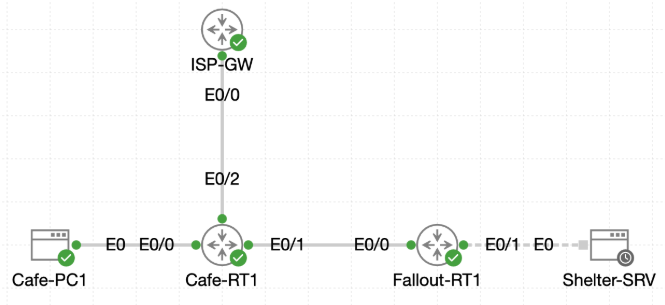

# Lab 019 - Static and Default Internet Routing

<p class="back-link">
  <a href="../../Lab-index.html">← Back to Lab Index</a>
</p>

<table>
<tr>
<td colspan="2" valign="top">

<h1>Objective</h1>

<h4>Configure deliberate static routing between two routed sites.</h4>

<h4>Remove leftover dynamic routing processes so that only connected and static routes remain.</h4>

<h4>Configure a default Internet route from <code>Cafe-RT1</code> towards the ISP gateway.</h4>

<h4>Verify that local, remote-site and simulated Internet traffic all follow the intended paths.</h4>

<h4>Demonstrate route preference using administrative distance, metric values and longest prefix match.</h4>

</td>
</tr>

<tr>
<td valign="top">

</td>
</tr>
</table>

---

## Scenario

This lab simulates a small routed network linking the Coffee House site to the Fallout Shelter site, with the Coffee House router also providing the route out towards a simulated ISP.

The network initially contained leftover EIGRP configuration from previous training. The objective was to remove this dynamic routing process and replace it with deliberate static routes. Once inter-site routing was restored, a default route was added on Cafe-RT1 so that unknown external destinations could be forwarded towards the ISP.

The final stage tested route selection logic, including static route administrative distance, default route behaviour, longest prefix match and a temporary floating static default route on Fallout-RT1.

---

## Devices Used

* Cafe-RT1
* Fallout-RT1
* Cafe-PC1
* Shelter-SRV
* ISP / simulated Internet target

---

## Addressing Summary

| Device                    |   Interface |    IP Address | Purpose                            |
| ------------------------- | ----------: | ------------: | ---------------------------------- |
| Cafe-RT1                  | Ethernet0/0 |   192.168.1.1 | Coffee House LAN gateway           |
| Cafe-RT1                  | Ethernet0/1 |   192.168.2.1 | Point-to-point link to Fallout-RT1 |
| Cafe-RT1                  | Ethernet0/2 |     216.0.5.2 | ISP-facing interface               |
| Fallout-RT1               | Ethernet0/0 |   192.168.2.2 | Point-to-point link to Cafe-RT1    |
| Fallout-RT1               | Ethernet0/1 |   192.168.3.1 | Shelter LAN gateway                |
| Cafe-PC1                  |         NIC |  192.168.1.50 | Coffee House LAN host              |
| Shelter-SRV               |         NIC | 192.168.3.100 | Shelter LAN server                 |
| ISP Gateway               |           - |     216.0.5.1 | Provider next-hop                  |
| Simulated Internet Target |           - |   203.0.113.8 | External test destination          |

---

## Configuration Steps

### Step 1 - Verify Interface Status on Cafe-RT1

The first task was to confirm that Cafe-RT1 had the required LAN, inter-router and ISP-facing interfaces online.

```bash
show ip interface brief
```

### Result

Cafe-RT1 showed:

```bash
Ethernet0/0            192.168.1.1     up    up
Ethernet0/1            192.168.2.1     up    up
Ethernet0/2            216.0.5.2       up    up
Ethernet0/3            unassigned      administratively down down
```

### Explanation

This confirmed that:

* The Coffee House LAN gateway was active on `192.168.1.1`.
* The point-to-point link to Fallout-RT1 was active on `192.168.2.1`.
* The ISP-facing link was active on `216.0.5.2`.
* The unused interface remained administratively down.

---

### Step 2 - Verify Interface Status on Fallout-RT1

Fallout-RT1 was then checked to confirm its point-to-point and LAN interfaces.

```bash
show ip interface brief
```

### Result

Fallout-RT1 showed:

```bash
Ethernet0/0            192.168.2.2     up    up
Ethernet0/1            192.168.3.1     up    up
Ethernet0/2            unassigned      administratively down down
Ethernet0/3            unassigned      administratively down down
```

### Explanation

This confirmed that:

* Fallout-RT1 had a working point-to-point link back to Cafe-RT1.
* The Shelter LAN gateway was active on `192.168.3.1`.
* No rogue addressing was present on unused interfaces.

---

### Step 3 - Remove Leftover EIGRP from Cafe-RT1

Cafe-RT1 still contained an old EIGRP process.

```bash
show running-config | section router
```

Output showed:

```bash
router eigrp 1
 network 192.168.1.0
 network 192.168.2.0 0.0.0.3
```

EIGRP was removed:

```bash
configure terminal
no router eigrp 1
exit
```

The route table was then checked:

```bash
show ip route
```

### Result

After EIGRP removal, Cafe-RT1 only displayed connected and local routes.

```bash
C        192.168.1.0/24 is directly connected, Ethernet0/0
L        192.168.1.1/32 is directly connected, Ethernet0/0
C        192.168.2.0/30 is directly connected, Ethernet0/1
L        192.168.2.1/32 is directly connected, Ethernet0/1
C        216.0.5.0/30 is directly connected, Ethernet0/2
L        216.0.5.2/32 is directly connected, Ethernet0/2
```

### Explanation

Removing EIGRP ensured the lab would rely on manually configured static routes rather than dynamic route learning.

---

### Step 4 - Remove Leftover EIGRP from Fallout-RT1

Fallout-RT1 also contained an old EIGRP process.

```bash
show running-config | section router
```

Output showed:

```bash
router eigrp 1
 network 192.168.2.0 0.0.0.3
 network 192.168.3.0
```

An initial command error occurred while removing the process:

```bash
no routereigrp 1
```

This failed because there was no space between `router` and `eigrp`.

The corrected command was then entered:

```bash
configure terminal
no router eigrp 1
exit
```

The route table was checked:

```bash
show ip route
```

### Result

Fallout-RT1 then showed only connected and local routes.

```bash
C        192.168.2.0/30 is directly connected, Ethernet0/0
L        192.168.2.2/32 is directly connected, Ethernet0/0
C        192.168.3.0/24 is directly connected, Ethernet0/1
L        192.168.3.1/32 is directly connected, Ethernet0/1
```

### Explanation

The EIGRP process was removed successfully. The router was left with only directly connected networks before static routes were added.

---

### Step 5 - Configure Static Route on Cafe-RT1

Cafe-RT1 needed a route to the remote Shelter LAN.

```bash
configure terminal
ip route 192.168.3.0 255.255.255.0 192.168.2.2
end
```

### Verification

```bash
show ip route
```

Cafe-RT1 displayed:

```bash
S     192.168.3.0/24 [1/0] via 192.168.2.2
```

### Explanation

This route tells Cafe-RT1 that traffic for the Shelter LAN, `192.168.3.0/24`, should be forwarded to Fallout-RT1 at `192.168.2.2`.

The route appears with:

```text
[1/0]
```

This means:

| Value | Meaning                 |
| ----: | ----------------------- |
|     1 | Administrative distance |
|     0 | Metric                  |

---

### Step 6 - Configure Static Route on Fallout-RT1

Fallout-RT1 needed a return route to the Coffee House LAN.

```bash
configure terminal
ip route 192.168.1.0 255.255.255.0 192.168.2.1
exit
```

### Verification

```bash
show ip route
```

Fallout-RT1 displayed:

```bash
S     192.168.1.0/24 [1/0] via 192.168.2.1
```

### Explanation

This route tells Fallout-RT1 that traffic for the Coffee House LAN, `192.168.1.0/24`, should be forwarded to Cafe-RT1 at `192.168.2.1`.

---

## Inter-Shelter Connectivity Testing

### Test 1 - Cafe-PC1 to Shelter-SRV

From Cafe-PC1:

```bash
ping -c 5 192.168.3.100
```

### Result

```bash
5 packets transmitted, 5 packets received, 0% packet loss
```

### Explanation

Cafe-PC1 successfully reached Shelter-SRV across the routed link. This proved that Cafe-RT1’s static route towards `192.168.3.0/24` was working.

---

### Test 2 - Shelter-SRV to Cafe-PC1

From Shelter-SRV:

```bash
ping 192.168.1.50
```

### Result

```bash
9 packets transmitted, 9 packets received, 0% packet loss
```

### Explanation

Shelter-SRV successfully reached Cafe-PC1. This proved that Fallout-RT1’s return route towards `192.168.1.0/24` was working.

---

## Default Route Configuration

### Step 7 - Confirm Cafe-RT1 ISP Connectivity

Before adding the default route, Cafe-RT1’s ISP-facing interface and provider gateway were checked.

```bash
show ip route
ping 216.0.5.1
```

### Result

Cafe-RT1 showed its ISP-facing connected network:

```bash
C        216.0.5.0/30 is directly connected, Ethernet0/2
L        216.0.5.2/32 is directly connected, Ethernet0/2
```

The ISP gateway responded successfully:

```bash
Success rate is 100 percent (5/5)
```

### Explanation

This confirmed that Cafe-RT1 could reach the ISP next-hop address `216.0.5.1`.

---

### Step 8 - Configure Default Route on Cafe-RT1

The default route was then added.

```bash
configure terminal
ip route 0.0.0.0 0.0.0.0 216.0.5.1
exit
```

### Verification

```bash
show ip route
```

Cafe-RT1 displayed:

```bash
Gateway of last resort is 216.0.5.1 to network 0.0.0.0

S*    0.0.0.0/0 [1/0] via 216.0.5.1
```

### Explanation

The `S*` route is a static candidate default route.

This means Cafe-RT1 now has a gateway of last resort for destinations that do not match a more specific route in the routing table.

---

## Internet Connectivity Testing

### Test 1 - Cafe-RT1 to Simulated Internet Target

From Cafe-RT1:

```bash
ping 203.0.113.8
```

### Result

```bash
Success rate is 100 percent (5/5)
```

### Test 2 - Cafe-PC1 to Simulated Internet Target

From Cafe-PC1:

```bash
ping 203.0.113.8
```

### Result

```bash
9 packets transmitted, 9 packets received, 0% packet loss
```

### Explanation

Cafe-PC1 was able to reach the simulated Internet target through Cafe-RT1 and the ISP link. This proved that the default route was working for unknown external destinations.

---

## Route Preference and Path Selection

### Step 9 - Verify Static Route Details on Cafe-RT1

The route to the Shelter LAN was checked in detail:

```bash
show ip route 192.168.3.0
```

Output showed:

```bash
Routing entry for 192.168.3.0/24
  Known via "static", distance 1, metric 0
  Routing Descriptor Blocks:
  * 192.168.2.2
      Route metric is 0, traffic share count is 1
```

The default route was also checked:

```bash
show ip route 0.0.0.0
```

Output showed:

```bash
Routing entry for 0.0.0.0/0, supernet
  Known via "static", distance 1, metric 0, candidate default path
  Routing Descriptor Blocks:
  * 216.0.5.1
      Route metric is 0, traffic share count is 1
```

### Explanation

Both routes had an administrative distance of `1` and a metric of `0`.

However, traffic to `192.168.3.0/24` uses the more specific static LAN route instead of the default route. This is because routers use longest prefix match before considering the default route for unknown destinations.

The default route `0.0.0.0/0` is only used when no more specific route exists.

---

## Floating Static Default Route Test

### Step 10 - Check Fallout-RT1 Before Floating Static Route

Fallout-RT1 was checked before adding the temporary floating default route.

```bash
show ip route
show ip route 0.0.0.0
ping 203.0.113.8
```

### Result

Fallout-RT1 had no default route:

```bash
Gateway of last resort is not set
% Network not in table
```

The ping to the simulated Internet target failed:

```bash
Success rate is 0 percent (0/5)
```

### Explanation

This confirmed that Fallout-RT1 did not currently know how to reach unknown external destinations.

---

### Step 11 - Add Temporary Floating Static Default Route on Fallout-RT1

A temporary floating static default route was added with an administrative distance of `5`.

```bash
configure terminal
ip route 0.0.0.0 0.0.0.0 192.168.2.1 5
end
```

### Verification

```bash
show ip route
show running-config | include ip route
show ip route 0.0.0.0
```

Fallout-RT1 displayed:

```bash
Gateway of last resort is 192.168.2.1 to network 0.0.0.0

S*    0.0.0.0/0 [5/0] via 192.168.2.1
```

Detailed route output showed:

```bash
Routing entry for 0.0.0.0/0, supernet
  Known via "static", distance 5, metric 0, candidate default path
  Routing Descriptor Blocks:
  * 192.168.2.1
      Route metric is 0, traffic share count is 1
```

### Explanation

The lab wording suggested that the floating static route should remain dormant. However, Fallout-RT1 had no existing lower-distance default route. Because there was no better default route already installed, the AD 5 route became active immediately.

This demonstrated an important routing principle:

> A floating static route only remains dormant when a competing route to the same destination exists with a lower administrative distance.

In this case, the AD 5 route became the best available default path because it was the only default route present on Fallout-RT1.

---

### Step 12 - Remove Temporary Floating Static Default Route

The temporary floating route was removed to restore the baseline.

```bash
configure terminal
no ip route 0.0.0.0 0.0.0.0 192.168.2.1 5
end
```

### Verification

```bash
show ip route
show running-config | include ip route
```

Fallout-RT1 returned to its original state:

```bash
Gateway of last resort is not set
```

The only remaining static route was:

```bash
ip route 192.168.1.0 255.255.255.0 192.168.2.1
```

---

## Final Routing Tables

### Cafe-RT1

Final routes included:

```bash
S*    0.0.0.0/0 [1/0] via 216.0.5.1
C     192.168.1.0/24 is directly connected, Ethernet0/0
L     192.168.1.1/32 is directly connected, Ethernet0/0
C     192.168.2.0/30 is directly connected, Ethernet0/1
L     192.168.2.1/32 is directly connected, Ethernet0/1
S     192.168.3.0/24 [1/0] via 192.168.2.2
C     216.0.5.0/30 is directly connected, Ethernet0/2
L     216.0.5.2/32 is directly connected, Ethernet0/2
```

### Fallout-RT1

Final routes included:

```bash
S     192.168.1.0/24 [1/0] via 192.168.2.1
C     192.168.2.0/30 is directly connected, Ethernet0/0
L     192.168.2.2/32 is directly connected, Ethernet0/0
C     192.168.3.0/24 is directly connected, Ethernet0/1
L     192.168.3.1/32 is directly connected, Ethernet0/1
```

---

## Troubleshooting

### Issue 1 - Incorrect EIGRP removal command on Fallout-RT1

#### Problem

The following command was entered incorrectly:

```bash
no routereigrp 1
```

#### Diagnosis

The CLI rejected the command with:

```bash
% Invalid input detected at '^' marker.
```

#### Fix

The command was corrected by adding the missing space:

```bash
no router eigrp 1
```

---

### Issue 2 - Fallout-RT1 floating static route became active immediately

#### Problem

The lab wording suggested that the floating static default route should stay dormant. However, after the route was added, it immediately appeared in the routing table as active:

```bash
S*    0.0.0.0/0 [5/0] via 192.168.2.1
```

#### Diagnosis

Fallout-RT1 did not already have a lower administrative distance default route. Therefore, the AD 5 static default had no better route to float behind.

#### Fix / Outcome

No correction was required. The behaviour was documented as valid routing behaviour.

The route was then removed as instructed:

```bash
no ip route 0.0.0.0 0.0.0.0 192.168.2.1 5
```

---

### Issue 3 - Mistyped show running-config command

#### Problem

The following command was entered incorrectly:

```bash
show runn in-config | include ip route
```

#### Diagnosis

The CLI rejected the command with:

```bash
% Invalid input detected at '^' marker.
```

#### Fix

The corrected command was used:

```bash
show running-config | include ip route
```

---

## Key Learning Points

* `C` routes are directly connected routes.
* `L` routes represent the router’s own local interface addresses.
* `S` routes are manually configured static routes.
* `S*` marks a static candidate default route.
* Static routes normally have an administrative distance of `1`.
* The route table format `[1/0]` means administrative distance `1`, metric `0`.
* A default route is written as `0.0.0.0/0`.
* A router uses the default route only when no more specific route exists.
* Longest prefix match is why `192.168.3.0/24` is preferred over `0.0.0.0/0` for shelter traffic.
* A floating static route only remains dormant when a better route to the same prefix already exists.
* A floating static route with AD `5` will become active if no lower-distance route is available.

---

## Completion Check

The lab was completed successfully.

* Cafe-RT1 and Fallout-RT1 had the correct connected routes.
* EIGRP was removed from both routers.
* Cafe-RT1 had a static route to `192.168.3.0/24` via `192.168.2.2`.
* Fallout-RT1 had a static route to `192.168.1.0/24` via `192.168.2.1`.
* Cafe-PC1 successfully reached Shelter-SRV.
* Shelter-SRV successfully reached Cafe-PC1.
* Cafe-RT1 successfully reached the ISP gateway `216.0.5.1`.
* Cafe-RT1 had a default route to `216.0.5.1`.
* Cafe-PC1 successfully reached the simulated Internet target `203.0.113.8`.
* Cafe-RT1 route preference was verified using administrative distance, metric and longest prefix match.
* Fallout-RT1 temporarily installed and then removed a floating static default route with AD `5`.
* Final routing tables were captured on both routers.
