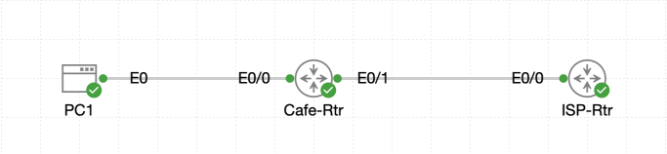

# Lab 020 - Adding the Internet

<p class="back-link">
  <a href="../../Lab-index.html">← Back to Lab Index</a>
</p>

<table>
<tr>
<td colspan="2" valign="top">

<h1>Objective</h1>

<h4>Deploy an ISP router to represent a simulated public internet edge.</h4>

<h4>Secure the ISP router with baseline access controls.</h4>

<h4>Configure WAN addressing between the cafe router and ISP router.</h4>

<h4>Create ISP loopback interfaces to simulate public DNS targets.</h4>

<h4>Verify that the cafe router can reach the simulated internet using its default route.</h4>

<h4>Confirm that the internal PC cannot yet reach the internet because NAT has not been configured.</h4>

</td>
</tr>

<tr>
<td valign="top">

</td>
</tr>
</table>

---

## Scenario

This lab simulates adding an internet edge to the existing cafe network.

A pre-staged ISP router was brought online and connected to `Cafe-Rtr` using a /30 WAN link. The ISP router was secured with baseline credentials and then configured with loopback interfaces to represent public DNS services.

The goal was to prove that `Cafe-Rtr` could forward traffic towards the simulated internet using its default route, while also recognising that internal PC traffic would fail until NAT is added in a later lab.

---

## Devices Used

* `ISP-Rtr`
* `Cafe-Rtr`
* `PC1`

---

## Addressing Table

| Device     |     Interface |    IP Address |       Subnet Mask | Purpose                  |
| ---------- | ------------: | ------------: | ----------------: | ------------------------ |
| `ISP-Rtr`  | `Ethernet0/0` |   `216.0.5.1` | `255.255.255.252` | ISP side of WAN link     |
| `Cafe-Rtr` | `Ethernet0/1` |   `216.0.5.2` | `255.255.255.252` | Cafe side of WAN link    |
| `ISP-Rtr`  |   `Loopback1` |     `1.1.1.1` | `255.255.255.255` | Simulated Cloudflare DNS |
| `ISP-Rtr`  |   `Loopback2` |     `8.8.8.8` | `255.255.255.255` | Simulated Google DNS     |
| `Cafe-Rtr` | `Ethernet0/0` | `192.168.1.1` |      Likely `/24` | Cafe LAN gateway         |

---

## Configuration Steps

### Step 1 - Access and Identify the ISP Router

The console session was opened on the ISP router. The router initially displayed the default prompt:

```bash
inserthostname-here>
```

Privileged EXEC mode and global configuration mode were entered, then the hostname was changed to `ISP-Rtr`.

```bash
enable
configure terminal
hostname ISP-Rtr
end
```

### Explanation

Changing the hostname makes the router easier to identify during configuration and verification. This is especially useful in multi-router labs because it reduces the chance of applying commands to the wrong device.

---

### Step 2 - Confirm Initial Interface State

The command below was used to inspect all interfaces:

```bash
show ip interface brief
```

The output confirmed that `Ethernet0/0` existed but was not yet configured:

```bash
Ethernet0/0            unassigned      YES TFTP   administratively down down
```

### Explanation

This confirmed that the expected WAN-facing interface was available for configuration. The `administratively down/down` state means the interface had not yet been enabled with `no shutdown`.

---

### Step 3 - Confirm Cafe Router WAN Interface

`Cafe-Rtr` was checked using:

```bash
show ip interface brief
```

The output showed that `Ethernet0/1` was already configured and operational:

```bash
Ethernet0/1            216.0.5.2       YES TFTP   up                    up
```

### Explanation

This verified that the cafe router already had its side of the WAN link active. The ISP router would therefore need to use the matching address `216.0.5.1/30`.

---

### Step 4 - Secure the ISP Router

The ISP router was configured with a local username and enable secret:

```bash
username cisco secret cisco
enable secret cisco
line con 0
 login local
line vty 0 4
 login local
```

### Explanation

This secured console and VTY access using the local username database. The `enable secret` protects privileged EXEC mode.

The lab wording asked for console and VTY passwords of `Cisco`. In an exam-style task, the more literal configuration would usually be:

```bash
line con 0
 password Cisco
 login
exit
line vty 0 4
 password Cisco
 login
exit
```

However, the configuration used in this lab is functionally stronger because it requires a username and password rather than only a shared line password.

---

### Step 5 - Configure and Enable the ISP WAN Interface

`Ethernet0/0` on `ISP-Rtr` was configured with the WAN address:

```bash
interface Ethernet0/0
 ip address 216.0.5.1 255.255.255.252
 no shutdown
```

The interface then came up:

```bash
%LINK-3-UPDOWN: Interface Ethernet0/0, changed state to up
%LINEPROTO-5-UPDOWN: Line protocol on Interface Ethernet0/0, changed state to up
```

### Explanation

The `/30` network provides two usable addresses:

|     Address | Purpose     |
| ----------: | ----------- |
| `216.0.5.1` | ISP router  |
| `216.0.5.2` | Cafe router |

Once `no shutdown` was applied, both the physical and protocol states moved to `up/up`.

---

### Step 6 - Test WAN Reachability

From `ISP-Rtr`, a ping was sent to `Cafe-Rtr`:

```bash
ping 216.0.5.2
```

The first test returned:

```bash
.!!!!
Success rate is 80 percent (4/5)
```

The second test returned:

```bash
!!!!!
Success rate is 100 percent (5/5)
```

### Explanation

The first ping likely lost one packet while ARP resolved the Layer 2 address. The second ping succeeded completely, confirming stable reachability between the ISP and cafe routers.

---

### Step 7 - Create Simulated Public DNS Loopbacks

Two loopback interfaces were created on `ISP-Rtr`:

```bash
interface loopback 1
 ip address 1.1.1.1 255.255.255.255
exit

interface loopback 2
 ip address 8.8.8.8 255.255.255.255
exit
```

### Explanation

Loopback interfaces are logical interfaces that remain up as long as the router is functioning. In this lab:

* `Loopback1` simulates Cloudflare DNS at `1.1.1.1`
* `Loopback2` simulates Google DNS at `8.8.8.8`

These provide test destinations that behave like public internet targets.

---

## Verification

### ISP Router Interface Status

```bash
show ip interface brief
```

Confirmed output:

```bash
Interface              IP-Address      OK? Method Status                Protocol
Ethernet0/0            216.0.5.1       YES manual up                    up
Loopback1              1.1.1.1         YES manual up                    up
Loopback2              8.8.8.8         YES manual up                    up
```

This confirmed that the ISP WAN interface and both simulated DNS loopbacks were operational.

---

### Cafe Router Reachability to Simulated Internet

From `Cafe-Rtr`, both loopback targets were successfully reached:

```bash
ping 1.1.1.1
```

Result:

```bash
!!!!!
Success rate is 100 percent (5/5)
```

Then:

```bash
ping 8.8.8.8
```

Result:

```bash
!!!!!
Success rate is 100 percent (5/5)
```

### Explanation

This proves that `Cafe-Rtr` can reach the simulated internet using its existing default route towards `216.0.5.1`.

---

### PC1 Internet Reachability Test

From `PC1`, a ping was attempted to `1.1.1.1`:

```bash
ping 1.1.1.1
```

The test failed:

```bash
86 packets transmitted, 0 packets received, 100% packet loss
```

### Explanation

This failure is expected at this stage.

`PC1` is using a private internal address from the `192.168.1.0/24` network. Although traffic can leave the cafe network, the ISP router does not currently have a route back to the private LAN.

In a real internet scenario, private RFC1918 addresses are not routed publicly. The next lab will introduce NAT so internal hosts can share the cafe router's public-facing address when accessing outside destinations.

---

## Troubleshooting Notes

### Issue 1 - Incorrect Show Command

An invalid command was entered:

```bash
show ip config
```

The router returned:

```bash
% Invalid input detected at '^' marker.
```

### Diagnosis

`show ip config` is not a valid IOS command for displaying interface summaries.

### Fix

The correct command was used:

```bash
show ip interface brief
```

---

### Issue 2 - Typo in Loopback2 IP Address Command

The following typo was entered:

```bash
ip adddress 8.8.8.8 255.255.255.255
```

The router returned:

```bash
% Invalid input detected at '^' marker.
```

### Diagnosis

The command failed because `address` was misspelled as `adddress`.

### Fix

The command was re-entered correctly:

```bash
ip address 8.8.8.8 255.255.255.255
```

---

### Issue 3 - PC1 Cannot Reach Simulated Internet

`PC1` failed to ping `1.1.1.1`:

```bash
86 packets transmitted, 0 packets received, 100% packet loss
```

### Diagnosis

The cafe router can reach the ISP loopbacks, but the ISP router has no return route to `192.168.1.0/24`.

### Fix

No fix was applied in this lab because the failure is expected. The issue sets up the requirement for NAT in the next lesson.

---

## Completion Check

| Requirement                      | Result                                      | Status   |
| -------------------------------- | ------------------------------------------- | -------- |
| ISP router deployed and accessed | Console access successful                   | Complete |
| Hostname configured              | `ISP-Rtr`                                   | Complete |
| Access security applied          | Local username and enable secret configured | Complete |
| ISP WAN interface configured     | `216.0.5.1/30` on `Ethernet0/0`             | Complete |
| ISP WAN interface operational    | `up/up`                                     | Complete |
| ISP can ping Cafe-Rtr            | `216.0.5.2` reachable                       | Complete |
| Loopback1 configured             | `1.1.1.1/32`                                | Complete |
| Loopback2 configured             | `8.8.8.8/32`                                | Complete |
| Cafe-Rtr can reach loopbacks     | Pings to `1.1.1.1` and `8.8.8.8` successful | Complete |
| PC1 fails before NAT             | 100% packet loss observed                   | Complete |

---

## Summary

This lab successfully added a simulated internet router to the cafe network. The ISP router was identified, secured, addressed and brought online using a /30 WAN connection to `Cafe-Rtr`.

Loopback interfaces were configured to represent public DNS targets, allowing the cafe edge router to prove external reachability. `Cafe-Rtr` successfully reached both `1.1.1.1` and `8.8.8.8`, confirming that its default route towards the ISP router was working.

The final PC test failed as expected because NAT had not yet been configured. This confirmed the purpose of the next lab: allowing internal private hosts to access external networks by translating their source addresses.
