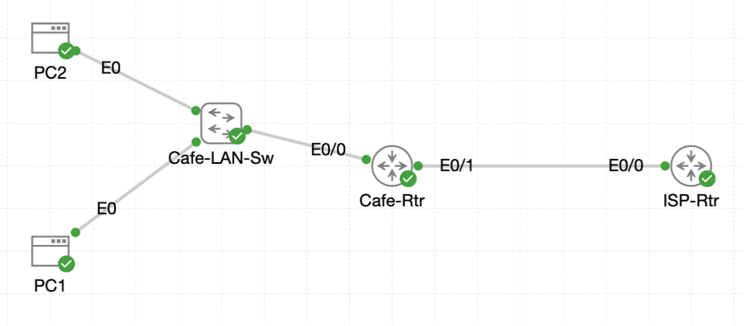

# Lab 021 - Configuring Static NAT

<p class="back-link">
  <a href="../../Lab-index.html">← Back to Lab Index</a>
</p>

<table>
<tr>
<td colspan="2" valign="top">

<h1>Objective</h1>

<h4>Diagnose why internal cafe LAN hosts cannot reach the simulated internet before NAT is configured.</h4>

<h4>Configure static one-to-one NAT mappings for internal hosts.</h4>

<h4>Mark the cafe router's LAN and WAN interfaces as NAT inside and NAT outside.</h4>

<h4>Verify outbound internet reachability from internal devices.</h4>

<h4>Confirm inbound reachability from the ISP router to the mapped public NAT addresses.</h4>

<h4>Demonstrate how static NAT can publish multiple inside devices using separate public addresses.</h4>

</td>
</tr>

<tr>
<td valign="top">

</td>
</tr>
</table>

---

## Scenario

This lab builds on the previous simulated internet lab.

The cafe network already has a working WAN link to `ISP-Rtr`, and `Cafe-Rtr` has a default route towards the ISP. However, the internal cafe hosts use private `192.168.1.0/24` addressing. The ISP router has no route back to this private LAN, so internal hosts cannot successfully communicate with the simulated internet.

To solve this, static NAT was configured on `Cafe-Rtr`. This created one-to-one translations between private inside addresses and public-facing addresses reachable through the ISP side of the topology.

---

## Devices Used

* `Cafe-Rtr`
* `ISP-Rtr`
* `PC1`
* `PC2`

---

## Addressing Table

| Device      |   Interface / Role |       IP Address | Purpose                          |
| ----------- | -----------------: | ---------------: | -------------------------------- |
| `Cafe-Rtr`  |      `Ethernet0/0` | `192.168.1.1/24` | Cafe LAN gateway / NAT inside    |
| `Cafe-Rtr`  |      `Ethernet0/1` |   `216.0.5.2/30` | WAN link to ISP / NAT outside    |
| `ISP-Rtr`   |      `Ethernet0/0` |   `216.0.5.1/30` | ISP side of WAN link             |
| `ISP-Rtr`   |        `Loopback0` |     `1.1.1.1/32` | Simulated Cloudflare DNS         |
| `ISP-Rtr`   |        `Loopback1` |     `8.8.8.8/32` | Simulated Google DNS             |
| `PC1`       |        Inside host |   `192.168.1.50` | Static NAT inside local address  |
| `PC2`       |        Inside host |   `192.168.1.51` | Static NAT inside local address  |
| NAT Mapping | PC1 public address |     `216.0.5.20` | Static NAT inside global address |
| NAT Mapping | PC2 public address |     `216.0.5.21` | Static NAT inside global address |

---

## Configuration Steps

### Step 1 - Verify Cafe Router Interface Status

The lab began on `Cafe-Rtr` by checking the router interfaces:

```bash
show ip interface brief
```

Confirmed output:

```bash
Interface              IP-Address      OK? Method Status                Protocol
Ethernet0/0            192.168.1.1     YES TFTP   up                    up
Ethernet0/1            216.0.5.2       YES TFTP   up                    up
Ethernet0/2            unassigned      YES unset  administratively down down
Ethernet0/3            unassigned      YES unset  administratively down down
```

### Explanation

This confirmed that the cafe LAN and WAN interfaces were both operational.

* `Ethernet0/0` connects to the internal cafe LAN.
* `Ethernet0/1` connects towards `ISP-Rtr`.

These two interfaces later became the NAT inside and outside boundaries.

---

### Step 2 - Confirm Pre-NAT Failure from PC1

From `PC1`, a ping was attempted to the simulated public target `1.1.1.1`.

```bash
ping 1.1.1.1
```

The test failed:

```bash
223 packets transmitted, 0 packets received, 100% packet loss
```

### Explanation

This failure was expected before NAT.

`PC1` uses a private inside address from the `192.168.1.0/24` network. Although traffic can be sent towards the ISP, the ISP router has no route back to the private LAN. Because the return path is missing, replies cannot reach `PC1`.

---

### Step 3 - Check ISP Router Routes

On `ISP-Rtr`, the interface status and routing table were checked:

```bash
show ip interface brief
show ip route
```

The ISP router had routes for the simulated public destinations and the public NAT host addresses:

```bash
C        1.1.1.1 is directly connected, Loopback0
C        8.8.8.8 is directly connected, Loopback1
C        216.0.5.0/30 is directly connected, Ethernet0/0
L        216.0.5.1/32 is directly connected, Ethernet0/0
S        216.0.5.20/32 [1/0] via 216.0.5.2
S        216.0.5.21/32 [1/0] via 216.0.5.2
```

### Explanation

The ISP router knew how to reach the public NAT addresses `216.0.5.20` and `216.0.5.21` through `Cafe-Rtr`.

However, it had no route for:

```bash
192.168.1.0/24
```

This confirmed why NAT was needed. The inside private address must be translated into a public address that the ISP router can return traffic to.

---

### Step 4 - Configure Static NAT for PC1

On `Cafe-Rtr`, a static one-to-one NAT entry was created for `PC1`:

```bash
conf t
ip nat inside source static 192.168.1.50 216.0.5.20
end
```

The NAT table was then checked:

```bash
show ip nat translation
```

Confirmed output:

```bash
Pro Inside global      Inside local       Outside local      Outside global
--- 216.0.5.20         192.168.1.50       ---                ---
```

### Explanation

This command maps:

```text
Inside local:  192.168.1.50
Inside global: 216.0.5.20
```

The inside local address is the real private address of the internal host. The inside global address is the public-facing address that outside devices use to reach that host.

---

### Step 5 - Mark NAT Inside and Outside Interfaces

The LAN-facing interface was marked as NAT inside:

```bash
conf t
interface Ethernet0/0
 ip nat inside
exit
```

The ISP-facing interface was marked as NAT outside:

```bash
interface Ethernet0/1
 ip nat outside
exit
end
```

The interface configuration was then checked:

```bash
show running-config interface et0/0
show running-config interface et0/1
```

Confirmed `Ethernet0/0` configuration:

```bash
interface Ethernet0/0
 description Cafe LAN
 ip address 192.168.1.1 255.255.255.0
 ip nat inside
end
```

Confirmed `Ethernet0/1` configuration:

```bash
interface Ethernet0/1
 description WAN toward ISP-Rtr
 ip address 216.0.5.2 255.255.255.252
 ip nat outside
end
```

### Explanation

NAT requires the router to understand which direction traffic is travelling.

* `ip nat inside` marks the trusted internal LAN side.
* `ip nat outside` marks the external ISP-facing side.

Without these interface roles, the static NAT entry exists in the configuration but cannot process traffic correctly.

---

### Step 6 - Verify PC1 Outbound Reachability

After configuring the NAT mapping and interface roles, `PC1` successfully pinged `1.1.1.1`:

```bash
ping -c 5 1.1.1.1
```

Successful output:

```bash
5 packets transmitted, 5 packets received, 0% packet loss
round-trip min/avg/max = 0.990/1.103/1.247 ms
```

### Explanation

This confirmed that the static NAT mapping for `PC1` was working.

When `PC1` sent traffic from `192.168.1.50`, `Cafe-Rtr` translated the source address to `216.0.5.20`. The ISP router could then return traffic to the public NAT address.

---

### Step 7 - Inspect NAT Translations

On `Cafe-Rtr`, the NAT table showed both the static mapping and an active ICMP translation:

```bash
show ip nat translations
```

Confirmed output:

```bash
Pro Inside global      Inside local       Outside local      Outside global
icmp 216.0.5.20:706    192.168.1.50:706   1.1.1.1:706        1.1.1.1:706
--- 216.0.5.20         192.168.1.50       ---                ---
```

### Explanation

The static entry confirms the permanent mapping between `192.168.1.50` and `216.0.5.20`.

The ICMP entry confirms that live translated traffic was actively passing through the router.

---

### Step 8 - Verify Inbound Reachability to PC1's Public NAT Address

From `ISP-Rtr`, a ping was sent to PC1's public NAT address:

```bash
ping 216.0.5.20
```

Successful output:

```bash
!!!!!
Success rate is 100 percent (5/5), round-trip min/avg/max = 1/1/1 ms
```

### Explanation

This confirmed that inbound traffic from the ISP side could reach the statically mapped inside host.

The ISP router sent traffic to `216.0.5.20`, and `Cafe-Rtr` translated that traffic back to the internal host `192.168.1.50`.

---

### Step 9 - Configure Static NAT for PC2

A second static NAT mapping was created for `PC2`:

```bash
conf t
ip nat inside source static 192.168.1.51 216.0.5.21
exit
```

The NAT table was checked again:

```bash
show ip nat translation
```

Confirmed output:

```bash
Pro Inside global      Inside local       Outside local      Outside global
--- 216.0.5.20         192.168.1.50       ---                ---
--- 216.0.5.21         192.168.1.51       ---                ---
```

### Explanation

This created a second one-to-one mapping:

```text
Inside local:  192.168.1.51
Inside global: 216.0.5.21
```

This demonstrates how multiple internal devices can be published using separate public IP addresses.

---

### Step 10 - Verify PC2 Outbound Reachability

From `PC2`, a ping was sent to `8.8.8.8`:

```bash
ping -c 5 8.8.8.8
```

Successful output:

```bash
5 packets transmitted, 5 packets received, 0% packet loss
round-trip min/avg/max = 1.051/1.185/1.600 ms
```

### Explanation

This confirmed that the second static NAT mapping was also functioning correctly.

`PC2` traffic sourced from `192.168.1.51` was translated to `216.0.5.21`, allowing the ISP-side simulated internet target to return traffic successfully.

---

## Verification Summary

| Test                               | Expected Result                | Observed Result                | Status   |
| ---------------------------------- | ------------------------------ | ------------------------------ | -------- |
| `Cafe-Rtr show ip interface brief` | LAN and WAN interfaces up/up   | `Et0/0` and `Et0/1` were up/up | Complete |
| Pre-NAT PC1 ping to `1.1.1.1`      | Failure                        | 100% packet loss               | Complete |
| ISP route table checked            | No route to `192.168.1.0/24`   | No private LAN route present   | Complete |
| Static NAT for PC1                 | `192.168.1.50` to `216.0.5.20` | Mapping shown in NAT table     | Complete |
| NAT inside interface               | `Et0/0`                        | `ip nat inside` present        | Complete |
| NAT outside interface              | `Et0/1`                        | `ip nat outside` present       | Complete |
| PC1 ping after NAT                 | Success                        | 0% packet loss                 | Complete |
| NAT translation table              | Static and active ICMP entries | Entries visible                | Complete |
| ISP ping to `216.0.5.20`           | Success                        | 100% success                   | Complete |
| Static NAT for PC2                 | `192.168.1.51` to `216.0.5.21` | Mapping shown in NAT table     | Complete |
| PC2 ping after NAT                 | Success                        | 0% packet loss                 | Complete |

---

## Troubleshooting Notes

### Issue 1 - PC1 Could Not Reach the Simulated Internet Before NAT

Before NAT was configured, `PC1` failed to ping `1.1.1.1`.

```bash
223 packets transmitted, 0 packets received, 100% packet loss
```

### Diagnosis

The ISP router had no route back to the private `192.168.1.0/24` cafe LAN. The ISP router did, however, have routes for the public NAT addresses `216.0.5.20` and `216.0.5.21`.

### Fix

A static NAT mapping was created on `Cafe-Rtr`:

```bash
ip nat inside source static 192.168.1.50 216.0.5.20
```

The cafe LAN interface was marked as NAT inside and the ISP-facing interface was marked as NAT outside.

---

### Issue 2 - Static NAT Entry Alone Was Not Enough

The static NAT translation was configured first, but NAT also required the router interfaces to be labelled correctly.

### Diagnosis

NAT needs an inside and outside boundary to know when translation should occur.

### Fix

The interfaces were configured as follows:

```bash
interface Ethernet0/0
 ip nat inside

interface Ethernet0/1
 ip nat outside
```

---

## Key Learning Points

* Static NAT creates a fixed one-to-one relationship between a private inside address and a public inside global address.
* `ip nat inside source static` defines the address mapping.
* `ip nat inside` and `ip nat outside` must be configured on the correct router interfaces.
* NAT solves the return-path problem where an outside router cannot route directly back to private RFC1918 addressing.
* Static NAT can support inbound reachability from outside networks to specific inside hosts.
* Each inside host requires a unique inside global address when using basic one-to-one static NAT.

---

## Completion Check

| Requirement                      | Result                                | Status   |
| -------------------------------- | ------------------------------------- | -------- |
| PC1 pre-NAT failure observed     | Ping to `1.1.1.1` failed              | Complete |
| ISP return-path issue identified | No route to `192.168.1.0/24`          | Complete |
| PC1 static NAT configured        | `192.168.1.50` mapped to `216.0.5.20` | Complete |
| NAT interfaces marked            | `Et0/0` inside, `Et0/1` outside       | Complete |
| PC1 outbound NAT verified        | Ping to `1.1.1.1` succeeded           | Complete |
| NAT table inspected              | Static and ICMP entries visible       | Complete |
| Inbound NAT verified             | ISP ping to `216.0.5.20` succeeded    | Complete |
| PC2 static NAT configured        | `192.168.1.51` mapped to `216.0.5.21` | Complete |
| PC2 outbound NAT verified        | Ping to `8.8.8.8` succeeded           | Complete |

---

## Summary

This lab successfully demonstrated static NAT on `Cafe-Rtr`.

Before NAT was configured, `PC1` could not reach the simulated internet because the ISP router had no route back to the private `192.168.1.0/24` LAN. A static NAT mapping was then created to translate `PC1` from `192.168.1.50` to the public address `216.0.5.20`.

After the LAN and WAN interfaces were marked as NAT inside and NAT outside, `PC1` successfully reached `1.1.1.1`, and `ISP-Rtr` could successfully reach the public NAT address `216.0.5.20`.

A second static NAT mapping was then added for `PC2`, translating `192.168.1.51` to `216.0.5.21`. `PC2` successfully reached `8.8.8.8`, confirming that multiple devices can be published using separate static NAT mappings.

The lab was completed successfully and prepares the network for later NAT, PAT, and internet-access scenarios.
