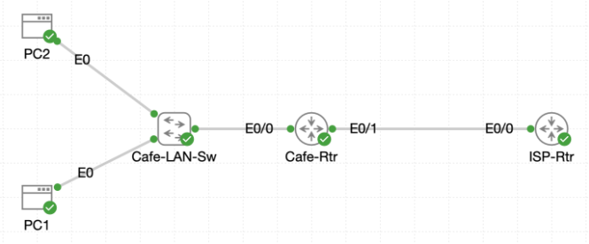

# Lab 022 - Configuring Dynamic NAT

<p class="back-link">
  <a href="../../Lab-index.html">← Back to Lab Index</a>
</p>

<table>
<tr>
<td colspan="2" valign="top">

<h1>Objective</h1>

<h4>Remove legacy one-to-one static NAT translations from <code>Cafe-Rtr</code>.</h4>

<h4>Configure dynamic NAT so multiple internal café hosts can borrow public addresses from a shared pool.</h4>

<h4>Define the inside LAN using a standard access list.</h4>

<h4>Create and verify a public NAT address pool named <code>Cafe-Public</code>.</h4>

<h4>Validate outbound connectivity from multiple hosts and confirm that dynamic translations are created successfully.</h4>

</td>
</tr>

<tr>
<td valign="top">

</td>
</tr>
</table>

---

## Scenario

This lab simulates a café network moving away from static one-to-one NAT mappings and towards dynamic NAT.

Previously, individual internal hosts were manually mapped to specific public IP addresses. This worked for a small number of devices, but it was not scalable once more café devices needed outbound Internet access.

The objective was to remove the old static NAT entries, define the inside address space with a standard access list, create a pool of public addresses, and bind the inside LAN to that pool using dynamic NAT.

The final result proved that multiple café hosts could reach the Internet while temporarily consuming public addresses from the configured NAT pool.

---

## Devices Used

* Cafe-Rtr
* PC1
* PC2
* ISP / simulated Internet target

---

## Addressing Summary

| Device / Role             | Interface   | IP Address / Range       | Purpose                             |
| ------------------------- | ----------- | ------------------------ | ----------------------------------- |
| Cafe-Rtr                  | Ethernet0/0 | 192.168.1.1/24           | Café LAN gateway / NAT inside       |
| Cafe-Rtr                  | Ethernet0/1 | 216.0.5.2/30             | WAN link towards ISP / NAT outside  |
| PC1                       | NIC         | 192.168.1.50             | Internal café host                  |
| PC2                       | NIC         | 192.168.1.51             | Internal café host                  |
| ISP next hop              | -           | 216.0.5.1                | Default route next-hop              |
| Dynamic NAT public pool   | -           | 216.0.5.50 - 216.0.5.100 | Public address pool for dynamic NAT |
| Simulated Internet target | -           | 1.1.1.1                  | External ping test destination      |

---

## Configuration Steps

### Step 1 - Review Existing NAT Configuration

The first task was to inspect the existing running configuration on `Cafe-Rtr`.

```bash
enable
show running-config
```

The router contained two static NAT mappings:

```bash
ip nat inside source static 192.168.1.50 216.0.5.20
ip nat inside source static 192.168.1.51 216.0.5.21
```

### Explanation

These entries created fixed one-to-one translations between internal café hosts and public IP addresses.

For this lab, they needed to be removed so that dynamic NAT could take over cleanly.

---

### Step 2 - Remove the Legacy Static NAT Entries

An initial attempt was made from privileged EXEC mode:

```bash
no ip nat inside source static 192.168.1.50 216.0.5.20
```

This failed because configuration changes must be made from global configuration mode.

The correct process was then followed:

```bash
configure terminal
no ip nat inside source static 192.168.1.50 216.0.5.20
no ip nat inside source static 192.168.1.51 216.0.5.21
exit
```

### Verification

```bash
show ip nat translations
```

### Result

No static NAT translations were shown.

### Explanation

This confirmed that the old static NAT entries had been removed and the router was ready for the dynamic NAT configuration.

---

### Step 3 - Define the Inside Address List

A standard access list was created to identify the internal café LAN.

```bash
configure terminal
access-list 1 permit 192.168.1.0 0.0.0.255
end
```

### Verification

```bash
show ip access-lists
```

### Result

```bash
Standard IP access list 1
    10 permit 192.168.1.0, wildcard bits 0.0.0.255
```

### Explanation

Access list `1` matches the full `192.168.1.0/24` café LAN.

This tells the router which inside local addresses are eligible for NAT translation.

---

### Step 4 - Create the Dynamic NAT Pool

A public address pool named `Cafe-Public` was created.

```bash
configure terminal
ip nat pool Cafe-Public 216.0.5.50 216.0.5.100 netmask 255.255.255.0
end
```

### Verification

```bash
show running-config | include ip nat pool
```

### Result

```bash
ip nat pool Cafe-Public 216.0.5.50 216.0.5.100 netmask 255.255.255.0
```

### Explanation

The NAT pool provides a block of public addresses that internal hosts can temporarily borrow when they initiate outbound traffic.

The pool contains public addresses from:

```text
216.0.5.50 to 216.0.5.100
```

This gives the router 51 available public addresses for dynamic translation.

---

### Step 5 - Bind the Access List to the NAT Pool

The inside address list was linked to the public NAT pool.

```bash
configure terminal
ip nat inside source list 1 pool Cafe-Public
end
```

### Explanation

This command tells the router:

* Use access list `1` to identify inside local addresses.
* Translate those addresses using the public addresses in the `Cafe-Public` pool.
* Create translations dynamically when matching hosts generate outbound traffic.

---

### Step 6 - Verify NAT Inside and Outside Interfaces

The LAN and WAN interfaces were checked.

```bash
show running-config interface ethernet0/0
show running-config interface ethernet0/1
```

### Result

```bash
interface Ethernet0/0
 description Cafe LAN
 ip address 192.168.1.1 255.255.255.0
 ip nat inside
```

```bash
interface Ethernet0/1
 description WAN toward ISP-Rtr
 ip address 216.0.5.2 255.255.255.252
 ip nat outside
```

### Explanation

Dynamic NAT requires the router to understand traffic direction.

`Ethernet0/0` was correctly marked as the inside interface because it faces the private café LAN.

`Ethernet0/1` was correctly marked as the outside interface because it faces the ISP network.

---

## Connectivity Testing

### Test 1 - PC1 to External Target

From PC1:

```bash
ping -c 5 1.1.1.1
```

### Result

```bash
5 packets transmitted, 5 packets received, 0% packet loss
```

### Explanation

PC1 successfully reached the simulated external address. This generated a dynamic NAT translation for the host.

---

### Test 2 - PC2 to External Target

An initial typo was entered:

```bash
oing -c 5 1.1.1.1
```

This failed because `oing` is not a valid command.

The corrected command was then used:

```bash
ping -c 5 1.1.1.1
```

### Result

```bash
5 packets transmitted, 5 packets received, 0% packet loss
```

### Explanation

PC2 also successfully reached the simulated external address. This proved that more than one café host could use the dynamic NAT pool.

---

## NAT Verification

### Step 7 - View Dynamic NAT Translations

The NAT translation table was checked on `Cafe-Rtr`.

```bash
show ip nat translations
```

### Result

```bash
Pro Inside global      Inside local       Outside local      Outside global
--- 216.0.5.50         192.168.1.50       ---                ---
icmp 216.0.5.51:710    192.168.1.51:710   1.1.1.1:710        1.1.1.1:710
--- 216.0.5.51         192.168.1.51       ---                ---
```

### Explanation

The output showed dynamic translations for both internal café hosts:

| Inside Local | Inside Global |
| ------------ | ------------- |
| 192.168.1.50 | 216.0.5.50    |
| 192.168.1.51 | 216.0.5.51    |

This confirmed that the router was allocating public addresses from the configured pool.

---

### Step 8 - View NAT Statistics

The NAT statistics were checked.

```bash
show ip nat statistics
```

### Result

```bash
Total active translations: 2 (0 static, 2 dynamic; 0 extended)
Outside interfaces:
  Ethernet0/1
Inside interfaces: 
  Ethernet0/0
Hits: 20  Misses: 0
CEF Translated packets: 20, CEF Punted packets: 0
 Reserved port setting disabled provisioned no
 Dynamic overload mapping configured: 0
Expired translations: 2
Dynamic mappings:
-- Inside Source
[Id: 1] access-list 1 pool Cafe-Public refcount 2
 pool Cafe-Public: id 1, netmask 255.255.255.0
        start 216.0.5.50 end 216.0.5.100
        type generic, total addresses 51, allocated 2 (3%), misses 0
```

### Explanation

This confirmed that:

* There were no remaining static NAT translations.
* Two dynamic translations were active.
* The correct inside and outside interfaces were being used.
* Access list `1` was mapped to pool `Cafe-Public`.
* The pool contained 51 addresses.
* Two addresses were currently allocated.
* No NAT misses were recorded.

---

## Troubleshooting

### Issue 1 - Attempted configuration command from the wrong mode

#### Problem

The following command was entered from privileged EXEC mode:

```bash
no ip nat inside source static 192.168.1.50 216.0.5.20
```

#### Diagnosis

The router rejected the command:

```bash
% Invalid input detected at '^' marker.
```

This happened because `no ip nat inside source static` is a global configuration command.

#### Fix

Global configuration mode was entered first:

```bash
configure terminal
no ip nat inside source static 192.168.1.50 216.0.5.20
```

---

### Issue 2 - Incorrect public IP used while removing a static NAT entry

#### Problem

The following command was entered:

```bash
no ip nat inside source static 192.168.1.51 216.0.5.20
```

#### Diagnosis

The router returned:

```bash
%Translation not found!!!!
```

The public address did not match the existing static NAT entry for `192.168.1.51`.

#### Fix

The correct public address was used:

```bash
no ip nat inside source static 192.168.1.51 216.0.5.21
```

---

### Issue 3 - Ambiguous NAT show command

#### Problem

The following command was entered:

```bash
show nat ?
```

#### Diagnosis

The router returned:

```bash
% Ambiguous command:  "show nat "
```

#### Fix

The correct command family was identified:

```bash
show ip nat ?
```

Useful options included:

```bash
show ip nat translations
show ip nat statistics
```

---

### Issue 4 - Typo on PC2 ping command

#### Problem

The following command was entered on PC2:

```bash
oing -c 5 1.1.1.1
```

#### Diagnosis

The Linux shell returned:

```bash
-sh: oing: not found
```

#### Fix

The command was corrected:

```bash
ping -c 5 1.1.1.1
```

---

## Key Learning Points

* Static NAT creates fixed one-to-one address mappings.
* Dynamic NAT allows inside hosts to borrow public addresses from a configured pool.
* A standard access list can be used to identify which inside addresses are eligible for translation.
* `ip nat inside` must be applied to the interface facing the private network.
* `ip nat outside` must be applied to the interface facing the public or ISP network.
* Dynamic NAT creates translations only when matching traffic is generated.
* `show ip nat translations` displays active translation entries.
* `show ip nat statistics` confirms the NAT pool, allocation count, inside/outside interfaces and dynamic mapping.
* Dynamic NAT without overload requires enough public addresses for the number of simultaneous translated hosts.
* NAT troubleshooting often involves checking command mode, access list matching, pool configuration and interface direction.

---

## Completion Check

The lab was completed successfully.

* Legacy static NAT entries were identified in the running configuration.
* Static NAT translations for `192.168.1.50` and `192.168.1.51` were removed.
* The NAT translation table was checked after removal.
* Access list `1` was created for the `192.168.1.0/24` café LAN.
* NAT pool `Cafe-Public` was created using public addresses `216.0.5.50` through `216.0.5.100`.
* Access list `1` was bound to the `Cafe-Public` pool.
* `Ethernet0/0` was verified as the NAT inside interface.
* `Ethernet0/1` was verified as the NAT outside interface.
* PC1 successfully reached `1.1.1.1`.
* PC2 successfully reached `1.1.1.1`.
* `show ip nat translations` confirmed dynamic address allocation.
* `show ip nat statistics` confirmed two dynamic translations, zero static translations and two allocated pool addresses.
