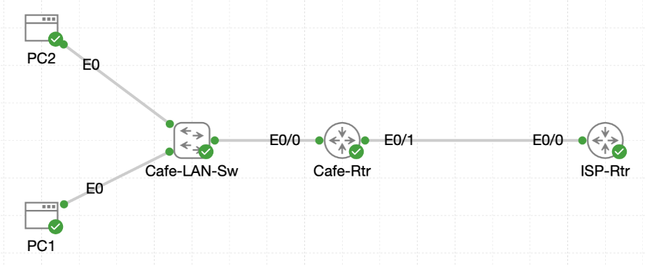

# Lab 023 - Configuring NAT Overload

<p class="back-link">
  <a href="../../Lab-index.html">← Back to Lab Index</a>
</p>

<table>
<tr>
<td colspan="2" valign="top">

<h1>Objective</h1>

<h4>Remove the previous dynamic NAT pool mapping from <code>Cafe-Rtr</code>.</h4>

<h4>Configure NAT overload so multiple private café hosts can share a single public WAN address.</h4>

<h4>Reuse the existing standard access list to identify the inside LAN.</h4>

<h4>Verify that <code>Ethernet0/0</code> remains the NAT inside interface and <code>Ethernet0/1</code> remains the NAT outside interface.</h4>

<h4>Confirm that multiple hosts can reach the Internet using the same inside global address with unique port numbers.</h4>

</td>
</tr>

<tr>
<td valign="top">

</td>
</tr>
</table>

---

## Scenario

This lab simulates a café network that has outgrown both static NAT and basic dynamic NAT.

In the previous lab, internal café hosts borrowed public addresses from a configured NAT pool. That worked while enough public addresses were available, but it still required a separate public address for each simultaneously translated host.

The objective in this lab was to remove the dynamic pool mapping and replace it with NAT overload. This allows many inside private hosts to share the single public IP address configured on the ISP-facing interface.

The final result proved that both café hosts could reach the simulated Internet while sharing the same public address, `216.0.5.2`, using unique port-based translations.

---

## Devices Used

* Cafe-Rtr
* PC1
* PC2
* ISP / simulated Internet target

---

## Addressing Summary

| Device / Role             | Interface   | IP Address / Range | Purpose                            |
| ------------------------- | ----------- | ------------------ | ---------------------------------- |
| Cafe-Rtr                  | Ethernet0/0 | 192.168.1.1/24     | Café LAN gateway / NAT inside      |
| Cafe-Rtr                  | Ethernet0/1 | 216.0.5.2/30       | WAN link towards ISP / NAT outside |
| PC1                       | NIC         | 192.168.1.50       | Internal café host                 |
| PC2                       | NIC         | 192.168.1.51       | Internal café host                 |
| ISP next hop              | -           | 216.0.5.1          | Default route next-hop             |
| Simulated Internet target | -           | 1.1.1.1            | External ping test destination     |

---

## Configuration Steps

### Step 1 - Review the Existing Dynamic NAT Configuration

The first task was to inspect the current running configuration on `Cafe-Rtr`.

```bash
enable
show running-config
```

The router still contained a dynamic NAT pool and a rule binding access list `1` to that pool.

```bash
ip nat pool Cafe-Public 216.0.5.20 216.0.5.30 netmask 255.255.255.240
ip nat inside source list 1 pool Cafe-Public
```

The router also already contained the inside access list:

```bash
ip access-list standard 1
 10 permit 192.168.1.0 0.0.0.255
```

### Explanation

The existing configuration used dynamic NAT. This meant internal hosts could borrow public addresses from the `Cafe-Public` pool.

For this lab, the dynamic pool rule needed to be removed and replaced with NAT overload using the WAN interface address.

---

### Step 2 - Remove the Dynamic NAT Pool Mapping

The existing dynamic NAT rule was removed.

```bash
configure terminal
no ip nat inside source list 1 pool Cafe-Public
exit
```

### Verification

```bash
show ip nat translations
```

### Result

No active NAT translations were shown.

### Explanation

This confirmed that the old dynamic NAT mapping was no longer being used.

The NAT pool itself still existed in the configuration, but the active source translation rule pointing to it had been removed. This meant it would no longer be used for inside source translations.

---

### Step 3 - Shut Down the NAT Interfaces During Reconfiguration

The café LAN and WAN interfaces were shut down to prevent new translations forming while NAT was being reconfigured.

```bash
configure terminal
interface ethernet0/1
shutdown
interface ethernet0/0
shutdown
exit
```

### Result

The router reported both interfaces moving to an administratively down state.

```bash
%LINK-5-CHANGED: Interface Ethernet0/1, changed state to administratively down
%LINEPROTO-5-UPDOWN: Line protocol on Interface Ethernet0/1, changed state to down
%LINK-5-CHANGED: Interface Ethernet0/0, changed state to administratively down
%LINEPROTO-5-UPDOWN: Line protocol on Interface Ethernet0/0, changed state to down
```

### Explanation

This paused LAN and WAN forwarding while the NAT configuration was changed.

Although not always required in a small lab, shutting the interfaces down made the change controlled and prevented hosts from generating new NAT entries during the transition.

---

### Step 4 - Configure NAT Overload

The new NAT overload rule was configured.

```bash
configure terminal
ip nat inside source list 1 interface ethernet0/1 overload
end
```

### Explanation

This command tells the router:

* Use access list `1` to identify inside local addresses.
* Translate matching hosts to the IP address configured on `Ethernet0/1`.
* Use the `overload` keyword to allow multiple inside hosts to share the same public address.
* Differentiate sessions using port numbers.

This is also known as PAT, or Port Address Translation.

---

### Step 5 - Verify NAT Inside and Outside Interface Direction

The LAN and WAN interface configuration was checked.

```bash
show running-config interface ethernet0/0
show running-config interface ethernet0/1
```

### Result

```bash
interface Ethernet0/0
 description Cafe LAN
 ip address 192.168.1.1 255.255.255.0
 ip nat inside
 shutdown
```

```bash
interface Ethernet0/1
 description WAN toward ISP-Rtr
 ip address 216.0.5.2 255.255.255.252
 ip nat outside
 shutdown
```

### Explanation

The NAT direction was still correct:

* `Ethernet0/0` faced the private café LAN and remained `ip nat inside`.
* `Ethernet0/1` faced the ISP and remained `ip nat outside`.

At this point, both interfaces were still shut down as part of the controlled reconfiguration process.

---

### Step 6 - Restore LAN and WAN Connectivity

Both interfaces were brought back online.

```bash
configure terminal
interface ethernet0/0
no shutdown
interface ethernet0/1
no shutdown
end
```

### Verification

```bash
show ip interface brief
```

### Result

```bash
Interface              IP-Address      OK? Method Status                Protocol
Ethernet0/0            192.168.1.1     YES TFTP   up                    up      
Ethernet0/1            216.0.5.2       YES TFTP   up                    up      
Ethernet0/2            unassigned      YES unset  administratively down down    
Ethernet0/3            unassigned      YES unset  administratively down down
```

### Explanation

This confirmed that:

* The café LAN interface was restored and operational.
* The ISP-facing WAN interface was restored and operational.
* Unused interfaces remained administratively down.

---

## Connectivity Testing

### Test 1 - PC1 to External Target

From PC1:

```bash
ping 1.1.1.1
```

### Result

```bash
14 packets transmitted, 14 packets received, 0% packet loss
```

### Explanation

PC1 successfully reached the simulated external address. This generated overloaded NAT translations through the WAN interface address.

---

### Test 2 - PC2 to External Target

From PC2:

```bash
ping -c 5 1.1.1.1
```

### Result

```bash
5 packets transmitted, 5 packets received, 0% packet loss
```

### Explanation

PC2 also successfully reached the simulated external address. This confirmed that multiple internal café hosts could use NAT overload at the same time.

---

## NAT Verification

### Step 7 - View NAT Overload Translations

The NAT translation table was checked on `Cafe-Rtr`.

```bash
show ip nat translations
```

### Result

```bash
Pro Inside global      Inside local       Outside local      Outside global
icmp 216.0.5.2:1024    192.168.1.50:694   1.1.1.1:694        1.1.1.1:1024
icmp 216.0.5.2:1025    192.168.1.51:707   1.1.1.1:707        1.1.1.1:1025
```

### Explanation

The output showed both internal hosts sharing the same inside global address:

| Inside Local | Inside Global  |
| ------------ | -------------- |
| 192.168.1.50 | 216.0.5.2:1024 |
| 192.168.1.51 | 216.0.5.2:1025 |

This proved that NAT overload was working.

Both private hosts were translated to the same public WAN interface address, `216.0.5.2`, but each translation used a different port number.

---

### Step 8 - View NAT Overload Statistics

NAT statistics were checked.

```bash
show ip nat statistics
```

### Result

```bash
Total active translations: 2 (0 static, 2 dynamic; 2 extended)
Outside interfaces:
  Ethernet0/1
Inside interfaces: 
  Ethernet0/0
Hits: 58  Misses: 0
CEF Translated packets: 58, CEF Punted packets: 0
 Reserved port setting disabled provisioned no
 Dynamic overload mapping configured: 1
Expired translations: 2
Dynamic mappings:
-- Inside Source
[Id: 2] access-list 1 interface Ethernet0/1 refcount 2
```

### Explanation

This confirmed that:

* There were two active dynamic translations.
* Both translations were extended, meaning they included port information.
* The outside interface was `Ethernet0/1`.
* The inside interface was `Ethernet0/0`.
* One dynamic overload mapping was configured.
* Access list `1` was mapped to interface `Ethernet0/1`.
* The translations had no NAT misses.

---

## Troubleshooting

### Issue 1 - Initial interface shutdown sequence was not entered cleanly

#### Problem

During the interface shutdown stage, `no shutdown` was initially entered before the interfaces were shut down.

```bash
interface ethernet0/0
no shutdown
interface ethernet0/1
no shutdown
interface ethernet0/1
shutdown
```

#### Diagnosis

This did not break the lab, but it showed that the sequence was slightly untidy. The required end state for the task was that both NAT interfaces were administratively down before the overload configuration was applied.

#### Fix

Both interfaces were ultimately placed into shutdown state correctly:

```bash
interface ethernet0/1
shutdown
interface ethernet0/0
shutdown
```

---

### Issue 2 - Mistyped show running-config command

#### Problem

The following command was entered:

```bash
show running-confir interface ethernet0/0
```

#### Diagnosis

The router rejected the command:

```bash
% Invalid input detected at '^' marker.
```

The word `running-config` had been mistyped as `running-confir`.

#### Fix

The correct command was used:

```bash
show running-config interface ethernet0/0
```

---

### Issue 3 - NAT pool remained in the running configuration

#### Problem

The running configuration still contained the old NAT pool:

```bash
ip nat pool Cafe-Public 216.0.5.20 216.0.5.30 netmask 255.255.255.240
```

#### Diagnosis

The dynamic source rule using the pool was removed, but the pool definition itself was not removed.

This did not stop NAT overload from working because the active NAT rule was now:

```bash
ip nat inside source list 1 interface Ethernet0/1 overload
```

#### Fix / Outcome

No operational fix was required for this lab because the old pool was not referenced by the active NAT rule.

For a cleaner final configuration, the unused pool could optionally be removed with:

```bash
configure terminal
no ip nat pool Cafe-Public 216.0.5.20 216.0.5.30 netmask 255.255.255.240
end
```

---

## Key Learning Points

* NAT overload allows many inside hosts to share a single public IP address.
* NAT overload is also commonly called PAT, or Port Address Translation.
* Dynamic NAT without overload requires available public addresses from a pool.
* NAT overload can use the public IP address assigned to the outside interface.
* The `overload` keyword allows multiple translations to use the same inside global address.
* Port numbers are used to keep each translated session unique.
* `ip nat inside` must be applied to the LAN-facing interface.
* `ip nat outside` must be applied to the ISP-facing interface.
* `show ip nat translations` confirms the inside local and inside global mappings.
* `show ip nat statistics` confirms whether overload is active and which interface is being used.
* A NAT pool can remain configured but unused if no active NAT rule references it.

---

## Completion Check

The lab was completed successfully.

* The existing dynamic NAT pool rule was identified.
* The rule `ip nat inside source list 1 pool Cafe-Public` was removed.
* The NAT translation table was checked after removing the dynamic pool mapping.
* `Ethernet0/0` and `Ethernet0/1` were shut down during the NAT change.
* NAT overload was configured using `ip nat inside source list 1 interface ethernet0/1 overload`.
* `Ethernet0/0` retained `ip nat inside`.
* `Ethernet0/1` retained `ip nat outside`.
* Both interfaces were restored to an up/up state.
* PC1 successfully reached `1.1.1.1`.
* PC2 successfully reached `1.1.1.1`.
* `show ip nat translations` confirmed both inside hosts sharing `216.0.5.2`.
* `show ip nat statistics` confirmed one dynamic overload mapping and two active extended translations.
