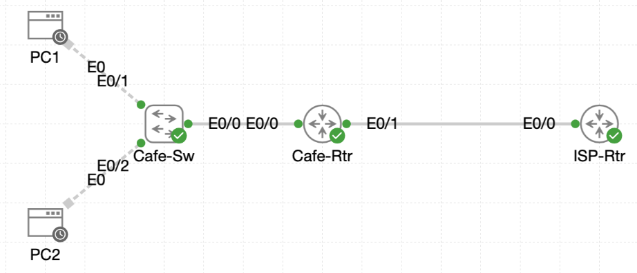

# Lab 024 - Configuring Basic NAT

<p class="back-link">
  <a href="../../Lab-index.html">← Back to Lab Index</a>
</p>

<table>
<tr>
<td colspan="2" valign="top">

<h1>Objective</h1>

<h4>Build a working ISP-side edge so the café network has a reachable upstream path.</h4>

<h4>Configure NAT inside and outside boundaries on <code>Cafe-Rtr</code>.</h4>

<h4>Publish an internal café host using static one-to-one NAT.</h4>

<h4>Replace the static mapping with dynamic NAT using a shared public address pool.</h4>

<h4>Finish with NAT overload so multiple inside hosts can share the WAN interface address.</h4>

</td>
</tr>

<tr>
<td valign="top">

</td>
</tr>
</table>

---

## Scenario

This lab simulates a small café network that needs controlled access to a simulated Internet service.

The café router, `Cafe-Rtr`, already had a LAN-facing interface for internal clients and a WAN-facing interface towards the ISP. The aim was to build the upstream ISP router, confirm external loopback reachability, and then configure several forms of NAT on the café edge.

The lab progressed through three NAT models:

* Static NAT for a single published internal host.
* Dynamic NAT using a pool of public addresses.
* NAT overload, also known as PAT, allowing multiple internal hosts to share one public interface address.

The final working state allowed both café clients to reach simulated Internet targets while sharing the outside address `216.0.5.2`.

---

## Devices Used

* Cafe-Rtr
* ISP-Rtr
* PC1
* PC2
* Simulated public DNS target `1.1.1.1`
* Simulated public DNS target `8.8.8.8`

---

## Addressing Summary

| Device / Object       | Interface    | IP Address / Range              | Purpose                                  |
| --------------------- | ------------ | ------------------------------- | ---------------------------------------- |
| Cafe-Rtr              | Ethernet0/0  | 192.168.1.1/24                  | Café LAN gateway / NAT inside interface  |
| Cafe-Rtr              | Ethernet0/1  | 216.0.5.2/30                    | WAN link to ISP / NAT outside interface  |
| ISP-Rtr               | Ethernet0/0  | 216.0.5.1/30                    | ISP-facing side of WAN link              |
| ISP-Rtr               | Loopback1    | 1.1.1.1/32                      | Simulated public DNS target              |
| ISP-Rtr               | Loopback8    | 8.8.8.8/32                      | Simulated public DNS target              |
| PC1                   | NIC          | 192.168.1.50                    | Internal café client                     |
| PC2                   | NIC          | 192.168.1.51                    | Internal café client                     |
| Static NAT address    | -            | 216.0.5.20                      | Temporary one-to-one public mapping      |
| Dynamic NAT pool      | -            | 216.0.5.50 - 216.0.5.100        | Temporary shared public address pool     |
| Final overload address| Ethernet0/1  | 216.0.5.2                       | Final shared PAT identity                |

---

## Configuration Steps

### Step 1 - Configure the ISP Router Identity and Access Security

The ISP router was prepared with the required hostname, enable secret, console password, VTY password and password encryption.

```bash
enable
configure terminal
hostname ISP-Rtr
enable secret Cisco
line console 0
password Cisco
login
exit
line vty 0 4
password Cisco
login
exit
service password-encryption
```

### Explanation

This gave the ISP router a clear lab identity and applied the standard local access controls required by the scenario.

---

### Step 2 - Configure the ISP WAN Interface

The ISP-facing WAN interface was configured on `ISP-Rtr`.

```bash
interface ethernet0/0
description WAN Link to Cafe-Rtr
ip address 216.0.5.1 255.255.255.252
no shutdown
exit
```

### Verification

```bash
show ip interface brief
```

### Result

`ISP-Rtr` showed the WAN link as operational:

```bash
Ethernet0/0            216.0.5.1       YES manual up                    up
Ethernet0/1            unassigned      YES unset  administratively down down
Ethernet0/2            unassigned      YES unset  administratively down down
Ethernet0/3            unassigned      YES unset  administratively down down
```

### Explanation

This confirmed that the ISP side of the point-to-point link was active on `216.0.5.1/30`.

---

### Step 3 - Verify the Existing Cafe-Rtr WAN and LAN Interfaces

The café router was checked before NAT configuration began.

```bash
show ip interface brief
```

### Result

`Cafe-Rtr` showed:

```bash
Ethernet0/0            192.168.1.1     YES TFTP   up                    up
Ethernet0/1            216.0.5.2       YES TFTP   up                    up
Ethernet0/2            unassigned      YES unset  administratively down down
Ethernet0/3            unassigned      YES unset  administratively down down
```

### Explanation

This confirmed that:

* `Ethernet0/0` was active as the café LAN gateway.
* `Ethernet0/1` was active as the WAN link towards `ISP-Rtr`.
* The unused interfaces remained administratively down.

---

### Step 4 - Configure Cafe-Rtr Default Route

`Cafe-Rtr` needed a default route pointing towards the ISP next-hop.

```bash
configure terminal
ip route 0.0.0.0 0.0.0.0 216.0.5.1
exit
```

### Verification

```bash
show ip route
```

### Result

`Cafe-Rtr` installed the default route:

```bash
Gateway of last resort is 216.0.5.1 to network 0.0.0.0

S*    0.0.0.0/0 [1/0] via 216.0.5.1
```

### Explanation

The `S*` entry shows a static candidate default route. This allowed `Cafe-Rtr` to forward unknown destinations towards the ISP router at `216.0.5.1`.

---

### Step 5 - Configure ISP Loopback Interfaces

The ISP router was given two loopback interfaces to act as simulated public DNS targets.

```bash
configure terminal
interface loopback1
ip address 1.1.1.1 255.255.255.255
exit
interface loopback8
ip address 8.8.8.8 255.255.255.255
exit
```

### Verification

```bash
show ip interface brief
```

### Result

`ISP-Rtr` showed both loopbacks online:

```bash
Loopback1              1.1.1.1         YES manual up                    up
Loopback8              8.8.8.8         YES manual up                    up
```

### Explanation

These loopbacks gave the café network two stable external addresses to test against.

---

### Step 6 - Confirm Cafe-Rtr Can Reach the ISP and Public Loopbacks

Before configuring NAT, basic upstream reachability was tested from `Cafe-Rtr`.

```bash
ping 216.0.5.1
ping 1.1.1.1
ping 8.8.8.8
```

### Result

All three tests succeeded:

```bash
Success rate is 100 percent (5/5)
```

### Explanation

This proved that `Cafe-Rtr` could reach:

* The ISP next-hop address `216.0.5.1`.
* The simulated public target `1.1.1.1`.
* The simulated public target `8.8.8.8`.

At this stage, the router itself had upstream connectivity, but inside hosts still needed NAT to communicate properly beyond the LAN.

---

## Static NAT Configuration

### Step 7 - Define the NAT Inside and Outside Interfaces

The café LAN interface was marked as the NAT inside boundary, and the WAN interface was marked as the NAT outside boundary.

```bash
configure terminal
interface ethernet0/0
ip nat inside
exit

interface ethernet0/1
ip nat outside
exit
end
```

### Verification

```bash
show running-config interface ethernet0/0
show running-config interface ethernet0/1
```

### Result

`Ethernet0/0` showed:

```bash
interface Ethernet0/0
 description Cafe LAN to Cafe-Sw Ethernet0/0
 ip address 192.168.1.1 255.255.255.0
 ip nat inside
```

`Ethernet0/1` showed:

```bash
interface Ethernet0/1
 description WAN toward ISP-Rtr Ethernet0/0
 ip address 216.0.5.2 255.255.255.252
 ip nat outside
```

### Explanation

These commands told `Cafe-Rtr` which side of the router contained private inside addresses and which side represented the outside public network.

---

### Step 8 - Configure Static NAT for PC1

A one-to-one static NAT mapping was configured for `PC1`.

```bash
configure terminal
ip nat inside source static 192.168.1.50 216.0.5.20
exit
```

### Verification

```bash
show ip nat translations
```

### Result

`Cafe-Rtr` displayed the static translation:

```bash
Pro Inside global      Inside local       Outside local      Outside global
--- 216.0.5.20         192.168.1.50       ---                ---
```

### Explanation

This mapping published internal host `192.168.1.50` as the public address `216.0.5.20`.

---

### Step 9 - Test Static NAT from ISP-Rtr

The static mapping was tested from the ISP side.

```bash
ping 216.0.5.20
```

### Result

The ping to the static NAT address succeeded:

```bash
Success rate is 100 percent (5/5)
```

A test directly towards the unpublished inside address for PC2 failed:

```bash
ping 192.168.1.51
```

```bash
Success rate is 0 percent (0/5)
```

### Explanation

This proved that:

* `PC1` was reachable through its static public mapping.
* `PC2` was not directly exposed to the outside network.
* The NAT boundary was working as intended.

---

### Step 10 - Check Static NAT Statistics

The NAT table and statistics were checked.

```bash
show ip nat translations
show ip nat statistics
```

### Result

`Cafe-Rtr` showed:

```bash
Total active translations: 1 (1 static, 0 dynamic; 0 extended)
Outside interfaces:
  Ethernet0/1
Inside interfaces:
  Ethernet0/0
Hits: 10  Misses: 0
```

### Explanation

The output confirmed that the static NAT entry was active and that NAT hits were being recorded.

---

## Dynamic NAT Pool Configuration

### Step 11 - Remove the Static NAT Mapping

The static NAT entry was removed before moving to dynamic NAT.

```bash
configure terminal
no ip nat inside source static 192.168.1.50 216.0.5.20
```

### Explanation

This cleared the one-to-one mapping so that the inside hosts could instead use a shared public pool.

---

### Step 12 - Configure the Dynamic NAT Pool

A standard access list was used to match the café LAN subnet, and a public NAT pool was used for outbound translation.

```bash
ip nat pool Cafe-Public 216.0.5.50 216.0.5.100 netmask 255.255.255.0
access-list 1 permit 192.168.1.0 0.0.0.255
ip nat inside source list 1 pool Cafe-Public
```

### Note

The captured CLI output contains a visually truncated pool command line:

```bash
Cafe-Rtr(config)#$ Cafe-Public 216.0.5.50 216.0.5.100 netmask 255.255.255.0
```

The later successful translations confirm that the pool-based NAT configuration was active.

### Explanation

This configuration allowed internal hosts matching access list `1` to borrow addresses from the `Cafe-Public` range when sending traffic to the outside network.

---

### Step 13 - Generate Traffic from PC1 and PC2

Traffic was generated from both inside clients.

From `PC1`:

```bash
ping 1.1.1.1
```

From `PC2`:

```bash
ping -c 5 8.8.8.8
```

### Result

Both clients successfully reached the simulated public targets.

`PC1` showed:

```bash
8 packets transmitted, 8 packets received, 0% packet loss
```

`PC2` showed:

```bash
5 packets transmitted, 5 packets received, 0% packet loss
```

### Explanation

This proved that both café hosts could use NAT to reach the outside network.

---

### Step 14 - Verify Dynamic NAT Translations

The NAT translation table was checked after the client traffic.

```bash
show ip nat translations
```

### Result

`Cafe-Rtr` displayed separate public pool addresses for each inside host:

```bash
icmp 216.0.5.50:738    192.168.1.50:738   1.1.1.1:738        1.1.1.1:738
--- 216.0.5.50         192.168.1.50       ---                ---
icmp 216.0.5.51:739    192.168.1.51:739   8.8.8.8:739        8.8.8.8:739
--- 216.0.5.51         192.168.1.51       ---                ---
```

### Explanation

This confirmed that:

* `PC1` was translated to `216.0.5.50`.
* `PC2` was translated to `216.0.5.51`.
* Dynamic NAT was allocating separate inside global addresses from the configured pool.

---

## NAT Overload Configuration

### Step 15 - Attempt to Remove the Dynamic NAT Rule

The dynamic NAT rule was removed as preparation for NAT overload.

```bash
configure terminal
no ip nat inside source list 1 pool Cafe-Public
```

### Result

The first removal attempt failed:

```bash
%Dynamic mapping in use, cannot remove
```

### Explanation

The router could not remove the dynamic NAT rule because existing translations were still active.

---

### Step 16 - Clear NAT Translations and Remove the Dynamic Rule

The active translations were cleared and the dynamic mapping was then removed.

```bash
clear ip nat translation *
configure terminal
no ip nat inside source list 1 pool Cafe-Public
```

### Explanation

Clearing the translation table removed the active NAT sessions, allowing the old dynamic NAT rule to be withdrawn.

---

### Step 17 - Shut Down Interfaces Before Applying NAT Overload

The LAN and WAN interfaces were temporarily shut down.

```bash
interface ethernet0/0
shutdown
exit

interface ethernet0/1
shutdown
exit
```

### Result

Both interfaces transitioned down:

```bash
Interface Ethernet0/0, changed state to administratively down
Line protocol on Interface Ethernet0/0, changed state to down

Interface Ethernet0/1, changed state to administratively down
Line protocol on Interface Ethernet0/1, changed state to down
```

### Explanation

This halted new traffic and prevented fresh NAT translations from being created while the NAT mode was changed.

---

### Step 18 - Configure NAT Overload on the WAN Interface

NAT overload was configured using the existing access list and the WAN interface address.

```bash
clear ip nat translation *
configure terminal
ip nat inside source list 1 interface ethernet0/1 overload
```

### Explanation

This told `Cafe-Rtr` to translate matching inside hosts behind the `Ethernet0/1` interface address, `216.0.5.2`, and use port numbers or session identifiers to keep the flows separate.

---

### Step 19 - Restore the LAN and WAN Interfaces

The café LAN and WAN interfaces were brought back online.

```bash
interface ethernet0/0
no shutdown
exit

interface ethernet0/1
no shutdown
exit
```

### Verification

```bash
show ip interface brief
```

### Result

`Cafe-Rtr` showed both interfaces restored:

```bash
Ethernet0/0            192.168.1.1     YES TFTP   up                    up
Ethernet0/1            216.0.5.2       YES TFTP   up                    up
```

### Explanation

The café router was ready to process inside traffic again using NAT overload.

---

### Step 20 - Test NAT Overload from PC1 and PC2

Traffic was generated again from both café hosts.

From `PC1`:

```bash
ping 1.1.1.1
```

From `PC2`:

```bash
ping 8.8.8.8
```

### Result

Both hosts received replies from the simulated Internet targets, confirming that outbound traffic was working after the overload change.

---

### Step 21 - Verify NAT Overload Translations

The NAT table was checked again.

```bash
show ip nat translations
```

### Result

Both inside hosts now shared the `Cafe-Rtr` WAN address `216.0.5.2`:

```bash
icmp 216.0.5.2:1024    192.168.1.50:753   1.1.1.1:753        1.1.1.1:1024
icmp 216.0.5.2:1025    192.168.1.51:753   8.8.8.8:753        8.8.8.8:1025
```

### Explanation

This confirmed that NAT overload was functioning correctly.

Both inside hosts used the same inside global address, `216.0.5.2`, while the router kept their sessions separate using different identifiers:

* `216.0.5.2:1024`
* `216.0.5.2:1025`

---

## Final Verification

### Cafe-Rtr Interface Status

```bash
show ip int brief
```

Final output showed:

```bash
Ethernet0/0            192.168.1.1     YES TFTP   up                    up
Ethernet0/1            216.0.5.2       YES TFTP   up                    up
Ethernet0/2            unassigned      YES unset  administratively down down
Ethernet0/3            unassigned      YES unset  administratively down down
```

### Cafe-Rtr Default Route

```bash
show ip route
```

Final output showed:

```bash
Gateway of last resort is 216.0.5.1 to network 0.0.0.0

S*    0.0.0.0/0 [1/0] via 216.0.5.1
```

### Cafe-Rtr NAT Configuration

```bash
show running-config | include ip nat
```

Final output showed:

```bash
ip nat inside
ip nat outside
ip nat inside source list 1 interface Ethernet0/1 overload
```

### Cafe-Rtr NAT Statistics

```bash
show ip nat statistics
```

Final output showed:

```bash
Total active translations: 2 (0 static, 2 dynamic; 2 extended)
Outside interfaces:
  Ethernet0/1
Inside interfaces:
  Ethernet0/0
Hits: 1304  Misses: 0
Dynamic overload mapping configured: 1
```

### ISP-Rtr Final Status

```bash
show ip int brief
```

Final output showed:

```bash
Ethernet0/0            216.0.5.1       YES manual up                    up
Loopback1              1.1.1.1         YES manual up                    up
Loopback8              8.8.8.8         YES manual up                    up
```

The ISP router could also reach the café WAN address:

```bash
ping 216.0.5.2
```

```bash
Success rate is 100 percent (5/5)
```

---

## Troubleshooting

### Issue 1 - Show command entered from configuration mode

#### Problem

The following verification command was entered while still in global configuration mode:

```bash
show ip interface brief
```

#### Diagnosis

The CLI rejected the command:

```bash
% Invalid input detected at '^' marker.
```

#### Fix

Configuration mode was exited before running the command again:

```bash
exit
show ip interface brief
```

---

### Issue 2 - Show route command entered from configuration mode

#### Problem

The following command was entered from configuration mode on `Cafe-Rtr`:

```bash
show ip route
```

#### Diagnosis

The CLI rejected the command because it was not entered from privileged EXEC mode:

```bash
% Invalid input detected at '^' marker.
```

#### Fix

The router was returned to privileged EXEC mode and the command was run successfully:

```bash
exit
show ip route
```

---

### Issue 3 - Dynamic NAT mapping could not be removed while active

#### Problem

The dynamic NAT rule could not be removed at first:

```bash
no ip nat inside source list 1 pool Cafe-Public
```

The router returned:

```bash
%Dynamic mapping in use, cannot remove
```

#### Diagnosis

Active NAT translations still existed in the translation table, so the router protected the mapping from being removed.

#### Fix

The active NAT translations were cleared:

```bash
clear ip nat translation *
```

The dynamic NAT rule was then removed successfully.

---

### Issue 4 - Captured NAT pool command appeared truncated

#### Problem

The raw CLI evidence showed a truncated command line when the dynamic NAT pool was being created:

```bash
Cafe-Rtr(config)#$ Cafe-Public 216.0.5.50 216.0.5.100 netmask 255.255.255.0
```

#### Diagnosis

The later translation table showed successful use of `216.0.5.50` and `216.0.5.51`, proving the pool-based NAT stage was active.

#### Fix / Outcome

No functional correction was required in the final state. The issue was documented as a capture artefact or terminal line display problem, while the working NAT evidence was preserved.

---

## Key Learning Points

* NAT requires clear inside and outside interface boundaries.
* `ip nat inside` marks the private side of the translation boundary.
* `ip nat outside` marks the public or upstream side of the translation boundary.
* Static NAT creates a fixed one-to-one mapping between an inside local address and an inside global address.
* Dynamic NAT allows inside hosts to borrow addresses from a public pool.
* NAT overload allows multiple inside hosts to share one public address.
* PAT separates sessions by using unique port numbers or identifiers.
* Active dynamic translations may need to be cleared before a NAT rule can be removed.
* A default route is needed so the edge router can forward unknown destinations upstream.
* `show ip nat translations` proves which inside hosts are being translated.
* `show ip nat statistics` confirms interface roles, hit counters and overload status.

---

## Completion Check

The lab was completed successfully.

* `ISP-Rtr` was configured with the correct hostname and access security.
* `ISP-Rtr` Ethernet0/0 was configured as `216.0.5.1/30` and brought up.
* `ISP-Rtr` loopbacks `1.1.1.1/32` and `8.8.8.8/32` were created and verified.
* `Cafe-Rtr` had working LAN and WAN interfaces.
* `Cafe-Rtr` used `216.0.5.1` as its default route.
* `Cafe-Rtr` successfully reached the ISP gateway and public loopbacks.
* `Cafe-Rtr` Ethernet0/0 was configured as the NAT inside interface.
* `Cafe-Rtr` Ethernet0/1 was configured as the NAT outside interface.
* Static NAT successfully mapped `192.168.1.50` to `216.0.5.20`.
* The static NAT test from `ISP-Rtr` to `216.0.5.20` succeeded.
* Direct access to unpublished host `192.168.1.51` from the ISP side failed, as expected.
* Dynamic NAT successfully translated `PC1` and `PC2` to separate public pool addresses.
* NAT overload was configured using access list `1` and interface `Ethernet0/1`.
* Final translations showed `PC1` and `PC2` sharing `216.0.5.2` with unique identifiers.
* Final NAT statistics confirmed overload was active.
