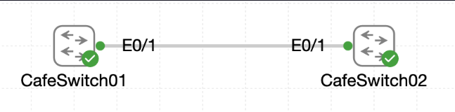

# Lab 025 - Creating and Naming VLANs

<p class="back-link">
  <a href="../../Lab-index.html">← Back to Lab Index</a>
</p>

<table>
<tr>
<td colspan="2" valign="top">

<h1>Objective</h1>

<h4>Inspect the default VLAN footprint on the café access switch before making changes.</h4>

<h4>Create dedicated VLANs for administrative devices and patron-facing devices.</h4>

<h4>Apply clear VLAN names that match the Castle Rysen security segmentation requirements.</h4>

<h4>Mirror the VLAN definitions across both café switches so future trunking can carry consistent VLANs.</h4>

<h4>Move the designated patron access ports on <code>CafeSwitch01</code> into the correct VLAN.</h4>

</td>
</tr>

<tr>
<td valign="top">

</td>
</tr>
</table>

---

## Scenario

This lab simulates the first stage of access-layer segmentation for the district café network.

Initially, all active switch ports were still operating in the default VLAN. Castle Rysen required the café switch estate to be split into separate security zones so that administrative devices and patron-facing devices would no longer share the same broadcast domain.

The goal was to create matching VLAN definitions on both café switches, then assign the patron-facing ports on `CafeSwitch01` to the correct VLAN. This prepares the access layer for later trunking, inter-switch VLAN propagation and eventual routed connectivity between VLANs.

---

## Devices Used

* CafeSwitch01
* CafeSwitch02
* Patron-facing access devices
* Administrative device segment

---

## VLAN Summary

| VLAN ID | VLAN Name        | Purpose                                  |
| ------: | ---------------- | ---------------------------------------- |
|       1 | default          | Legacy/default switch VLAN               |
|      10 | ADMIN_DEVICES    | Administrative device segment            |
|      20 | PATRON_DEVICES   | Café patron-facing access segment        |
|    1002 | fddi-default     | Reserved legacy VLAN                     |
|    1003 | token-ring-default | Reserved legacy VLAN                   |
|    1004 | fddinet-default  | Reserved legacy VLAN                     |
|    1005 | trnet-default    | Reserved legacy VLAN                     |

---

## Port Assignment Summary

| Switch       | Interfaces                                      | Final VLAN | Purpose                    |
| ------------ | ----------------------------------------------- | ---------: | -------------------------- |
| CafeSwitch01 | Ethernet2/2, Ethernet2/3                        |         20 | Patron-facing access ports |
| CafeSwitch01 | Ethernet3/0, Ethernet3/1, Ethernet3/2, Ethernet3/3 |      20 | Patron-facing access ports |
| CafeSwitch01 | Remaining access ports                          |          1 | Default / unchanged ports  |
| CafeSwitch02 | All access ports                                |          1 | Default / unchanged ports  |

---

## Configuration Steps

### Step 1 - Inspect the Default VLAN Footprint on CafeSwitch01

The first task was to check the existing VLAN table before making changes.

```bash
enable
show vlan brief
```

### Result

`CafeSwitch01` initially showed all active switch ports assigned to VLAN 1:

```bash
VLAN Name                             Status    Ports
---- -------------------------------- --------- -------------------------------
1    default                          active    Et0/0, Et0/1, Et0/2, Et0/3
                                                Et1/0, Et1/1, Et1/2, Et1/3
                                                Et2/0, Et2/1, Et2/2, Et2/3
                                                Et3/0, Et3/1, Et3/2, Et3/3
1002 fddi-default                     act/unsup 
1003 token-ring-default               act/unsup 
1004 fddinet-default                  act/unsup 
1005 trnet-default                    act/unsup 
```

### Explanation

This confirmed the baseline state of the switch.

Before segmentation, every usable Ethernet port was still in VLAN 1. This means all connected devices would share the same Layer 2 broadcast domain unless the ports were moved into separate VLANs.

---

### Step 2 - Create Security VLANs on CafeSwitch01

`CafeSwitch01` was then configured with two new VLANs:

* VLAN 10 for administrative devices.
* VLAN 20 for patron-facing devices.

```bash
configure terminal
vlan 10
name ADMIN_DEVICES
exit
vlan 20
name PATRON_DEVICES
end
```

### Verification

```bash
show vlan brief
```

### Result

`CafeSwitch01` showed both new VLANs in the VLAN database:

```bash
10   ADMIN_DEVICES                    active    
20   PATRON_DEVICES                   active    
```

### Explanation

The VLANs now existed on `CafeSwitch01`, but no ports had been moved yet.

At this stage, VLAN 10 and VLAN 20 were available as separate Layer 2 containers. However, the switch would not actually place any connected device into those VLANs until access ports were assigned to them.

---

### Step 3 - Mirror VLAN Definitions on CafeSwitch02

The same VLAN structure was created on `CafeSwitch02`.

```bash
enable
configure terminal
vlan 10
name ADMIN_DEVICES
exit
vlan 20
name PATRON_DEVICES
end
```

### Verification

```bash
show vlan brief
```

### Result

`CafeSwitch02` showed the same VLAN names and VLAN IDs:

```bash
10   ADMIN_DEVICES                    active    
20   PATRON_DEVICES                   active    
```

### Explanation

This ensured both café switches used the same VLAN numbering and naming scheme.

Matching VLAN definitions are important before introducing trunk links. A trunk can carry tagged VLAN traffic between switches, but the VLANs still need to be understood consistently on each switch.

---

### Step 4 - Assign Patron Ports on CafeSwitch01

The patron-facing access ports on `CafeSwitch01` were selected as a range.

```bash
configure terminal
interface range ethernet2/2 - 3, ethernet3/0 - 3
switchport mode access
switchport access vlan 20
end
```

### Explanation

The command:

```bash
interface range ethernet2/2 - 3, ethernet3/0 - 3
```

selected the following interfaces together:

* `Ethernet2/2`
* `Ethernet2/3`
* `Ethernet3/0`
* `Ethernet3/1`
* `Ethernet3/2`
* `Ethernet3/3`

The command:

```bash
switchport mode access
```

forced the selected interfaces to behave as access ports.

The command:

```bash
switchport access vlan 20
```

placed those access ports into VLAN 20, the `PATRON_DEVICES` VLAN.

---

## Verification

### Final VLAN Table on CafeSwitch01

```bash
show vlan brief
```

### Result

`CafeSwitch01` showed the selected patron ports assigned to VLAN 20:

```bash
VLAN Name                             Status    Ports
---- -------------------------------- --------- -------------------------------
1    default                          active    Et0/0, Et0/1, Et0/2, Et0/3
                                                Et1/0, Et1/1, Et1/2, Et1/3
                                                Et2/0, Et2/1
10   ADMIN_DEVICES                    active    
20   PATRON_DEVICES                   active    Et2/2, Et2/3, Et3/0, Et3/1
                                                Et3/2, Et3/3
1002 fddi-default                     act/unsup 
1003 token-ring-default               act/unsup 
1004 fddinet-default                  act/unsup 
1005 trnet-default                    act/unsup 
```

### Explanation

This confirmed that the required patron-facing interfaces had been moved out of the default VLAN and into VLAN 20.

The administrative VLAN, VLAN 10, was also present and ready for later port assignments.

---

### Final VLAN Table on CafeSwitch02

```bash
show vlan brief
```

### Result

`CafeSwitch02` showed both required VLANs:

```bash
10   ADMIN_DEVICES                    active    
20   PATRON_DEVICES                   active    
```

### Explanation

This confirmed that `CafeSwitch02` had matching VLAN definitions, even though no ports had yet been assigned to VLAN 10 or VLAN 20 on that switch.

---

## Troubleshooting

### Issue 1 - Default VLAN still contained most access ports

#### Problem

After VLAN 10 and VLAN 20 were created, most switch ports remained in VLAN 1.

#### Diagnosis

Creating a VLAN does not automatically move any switch ports into that VLAN. The VLAN database and the interface assignments are separate parts of the configuration.

#### Fix

The required patron interfaces were manually configured as access ports and assigned to VLAN 20:

```bash
interface range ethernet2/2 - 3, ethernet3/0 - 3
switchport mode access
switchport access vlan 20
```

---

### Issue 2 - VLAN 10 had no access ports assigned

#### Problem

VLAN 10 appeared in the VLAN table but had no ports assigned.

```bash
10   ADMIN_DEVICES                    active    
```

#### Diagnosis

This was expected for the scope of this lab. The task was to create and name the administrative VLAN, but the only explicit port assignment requirement was for the patron-facing access ports on `CafeSwitch01`.

#### Fix / Outcome

No correction was required. VLAN 10 was left available for later administrative device assignments.

---

## Key Learning Points

* VLANs split a switch into separate Layer 2 broadcast domains.
* VLAN 1 is the default VLAN on Cisco switches.
* Creating a VLAN does not automatically assign any ports to it.
* VLAN names make the switch configuration easier to read and audit.
* VLAN IDs and names should be kept consistent across switches.
* Access ports carry traffic for one VLAN only.
* `switchport mode access` explicitly configures a port as an access port.
* `switchport access vlan 20` assigns an access port to VLAN 20.
* `interface range` allows multiple ports to be configured with the same commands.
* `show vlan brief` is the main verification command for VLAN membership.

---

## Completion Check

The lab was completed successfully.

* The default VLAN footprint was captured on `CafeSwitch01`.
* `CafeSwitch01` was configured with VLAN 10 named `ADMIN_DEVICES`.
* `CafeSwitch01` was configured with VLAN 20 named `PATRON_DEVICES`.
* `CafeSwitch02` was configured with matching VLAN 10 and VLAN 20 definitions.
* The patron-facing ports on `CafeSwitch01` were configured as access ports.
* `Ethernet2/2` and `Ethernet2/3` were assigned to VLAN 20.
* `Ethernet3/0` through `Ethernet3/3` were assigned to VLAN 20.
* `show vlan brief` confirmed that VLAN 20 contained the required patron ports.
* Both switches retained the default VLAN for unchanged legacy ports.
* The access layer is now ready for later trunk configuration and inter-VLAN routing labs.
