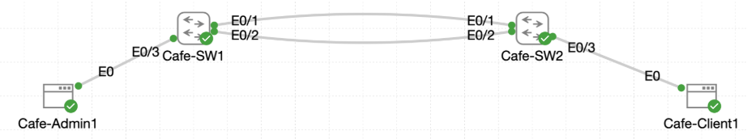

# Lab 026 - Using Trunks to Extend VLANs

<p class="back-link">
  <a href="../../Lab-index.html">← Back to Lab Index</a>
</p>

<table>
<tr>
<td colspan="2" valign="top">

<h1>Objective</h1>

<h4>Configure 802.1Q trunk links between <code>Cafe-SW1</code> and <code>Cafe-SW2</code>.</h4>

<h4>Create matching VLAN definitions on both switches so VLAN traffic can span the inter-switch links.</h4>

<h4>Place workstation access ports into the correct VLANs and verify same-VLAN connectivity across the trunk.</h4>

<h4>Move a workstation into a separate VLAN and prove that Layer 2 segmentation prevents communication without routing.</h4>

<h4>Use trunk and VLAN verification commands to confirm the final switch state.</h4>

</td>
</tr>

<tr>
<td valign="top">

</td>
</tr>
</table>

---

## Scenario

This lab simulates a small café access-layer network where two switches already exist, but VLANs do not yet extend properly between them.

The goal was to configure trunk links between `Cafe-SW1` and `Cafe-SW2` so that VLAN 10 and VLAN 20 could pass across the same physical inter-switch cabling while remaining logically separate.

The lab then tested two important behaviours:

* Hosts in the same VLAN can communicate across a trunk.
* Hosts in different VLANs cannot communicate unless inter-VLAN routing is provided.

This made the lab a practical demonstration of VLAN extension, access port assignment, trunk verification and Layer 2 segmentation.

---

## Devices Used

* Cafe-SW1
* Cafe-SW2
* Cafe-Admin1
* Cafe-Client1

---

## VLAN Summary

| VLAN ID | VLAN Name        | Purpose                  |
| ------: | ---------------- | ------------------------ |
| 1       | default          | Existing default VLAN    |
| 10      | ADMIN_DEVICES    | Administrative devices   |
| 20      | PATRON_DEVICES   | Patron / client devices  |

---

## Addressing Summary

| Device       | Interface | IP Address   | Subnet Mask       | Default Gateway | Purpose                         |
| ------------ | --------- | ------------ | ----------------- | --------------- | ------------------------------- |
| Cafe-Admin1  | eth0      | 10.0.18.2    | 255.255.255.224   | 10.0.18.1       | Admin workstation in VLAN 10    |
| Cafe-Client1 | eth0      | 10.0.18.3    | 255.255.255.224   | 10.0.18.1       | Initial VLAN 10 test address    |
| Cafe-Client1 | eth0      | 10.0.18.34   | 255.255.255.224   | 10.0.18.33      | Final VLAN 20 test address      |

---

## Interface Summary

| Device    | Interface         | Final Role                        |
| --------- | ----------------- | --------------------------------- |
| Cafe-SW1  | Ethernet0/1       | 802.1Q trunk to Cafe-SW2          |
| Cafe-SW1  | Ethernet0/2       | 802.1Q trunk to Cafe-SW2          |
| Cafe-SW1  | Ethernet0/3       | Access port in VLAN 10            |
| Cafe-SW2  | Ethernet0/1       | 802.1Q trunk to Cafe-SW1          |
| Cafe-SW2  | Ethernet0/2       | 802.1Q trunk to Cafe-SW1          |
| Cafe-SW2  | Ethernet0/3       | Access port in VLAN 20            |

---

## Configuration Steps

### Step 1 - Create VLANs and Configure Trunks on Cafe-SW1

The first task was to create the required VLANs on Cafe-SW1 and configure the uplink interfaces as trunks.

```bash
enable
configure terminal
vlan 10
name ADMIN_DEVICES
exit
vlan 20
name PATRON_DEVICES
exit
interface range ethernet0/1-2
switchport trunk encapsulation dot1q
switchport mode trunk
end
```

### Verification

```bash
show interface trunk
```

### Result

Cafe-SW1 showed both uplinks trunking:

```bash
Port           Mode             Encapsulation  Status        Native vlan
Et0/1          on               802.1q         trunking      1
Et0/2          on               802.1q         trunking      1
```

The active VLAN section showed:

```bash
Port           Vlans allowed and active in management domain
Et0/1          1,10,20
Et0/2          1,10,20
```

### Explanation

This confirmed that:

* VLAN 10 and VLAN 20 existed on Cafe-SW1.
* Ethernet0/1 and Ethernet0/2 were operating as 802.1Q trunks.
* The trunks were capable of carrying VLAN 10 and VLAN 20 traffic.

At this stage, the spanning-tree forwarding section only showed VLAN 1 forwarding on Cafe-SW1, but the trunks were operational and the required VLANs were active in the management domain.

---

### Step 2 - Create Matching VLANs and Trunks on Cafe-SW2

The same VLAN and trunk structure was then configured on Cafe-SW2.

```bash
enable
configure terminal
vlan 10
name ADMIN_DEVICES
exit
vlan 20
name PATRON_DEVICES
exit
interface range ethernet 0/1-2
switchport trunk encapsulation dot1q
switchport mode trunk
end
```

### Verification

```bash
show interface trunk
```

### Result

Cafe-SW2 also showed both uplinks trunking:

```bash
Port           Mode             Encapsulation  Status        Native vlan
Et0/1          on               802.1q         trunking      1
Et0/2          on               802.1q         trunking      1
```

The active VLAN section showed:

```bash
Port           Vlans allowed and active in management domain
Et0/1          1,10,20
Et0/2          1,10,20
```

The spanning-tree forwarding section showed:

```bash
Port           Vlans in spanning tree forwarding state and not pruned
Et0/1          1,10,20
Et0/2          none
```

### Explanation

This confirmed that Cafe-SW2 matched the VLAN and trunk design used on Cafe-SW1.

The `none` result for Ethernet0/2 in the forwarding section is consistent with a redundant trunk being blocked by spanning tree. The link was still trunking, but spanning tree prevented it from forwarding user VLAN traffic to avoid a Layer 2 loop.

---

### Step 3 - Assign Cafe-Admin1 to VLAN 10 on Cafe-SW1

Cafe-Admin1 was connected to Ethernet0/3 on Cafe-SW1, so that switchport was placed into VLAN 10.

```bash
configure terminal
interface ethernet0/3
switchport mode access
switchport access vlan 10
end
```

### Verification

```bash
show vlan brief
```

### Result

Cafe-SW1 showed Ethernet0/3 in VLAN 10:

```bash
VLAN Name                             Status    Ports
---- -------------------------------- --------- -------------------------------
1    default                          active    Et0/0
10   ADMIN_DEVICES                    active    Et0/3
20   PATRON_DEVICES                   active
```

### Explanation

This confirmed that Cafe-Admin1 was now attached to the administrative VLAN.

---

### Step 4 - Initially Assign Cafe-Client1 to VLAN 10 on Cafe-SW2

Cafe-Client1 was initially placed into VLAN 10 so that same-VLAN connectivity could be tested across the trunk.

```bash
configure terminal
interface ethernet0/3
switchport mode access
switchport access vlan 10
end
```

### Verification

```bash
show vlan brief
```

### Result

Cafe-SW2 showed Ethernet0/3 in VLAN 10:

```bash
VLAN Name                             Status    Ports
---- -------------------------------- --------- -------------------------------
1    default                          active    Et0/0
10   ADMIN_DEVICES                    active    Et0/3
20   PATRON_DEVICES                   active
```

### Explanation

At this point, both workstations were in VLAN 10, even though they were connected to different switches. This set up the first connectivity test across the trunk.

---

## Same-VLAN Connectivity Testing

### Step 5 - Configure Cafe-Admin1 IP Settings

Cafe-Admin1 was configured with an address in the VLAN 10 subnet.

```bash
sudo ifconfig eth0 10.0.18.2 netmask 255.255.255.224 up
sudo route del default 2>/dev/null
sudo route add default gw 10.0.18.1 eth0
```

### Step 6 - Configure Cafe-Client1 IP Settings for VLAN 10

Cafe-Client1 was also given a VLAN 10 address.

```bash
sudo ifconfig eth0 10.0.18.3 netmask 255.255.255.224 up
sudo route del default 2>/dev/null
sudo route add default gw 10.0.18.1 eth0
```

### Test - Cafe-Admin1 to Cafe-Client1

From Cafe-Admin1:

```bash
ping -c 5 10.0.18.3
```

### Result

```bash
5 packets transmitted, 5 packets received, 0% packet loss
```

### Explanation

The ping succeeded because both hosts were in VLAN 10.

This proved that VLAN 10 was successfully extended across the inter-switch trunk links.

---

## VLAN Segmentation Testing

### Step 7 - Move Cafe-Client1 into VLAN 20

Cafe-Client1 was then moved from VLAN 10 into VLAN 20.

```bash
configure terminal
interface ethernet0/3
switchport access vlan 20
end
```

### Verification

```bash
show vlan brief
```

### Result

Cafe-SW2 showed Ethernet0/3 in VLAN 20:

```bash
VLAN Name                             Status    Ports
---- -------------------------------- --------- -------------------------------
1    default                          active    Et0/0
10   ADMIN_DEVICES                    active
20   PATRON_DEVICES                   active    Et0/3
```

### Explanation

This moved Cafe-Client1 into the patron VLAN while Cafe-Admin1 remained in the admin VLAN.

---

### Step 8 - Readdress Cafe-Client1 for VLAN 20

Cafe-Client1 was then given an address in the VLAN 20 subnet.

```bash
sudo ifconfig eth0 10.0.18.34 netmask 255.255.255.224 up
sudo route del default 2>/dev/null
sudo route add default gw 10.0.18.33 eth0
```

### Explanation

The new IP settings placed Cafe-Client1 into the `10.0.18.32/27` subnet.

Cafe-Admin1 remained in the `10.0.18.0/27` subnet.

No Layer 3 routing was configured between the two VLANs, so the two hosts should no longer be able to communicate.

---

### Step 9 - Test Admin VLAN to Patron VLAN Connectivity

From Cafe-Admin1:

```bash
ping -c 5 10.0.18.34
```

### Result

```bash
5 packets transmitted, 0 packets received, 100% packet loss
```

### Explanation

The failed ping proved that the VLAN boundary was working.

Although the switches were connected by trunks, VLAN 10 and VLAN 20 remained separate Layer 2 broadcast domains. Because no router or Layer 3 switch interface was configured to route between those VLANs, traffic from Cafe-Admin1 could not reach Cafe-Client1 after it moved into VLAN 20.

---

## Final Verification

### Cafe-SW1 Trunk Verification

```bash
show interface trunk
```

Cafe-SW1 showed:

```bash
Port           Mode             Encapsulation  Status        Native vlan
Et0/1          on               802.1q         trunking      1
Et0/2          on               802.1q         trunking      1
```

The active VLANs were:

```bash
Port           Vlans allowed and active in management domain
Et0/1          1,10,20
Et0/2          1,10,20
```

The forwarding section showed:

```bash
Port           Vlans in spanning tree forwarding state and not pruned
Et0/1          1,10,20
Et0/2          1,10,20
```

### Cafe-SW1 VLAN Verification

```bash
show vlan brief
```

Cafe-SW1 showed:

```bash
VLAN Name                             Status    Ports
---- -------------------------------- --------- -------------------------------
1    default                          active    Et0/0
10   ADMIN_DEVICES                    active    Et0/3
20   PATRON_DEVICES                   active
```

### Cafe-SW2 Trunk Verification

```bash
show interface trunk
```

Cafe-SW2 showed:

```bash
Port           Mode             Encapsulation  Status        Native vlan
Et0/1          on               802.1q         trunking      1
Et0/2          on               802.1q         trunking      1
```

The active VLANs were:

```bash
Port           Vlans allowed and active in management domain
Et0/1          1,10,20
Et0/2          1,10,20
```

The forwarding section showed:

```bash
Port           Vlans in spanning tree forwarding state and not pruned
Et0/1          1,10,20
Et0/2          none
```

### Cafe-SW2 VLAN Verification

```bash
show vlan brief
```

Cafe-SW2 showed:

```bash
VLAN Name                             Status    Ports
---- -------------------------------- --------- -------------------------------
1    default                          active    Et0/0
10   ADMIN_DEVICES                    active
20   PATRON_DEVICES                   active    Et0/3
```

---

## Troubleshooting

### Issue 1 - Partial command entry while naming VLAN 10

#### Problem

While configuring VLAN 10 on Cafe-SW1, several partial commands were entered before the final VLAN name was applied.

```bash
name
name
name AD<
name ADMIN_DEVICES
```

#### Diagnosis

The switch accepted the final complete command:

```bash
name ADMIN_DEVICES
```

The later `show vlan brief` output confirmed that VLAN 10 was correctly named.

#### Fix

No further correction was needed once the complete VLAN name command was entered.

---

### Issue 2 - Trunk links briefly dropped during mode change

#### Problem

When the interfaces were converted into trunks on Cafe-SW1, Ethernet0/1 and Ethernet0/2 briefly dropped and returned to service.

```bash
%LINEPROTO-5-UPDOWN: Line protocol on Interface Ethernet0/1, changed state to down
%LINEPROTO-5-UPDOWN: Line protocol on Interface Ethernet0/2, changed state to down
%LINEPROTO-5-UPDOWN: Line protocol on Interface Ethernet0/1, changed state to up
%LINEPROTO-5-UPDOWN: Line protocol on Interface Ethernet0/2, changed state to up
```

#### Diagnosis

This was expected behaviour while trunk negotiation and interface state refreshed after the switchport mode change.

#### Fix

No fix was required. Both links returned to `up` and later showed as trunking.

---

### Issue 3 - Redundant trunk blocked by spanning tree on Cafe-SW2

#### Problem

Cafe-SW2 showed Ethernet0/2 as trunking, but the spanning-tree forwarding section listed:

```bash
Et0/2          none
```

#### Diagnosis

This indicates that the trunk existed but was not forwarding VLAN traffic due to spanning-tree behaviour. With two inter-switch links present, spanning tree can block one path to prevent a Layer 2 loop.

#### Fix / Outcome

No correction was required for this lab. The result was documented as expected redundant-link behaviour.

---

## Key Learning Points

* VLANs must exist on both switches before they can be carried meaningfully across a trunk.
* A trunk link can carry traffic for multiple VLANs over one physical connection.
* `switchport trunk encapsulation dot1q` sets the trunk tagging method.
* `switchport mode trunk` forces an interface to operate as a trunk.
* `show interface trunk` confirms trunk status, encapsulation, native VLAN and active VLANs.
* Access ports belong to one VLAN at a time.
* Hosts in the same VLAN can communicate across a trunk if they share compatible IP addressing.
* Hosts in different VLANs cannot communicate without inter-VLAN routing.
* A failed ping can be a successful test when the objective is to prove segmentation.
* Spanning tree may block one of two redundant trunk links to prevent a switching loop.

---

## Completion Check

The lab was completed successfully.

* VLAN 10 `ADMIN_DEVICES` was created on Cafe-SW1 and Cafe-SW2.
* VLAN 20 `PATRON_DEVICES` was created on Cafe-SW1 and Cafe-SW2.
* Ethernet0/1 and Ethernet0/2 were configured as 802.1Q trunks on both switches.
* `show interface trunk` confirmed the trunks were operational.
* VLANs 10 and 20 appeared as allowed and active on the trunk links.
* Cafe-Admin1 was placed into VLAN 10 through Cafe-SW1 Ethernet0/3.
* Cafe-Client1 was initially placed into VLAN 10 through Cafe-SW2 Ethernet0/3.
* Cafe-Admin1 successfully pinged Cafe-Client1 while both hosts were in VLAN 10.
* Cafe-Client1 was then moved to VLAN 20.
* Cafe-Client1 was readdressed into the `10.0.18.32/27` subnet.
* Cafe-Admin1 could no longer ping Cafe-Client1 after the VLAN move.
* Final verification confirmed Cafe-SW1 Ethernet0/3 in VLAN 10 and Cafe-SW2 Ethernet0/3 in VLAN 20.
