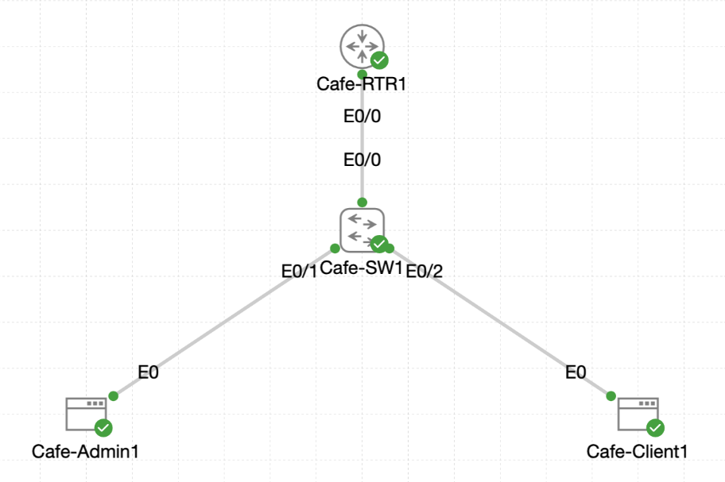

# Lab 027 - Routing Between VLANs

<p class="back-link">
  <a href="../../Lab-index.html">← Back to Lab Index</a>
</p>

<table>
<tr>
<td colspan="2" valign="top">

<h1>Objective</h1>

<h4>Convert the switch-to-router uplink between <code>Cafe-SW1</code> and <code>Cafe-RTR1</code> into an 802.1Q trunk.</h4>

<h4>Replace a single physical router interface address with VLAN-specific router-on-a-stick subinterfaces.</h4>

<h4>Configure routed gateway addresses for VLAN 10 and VLAN 20 using separate /27 subnets.</h4>

<h4>Build separate DHCP pools for the admin and patron VLANs.</h4>

<h4>Verify that clients receive the correct dynamic addressing and are prepared for inter-VLAN routing through <code>Cafe-RTR1</code>.</h4>

</td>
</tr>

<tr>
<td valign="top">

</td>
</tr>
</table>

---

## Scenario

This lab extends the previous VLAN work by adding Layer 3 routing between the café VLANs.

The switches already contain separate VLANs for admin and patron devices. The next task was to convert the link between `Cafe-SW1` and `Cafe-RTR1` into a tagged trunk and then configure `Cafe-RTR1` as a router-on-a-stick gateway.

Instead of using one IP address directly on the physical router interface, the router was rebuilt with two logical subinterfaces:

* `Ethernet0/0.10` for VLAN 10.
* `Ethernet0/0.20` for VLAN 20.

Each subinterface acts as the default gateway for its VLAN. Separate DHCP pools were then created so hosts in each VLAN could automatically receive the correct IP address, subnet mask, default gateway and DNS server.

The supplied raw evidence confirms the trunk configuration, subinterface configuration, DHCP pool creation and successful DHCP leases for both clients. The final lab objective was inter-VLAN reachability through the router-on-a-stick design.

---

## Devices Used

* Cafe-SW1
* Cafe-RTR1
* Cafe-Admin1
* Cafe-Client1

---

## VLAN Summary

| VLAN ID | VLAN Name | Purpose                 |
| ------: | --------- | ----------------------- |
| 10      | ADMIN     | Admin workstation VLAN  |
| 20      | PATRON    | Patron workstation VLAN |

---

## Addressing Summary

| Device / Function | Interface        | IP Address  | Subnet Mask       | Purpose                        |
| ----------------- | ---------------- | ----------- | ----------------- | ------------------------------ |
| Cafe-RTR1         | Ethernet0/0      | Unassigned  | -                 | Physical trunk parent          |
| Cafe-RTR1         | Ethernet0/0.10   | 10.0.18.1   | 255.255.255.224   | VLAN 10 default gateway        |
| Cafe-RTR1         | Ethernet0/0.20   | 10.0.18.33  | 255.255.255.224   | VLAN 20 default gateway        |
| Cafe-Admin1       | eth0             | 10.0.18.2   | 255.255.255.224   | DHCP client in VLAN 10         |
| Cafe-Client1      | eth0             | 10.0.18.34  | 255.255.255.224   | DHCP client in VLAN 20         |

---

## DHCP Summary

| DHCP Pool | Network        | Subnet Mask       | Default Gateway | DNS Server |
| --------- | -------------- | ----------------- | --------------- | ---------- |
| ADMIN-10  | 10.0.18.0      | 255.255.255.224   | 10.0.18.1       | 1.1.1.1    |
| PATRON-20 | 10.0.18.32     | 255.255.255.224   | 10.0.18.33      | 1.1.1.1    |

---

## Interface Summary

| Device    | Interface      | Final Role                                  |
| --------- | -------------- | ------------------------------------------- |
| Cafe-SW1  | Ethernet0/0    | 802.1Q trunk to Cafe-RTR1                   |
| Cafe-RTR1 | Ethernet0/0    | Physical parent interface, no IP address    |
| Cafe-RTR1 | Ethernet0/0.10 | VLAN 10 routed subinterface                 |
| Cafe-RTR1 | Ethernet0/0.20 | VLAN 20 routed subinterface                 |

---

## Configuration Steps

### Step 1 - Configure the Switch-to-Router Link as a Trunk

The first task was to convert `Cafe-SW1` Ethernet0/0 into a trunk so that VLAN-tagged traffic could pass between the switch and the router.

```bash
enable
configure terminal
interface ethernet0/0
switchport trunk encapsulation dot1q
switchport mode trunk
end
```

### Verification

```bash
show interface trunk
```

### Initial Result

Cafe-SW1 showed Ethernet0/0 trunking:

```bash
Port           Mode             Encapsulation  Status        Native vlan
Et0/0          on               802.1q         trunking      1
```

The trunk allowed all VLANs:

```bash
Port           Vlans allowed on trunk
Et0/0          1-4094
```

At this stage the forwarding section initially showed:

```bash
Port           Vlans in spanning tree forwarding state and not pruned
Et0/0          none
```

### Explanation

The switchport had been successfully converted into an 802.1Q trunk.

The `none` result in the forwarding section was not treated as a final failure because the router side had not yet been fully rebuilt with VLAN-aware subinterfaces. The lab instructions specifically allowed the trunk to be checked again after router tagging was ready.

---

### Step 2 - Create VLAN 10 and VLAN 20 on Cafe-SW1

The required VLANs were then confirmed and named on Cafe-SW1.

```bash
configure terminal
vlan 10
name ADMIN
exit
vlan 20
name PATRON
end
```

### Verification

```bash
show interface trunk
```

### Result

After the VLANs were present, Cafe-SW1 showed VLANs 10 and 20 active and forwarding on Ethernet0/0:

```bash
Port           Vlans allowed and active in management domain
Et0/0          1,10,20
```

```bash
Port           Vlans in spanning tree forwarding state and not pruned
Et0/0          1,10,20
```

### Explanation

This confirmed that the switch trunk was now ready to carry VLAN 10 and VLAN 20 traffic towards the router.

---

### Step 3 - Inspect the Existing Router Interface Configuration

Cafe-RTR1 initially still had a single IP address directly assigned to Ethernet0/0.

```bash
show ip interface brief
```

### Result

```bash
Interface              IP-Address      OK? Method Status                Protocol
Ethernet0/0            10.0.18.1       YES TFTP   up                    up
Ethernet0/1            unassigned      YES unset  administratively down down
Ethernet0/2            unassigned      YES unset  administratively down down
Ethernet0/3            unassigned      YES unset  administratively down down
```

A full running configuration check confirmed that the physical interface had the old gateway address:

```bash
interface Ethernet0/0
 description Link to Cafe-SW1 Et0/0
 ip address 10.0.18.1 255.255.255.192
```

### Explanation

For router-on-a-stick, the physical parent interface should not keep the routed IP address. The IP addressing needs to move onto VLAN-specific subinterfaces instead.

---

### Step 4 - Remove the Legacy Address from Ethernet0/0

The old address was removed from the physical interface.

```bash
configure terminal
interface ethernet0/0
no ip address 10.0.18.1 255.255.255.192
exit
```

### Explanation

Removing the old `/26` address allowed the physical interface to become a parent trunk interface for the subinterfaces.

---

### Step 5 - Create the VLAN 10 Subinterface

The first router subinterface was created for VLAN 10.

```bash
interface ethernet0/0.10
encapsulation dot1q 10
ip address 10.0.18.1 255.255.255.224
exit
```

### Explanation

This tells Cafe-RTR1 to process frames tagged with VLAN 10 on subinterface `Ethernet0/0.10`.

The IP address `10.0.18.1/27` becomes the default gateway for VLAN 10 hosts.

---

### Step 6 - Create the VLAN 20 Subinterface

The second router subinterface was created for VLAN 20.

```bash
interface ethernet0/0.20
encapsulation dot1q 20
ip address 10.0.18.33 255.255.255.224
exit
```

### Explanation

This tells Cafe-RTR1 to process frames tagged with VLAN 20 on subinterface `Ethernet0/0.20`.

The IP address `10.0.18.33/27` becomes the default gateway for VLAN 20 hosts.

---

### Step 7 - Confirm Router Subinterface Status

The router interface summary was checked.

```bash
show ip interface brief
```

### Result

```bash
Interface              IP-Address      OK? Method Status                Protocol
Ethernet0/0            unassigned      YES unset  up                    up
Ethernet0/0.10         10.0.18.1       YES manual up                    up
Ethernet0/0.20         10.0.18.33      YES manual up                    up
Ethernet0/1            unassigned      YES unset  administratively down down
Ethernet0/2            unassigned      YES unset  administratively down down
Ethernet0/3            unassigned      YES unset  administratively down down
```

The running configuration confirmed the final router-on-a-stick structure:

```bash
interface Ethernet0/0
 description Link to Cafe-SW1 Et0/0
 no ip address
interface Ethernet0/0.10
 encapsulation dot1Q 10
 ip address 10.0.18.1 255.255.255.224
interface Ethernet0/0.20
 encapsulation dot1Q 20
 ip address 10.0.18.33 255.255.255.224
```

### Explanation

This confirmed that:

* The physical interface was up/up with no IP address.
* The VLAN 10 subinterface was up/up with `10.0.18.1/27`.
* The VLAN 20 subinterface was up/up with `10.0.18.33/27`.
* Router-on-a-stick was now active.

---

## DHCP Configuration

### Step 8 - Remove the Old Combined DHCP Pool

Cafe-RTR1 still had an earlier DHCP pool configured for a combined network.

The old pool and exclusion were removed.

```bash
configure terminal
no ip dhcp pool Cafe-Base
no ip dhcp excluded-address 10.0.18.1 10.0.18.10
```

### Explanation

The previous `Cafe-Base` pool used the wider `10.0.18.0/26` network. Because the design now uses two `/27` VLANs, the old single-scope pool had to be removed.

---

### Step 9 - Add DHCP Excluded Addresses

The router gateway addresses were excluded so they would not be leased to clients.

```bash
ip dhcp excluded-address 10.0.18.1 10.0.18.1
ip dhcp excluded-address 10.0.18.33 10.0.18.33
```

### Explanation

The router owns the first usable address in each VLAN subnet:

* `10.0.18.1` for VLAN 10.
* `10.0.18.33` for VLAN 20.

These addresses must be reserved and excluded from DHCP assignment.

---

### Step 10 - Configure the VLAN 20 DHCP Pool

The patron VLAN DHCP pool was configured first.

```bash
ip dhcp pool PATRON-20
network 10.0.18.32 255.255.255.224
default-router 10.0.18.33
dns-server 1.1.1.1
exit
```

### Explanation

This pool serves clients in VLAN 20 using the `10.0.18.32/27` subnet.

The default gateway matches the router’s VLAN 20 subinterface address.

---

### Step 11 - Configure the VLAN 10 DHCP Pool

The admin VLAN DHCP pool was then configured.

```bash
ip dhcp pool ADMIN-10
network 10.0.18.0 255.255.255.224
default-router 10.0.18.1
dns-server 1.1.1.1
exit
end
```

### Explanation

This pool serves clients in VLAN 10 using the `10.0.18.0/27` subnet.

The default gateway matches the router’s VLAN 10 subinterface address.

---

### Step 12 - Verify DHCP Bindings

The router DHCP bindings were checked.

```bash
show ip dhcp binding
```

### Result

```bash
Bindings from all pools not associated with VRF:
IP address      Client-ID/              Lease expiration        Type       State      Interface
                Hardware address/
                User name
10.0.18.34      0152.5400.e44b.fe       Jun 25 2026 05:22 PM    Automatic  Active     Ethernet0/0.20
```

### Explanation

At this point, Cafe-Client1 had successfully received a DHCP lease from the VLAN 20 pool.

---

## Client DHCP Verification

### Step 13 - Request a DHCP Lease on Cafe-Admin1

Cafe-Admin1 was reset to `0.0.0.0`, had its default route cleared, and then requested a DHCP lease.

```bash
sudo ifconfig eth0 0.0.0.0 up
sudo route del default 2>/dev/null
sudo udhcpc -i eth0 -n -q
```

### Result

```bash
udhcpc: lease of 10.0.18.2 obtained from 10.0.18.1, lease time 86400
adding dns 1.1.1.1
```

The interface showed:

```bash
inet addr:10.0.18.2  Bcast:10.0.18.31  Mask:255.255.255.224
```

The route table showed:

```bash
Destination     Gateway         Genmask         Flags Metric Ref    Use Iface
0.0.0.0         10.0.18.1       0.0.0.0         UG    0      0        0 eth0
10.0.18.0       0.0.0.0         255.255.255.224 U     0      0        0 eth0
```

### Explanation

Cafe-Admin1 successfully received:

* IP address `10.0.18.2`.
* Subnet mask `255.255.255.224`.
* Default gateway `10.0.18.1`.
* DNS server `1.1.1.1`.

This matched the `ADMIN-10` DHCP pool.

---

### Step 14 - Request a DHCP Lease on Cafe-Client1

Cafe-Client1 was also reset and configured for DHCP.

```bash
sudo ifconfig eth0 0.0.0.0 up
sudo route del default 2>/dev/null
sudo udhcpc -i eth0 -n -q
```

### Result

```bash
udhcpc: lease of 10.0.18.34 obtained from 10.0.18.33, lease time 86400
adding dns 1.1.1.1
```

The interface showed:

```bash
inet addr:10.0.18.34  Bcast:10.0.18.63  Mask:255.255.255.224
```

The route table showed:

```bash
Destination     Gateway         Genmask         Flags Metric Ref    Use Iface
0.0.0.0         10.0.18.33      0.0.0.0         UG    0      0        0 eth0
10.0.18.32      0.0.0.0         255.255.255.224 U     0      0        0 eth0
```

### Explanation

Cafe-Client1 successfully received:

* IP address `10.0.18.34`.
* Subnet mask `255.255.255.224`.
* Default gateway `10.0.18.33`.
* DNS server `1.1.1.1`.

This matched the `PATRON-20` DHCP pool.

---

## Inter-VLAN Connectivity Testing

### Expected Test

The intended final connectivity test is to ping between the admin and patron clients through Cafe-RTR1.

Example test from Cafe-Admin1:

```bash
ping -c 5 10.0.18.34
```

### Expected Result

With the router-on-a-stick subinterfaces up/up and each client using the correct DHCP-provided default gateway, traffic between VLAN 10 and VLAN 20 should be routed by Cafe-RTR1.

### Evidence Note

The supplied raw CLI evidence includes the router-on-a-stick configuration and successful DHCP addressing for both VLANs. However, the pasted CLI evidence does not include a final inter-VLAN ping output after both DHCP leases were obtained.

For portfolio completeness, this would be a useful final command to capture in the evidence folder after reopening the lab.

---

## Troubleshooting

### Issue 1 - Mistyped router interface name

#### Problem

The following command was entered incorrectly:

```bash
interface ehernet0/0
```

#### Diagnosis

The CLI rejected the command:

```bash
% Invalid input detected at '^' marker.
```

#### Fix

The command was corrected later by entering the proper interface name:

```bash
interface ethernet0/0
```

---

### Issue 2 - Attempted to remove an IP address outside interface configuration mode

#### Problem

The command below was entered from global configuration mode:

```bash
no ip address
```

#### Diagnosis

The router rejected the command as incomplete:

```bash
% Incomplete command.
```

#### Fix

The interface was entered first, and the old address was then removed using the full address and mask:

```bash
interface ethernet0/0
no ip address 10.0.18.1 255.255.255.192
```

---

### Issue 3 - Incorrect legacy mask guesses while removing the old IP address

#### Problem

The following commands were attempted:

```bash
no ip address 10.0.18.1 255.255.255.224
no ip address 10.0.18.1 255.255.255.0
```

#### Diagnosis

Both failed because the actual configured mask on the physical interface was `/26`, not `/27` or `/24`.

The running configuration confirmed the correct existing address:

```bash
ip address 10.0.18.1 255.255.255.192
```

#### Fix

The address was removed using the correct mask:

```bash
no ip address 10.0.18.1 255.255.255.192
```

---

### Issue 4 - Switchport commands attempted on a router subinterface

#### Problem

While configuring `Ethernet0/0.10`, switch commands were attempted:

```bash
switchport mode trunk
switchport trunk encapsulation dot1q
switchport vlan 10
```

#### Diagnosis

The router rejected these commands because router subinterfaces do not use switchport syntax.

#### Fix

The correct router subinterface command was used:

```bash
encapsulation dot1q 10
```

---

### Issue 5 - Incorrect interface command

#### Problem

The following command was attempted:

```bash
interface 0/0
```

#### Diagnosis

The CLI rejected the command because it was missing the interface type.

#### Fix

The correct command was used:

```bash
interface ethernet0/0
```

---

### Issue 6 - DHCP client requested a lease before the matching pool was ready

#### Problem

During DHCP configuration, the router reported:

```bash
%DHCPD-7-NO_LEASE: DHCP lease assignment failure, client 5254.00e4.4bfe reason NO POOL
```

#### Diagnosis

A DHCP request arrived before the relevant pool was fully configured.

#### Fix

The `PATRON-20` and `ADMIN-10` pools were completed with the correct network, default gateway and DNS server values.

---

### Issue 7 - Initial incorrect Linux login attempt

#### Problem

An incorrect login attempt occurred on Cafe-Admin1.

```bash
ciscLogin incorrect
```

#### Diagnosis

The first password entry was rejected.

#### Fix

The login was repeated successfully as user `cisco`.

---

### Issue 8 - Linux route deletion message

#### Problem

When requesting DHCP on the clients, the system reported:

```bash
route: SIOCDELRT: No such process
```

#### Diagnosis

This occurred because there was no existing default route to remove.

#### Fix / Outcome

No correction was needed. The DHCP client then added the correct default gateway.

---

## Key Learning Points

* Router-on-a-stick uses one physical router interface with multiple VLAN-tagged subinterfaces.
* The physical router interface should have no IP address when subinterfaces provide the Layer 3 gateways.
* `encapsulation dot1q <vlan-id>` tells the router which VLAN tag a subinterface should process.
* Each VLAN requires its own default gateway address.
* Each VLAN should have a DHCP pool that matches its subnet.
* DHCP exclusions protect router gateway addresses from being leased to clients.
* Switch trunk commands and router subinterface commands are different.
* A trunk link carries tagged frames between the switch and router.
* Inter-VLAN routing requires a Layer 3 device or Layer 3 switch.
* DHCP lease output is strong evidence that VLAN tagging, gateway subinterfaces and DHCP pools are aligned.
* CLI mistakes are useful evidence when they show diagnosis and correction.

---

## Completion Check

The lab was substantially completed.

* Cafe-SW1 Ethernet0/0 was configured as an 802.1Q trunk.
* Cafe-SW1 showed VLANs 10 and 20 active on the trunk.
* VLAN 10 `ADMIN` and VLAN 20 `PATRON` were present.
* Cafe-RTR1 Ethernet0/0 had its old physical IP address removed.
* Cafe-RTR1 Ethernet0/0.10 was configured with `encapsulation dot1Q 10`.
* Cafe-RTR1 Ethernet0/0.10 was assigned `10.0.18.1/27`.
* Cafe-RTR1 Ethernet0/0.20 was configured with `encapsulation dot1Q 20`.
* Cafe-RTR1 Ethernet0/0.20 was assigned `10.0.18.33/27`.
* Both router subinterfaces showed `up/up`.
* The old `Cafe-Base` DHCP pool was removed.
* Separate `ADMIN-10` and `PATRON-20` DHCP pools were configured.
* Cafe-Admin1 received DHCP address `10.0.18.2/27` with gateway `10.0.18.1`.
* Cafe-Client1 received DHCP address `10.0.18.34/27` with gateway `10.0.18.33`.
* The supplied raw evidence does not include the final inter-VLAN ping, so that would be the next item to capture for complete evidence.
