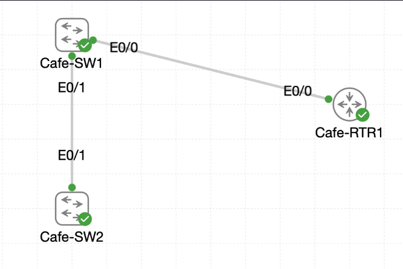

# Lab 028 - Locking Down Legacy Trunk Protocols

<p class="back-link">
  <a href="../../Lab-index.html">← Back to Lab Index</a>
</p>

<table>
<tr>
<td colspan="2" valign="top">

<h1>Objective</h1>

<h4>Convert trunk links into static 802.1Q trunks rather than relying on dynamic negotiation.</h4>

<h4>Disable Dynamic Trunking Protocol negotiation on the inter-switch trunk between <code>Cafe-SW1</code> and <code>Cafe-SW2</code>.</h4>

<h4>Harden the switch-to-router trunk from <code>Cafe-SW1</code> to <code>Cafe-RTR1</code> while preserving router-on-a-stick operation.</h4>

<h4>Place both switches into the trusted VTP domain <code>COOKIE</code>.</h4>

<h4>Move both switches into VTP transparent mode so VLAN databases remain locally controlled.</h4>

</td>
</tr>

<tr>
<td valign="top">

</td>
</tr>
</table>

---

## Scenario

This lab focuses on hardening the VLAN trunking design from previous exercises.

The café network already uses VLAN trunks between `Cafe-SW1`, `Cafe-SW2` and `Cafe-RTR1`. However, if trunk negotiation remains dynamic, an incorrectly connected or rogue switch could potentially influence the trunking state.

The objective was to remove that uncertainty by forcing the relevant links into static trunk mode and disabling DTP negotiation with `switchport nonegotiate`.

The second part of the lab addressed VTP. Both switches were placed into the shared domain `COOKIE` and then moved into transparent mode so VLAN information would remain locally controlled rather than being overwritten through VTP advertisements.

The final state preserves the router-on-a-stick design while reducing the risk of accidental or unauthorised VLAN trunk negotiation.

---

## Devices Used

* Cafe-SW1
* Cafe-SW2
* Cafe-RTR1

---

## VLAN Summary

| VLAN ID | VLAN Name | Purpose                 |
| ------: | --------- | ----------------------- |
| 1       | default   | Default / legacy VLAN   |
| 10      | ADMIN     | Admin device VLAN       |
| 20      | PATRON    | Patron device VLAN      |

---

## Interface Summary

| Device    | Interface      | Final Role                                      |
| --------- | -------------- | ----------------------------------------------- |
| Cafe-SW1  | Ethernet0/0    | Static 802.1Q trunk to Cafe-RTR1, DTP disabled  |
| Cafe-SW1  | Ethernet0/1    | Static 802.1Q trunk to Cafe-SW2, DTP disabled   |
| Cafe-SW2  | Ethernet0/1    | Static 802.1Q trunk to Cafe-SW1, DTP disabled   |
| Cafe-RTR1 | Ethernet0/0    | Physical router-on-a-stick parent interface     |
| Cafe-RTR1 | Ethernet0/0.10 | VLAN 10 gateway subinterface                    |
| Cafe-RTR1 | Ethernet0/0.20 | VLAN 20 gateway subinterface                    |

---

## Addressing Summary

| Device    | Interface        | IP Address | Purpose                 |
| --------- | ---------------- | ---------- | ----------------------- |
| Cafe-RTR1 | Ethernet0/0      | Unassigned | Router trunk parent     |
| Cafe-RTR1 | Ethernet0/0.10   | 10.0.18.1  | VLAN 10 gateway         |
| Cafe-RTR1 | Ethernet0/0.20   | 10.0.18.33 | VLAN 20 gateway         |

---

## Configuration Steps

### Step 1 - Harden the Inter-Switch Trunk on Cafe-SW1

The first task was to lock `Cafe-SW1` Ethernet0/1 into permanent trunk mode and disable DTP negotiation.

```bash
enable
configure terminal
interface ethernet0/1
switchport trunk encapsulation dot1q
switchport mode trunk
switchport nonegotiate
end
```

### Verification

```bash
show interface trunk
show dtp interface ethernet 0/1
```

### Result

Cafe-SW1 showed Ethernet0/1 operating as a trunk:

```bash
Port           Mode             Encapsulation  Status        Native vlan
Et0/1          on               802.1q         trunking      1
```

The trunk was limited to VLANs 10 and 20:

```bash
Port           Vlans allowed on trunk
Et0/1          10,20
```

The DTP output showed:

```bash
TOS/TAS/TNS:                              TRUNK/NONEGOTIATE/TRUNK
TOT/TAT/TNT:                              802.1Q/802.1Q/802.1Q
Hello timer expiration (sec/state):       never/STOPPED
Negotiation timer expiration (sec/state): never/STOPPED
FSM state:                                S6:TRUNK
```

### Explanation

The interface was no longer relying on dynamic negotiation to become a trunk.

The important confirmation was:

```text
TRUNK/NONEGOTIATE/TRUNK
```

This means the port was statically operating as a trunk while DTP negotiation was disabled.

---

### Step 2 - Harden the Inter-Switch Trunk on Cafe-SW2

The same hardening was then applied to the matching trunk on `Cafe-SW2` Ethernet0/1.

```bash
enable
configure terminal
interface ethernet0/1
switchport trunk encapsulation dot1q
switchport mode trunk
switchport nonegotiate
end
```

### Verification

```bash
show interface trunk
show dtp interface ethernet0/1
```

### Result

Cafe-SW2 showed Ethernet0/1 operating as a trunk:

```bash
Port           Mode             Encapsulation  Status        Native vlan
Et0/1          on               802.1q         trunking      1
```

The trunk was limited to VLANs 10 and 20:

```bash
Port           Vlans allowed on trunk
Et0/1          10,20
```

The DTP output showed:

```bash
TOS/TAS/TNS:                              TRUNK/NONEGOTIATE/TRUNK
TOT/TAT/TNT:                              802.1Q/802.1Q/802.1Q
Hello timer expiration (sec/state):       never/STOPPED
Negotiation timer expiration (sec/state): never/STOPPED
FSM state:                                S6:TRUNK
```

### Explanation

Both ends of the inter-switch backbone were now statically configured trunks with DTP negotiation disabled.

This is safer and more predictable than leaving either side in a dynamic trunking mode.

---

### Step 3 - Harden the Router-on-a-Stick Uplink on Cafe-SW1

The router-facing uplink on `Cafe-SW1` Ethernet0/0 was also configured as a static trunk with DTP negotiation disabled.

```bash
configure terminal
interface ethernet0/0
switchport trunk encapsulation dot1q
switchport mode trunk
switchport nonegotiate
end
```

### Verification

```bash
show interface trunk
show dtp interface ethernet0/0
```

### Result

Cafe-SW1 showed both Ethernet0/0 and Ethernet0/1 as static trunks:

```bash
Port           Mode             Encapsulation  Status        Native vlan
Et0/0          on               802.1q         trunking      1
Et0/1          on               802.1q         trunking      1
```

Both trunks were limited to VLANs 10 and 20:

```bash
Port           Vlans allowed on trunk
Et0/0          10,20
Et0/1          10,20
```

The DTP output for Ethernet0/0 showed:

```bash
TOS/TAS/TNS:                              TRUNK/NONEGOTIATE/TRUNK
TOT/TAT/TNT:                              802.1Q/802.1Q/802.1Q
Hello timer expiration (sec/state):       never/STOPPED
Negotiation timer expiration (sec/state): never/STOPPED
FSM state:                                S6:TRUNK
```

### Explanation

This ensured the link to `Cafe-RTR1` remained a trunk but did not attempt to negotiate trunking dynamically.

This is the correct approach for a router-on-a-stick link because the router uses subinterfaces and 802.1Q tags; it does not participate in switch DTP negotiation.

---

### Step 4 - Verify Router-on-a-Stick Survived the Trunk Hardening

After hardening the router-facing trunk, `Cafe-RTR1` was checked to confirm the parent interface and VLAN subinterfaces remained up.

```bash
show ip interface brief
```

### Result

```bash
Interface              IP-Address      OK? Method Status                Protocol
Ethernet0/0            unassigned      YES unset  up                    up
Ethernet0/0.10         10.0.18.1       YES TFTP   up                    up
Ethernet0/0.20         10.0.18.33      YES TFTP   up                    up
Ethernet0/1            unassigned      YES unset  administratively down down
Ethernet0/2            unassigned      YES unset  administratively down down
Ethernet0/3            unassigned      YES unset  administratively down down
```

### Explanation

The router-on-a-stick service remained intact.

This proved that disabling DTP on the switch did not break router subinterface operation. The router only needed the switchport to remain a static 802.1Q trunk.

---

## VTP Hardening

### Step 5 - Check Initial VTP Status on Cafe-SW1

The initial VTP status on `Cafe-SW1` was checked.

```bash
show vtp status
```

### Result

Cafe-SW1 initially showed no VTP domain and was operating in server mode:

```bash
VTP Domain Name                 :
VTP Operating Mode              : Server
Configuration Revision          : 0
```

### Explanation

VTP server mode can advertise VLAN database changes to other switches in the same domain. For this lab, the objective was to move away from this behaviour and make VLAN changes local only.

---

### Step 6 - Configure VTP Domain and Transparent Mode on Cafe-SW1

Cafe-SW1 was placed into the `COOKIE` VTP domain and then moved into transparent mode.

```bash
configure terminal
vtp domain COOKIE
vtp mode transparent
vlan 10
name ADMIN
exit
vlan 20
name PATRON
end
```

### Verification

```bash
show vlan brief
show vtp status
```

### Result

Cafe-SW1 showed the expected VLANs:

```bash
VLAN Name                             Status    Ports
---- -------------------------------- --------- -------------------------------
1    default                          active    Et0/2, Et0/3
10   ADMIN                            active
20   PATRON                           active
1002 fddi-default                     act/unsup
1003 token-ring-default               act/unsup
1004 fddinet-default                  act/unsup
1005 trnet-default                    act/unsup
```

VTP status showed:

```bash
VTP Domain Name                 : COOKIE
VTP Operating Mode              : Transparent
Number of existing VLANs        : 7
Configuration Revision          : 0
```

### Explanation

Cafe-SW1 was now in the correct VTP domain and operating in transparent mode.

The VLAN database remained local to the switch and VLANs 10 and 20 were present after the mode change.

---

### Step 7 - Check Initial VTP Status on Cafe-SW2

The VTP status on `Cafe-SW2` was checked next.

```bash
show vtp status
```

### Result

Cafe-SW2 already showed the `COOKIE` domain, but it was still operating in server mode:

```bash
VTP Domain Name                 : COOKIE
VTP Operating Mode              : Server
Configuration Revision          : 0
```

The output also showed:

```bash
*** MD5 digest checksum mismatch on trunk: Et0/1 ***
```

### Explanation

The domain name was already set correctly, but VTP server mode still needed to be removed.

The MD5 digest mismatch indicated that the switches did not currently have matching VTP database state across the trunk. Moving both switches into transparent mode and explicitly recreating the required VLANs was the correct response for this hardening lab.

---

### Step 8 - Configure VTP Transparent Mode on Cafe-SW2

Cafe-SW2 was moved into VTP transparent mode. VLANs 10 and 20 were then explicitly created and named.

```bash
configure terminal
vtp domain COOKIE
vtp mode transparent
vlan 10
name ADMIN
exit
vlan 20
name PATRON
end
```

### Verification

```bash
show vlan brief
show vtp status
```

### Result

Cafe-SW2 showed VLANs 10 and 20 present:

```bash
VLAN Name                             Status    Ports
---- -------------------------------- --------- -------------------------------
1    default                          active    Et0/0, Et0/2, Et0/3
10   ADMIN                            active
20   PATRON                           active
1002 fddi-default                     act/unsup
1003 token-ring-default               act/unsup
1004 fddinet-default                  act/unsup
1005 trnet-default                    act/unsup
```

VTP status showed:

```bash
VTP Domain Name                 : COOKIE
VTP Operating Mode              : Transparent
Number of existing VLANs        : 7
Configuration Revision          : 0
```

The output still included:

```bash
*** MD5 digest checksum mismatch on trunk: Et0/1 ***
```

### Explanation

Cafe-SW2 was successfully moved from server mode into transparent mode and VLANs 10 and 20 were present locally.

The remaining digest warning was captured as evidence. In a real environment, the next validation step would be to recheck trunk state and confirm both switches now hold matching local VLAN definitions after transparent mode has been applied.

---

## Final Verification

### Static Trunk and DTP Verification

`show dtp interface` confirmed that the hardened trunk ports were statically trunking with negotiation stopped.

Cafe-SW1 Ethernet0/1 showed:

```bash
TOS/TAS/TNS:                              TRUNK/NONEGOTIATE/TRUNK
Hello timer expiration (sec/state):       never/STOPPED
Negotiation timer expiration (sec/state): never/STOPPED
FSM state:                                S6:TRUNK
```

Cafe-SW2 Ethernet0/1 showed:

```bash
TOS/TAS/TNS:                              TRUNK/NONEGOTIATE/TRUNK
Hello timer expiration (sec/state):       never/STOPPED
Negotiation timer expiration (sec/state): never/STOPPED
FSM state:                                S6:TRUNK
```

Cafe-SW1 Ethernet0/0 showed:

```bash
TOS/TAS/TNS:                              TRUNK/NONEGOTIATE/TRUNK
Hello timer expiration (sec/state):       never/STOPPED
Negotiation timer expiration (sec/state): never/STOPPED
FSM state:                                S6:TRUNK
```

### Router Subinterface Verification

`Cafe-RTR1` showed:

```bash
Ethernet0/0            unassigned      YES unset  up                    up
Ethernet0/0.10         10.0.18.1       YES TFTP   up                    up
Ethernet0/0.20         10.0.18.33      YES TFTP   up                    up
```

### VTP Verification

Cafe-SW1 showed:

```bash
VTP Domain Name                 : COOKIE
VTP Operating Mode              : Transparent
Configuration Revision          : 0
```

Cafe-SW2 showed:

```bash
VTP Domain Name                 : COOKIE
VTP Operating Mode              : Transparent
Configuration Revision          : 0
```

### VLAN Verification

Cafe-SW1 showed:

```bash
10   ADMIN                            active
20   PATRON                           active
```

Cafe-SW2 showed:

```bash
10   ADMIN                            active
20   PATRON                           active
```

### Evidence Note

The supplied CLI evidence confirms that the trunks were static, DTP negotiation was disabled, router subinterfaces stayed up/up, and VTP transparent mode was configured on both switches.

The trunk output captured before VTP transparent mode showed VLANs 10 and 20 as allowed, but not active in the management domain at that moment. The later `show vlan brief` output confirms VLANs 10 and 20 were recreated locally on both switches. For an even stronger final evidence set, the next useful command would be another `show interface trunk` on both switches after the final VLAN recreation.

---

## Troubleshooting

### Issue 1 - Incorrect DTP command attempt

#### Problem

The following command was entered on Cafe-SW1:

```bash
switchport dtp
```

The help query was also attempted:

```bash
switchport dtp ?
```

#### Diagnosis

The switch rejected the command:

```bash
% Invalid input detected at '^' marker.
% Unrecognized command
```

#### Fix

The correct command to disable trunk negotiation was used:

```bash
switchport nonegotiate
```

---

### Issue 2 - Trunk links briefly dropped during configuration

#### Problem

Both the inter-switch trunk and router-facing trunk briefly changed line protocol state while trunk settings were applied.

Example output:

```bash
%LINEPROTO-5-UPDOWN: Line protocol on Interface Ethernet0/1, changed state to down
%LINEPROTO-5-UPDOWN: Line protocol on Interface Ethernet0/1, changed state to up
```

#### Diagnosis

This was expected during interface mode changes and trunk negotiation changes.

#### Fix

No fix was required. The interfaces returned to trunking state.

---

### Issue 3 - Trunk showed VLANs allowed but not active before VLAN recreation

#### Problem

After trunk hardening, trunk output showed VLANs 10 and 20 allowed on the trunk, but not active in the management domain:

```bash
Port           Vlans allowed on trunk
Et0/1          10,20

Port           Vlans allowed and active in management domain
Et0/1          none
```

#### Diagnosis

The VLANs were allowed on the trunk, but the local VLAN database did not yet contain active VLAN 10 and VLAN 20 entries at that point in the evidence.

#### Fix

VLANs 10 and 20 were recreated after VTP transparent mode was configured:

```bash
vlan 10
name ADMIN
exit
vlan 20
name PATRON
```

---

### Issue 4 - VTP MD5 digest mismatch on Cafe-SW2

#### Problem

Cafe-SW2 reported:

```bash
*** MD5 digest checksum mismatch on trunk: Et0/1 ***
```

#### Diagnosis

The switches had inconsistent VTP database state across the trunk while VTP was still being audited and changed.

#### Fix / Outcome

Both switches were placed into VTP transparent mode and VLANs 10 and 20 were configured locally.

The digest warning was retained in the evidence because it is useful troubleshooting context.

---

## Key Learning Points

* Dynamic Trunking Protocol can be disabled with `switchport nonegotiate`.
* Static trunking is configured with `switchport mode trunk`.
* On switches that require it, `switchport trunk encapsulation dot1q` sets the trunk tagging method.
* `show dtp interface` confirms whether negotiation timers are stopped.
* `TRUNK/NONEGOTIATE/TRUNK` confirms the port is statically trunking without negotiation.
* Router-on-a-stick links should be static trunks on the switch side.
* Routers do not negotiate trunks using DTP.
* VTP server mode can advertise VLAN database changes to other switches.
* VTP transparent mode keeps VLAN changes local while still allowing normal trunk forwarding.
* A VTP configuration revision of `0` is safer in this training context because it reduces the risk of accidental VLAN database overwrites.
* Allowed VLANs on a trunk and active VLANs in the local VLAN database are not the same thing.
* Rechecking `show interface trunk` after VLAN recreation is a useful final validation step.

---

## Completion Check

The lab was completed successfully, with one recommended extra verification command noted for stronger evidence.

* Cafe-SW1 Ethernet0/1 was configured as a static 802.1Q trunk.
* Cafe-SW1 Ethernet0/1 had DTP negotiation disabled.
* Cafe-SW2 Ethernet0/1 was configured as a static 802.1Q trunk.
* Cafe-SW2 Ethernet0/1 had DTP negotiation disabled.
* Cafe-SW1 Ethernet0/0 was configured as a static 802.1Q trunk to Cafe-RTR1.
* Cafe-SW1 Ethernet0/0 had DTP negotiation disabled.
* `show dtp interface` confirmed `TRUNK/NONEGOTIATE/TRUNK` on the hardened trunk ports.
* Cafe-RTR1 Ethernet0/0 stayed up/up.
* Cafe-RTR1 Ethernet0/0.10 stayed up/up with `10.0.18.1`.
* Cafe-RTR1 Ethernet0/0.20 stayed up/up with `10.0.18.33`.
* Cafe-SW1 was configured with VTP domain `COOKIE`.
* Cafe-SW1 was moved into VTP transparent mode.
* Cafe-SW2 was configured with VTP domain `COOKIE`.
* Cafe-SW2 was moved into VTP transparent mode.
* VLAN 10 `ADMIN` and VLAN 20 `PATRON` were present on both switches.
* Final VTP output showed transparent mode and configuration revision `0` on both switches.
* Recommended extra evidence: run `show interface trunk` on both switches again after the final VLAN recreation to prove VLANs 10 and 20 are active on the hardened trunks.
