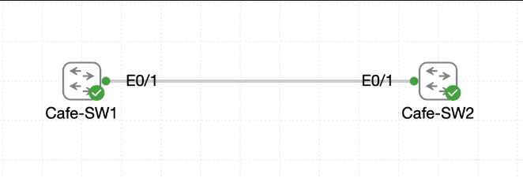

# Lab 029 - The Purpose of the Native VLAN

<p class="back-link">
  <a href="../../Lab-index.html">← Back to Lab Index</a>
</p>

<table>
<tr>
<td colspan="2" valign="top">

<h1>Objective</h1>

<h4>Audit the initial switchport and trunking state of the uplink between <code>Cafe-SW1</code> and <code>Cafe-SW2</code>.</h4>

<h4>Create VLAN 99 as the dedicated management/native VLAN.</h4>

<h4>Force the inter-switch uplink into 802.1Q trunking mode.</h4>

<h4>Move the trunk native VLAN from VLAN 1 to VLAN 99 on both switches.</h4>

<h4>Identify, diagnose and resolve a native VLAN mismatch across the trunk.</h4>

</td>
</tr>

<tr>
<td valign="top">

</td>
</tr>
</table>

---

## Scenario

This lab demonstrates the purpose of the native VLAN on an 802.1Q trunk.

The uplink between `Cafe-SW1` and `Cafe-SW2` started as a normal non-trunking switchport. VLANs 10 and 20 already existed for lab access ports, but the inter-switch link was still operating as an access port in VLAN 1.

The objective was to create VLAN 99 as the management/native VLAN, convert the uplink into an 802.1Q trunk, and then change the native VLAN from the default VLAN 1 to VLAN 99.

A deliberate temporary mismatch occurred after `Cafe-SW1` was changed before `Cafe-SW2`. This produced spanning-tree and CDP warnings, proving why both ends of a trunk must agree on the native VLAN. Once `Cafe-SW2` was aligned, the trunk became stable and VLAN 99 became the native VLAN on both sides.

---

## Devices Used

* Cafe-SW1
* Cafe-SW2

---

## VLAN Summary

| VLAN ID | VLAN Name   | Purpose                           |
| ------: | ----------- | --------------------------------- |
| 1       | default     | Original default/native VLAN      |
| 10      | VLAN0010    | Existing lab access VLAN          |
| 20      | VLAN0020    | Existing lab access VLAN          |
| 99      | MGMT-NATIVE | Management/native VLAN for trunks |

---

## Interface Summary

| Device   | Interface   | Final Role                                  |
| -------- | ----------- | ------------------------------------------- |
| Cafe-SW1 | Ethernet0/1 | 802.1Q trunk to Cafe-SW2, native VLAN 99    |
| Cafe-SW2 | Ethernet0/1 | 802.1Q trunk to Cafe-SW1, native VLAN 99    |

---

## Configuration Steps

### Step 1 - Check the Initial Trunk State on Cafe-SW1

The first task was to verify whether any interfaces were already trunking.

```bash
show interface trunk
```

### Result

No trunk output was returned.

```bash
Cafe-SW1#show interface trunk
Cafe-SW1#
```

### Explanation

A blank `show interface trunk` result confirmed that no switchports were currently operating as trunks.

This matched the lab starting point: the physical link between the switches was connected, but it was not yet trunking.

---

### Step 2 - Inspect the Initial Switchport State

Ethernet0/1 on Cafe-SW1 was inspected in detail.

```bash
show interfaces Ethernet0/1 switchport
```

### Result

The output showed:

```bash
Name: Et0/1
Switchport: Enabled
Administrative Mode: dynamic auto
Operational Mode: static access
Administrative Trunking Encapsulation: negotiate
Operational Trunking Encapsulation: native
Negotiation of Trunking: On
Access Mode VLAN: 1 (default)
Trunking Native Mode VLAN: 1 (default)
```

### Explanation

This confirmed that Ethernet0/1 was not yet a trunk.

Important baseline details were:

* The administrative mode was `dynamic auto`.
* The operational mode was `static access`.
* The access VLAN was VLAN 1.
* The native VLAN was still VLAN 1.
* Dynamic trunking negotiation was still enabled.

This gave a clean before-state before the native VLAN was changed.

---

### Step 3 - Confirm Existing VLANs on Cafe-SW1

The VLAN table was checked.

```bash
show vlan brief
```

### Result

Cafe-SW1 showed:

```bash
VLAN Name                             Status    Ports
---- -------------------------------- --------- -------------------------------
1    default                          active    Et0/0, Et0/1
10   VLAN0010                         active    Et0/2
20   VLAN0020                         active    Et0/3
1002 fddi-default                     act/unsup
1003 token-ring-default               act/unsup
1004 fddinet-default                  act/unsup
1005 trnet-default                    act/unsup
```

### Explanation

This confirmed that VLAN 10 and VLAN 20 already existed in the lab, while the uplink Ethernet0/1 was still in the default VLAN.

---

### Step 4 - Check for Existing Native VLAN Warnings

The switch log was checked for existing native VLAN warnings before making changes.

```bash
show logging | include VLAN|Native
```

### Result

No existing native VLAN or mismatch log entries were shown.

### Explanation

This confirmed a clean baseline. Any later native VLAN warning could therefore be tied to the configuration changes made during the lab.

---

## Native VLAN Configuration

### Step 5 - Create VLAN 99 on Cafe-SW1

VLAN 99 was created and named as the management/native VLAN.

```bash
configure terminal
vlan 99
name MGMT-NATIVE
exit
```

### Explanation

VLAN 99 was created as the dedicated landing VLAN for untagged traffic on the trunk.

Using a non-default native VLAN is better practice than leaving untagged traffic in VLAN 1.

---

### Step 6 - Configure Cafe-SW1 Ethernet0/1 as a Trunk with Native VLAN 99

Ethernet0/1 on Cafe-SW1 was configured as an 802.1Q trunk and its native VLAN was changed to VLAN 99.

```bash
interface ethernet0/1
switchport trunk encapsulation dot1q
switchport mode trunk
switchport trunk native vlan 99
end
```

### Result

During the change, the interface briefly dropped and returned:

```bash
%LINEPROTO-5-UPDOWN: Line protocol on Interface Ethernet0/1, changed state to down
%LINEPROTO-5-UPDOWN: Line protocol on Interface Ethernet0/1, changed state to up
```

The switch then reported inconsistent VLAN behaviour:

```bash
%SPANTREE-2-BLOCK_PVID_PEER: Blocking Ethernet0/1 on VLAN0001. Inconsistent peer vlan.
%SPANTREE-2-BLOCK_PVID_LOCAL: Blocking Ethernet0/1 on VLAN0099. Inconsistent local vlan.
```

### Explanation

This was expected at this point because only one side of the link had been changed.

Cafe-SW1 now used native VLAN 99, while Cafe-SW2 still used native VLAN 1. This created a native VLAN mismatch.

---

### Step 7 - Verify the Trunk on Cafe-SW1

The trunk was checked from Cafe-SW1.

```bash
show interface trunk | begin Port
```

### Result

Cafe-SW1 showed Ethernet0/1 trunking with native VLAN 99:

```bash
Port           Mode             Encapsulation  Status        Native vlan
Et0/1          on               802.1q         trunking      99
```

The active VLANs were:

```bash
Port           Vlans allowed and active in management domain
Et0/1          1,10,20,99
```

The forwarding section showed:

```bash
Port           Vlans in spanning tree forwarding state and not pruned
Et0/1          10,20
```

### Explanation

Cafe-SW1 was now configured correctly, but the link was not fully stable because Cafe-SW2 still needed to be changed to the same native VLAN.

The forwarding output reflected the mismatch state: not all expected VLANs were forwarding yet.

---

## Native VLAN Mismatch Observation

### Step 8 - Observe Cafe-SW2 Mismatch Messages

Before Cafe-SW2 was corrected, it generated native VLAN mismatch messages.

```bash
%CDP-4-NATIVE_VLAN_MISMATCH: Native VLAN mismatch discovered on Ethernet0/1 (1), with Cafe-SW1 Ethernet0/1 (99).
```

It also showed spanning-tree inconsistency:

```bash
%SPANTREE-2-BLOCK_PVID_LOCAL: Blocking Ethernet0/1 on VLAN0001. Inconsistent local vlan.
```

### Explanation

This proved that the trunk endpoints disagreed about which VLAN should carry untagged frames.

Cafe-SW2 still believed the native VLAN was VLAN 1, while Cafe-SW1 had moved to VLAN 99.

This is a significant issue because native VLAN mismatches can accidentally leak untagged traffic into the wrong VLAN.

---

## Correcting Cafe-SW2

### Step 9 - Create VLAN 99 on Cafe-SW2

VLAN 99 was created on Cafe-SW2 with the same management/native name.

```bash
enable
configure terminal
vlan 99
name MGMT-NATIVE
exit
```

### Explanation

The native VLAN must exist on the switch before it can be used properly on the trunk.

---

### Step 10 - Configure Cafe-SW2 Ethernet0/1 as a Matching Trunk

Cafe-SW2 Ethernet0/1 was configured to match Cafe-SW1.

```bash
interface ethernet0/1
switchport trunk encapsulation dot1q
switchport mode trunk
switchport trunk native vlan 99
end
```

### Result

After Cafe-SW2 was corrected, the switch reported that port consistency was restored:

```bash
%SPANTREE-2-UNBLOCK_CONSIST_PORT: Unblocking Ethernet0/1 on VLAN0099. Port consistency restored.
%SPANTREE-2-UNBLOCK_CONSIST_PORT: Unblocking Ethernet0/1 on VLAN0001. Port consistency restored.
```

### Explanation

Once both ends of the trunk used VLAN 99 as the native VLAN, the mismatch condition was cleared and spanning tree unblocked the affected VLANs.

---

### Step 11 - Verify the Trunk on Cafe-SW2

The trunk was checked on Cafe-SW2.

```bash
show interface trunk | begin Port
```

### Result

Cafe-SW2 showed Ethernet0/1 trunking with native VLAN 99:

```bash
Port           Mode             Encapsulation  Status        Native vlan
Et0/1          on               802.1q         trunking      99
```

The active VLANs were:

```bash
Port           Vlans allowed and active in management domain
Et0/1          1,10,20,99
```

The forwarding section showed:

```bash
Port           Vlans in spanning tree forwarding state and not pruned
Et0/1          1,10,20,99
```

### Explanation

This confirmed that Cafe-SW2 was now aligned with Cafe-SW1.

The trunk was up, VLAN 99 was the native VLAN, and VLANs 1, 10, 20 and 99 were active and forwarding.

---

### Step 12 - Review Historical Mismatch Logs

The switch log was checked after the correction.

```bash
show logging | include Native|mismatch
```

### Result

Cafe-SW2 still displayed the earlier mismatch messages:

```bash
%CDP-4-NATIVE_VLAN_MISMATCH: Native VLAN mismatch discovered on Ethernet0/1 (1), with Cafe-SW1 Ethernet0/1 (99).
%CDP-4-NATIVE_VLAN_MISMATCH: Native VLAN mismatch discovered on Ethernet0/1 (1), with Cafe-SW1 Ethernet0/1 (99).
%CDP-4-NATIVE_VLAN_MISMATCH: Native VLAN mismatch discovered on Ethernet0/1 (1), with Cafe-SW1 Ethernet0/1 (99).
```

### Explanation

These were historical log entries from before Cafe-SW2 was corrected.

The important evidence is that the port was later unblocked and the final trunk output showed native VLAN 99 with VLANs 1, 10, 20 and 99 forwarding.

---

## Final Verification

### Cafe-SW1 Final Trunk State

Cafe-SW1 showed Ethernet0/1 as an 802.1Q trunk with native VLAN 99:

```bash
Port           Mode             Encapsulation  Status        Native vlan
Et0/1          on               802.1q         trunking      99
```

The active VLANs were:

```bash
Port           Vlans allowed and active in management domain
Et0/1          1,10,20,99
```

### Cafe-SW2 Final Trunk State

Cafe-SW2 showed the matching native VLAN:

```bash
Port           Mode             Encapsulation  Status        Native vlan
Et0/1          on               802.1q         trunking      99
```

The forwarding section confirmed all expected VLANs were active and forwarding:

```bash
Port           Vlans in spanning tree forwarding state and not pruned
Et0/1          1,10,20,99
```

---

## Troubleshooting

### Issue 1 - No initial trunk output

#### Problem

The first trunk check produced no output:

```bash
show interface trunk
```

#### Diagnosis

No interfaces were currently operating as trunks.

#### Fix / Outcome

This was expected for the starting state of the lab and was documented as the baseline.

---

### Issue 2 - Native VLAN mismatch after configuring only Cafe-SW1

#### Problem

After Cafe-SW1 was changed to native VLAN 99, Cafe-SW2 still used native VLAN 1.

Cafe-SW2 logged:

```bash
%CDP-4-NATIVE_VLAN_MISMATCH: Native VLAN mismatch discovered on Ethernet0/1 (1), with Cafe-SW1 Ethernet0/1 (99).
```

#### Diagnosis

Both ends of an 802.1Q trunk must use the same native VLAN. During the partial configuration state, they did not match.

#### Fix

Cafe-SW2 was configured with the same native VLAN:

```bash
vlan 99
name MGMT-NATIVE
interface ethernet0/1
switchport trunk encapsulation dot1q
switchport mode trunk
switchport trunk native vlan 99
```

---

### Issue 3 - Spanning tree blocked VLANs during the mismatch

#### Problem

The switches reported inconsistent VLAN states:

```bash
%SPANTREE-2-BLOCK_PVID_PEER: Blocking Ethernet0/1 on VLAN0001. Inconsistent peer vlan.
%SPANTREE-2-BLOCK_PVID_LOCAL: Blocking Ethernet0/1 on VLAN0099. Inconsistent local vlan.
```

#### Diagnosis

Spanning tree detected a Port VLAN ID inconsistency caused by the native VLAN mismatch.

#### Fix

After Cafe-SW2 was aligned to native VLAN 99, spanning tree restored port consistency:

```bash
%SPANTREE-2-UNBLOCK_CONSIST_PORT: Unblocking Ethernet0/1 on VLAN0099. Port consistency restored.
%SPANTREE-2-UNBLOCK_CONSIST_PORT: Unblocking Ethernet0/1 on VLAN0001. Port consistency restored.
```

---

### Issue 4 - Historical mismatch logs remained visible

#### Problem

After the fix, `show logging | include Native|mismatch` still displayed earlier mismatch messages.

#### Diagnosis

The command showed historical log entries. It did not mean the mismatch was still active.

#### Fix / Outcome

The final trunk output was used as the current-state verification. It showed both sides using native VLAN 99.

---

## Key Learning Points

* An 802.1Q trunk can carry multiple VLANs over one physical link.
* The native VLAN carries untagged traffic on an 802.1Q trunk.
* By default, the native VLAN is usually VLAN 1.
* Moving the native VLAN away from VLAN 1 is a common hardening practice.
* The native VLAN must match on both ends of a trunk.
* A native VLAN mismatch can cause CDP warnings and spanning-tree inconsistency events.
* Spanning tree can block VLANs when it detects a Port VLAN ID mismatch.
* `show interfaces <interface> switchport` is useful for proving the initial switchport mode and native VLAN.
* `show interface trunk` confirms trunk status, encapsulation and native VLAN.
* Historical log entries may remain after a problem is fixed.
* Final trunk state is more important than old log messages when confirming the current condition.

---

## Completion Check

The lab was completed successfully.

* Cafe-SW1 initially had no trunking interfaces.
* Cafe-SW1 Ethernet0/1 initially operated as a static access port in VLAN 1.
* VLANs 10 and 20 were already present on Cafe-SW1.
* No native VLAN mismatch logs were present before the lab changes.
* VLAN 99 `MGMT-NATIVE` was created on Cafe-SW1.
* Cafe-SW1 Ethernet0/1 was converted into an 802.1Q trunk.
* Cafe-SW1 Ethernet0/1 was configured with native VLAN 99.
* A temporary native VLAN mismatch was observed while Cafe-SW2 still used VLAN 1.
* VLAN 99 `MGMT-NATIVE` was created on Cafe-SW2.
* Cafe-SW2 Ethernet0/1 was converted into an 802.1Q trunk.
* Cafe-SW2 Ethernet0/1 was configured with native VLAN 99.
* Spanning tree restored port consistency after both sides matched.
* Cafe-SW2 confirmed Ethernet0/1 trunking with native VLAN 99.
* Cafe-SW2 confirmed VLANs 1, 10, 20 and 99 active and forwarding.
* Historical mismatch logs remained visible, but the final trunk state showed the native VLAN mismatch had been resolved.
