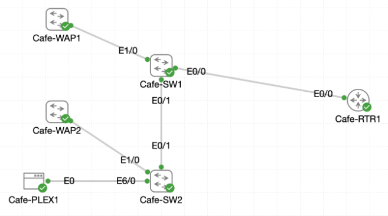

# Lab 030 - Castle Rysen Cafe VLAN Implementation

<p class="back-link">
  <a href="../../Lab-index.html">← Back to Lab Index</a>
</p>

<table>
<tr>
<td colspan="2" valign="top">

<h1>Objective</h1>

<h4>Audit the live VLAN and trunking state on <code>Cafe-SW1</code> and <code>Cafe-SW2</code>.</h4>

<h4>Enable the router parent interface so the existing router-on-a-stick subinterfaces can operate.</h4>

<h4>Configure the router-facing, inter-switch and wireless access point uplinks as 802.1Q trunks.</h4>

<h4>Restrict trunk forwarding to the required admin and patron VLANs.</h4>

<h4>Move the Plex server into the admin VLAN and verify gateway reachability.</h4>

<h4>Shut down unused access ports to reduce the risk of rogue device connections.</h4>

</td>
</tr>

<tr>
<td valign="top">

</td>
</tr>
</table>

---

## Scenario

This lab brings the Castle Rysen cafe switching environment into a more complete production-style VLAN configuration.

The router-on-a-stick subinterfaces already existed on `Cafe-RTR1`, but the physical parent interface needed to be enabled before the VLAN gateways could operate. The switches also still had important uplinks in their default non-trunking state, meaning VLAN 10 and VLAN 20 could not yet cross the cafe properly.

The work focused on four areas:

* Mapping the real IOL interface names used by the lab.
* Enabling the router parent interface and switch trunk links.
* Returning the Plex media server to the admin VLAN.
* Locking down unused switchports so unauthorised devices could not easily be added to the network.

The final design leaves active cafe infrastructure in the correct VLANs and moves unused ports into a disabled state.

---

## Devices Used

* Cafe-RTR1
* Cafe-SW1
* Cafe-SW2
* Cafe-WAP1
* Cafe-WAP2
* Cafe-PLEX1

---

## Live Interface Map

| Link / Device | Interface |
| ------------- | --------- |
| Cafe-RTR1 to Cafe-SW1 | Cafe-RTR1 Ethernet0/0 to Cafe-SW1 Ethernet0/0 |
| Cafe-SW1 to Cafe-SW2 | Cafe-SW1 Ethernet0/1 to Cafe-SW2 Ethernet0/1 |
| Cafe-WAP1 uplink | Cafe-SW1 Ethernet1/0 |
| Cafe-WAP2 uplink | Cafe-SW2 Ethernet1/0 |
| Cafe-PLEX1 access port | Cafe-SW2 Ethernet6/0 |
| Cafe-PLEX1 login | Username `cisco`, password `cisco` |

---

## VLAN Summary

| VLAN ID | Initial Name | Final Name   | Purpose                 |
| ------: | ------------ | ------------ | ----------------------- |
| 1       | default      | default      | Default / unused ports  |
| 10      | VLAN0010     | ADMIN-FLOOR  | Admin devices           |
| 20      | VLAN0020     | PATRON-FLOOR | Patron devices          |

---

## Addressing Summary

| Device / Function | Interface        | IP Address | Subnet Mask       | Gateway     | Purpose                  |
| ----------------- | ---------------- | ---------- | ----------------- | ----------- | ------------------------ |
| Cafe-RTR1         | Ethernet0/0      | Unassigned | -                 | -           | Router trunk parent      |
| Cafe-RTR1         | Ethernet0/0.10   | 10.0.18.1  | 255.255.255.224   | -           | VLAN 10 gateway          |
| Cafe-RTR1         | Ethernet0/0.20   | 10.0.18.33 | 255.255.255.224   | -           | VLAN 20 gateway          |
| Cafe-PLEX1        | eth0             | 10.0.18.6  | 255.255.255.224   | 10.0.18.1   | Plex server in VLAN 10   |

---

## Final Trunk Plan

| Device   | Interface   | Description              | Trunk VLANs |
| -------- | ----------- | ------------------------ | ----------- |
| Cafe-SW1 | Ethernet0/0 | Trunk to Cafe-RTR1       | 10,20       |
| Cafe-SW1 | Ethernet0/1 | Trunk to Cafe-SW2        | 10,20       |
| Cafe-SW1 | Ethernet1/0 | Trunk to Cafe-01-WAP1    | 10,20       |
| Cafe-SW2 | Ethernet0/1 | Trunk to Cafe-SW1        | 10,20       |
| Cafe-SW2 | Ethernet1/0 | Trunk to Cafe-01-WAP2    | 10,20       |

---

## Configuration Steps

### Step 1 - Audit the Starting VLAN State on Cafe-SW1

The VLAN database on `Cafe-SW1` was checked first.

```bash
show vlan brief
```

### Result

Cafe-SW1 initially showed VLAN 10 and VLAN 20 using default names:

```bash
VLAN Name                             Status    Ports
---- -------------------------------- --------- -------------------------------
1    default                          active    Et0/0, Et0/1, Et1/0, Et1/1
                                                Et1/2, Et1/3, Et2/0, Et2/1
                                                Et2/2, Et2/3, Et3/0, Et3/1
                                                Et3/2, Et3/3, Et4/0, Et4/1
                                                Et4/2, Et4/3, Et5/0, Et5/1
                                                Et5/2, Et5/3, Et6/0, Et6/1
                                                Et6/2, Et6/3
10   VLAN0010                         active    Et0/2
20   VLAN0020                         active    Et0/3
```

### Explanation

This confirmed that VLANs 10 and 20 already existed, but the main uplinks were still in VLAN 1 rather than operating as trunks.

---

### Step 2 - Confirm No Active Trunks on Cafe-SW1

The trunk table was checked.

```bash
show interface trunk | begin Port
```

### Result

No trunk output was returned.

```bash
Cafe-SW1#show interface trunk | begin Port
Cafe-SW1#
```

### Explanation

This confirmed that no interfaces were actively trunking at the start of the lab.

---

### Step 3 - Audit the Starting VLAN State on Cafe-SW2

The VLAN database on `Cafe-SW2` was checked next.

```bash
show vlan brief
```

### Result

Cafe-SW2 initially showed:

```bash
VLAN Name                             Status    Ports
---- -------------------------------- --------- -------------------------------
1    default                          active    Et0/0, Et0/1, Et0/2, Et1/0
                                                Et1/1, Et1/3, Et2/0, Et2/1
                                                Et2/2, Et2/3, Et3/0, Et3/1
                                                Et3/2, Et3/3, Et4/0, Et4/1
                                                Et4/2, Et4/3, Et5/0, Et5/1
                                                Et5/2, Et5/3, Et6/0, Et6/1
                                                Et6/2, Et6/3
10   VLAN0010                         active    Et0/3
20   VLAN0020                         active    Et1/2
```

### Explanation

This confirmed that Cafe-PLEX1 was connected to Ethernet6/0, which initially remained in VLAN 1.

---

## Router and Trunk Configuration

### Step 4 - Enable the Router Parent Interface

The router parent interface was enabled so that the existing subinterfaces could operate.

```bash
configure terminal
interface ethernet0/0
no shutdown
end
```

### Verification

```bash
show ip interface brief
```

### Result

`Cafe-RTR1` showed:

```bash
Interface              IP-Address      OK? Method Status                Protocol
Ethernet0/0            unassigned      YES unset  up                    up
Ethernet0/0.10         10.0.18.1       YES TFTP   up                    up
Ethernet0/0.20         10.0.18.33      YES TFTP   up                    up
Ethernet0/1            unassigned      YES unset  administratively down down
Ethernet0/2            unassigned      YES unset  administratively down down
Ethernet0/3            unassigned      YES unset  administratively down down
```

### Explanation

This confirmed that the physical parent interface and both router-on-a-stick subinterfaces were up/up.

---

### Step 5 - Rename VLANs on Cafe-SW1

VLANs 10 and 20 were renamed to match their production roles.

```bash
configure terminal
vlan 10
name ADMIN-FLOOR
vlan 20
name PATRON-FLOOR
exit
```

### Explanation

Renaming the VLANs makes the switch configuration easier to understand and more suitable for portfolio evidence.

---

### Step 6 - Configure Cafe-SW1 Trunks

The router-facing trunk, inter-switch trunk and WAP uplink trunk were configured on Cafe-SW1.

```bash
interface ethernet0/0
description Trunk to Cafe-RTR1
switchport trunk encapsulation dot1q
switchport mode trunk
switchport trunk allowed vlan 10,20
exit

interface ethernet0/1
description Trunk to Cafe-SW2
switchport trunk encapsulation dot1q
switchport mode trunk
switchport trunk allowed vlan 10,20
exit

interface ethernet1/0
description Trunk to Cafe-01-WAP1
switchport trunk encapsulation dot1q
switchport mode trunk
switchport trunk allowed vlan 10,20
end
```

### Verification

```bash
show interface trunk | begin Port
```

### Result

Cafe-SW1 showed three active trunks:

```bash
Port           Mode             Encapsulation  Status        Native vlan
Et0/0          on               802.1q         trunking      1
Et0/1          on               802.1q         trunking      1
Et1/0          on               802.1q         trunking      1
```

All three trunks were limited to VLANs 10 and 20:

```bash
Port           Vlans allowed on trunk
Et0/0          10,20
Et0/1          10,20
Et1/0          10,20
```

VLANs 10 and 20 were allowed and active:

```bash
Port           Vlans allowed and active in management domain
Et0/0          10,20
Et0/1          10,20
Et1/0          10,20
```

The forwarding section showed:

```bash
Port           Vlans in spanning tree forwarding state and not pruned
Et0/0          10,20
Et0/1          10,20
Et1/0          none
```

### Explanation

This confirmed the required switch trunks were active and restricted to VLANs 10 and 20. The WAP trunk `Et1/0` showed `none` in the spanning-tree forwarding section at that moment, which was acceptable for this lab because WAP trunk forwarding may not immediately show active forwarding until traffic is present.

---

### Step 7 - Rename VLANs on Cafe-SW2

VLANs 10 and 20 were renamed on Cafe-SW2.

```bash
configure terminal
vlan 10
name ADMIN-FLOOR
vlan 20
name PATRON-FLOOR
exit
```

### Explanation

This kept the VLAN database consistent between the two switches.

---

### Step 8 - Configure Cafe-SW2 Trunks

The inter-switch trunk and WAP uplink trunk were configured on Cafe-SW2.

```bash
interface ethernet0/1
description Trunk to Cafe-SW1
switchport trunk encapsulation dot1q
switchport mode trunk
switchport trunk allowed vlan 10,20
exit

interface ethernet1/0
description Trunk to Cafe-01-WAP2
switchport trunk encapsulation dot1q
switchport mode trunk
switchport trunk allowed vlan 10,20
end
```

### Verification

```bash
show interface trunk | begin Port
```

### Result

Cafe-SW2 showed both required trunks:

```bash
Port           Mode             Encapsulation  Status        Native vlan
Et0/1          on               802.1q         trunking      1
Et1/0          on               802.1q         trunking      1
```

Both trunks were limited to VLANs 10 and 20:

```bash
Port           Vlans allowed on trunk
Et0/1          10,20
Et1/0          10,20
```

The forwarding section confirmed both trunks forwarding VLANs 10 and 20:

```bash
Port           Vlans in spanning tree forwarding state and not pruned
Et0/1          10,20
Et1/0          10,20
```

### Explanation

Cafe-SW2 was now aligned with the trunk design. The inter-switch link and WAP2 uplink were trunking and restricted to the required VLANs only.

---

## Plex Server Rehome

### Step 9 - Move Cafe-PLEX1 into VLAN 10

Cafe-PLEX1 was connected to Cafe-SW2 Ethernet6/0. The port was configured as an access port in VLAN 10.

```bash
configure terminal
interface ethernet6/0
description Cafe-01-Plex
switchport mode access
switchport access vlan 10
spanning-tree portfast
end
```

### Explanation

This placed the Plex server back into the admin VLAN. `spanning-tree portfast` is appropriate here because the interface connects to an end host rather than another switch.

---

### Step 10 - Verify Cafe-PLEX1 IP Configuration

From the Linux console on Cafe-PLEX1:

```bash
ifconfig eth0
route -n
```

### Result

Cafe-PLEX1 showed an admin VLAN address:

```bash
inet addr:10.0.18.6  Bcast:10.0.18.31  Mask:255.255.255.224
```

The route table showed the admin gateway:

```bash
Destination     Gateway         Genmask         Flags Metric Ref    Use Iface
0.0.0.0         10.0.18.1       0.0.0.0         UG    0      0        0 eth0
10.0.18.0       0.0.0.0         255.255.255.224 U     0      0        0 eth0
```

### Explanation

Cafe-PLEX1 was correctly addressed in the `10.0.18.0/27` admin subnet and used `10.0.18.1` as its default gateway.

---

### Step 11 - Test Cafe-PLEX1 to Admin Gateway

Cafe-PLEX1 tested reachability to the VLAN 10 gateway.

```bash
ping -c 5 10.0.18.1
```

### Result

```bash
5 packets transmitted, 5 packets received, 0% packet loss
round-trip min/avg/max = 0.976/1.568/3.720 ms
```

### Explanation

The ping succeeded, proving that Cafe-PLEX1 was in the correct VLAN and could reach the router-on-a-stick gateway for VLAN 10.

---

## Unused Port Lockdown

### Step 12 - Lock Down Unused Ports on Cafe-SW1

The unused ports on Cafe-SW1 were moved into access mode, placed in VLAN 1, labelled and administratively shut down.

Example configuration pattern:

```bash
interface range ethernet1/1 - 3
description UNUSED-LOCKDOWN
switchport mode access
switchport access vlan 1
shutdown
```

The same pattern was applied across the unused ranges from Ethernet1/1 through Ethernet6/3.

### Verification

```bash
show interfaces status | include disabled|Port
show vlan brief
```

### Result

Cafe-SW1 showed the unused ports disabled and labelled:

```bash
Port         Name               Status       Vlan
Et1/1        UNUSED-LOCKDOWN    disabled     1
Et1/2        UNUSED-LOCKDOWN    disabled     1
Et1/3        UNUSED-LOCKDOWN    disabled     1
Et2/0        UNUSED-LOCKDOWN    disabled     1
Et2/1        UNUSED-LOCKDOWN    disabled     1
Et2/2        UNUSED-LOCKDOWN    disabled     1
Et2/3        UNUSED-LOCKDOWN    disabled     1
Et3/0        UNUSED-LOCKDOWN    disabled     1
Et3/1        UNUSED-LOCKDOWN    disabled     1
Et3/2        UNUSED-LOCKDOWN    disabled     1
Et3/3        UNUSED-LOCKDOWN    disabled     1
Et4/0        UNUSED-LOCKDOWN    disabled     1
Et4/1        UNUSED-LOCKDOWN    disabled     1
Et4/2        UNUSED-LOCKDOWN    disabled     1
Et4/3        UNUSED-LOCKDOWN    disabled     1
Et5/0        UNUSED-LOCKDOWN    disabled     1
Et5/1        UNUSED-LOCKDOWN    disabled     1
Et5/2        UNUSED-LOCKDOWN    disabled     1
Et5/3        UNUSED-LOCKDOWN    disabled     1
Et6/0        UNUSED-LOCKDOWN    disabled     1
Et6/1        UNUSED-LOCKDOWN    disabled     1
Et6/2        UNUSED-LOCKDOWN    disabled     1
Et6/3        UNUSED-LOCKDOWN    disabled     1
```

The VLAN table showed:

```bash
10   ADMIN-FLOOR                      active    Et0/2
20   PATRON-FLOOR                     active    Et0/3
```

### Explanation

Cafe-SW1 was fully hardened according to the lab requirement. Active infrastructure ports remained available, while unused switchports were disabled.

---

### Step 13 - Lock Down Unused Ports on Cafe-SW2

Unused switchports on Cafe-SW2 were also moved into access mode, placed in VLAN 1 and shut down.

Example configuration pattern:

```bash
interface ethernet0/0
description UNUSED-LOCKDOWN
switchport mode access
switchport access vlan 1
shutdown
```

Interface ranges were then used for larger blocks:

```bash
interface range ethernet2/0 - 3
switchport mode access
switchport access vlan 1
shutdown
```

### Verification

```bash
show interfaces status | include disabled|Port
show vlan brief
```

### Result

Cafe-SW2 showed the unused ports disabled in VLAN 1.

Selected output:

```bash
Port         Name               Status       Vlan
Et0/0        UNUSED-LOCKDOWN    disabled     1
Et0/2        UNUSED-LOCKDOWN    disabled     1
Et1/1        UNUSED-LOCKDOWN    disabled     1
Et1/3        UNUSED-LOCKDOWN    disabled     1
Et2/0        UNUSED-LOCKDOWN    disabled     1
Et2/1        UNUSED-LOCKDOWN    disabled     1
Et2/2        UNUSED-LOCKDOWN    disabled     1
Et2/3        UNUSED-LOCKDOWN    disabled     1
Et3/0        UNUSED-LOCKDOWN    disabled     1
Et3/1        UNUSED-LOCKDOWN    disabled     1
Et3/2        UNUSED-LOCKDOWN    disabled     1
Et3/3        UNUSED-LOCKDOWN    disabled     1
Et4/0        UNUSED-LOCKDOWN    disabled     1
Et4/1        UNUSED-LOCKDOWN    disabled     1
Et4/2        UNUSED-LOCKDOWN    disabled     1
Et4/3        UNUSED-LOCKDOWN    disabled     1
Et5/0                           disabled     1
Et5/1                           disabled     1
Et5/2                           disabled     1
Et5/3                           disabled     1
Et6/1                           disabled     1
Et6/2                           disabled     1
Et6/3                           disabled     1
```

The final VLAN table showed:

```bash
10   ADMIN-FLOOR                      active    Et0/3, Et6/0
20   PATRON-FLOOR                     active    Et1/2
```

### Explanation

The unused ports on Cafe-SW2 were functionally shut down and placed in VLAN 1.

The evidence shows that some disabled ports, specifically Ethernet5/0 through Ethernet5/3 and Ethernet6/1 through Ethernet6/3, were disabled in VLAN 1 but did not show the `UNUSED-LOCKDOWN` description in the final `show interfaces status` output. The shutdown objective was met, but adding the missing descriptions would make the evidence fully match the stated completion check.

---

## Final Verification

### Cafe-SW1 Trunk Verification

Cafe-SW1 reported the required trunks:

```bash
Port           Mode             Encapsulation  Status        Native vlan
Et0/0          on               802.1q         trunking      1
Et0/1          on               802.1q         trunking      1
Et1/0          on               802.1q         trunking      1
```

All were restricted to VLANs 10 and 20:

```bash
Port           Vlans allowed on trunk
Et0/0          10,20
Et0/1          10,20
Et1/0          10,20
```

### Cafe-SW2 Trunk Verification

Cafe-SW2 reported:

```bash
Port           Mode             Encapsulation  Status        Native vlan
Et0/1          on               802.1q         trunking      1
Et1/0          on               802.1q         trunking      1
```

Both were restricted to VLANs 10 and 20:

```bash
Port           Vlans allowed on trunk
Et0/1          10,20
Et1/0          10,20
```

### Cafe-PLEX1 Verification

Cafe-PLEX1 used the admin subnet:

```bash
inet addr:10.0.18.6  Bcast:10.0.18.31  Mask:255.255.255.224
```

The server successfully reached the admin gateway:

```bash
5 packets transmitted, 5 packets received, 0% packet loss
```

---

## Troubleshooting

### Issue 1 - Mistyped router interface name

#### Problem

The router interface command was entered incorrectly:

```bash
interface ethenet0/0
```

#### Diagnosis

The CLI rejected the command:

```bash
% Invalid input detected at '^' marker.
```

#### Fix

The correct command was entered:

```bash
interface ethernet0/0
```

---

### Issue 2 - Initial trunk checks returned no trunk output

#### Problem

Both switches initially returned directly to the prompt when trunk status was checked.

```bash
show interface trunk | begin Port
```

#### Diagnosis

No ports were actively trunking at the start of the lab.

#### Fix

The required uplinks were configured with:

```bash
switchport trunk encapsulation dot1q
switchport mode trunk
switchport trunk allowed vlan 10,20
```

---

### Issue 3 - Incorrect VLAN command on Cafe-SW2

#### Problem

The following command was mistyped:

```bash
valn 10
```

#### Diagnosis

The CLI rejected the command:

```bash
% Invalid input detected at '^' marker.
```

#### Fix

The command was corrected:

```bash
vlan 10
```

---

### Issue 4 - Temporary incorrect allowed VLAN entry on Cafe-SW1

#### Problem

An incomplete allowed VLAN command was entered:

```bash
switchport trunk allowed vlan 10,2
```

#### Diagnosis

This would not correctly allow VLAN 20.

#### Fix

The correct command was entered immediately afterwards:

```bash
switchport trunk allowed vlan 10,20
```

---

### Issue 5 - `show vlan brief | include et6/0` returned no output

#### Problem

After configuring Cafe-SW2 Ethernet6/0, the following command returned no matching output:

```bash
show vlan brief | include et6/0
```

#### Diagnosis

The VLAN table displays the port as `Et6/0`, so the lowercase filter did not match the output.

#### Fix

The full VLAN table was checked later and confirmed Ethernet6/0 in VLAN 10:

```bash
10   ADMIN-FLOOR                      active    Et0/3, Et6/0
```

---

### Issue 6 - Incorrect interface range syntax on Cafe-SW2

#### Problem

The following command was attempted:

```bash
interface ethernet2/0 - 3
```

#### Diagnosis

IOS requires `interface range` when selecting multiple interfaces.

#### Fix

The corrected command was used:

```bash
interface range ethernet2/0 - 3
```

---

### Issue 7 - Missing descriptions on some disabled Cafe-SW2 ports

#### Problem

The final status output showed several disabled Cafe-SW2 ports without the `UNUSED-LOCKDOWN` description.

```bash
Et5/0                           disabled     1
Et5/1                           disabled     1
Et5/2                           disabled     1
Et5/3                           disabled     1
Et6/1                           disabled     1
Et6/2                           disabled     1
Et6/3                           disabled     1
```

#### Diagnosis

Those ports were shut down and placed in VLAN 1, but the description was not visible in the final evidence output.

#### Fix / Recommendation

For a perfect completion check, apply the description to those ranges and recapture `show interfaces status`:

```bash
configure terminal
interface range ethernet5/0 - 3
description UNUSED-LOCKDOWN
exit
interface range ethernet6/1 - 3
description UNUSED-LOCKDOWN
end
show interfaces status | include disabled|Port
```

---

## Key Learning Points

* A router-on-a-stick design requires the physical router parent interface to be up.
* Router subinterfaces can remain configured but will not be useful if the parent interface is shut down.
* Trunk links must be configured on switch uplinks that need to carry multiple VLANs.
* `switchport trunk allowed vlan 10,20` restricts the trunk to only the required VLANs.
* VLAN names make the configuration easier to audit.
* WAP uplinks may need to be trunks if they carry more than one SSID-to-VLAN mapping.
* Access ports should be used for single devices such as the Plex server.
* `spanning-tree portfast` is suitable for end-host access ports.
* Unused switchports should be administratively shut down.
* Unused ports should also be labelled clearly to make future audits easier.
* CLI errors are useful evidence when the correction is shown clearly.
* Case-sensitive include filters can miss expected output if the displayed interface abbreviation uses different capitalisation.

---

## Completion Check

The lab was completed with one minor documentation follow-up recommended.

* Cafe-SW1 and Cafe-SW2 VLAN states were captured at the start of the lab.
* Cafe-RTR1 Ethernet0/0 was enabled.
* Cafe-RTR1 Ethernet0/0.10 was up/up with `10.0.18.1`.
* Cafe-RTR1 Ethernet0/0.20 was up/up with `10.0.18.33`.
* Cafe-SW1 VLAN 10 was renamed `ADMIN-FLOOR`.
* Cafe-SW1 VLAN 20 was renamed `PATRON-FLOOR`.
* Cafe-SW1 Ethernet0/0 was configured as a trunk to Cafe-RTR1.
* Cafe-SW1 Ethernet0/1 was configured as a trunk to Cafe-SW2.
* Cafe-SW1 Ethernet1/0 was configured as a trunk to Cafe-01-WAP1.
* Cafe-SW1 trunks allowed VLANs 10 and 20.
* Cafe-SW2 VLAN 10 was renamed `ADMIN-FLOOR`.
* Cafe-SW2 VLAN 20 was renamed `PATRON-FLOOR`.
* Cafe-SW2 Ethernet0/1 was configured as a trunk to Cafe-SW1.
* Cafe-SW2 Ethernet1/0 was configured as a trunk to Cafe-01-WAP2.
* Cafe-SW2 trunks allowed VLANs 10 and 20.
* Cafe-SW2 Ethernet6/0 was configured as an access port in VLAN 10 for Cafe-PLEX1.
* Cafe-PLEX1 used `10.0.18.6/27` with default gateway `10.0.18.1`.
* Cafe-PLEX1 successfully pinged `10.0.18.1`.
* Cafe-SW1 unused ports were disabled, left in VLAN 1 and labelled `UNUSED-LOCKDOWN`.
* Cafe-SW2 unused ports were disabled and left in VLAN 1.
* Recommended follow-up: add the missing `UNUSED-LOCKDOWN` descriptions to Cafe-SW2 Ethernet5/0-5/3 and Ethernet6/1-6/3 for perfect evidence alignment.
