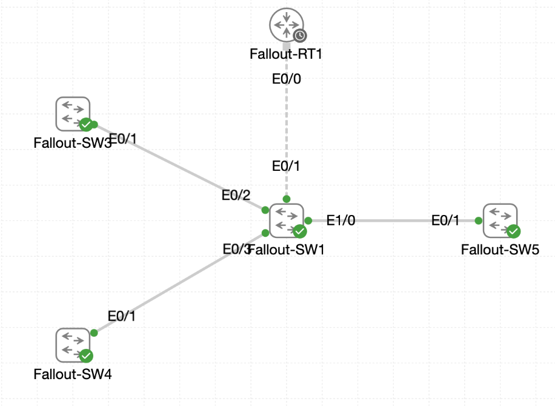

# Lab 031 - Castle Rysen Fallout Shelter VLAN Implementation

<p class="back-link">
  <a href="../../Lab-index.html">Back to Lab Index</a>
</p>

<table>
<tr>
<td colspan="2" valign="top">

# Objective

#### Build the fallout shelter VLAN database on `Fallout-SW1`.
#### Use VTP to publish VLANs 10, 20, 30 and 40 to the connected access switches.
#### Configure trunk links from the core switch to the router and access switches.
#### Assign available access ports to the correct shelter VLANs.
#### Build a router-on-a-stick gateway on `Fallout-RT1`.
#### Configure DHCP pools for each VLAN subnet and verify the resulting configuration.

</td>
</tr>

<tr>
<td valign="top">

</td>
</tr>
</table>

---

## Scenario

This lab simulates a Castle Rysen fallout shelter segmentation rebuild.

The shelter core switch, `Fallout-SW1`, needed to hold the authoritative VLAN database and share it with the available access switches using VTP. The lab used a trimmed five-node topology, so only `Fallout-RT1`, `Fallout-SW1`, `Fallout-SW3`, `Fallout-SW4` and `Fallout-SW5` were available.

The final design required four VLANs:

* A management VLAN.
* An internal communications VLAN.
* A video surveillance VLAN.
* A guest access VLAN.

The router was then configured for router-on-a-stick inter-VLAN routing, with separate DHCP pools for each VLAN subnet.

---

## Devices Used

* Fallout-RT1
* Fallout-SW1
* Fallout-SW3
* Fallout-SW4
* Fallout-SW5

---

## Live Topology Notes

This Interactive Console lab exposed only five console tabs.

There were no `Fallout-SW2`, `Fallout-SW6` or workstation console tabs available.

| Link | Interface Mapping |
| ---- | ----------------- |
| Fallout-SW1 to Fallout-RT1 | Fallout-SW1 Ethernet0/1 to Fallout-RT1 Ethernet0/0 |
| Fallout-SW1 to Fallout-SW3 | Fallout-SW1 Ethernet0/2 to Fallout-SW3 Ethernet0/1 |
| Fallout-SW1 to Fallout-SW4 | Fallout-SW1 Ethernet0/3 to Fallout-SW4 Ethernet0/1 |
| Fallout-SW1 to Fallout-SW5 | Fallout-SW1 Ethernet1/0 to Fallout-SW5 Ethernet0/1 |

---

## VLAN Plan

| VLAN ID | Name | Purpose |
| ------: | ---- | ------- |
| 10 | MGMT-FALLOUT | Shelter management network |
| 20 | INTERNAL-COMMS | Internal communications network |
| 30 | VIDEO-SURVEILLANCE | Video/NVR network |
| 40 | GUEST-ACCESS | Survivor guest access network |

---

## IP Addressing and DHCP Plan

| VLAN | Subinterface | Gateway | DHCP Network |
| ---- | ------------ | ------- | ------------ |
| 10 | Ethernet0/0.10 | 10.0.16.1/25 | 10.0.16.0/25 |
| 20 | Ethernet0/0.20 | 10.0.16.129/25 | 10.0.16.128/25 |
| 30 | Ethernet0/0.30 | 10.0.17.1/25 | 10.0.17.0/25 |
| 40 | Ethernet0/0.40 | 10.0.17.129/25 | 10.0.17.128/25 |

All DHCP pools used:

```bash
dns-server 1.1.1.1
domain-name fallout.local
```

---

## Final Trunk Plan

| Device | Interface | Link Role | Allowed VLANs |
| ------ | --------- | --------- | ------------- |
| Fallout-SW1 | Ethernet0/1 | Trunk to Fallout-RT1 | 10,20,30,40 |
| Fallout-SW1 | Ethernet0/2 | Trunk to Fallout-SW3 | 10,20,30,40 |
| Fallout-SW1 | Ethernet0/3 | Trunk to Fallout-SW4 | 10,20,30,40 |
| Fallout-SW1 | Ethernet1/0 | Trunk to Fallout-SW5 | 10,20,30,40 |

---

## Access Port Plan

| Device | Interface | Description | VLAN |
| ------ | --------- | ----------- | ---- |
| Fallout-SW3 | Ethernet0/3 | MGMT-CONSOLE | 10 |
| Fallout-SW4 | Ethernet0/3 | INTERNAL-WORKSTATION | 20 |
| Fallout-SW5 | Ethernet0/3 | VIDEO-NVR | 30 |
| Fallout-SW5 | Ethernet1/1 | GUEST-KIOSK | 40 |

---

## Configuration Steps

### Step 1 - Capture the Starting VTP State

The first task was to check the VTP status on `Fallout-SW1`.

```bash
show vtp status
```

### Result

The initial output showed:

```bash
VTP Domain Name                 :
VTP Operating Mode              : Server
Number of existing VLANs        : 5
Configuration Revision          : 0
```

### Explanation

This confirmed a clean starting point.

The switch was already in VTP server mode, but no VTP domain was configured and only the five default VLANs existed.

---

### Step 2 - Capture the Starting VLAN Inventory

The existing VLAN table was checked.

```bash
show vlan
```

### Result

Only the default VLANs were present:

```bash
1    default                          active    Et0/0, Et0/1, Et0/2, Et0/3
                                                Et1/0, Et1/1, Et1/2, Et1/3
1002 fddi-default                     act/unsup
1003 token-ring-default               act/unsup
1004 fddinet-default                  act/unsup
1005 trnet-default                    act/unsup
```

### Explanation

The shelter VLANs had not yet been created.

The trunk check also returned no output:

```bash
show interface trunk | begin Port
```

This confirmed that no interfaces were trunking at the start of the lab.

---

### Step 3 - Configure the VTP Domain and VLANs on Fallout-SW1

`Fallout-SW1` was assigned to the `fallout` VTP domain and kept in server mode.

```bash
configure terminal
vtp domain fallout
vtp mode server
vlan 10
name MGMT-FALLOUT
vlan 20
name INTERNAL-COMMS
vlan 30
name VIDEO-SURVEILLANCE
vlan 40
name GUEST-ACCESS
end
```

### Result

The switch confirmed the VTP domain change:

```bash
Changing VTP domain name from NULL to fallout
%SW_VLAN-6-VTP_DOMAIN_NAME_CHG: VTP domain name changed to fallout.
```

The verification output showed:

```bash
VTP Domain Name                 : fallout
VTP Operating Mode              : Server
Number of existing VLANs        : 9
Configuration Revision          : 4
```

The new VLANs were present:

```bash
10   MGMT-FALLOUT                     active
20   INTERNAL-COMMS                   active
30   VIDEO-SURVEILLANCE               active
40   GUEST-ACCESS                     active
```

### Explanation

Creating four VLANs increased the VLAN count from 5 to 9 and moved the VTP configuration revision to 4.

---

### Step 4 - Configure Fallout-SW1 Trunks

The router trunk and three access-switch trunks were configured from `Fallout-SW1`.

```bash
configure terminal
interface ethernet0/1
description "Uplink to Fallout-RT1"
switchport trunk encapsulation dot1q
switchport mode trunk
switchport trunk allowed vlan 10,20,30,40
exit

interface ethernet0/2
description Link to Fallout-SW3
switchport trunk encapsulation dot1q
switchport mode trunk
switchport trunk allowed vlan 10,20,30,40
exit

interface ethernet0/3
description Link to Fallout-SW4
switchport trunk encapsulation dot1q
switchport mode trunk
switchport trunk allowed vlan 10,20,30,40
exit

interface ethernet1/0
description Link to Fallout-SW5
switchport trunk encapsulation dot1q
switchport mode trunk
switchport trunk allowed vlan 10,20,30,40
end
```

### Result

Each trunk briefly cycled line protocol as trunking came up.

The final trunk verification showed:

```bash
Port           Mode             Encapsulation  Status        Native vlan
Et0/1          on               802.1q         trunking      1
Et0/2          on               802.1q         trunking      1
Et0/3          on               802.1q         trunking      1
Et1/0          on               802.1q         trunking      1
```

Allowed VLANs:

```bash
Port           Vlans allowed on trunk
Et0/1          10,20,30,40
Et0/2          10,20,30,40
Et0/3          10,20,30,40
Et1/0          10,20,30,40
```

Forwarding VLANs:

```bash
Port           Vlans in spanning tree forwarding state and not pruned
Et0/1          10,20,30,40
Et0/2          10,20,30,40
Et0/3          10,20,30,40
Et1/0          10,20,30,40
```

### Explanation

This confirmed that `Fallout-SW1` was now trunking to the router and all three access switches. The trunks were restricted to only the four required shelter VLANs.

---

### Step 5 - Verify VTP Learning on Fallout-SW3

`Fallout-SW3` was checked to confirm that it learned the VTP domain and VLANs.

```bash
show vtp status
show vlan brief | include 10  |20  |30  |40
show interface trunk | begin Port
```

### Result

`Fallout-SW3` showed:

```bash
VTP Domain Name                 : fallout
VTP Operating Mode              : Server
Number of existing VLANs        : 9
Configuration Revision          : 4
```

It had learned all four VLANs:

```bash
10   MGMT-FALLOUT                     active
20   INTERNAL-COMMS                   active
30   VIDEO-SURVEILLANCE               active
40   GUEST-ACCESS                     active
```

Its uplink was trunking:

```bash
Port           Mode             Encapsulation  Status        Native vlan
Et0/1          auto             n-802.1q       trunking      1
```

### Explanation

VTP propagation was working. The access switch learned the VLAN database from the core switch and had an operational trunk back towards `Fallout-SW1`.

---

### Step 6 - Verify VTP Learning on Fallout-SW4

`Fallout-SW4` was checked next.

```bash
show vlan brief | include 10  |20  |30  |40
show interface trunk | begin Port
```

### Result

`Fallout-SW4` had learned VLANs 10, 20, 30 and 40:

```bash
10   MGMT-FALLOUT                     active
20   INTERNAL-COMMS                   active
30   VIDEO-SURVEILLANCE               active
40   GUEST-ACCESS                     active
```

The uplink was trunking:

```bash
Port           Mode             Encapsulation  Status        Native vlan
Et0/1          auto             n-802.1q       trunking      1
```

### Explanation

This confirmed that VLAN learning and trunking were also working between `Fallout-SW1` and `Fallout-SW4`.

---

### Step 7 - Verify VTP Learning on Fallout-SW5

`Fallout-SW5` was checked as the final access switch.

```bash
show vlan brief | include 10  |20  |30  |40
show interface trunk | begin Port
```

### Result

`Fallout-SW5` had learned all required VLANs:

```bash
10   MGMT-FALLOUT                     active
20   INTERNAL-COMMS                   active
30   VIDEO-SURVEILLANCE               active
40   GUEST-ACCESS                     active
```

The trunk was active:

```bash
Port           Mode             Encapsulation  Status        Native vlan
Et0/1          auto             n-802.1q       trunking      1
```

### Explanation

All available access switches had now learned the VTP domain and the four shelter VLANs.

---

### Step 8 - Configure the Management Access Port on Fallout-SW3

`Fallout-SW3` Ethernet0/3 was assigned to VLAN 10.

```bash
configure terminal
interface ethernet0/3
description MGMT-CONSOLE
switchport mode access
switchport access vlan 10
spanning-tree portfast
end
```

### Verification

```bash
show vlan brief | include 10  |et0/3
```

### Result

```bash
10   MGMT-FALLOUT                     active    Et0/3
```

### Explanation

The management console access port was successfully placed into VLAN 10.

---

### Step 9 - Configure the Internal Workstation Access Port on Fallout-SW4

`Fallout-SW4` Ethernet0/3 was assigned to VLAN 20.

```bash
configure terminal
interface ethernet0/3
description INTERNAL-WORKSTATION
switchport mode access
switchport access vlan 20
spanning-tree portfast
end
```

### Verification

```bash
show vlan brief | include 20  |et0/3
```

### Result

```bash
20   INTERNAL-COMMS                   active    Et0/3
```

### Explanation

The internal workstation port was successfully placed into VLAN 20.

---

### Step 10 - Configure Video and Guest Access Ports on Fallout-SW5

Because the trimmed lab had no `Fallout-SW6`, both remaining access-port checks were completed on `Fallout-SW5`.

```bash
configure terminal
interface ethernet0/3
description VIDEO-NVR
switchport mode access
switchport access vlan 30
spanning-tree portfast
exit

interface ethernet1/1
description GUEST-KIOSK
switchport mode access
switchport access vlan 40
spanning-tree portfast
end
```

### Verification

```bash
show vlan brief | include 30  |40  |et0/3|et1/1
```

### Result

```bash
30   VIDEO-SURVEILLANCE               active    Et0/3
40   GUEST-ACCESS                     active    Et1/1
```

### Explanation

The available `Fallout-SW5` ports were successfully assigned:

* Ethernet0/3 to VLAN 30 for video surveillance.
* Ethernet1/1 to VLAN 40 for guest access.

---

## Router-on-a-Stick Gateway

### Step 11 - Activate the Router Parent Interface

On `Fallout-RT1`, the physical router interface was enabled.

```bash
configure terminal
interface ethernet0/0
no shutdown
```

### Result

The interface came up:

```bash
%LINK-3-UPDOWN: Interface Ethernet0/0, changed state to up
%LINEPROTO-5-UPDOWN: Line protocol on Interface Ethernet0/0, changed state to up
```

### Explanation

The parent interface must be up before the router-on-a-stick subinterfaces can pass traffic.

---

### Step 12 - Configure Router Subinterfaces

Subinterfaces were created for each VLAN.

```bash
interface ethernet0/0.10
encapsulation dot1q 10
ip address 10.0.16.1 255.255.255.128
exit

interface ethernet0/0.20
encapsulation dot1q 20
ip address 10.0.16.129 255.255.255.128
exit

interface ethernet0/0.30
encapsulation dot1q 30
ip address 10.0.17.1 255.255.255.128
exit

interface ethernet0/0.40
encapsulation dot1q 40
ip address 10.0.17.129 255.255.255.128
exit
```

### Explanation

Each subinterface was mapped to a different 802.1Q VLAN tag and given the gateway address for that VLAN.

---

### Step 13 - Configure DHCP Pools

Four DHCP pools were created.

```bash
ip dhcp pool MGMT
network 10.0.16.0 255.255.255.128
default-router 10.0.16.1
dns-server 1.1.1.1
domain-name fallout.local

ip dhcp pool INTERNAL
network 10.0.16.128 255.255.255.128
default-router 10.0.16.129
dns-server 1.1.1.1
domain-name fallout.local

ip dhcp pool VIDEO
network 10.0.17.0 255.255.255.128
default-router 10.0.17.1
dns-server 1.1.1.1
domain-name fallout.local

ip dhcp pool GUEST
network 10.0.17.128 255.255.255.128
default-router 10.0.17.129
dns-server 1.1.1.1
domain-name fallout.local
```

### Verification

```bash
show running-config | section ip dhcp pool
show ip dhcp binding
```

### Result

The DHCP pools were present in the running configuration:

```bash
ip dhcp pool MGMT
 network 10.0.16.0 255.255.255.128
 default-router 10.0.16.1
 dns-server 1.1.1.1
 domain-name fallout.local
ip dhcp pool INTERNAL
 network 10.0.16.128 255.255.255.128
 default-router 10.0.16.129
 dns-server 1.1.1.1
 domain-name fallout.local
ip dhcp pool VIDEO
 network 10.0.17.0 255.255.255.128
 default-router 10.0.17.1
 dns-server 1.1.1.1
 domain-name fallout.local
ip dhcp pool GUEST
 network 10.0.17.128 255.255.255.128
 default-router 10.0.17.129
 dns-server 1.1.1.1
 domain-name fallout.local
```

The DHCP binding table was empty:

```bash
Bindings from all pools not associated with VRF:
IP address      Client-ID/              Lease expiration        Type       State      Interface
                Hardware address/
                User name
```

### Explanation

The empty DHCP binding table was expected because the trimmed lab did not include workstation console tabs or active DHCP clients.

---

## Final Verification

### Fallout-SW1 VTP Verification

`Fallout-SW1` showed the expected VTP state:

```bash
VTP Domain Name                 : fallout
VTP Operating Mode              : Server
Number of existing VLANs        : 9
Configuration Revision          : 4
```

### Fallout-SW1 Trunk Verification

All required trunks were active:

```bash
Port           Mode             Encapsulation  Status        Native vlan
Et0/1          on               802.1q         trunking      1
Et0/2          on               802.1q         trunking      1
Et0/3          on               802.1q         trunking      1
Et1/0          on               802.1q         trunking      1
```

All four VLANs were allowed and forwarding:

```bash
Port           Vlans in spanning tree forwarding state and not pruned
Et0/1          10,20,30,40
Et0/2          10,20,30,40
Et0/3          10,20,30,40
Et1/0          10,20,30,40
```

### Access Switch VLAN Verification

The access switches learned VLANs 10, 20, 30 and 40 through VTP.

Each access-switch uplink showed as trunking on Ethernet0/1.

### Access Port Verification

The final access-port checks showed:

```bash
10   MGMT-FALLOUT                     active    Et0/3
20   INTERNAL-COMMS                   active    Et0/3
30   VIDEO-SURVEILLANCE               active    Et0/3
40   GUEST-ACCESS                     active    Et1/1
```

### Router and DHCP Verification

The captured configuration shows the router parent interface being enabled, the four subinterfaces being configured, and the DHCP pools being present in the running configuration.

The command:

```bash
show ip interface brief | include eth0/0
```

returned no output in the captured evidence. This was a filtering issue caused by matching lowercase `eth0/0` against the IOS interface display format. A better final command would be:

```bash
show ip interface brief | include Ethernet0/0
```

or simply:

```bash
show ip interface brief
```

---

## Troubleshooting

### Issue 1 - No Initial Trunk Output

#### Problem

The initial trunk check returned no output:

```bash
show interface trunk | begin Port
```

#### Diagnosis

No ports were trunking at the start of the lab.

#### Fix / Outcome

The required trunk links were configured on `Fallout-SW1` using:

```bash
switchport trunk encapsulation dot1q
switchport mode trunk
switchport trunk allowed vlan 10,20,30,40
```

---

### Issue 2 - Mistyped Trunk Command on Fallout-SW5

#### Problem

The command was mistyped:

```bash
show interface trunl | begin Port
```

#### Diagnosis

IOS rejected the command:

```bash
% Invalid input detected at '^' marker.
```

#### Fix

The correct command was entered:

```bash
show interface trunk | begin Port
```

---

### Issue 3 - Mistyped PortFast Command on Fallout-SW5

#### Problem

The command was entered with an extra `n`:

```bash
spannning-tree portfast
```

#### Diagnosis

IOS rejected the command:

```bash
% Invalid input detected at '^' marker.
```

#### Fix

The correct command was applied:

```bash
spanning-tree portfast
```

---

### Issue 4 - Mistyped Router Shutdown Command

#### Problem

On `Fallout-RT1`, the router interface command was mistyped:

```bash
mo shutdown
```

#### Diagnosis

IOS rejected the command:

```bash
% Invalid input detected at '^' marker.
```

#### Fix

The correct command was used:

```bash
no shutdown
```

---

### Issue 5 - Duplicate VLAN Tag on Router Subinterface

#### Problem

While configuring `Ethernet0/0.20`, VLAN tag 10 was entered by mistake:

```bash
encapsulation dot1q 10
```

#### Diagnosis

IOS rejected the duplicate VLAN tag:

```bash
%Configuration of multiple subinterfaces of the same main
interface with the same VID (10) is not permitted.
This VID is already configured on Ethernet0/0.10.
```

#### Fix

The correct VLAN tag was applied:

```bash
encapsulation dot1q 20
```

---

### Issue 6 - Router Interface Verification Filter Returned No Output

#### Problem

The command below returned no output:

```bash
show ip interface brief | include eth0/0
```

#### Diagnosis

The filter used lowercase text, while IOS displays the interface as `Ethernet0/0`.

#### Fix / Recommendation

Use a case-matching filter or show the full table:

```bash
show ip interface brief | include Ethernet0/0
show ip interface brief
```

---

## Key Learning Points

* VTP can distribute VLAN database changes from a server switch to connected switches.
* VTP revision numbers increase when VLAN database changes are made.
* A trunk is required between switches when multiple VLANs must cross a single physical link.
* `switchport trunk allowed vlan` limits which VLANs can traverse a trunk.
* Access ports belong to one VLAN and are suitable for end devices.
* `spanning-tree portfast` is used on end-host access ports, but should not be used carelessly on links to other switches.
* Router-on-a-stick uses subinterfaces to route between VLANs over one physical router interface.
* Each router subinterface must use a unique 802.1Q VLAN tag.
* DHCP pools must match the subnet and default gateway for each VLAN.
* `show ip dhcp binding` can be empty when no DHCP clients are present.
* IOS include filters are case-sensitive enough in practice to miss expected output when the displayed text does not match the filter.
* CLI mistakes are useful troubleshooting evidence when the correction is also captured.

---

## Completion Check

The lab was completed successfully with one minor verification-capture note.

* `Fallout-SW1` was placed in the `fallout` VTP domain.
* `Fallout-SW1` remained in VTP server mode.
* VLANs 10, 20, 30 and 40 were created with the required names.
* `Fallout-SW1` showed 9 existing VLANs after the four new VLANs were added.
* `Fallout-SW1` showed VTP configuration revision 4.
* `Fallout-SW1` Ethernet0/1 trunked to `Fallout-RT1`.
* `Fallout-SW1` Ethernet0/2 trunked to `Fallout-SW3`.
* `Fallout-SW1` Ethernet0/3 trunked to `Fallout-SW4`.
* `Fallout-SW1` Ethernet1/0 trunked to `Fallout-SW5`.
* All `Fallout-SW1` trunks allowed VLANs 10, 20, 30 and 40.
* `Fallout-SW3`, `Fallout-SW4` and `Fallout-SW5` learned the VLAN database through VTP.
* `Fallout-SW3` Ethernet0/3 was assigned to VLAN 10.
* `Fallout-SW4` Ethernet0/3 was assigned to VLAN 20.
* `Fallout-SW5` Ethernet0/3 was assigned to VLAN 30.
* `Fallout-SW5` Ethernet1/1 was assigned to VLAN 40.
* `Fallout-RT1` Ethernet0/0 was enabled.
* Router subinterfaces were configured for VLANs 10, 20, 30 and 40.
* DHCP pools were configured for MGMT, INTERNAL, VIDEO and GUEST.
* `show ip dhcp binding` was empty, as expected, because the lab had no active workstation clients.
* Recommended evidence improvement: recapture `show ip interface brief` without the lowercase include filter.

---

## Evidence

The raw CLI output for this lab is stored here:

[Raw CLI Output](evidence/raw-cli-output.md)
