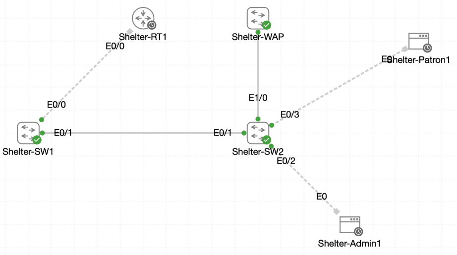

# Lab 032 - Fortifying the Shelter VLAN Core

<p class="back-link">
  <a href="../../Lab-index.html">Back to Lab Index</a>
</p>

<table>
<tr>
<td colspan="2" valign="top">

# Objective

#### Publish the shelter VLAN blueprint on both switches.
#### Move both switches into the `FALLOUT` VTP domain and lock them into transparent mode.
#### Harden all trunk links with static 802.1Q trunking, native VLAN 99 and DTP disabled.
#### Build router-on-a-stick gateways and DHCP services on `Shelter-RT1`.
#### Place endpoint and management access ports in the correct VLANs.
#### Shut down unused switchports and verify client addressing, routing and DHCP bindings.

</td>
</tr>

<tr>
<td valign="top">

</td>
</tr>
</table>

---

## Scenario

This lab simulates a hardened Castle Rysen shelter network build.

The shelter contains two switches, one router and two available endpoint consoles:

* `Shelter-SW1`
* `Shelter-SW2`
* `Shelter-RT1`
* `Shelter-Admin1`
* `Shelter-Patron1`

The target design required four production VLANs and one dedicated management/native VLAN. The switch fabric had to be hardened so trunks used static 802.1Q encapsulation, VLAN 99 as the native VLAN, and disabled Dynamic Trunking Protocol.

The router then provided inter-VLAN gateway services and DHCP scopes for all VLANs. The available hosts were used to prove DHCP and gateway reachability for VLAN 10 and VLAN 20.

---

## Devices Used

* Shelter-RT1
* Shelter-SW1
* Shelter-SW2
* Shelter-Admin1
* Shelter-Patron1

---

## Access Credentials Used

| Function | Credential |
| -------- | ---------- |
| Console / VTY | `castle` / `StayAlive!12` |
| Privileged EXEC | `Bunker!Shield` |
| TinyCore Linux hosts | `cisco` / `cisco` |

The endpoint credential point mattered during the lab because `Shelter-Admin1` rejected the switch/router lab credentials and accepted the TinyCore Linux `cisco` login instead.

---

## VLAN Plan

| VLAN | Name | Purpose |
| ---: | ---- | ------- |
| 10 | MGMT-FALLOUT | Admin / management client segment |
| 20 | INTERNAL-COMMS | Patron / internal communications segment |
| 30 | VIDEO-SURVEILLANCE | Video surveillance segment |
| 40 | GUEST-ACCESS | Guest access segment |
| 99 | MGMT-NATIVE | Management and native VLAN |

---

## Addressing Plan

| VLAN | Router Interface | Gateway | Subnet |
| ---: | ---------------- | ------- | ------ |
| 10 | Ethernet0/0.10 | 10.0.16.1 | 10.0.16.0/25 |
| 20 | Ethernet0/0.20 | 10.0.16.129 | 10.0.16.128/25 |
| 30 | Ethernet0/0.30 | 10.0.17.1 | 10.0.17.0/25 |
| 40 | Ethernet0/0.40 | 10.0.17.129 | 10.0.17.128/25 |
| 99 | Ethernet0/0.99 | 10.0.99.1 | 10.0.99.0/27 |

All DHCP pools used:

```bash
dns-server 1.1.1.1
domain-name fallout.local
```

---

## Interface Plan

| Device | Interface | Final Role |
| ------ | --------- | ---------- |
| Shelter-SW1 | Ethernet0/0 | Trunk to Shelter-RT1 |
| Shelter-SW1 | Ethernet0/1 | Trunk to Shelter-SW2 |
| Shelter-SW1 | Ethernet0/2 | Virtualisation management uplink in VLAN 99 |
| Shelter-SW2 | Ethernet0/1 | Trunk to Shelter-SW1 |
| Shelter-SW2 | Ethernet0/2 | Shelter-Admin1 access port in VLAN 10 |
| Shelter-SW2 | Ethernet0/3 | Shelter-Patron1 access port in VLAN 20 |
| Shelter-SW2 | Ethernet1/0 | Trunk to shelter access point |

Important live-topology correction: the task brief referenced `Shelter-SW2 Ethernet0/4` for the access point uplink, but the live IOL switch did not expose Ethernet0/4. The actual working interface was `Ethernet1/0`.

---

## Configuration Steps

### Step 1 - Capture the Starting State on Shelter-SW1

The initial VLAN and VTP state was captured before making changes.

```bash
show vlan
show vtp status
```

### Result

`Shelter-SW1` started with only the default VLANs:

```bash
1    default                          active    Et0/0, Et0/1, Et0/2, Et0/3
                                                Et1/0, Et1/1, Et1/2, Et1/3
                                                Et2/0, Et2/1, Et2/2, Et2/3
1002 fddi-default                     act/unsup
1003 token-ring-default               act/unsup
1004 fddinet-default                  act/unsup
1005 trnet-default                    act/unsup
```

The VTP status showed no domain and a clean revision:

```bash
VTP Domain Name                 :
VTP Operating Mode              : Server
Number of existing VLANs        : 5
Configuration Revision          : 0
```

### Explanation

This gave a clean baseline before the shelter VLAN catalogue was added.

---

### Step 2 - Create the VLAN Catalogue on Shelter-SW1

The `FALLOUT` VTP domain was configured and VLANs 10, 20, 30, 40 and 99 were created.

```bash
configure terminal
vtp domain FALLOUT
vlan 10
name MGMT-FALLOUT
vlan 20
name INTERNAL-COMMS
vlan 30
name VIDEO-SURVEILLANCE
vlan 40
name GUEST-ACCESS
vlan 99
name MGMT-NATIVE
vtp mode transparent
```

### Result

The final VTP state on `Shelter-SW1` showed:

```bash
VTP Domain Name                 : FALLOUT
VTP Operating Mode              : Transparent
Number of existing VLANs        : 10
Configuration Revision          : 0
```

### Explanation

The five required VLANs were present locally. The switch was then placed into VTP transparent mode so it would keep its own VLAN database and avoid external VTP overwrites.

The configuration revision reset to `0` after transparent mode was enabled. This was expected and important to document.

---

### Step 3 - Mirror the VLAN Catalogue on Shelter-SW2

The same VLANs were created on `Shelter-SW2`.

```bash
configure terminal
vtp domain FALLOUT
vlan 10
name MGMT-FALLOUT
vlan 20
name INTERNAL-COMMS
vlan 30
name VIDEO-SURVEILLANCE
vlan 40
name GUEST-ACCESS
vlan 99
name MGMT-NATIVE
vtp mode transparent
```

### Result

Before transparent mode, `Shelter-SW2` showed revision 5 after the VLANs were created:

```bash
VTP Operating Mode              : Server
Number of existing VLANs        : 10
Configuration Revision          : 5
```

After switching to transparent mode:

```bash
VTP Operating Mode              : Transparent
Number of existing VLANs        : 10
Configuration Revision          : 0
```

### Explanation

Both switches had the same VLAN names and IDs, and both were locked into VTP transparent mode.

---

### Step 4 - Configure the Inter-Switch Trunk

The inter-switch link was configured as a static trunk with native VLAN 99 and DTP disabled.

On `Shelter-SW1`:

```bash
interface ethernet0/1
description Trunk-to-Shelter-SW2
switchport trunk encapsulation dot1q
switchport mode trunk
switchport trunk native vlan 99
switchport trunk allowed vlan 10,20,30,40,99
switchport nonegotiate
no shutdown
```

On `Shelter-SW2`:

```bash
interface ethernet0/1
description Trunk-to-Shelter-SW1
switchport trunk encapsulation dot1q
switchport mode trunk
switchport trunk native vlan 99
switchport trunk allowed vlan 10,20,30,40,99
switchport nonegotiate
no shutdown
```

### Result

While only one side had been changed, native VLAN mismatch and spanning-tree inconsistency messages appeared:

```bash
%SPANTREE-2-BLOCK_PVID_PEER: Blocking Ethernet0/1 on VLAN0001. Inconsistent peer vlan.
%SPANTREE-2-BLOCK_PVID_LOCAL: Blocking Ethernet0/1 on VLAN0099. Inconsistent local vlan.
%CDP-4-NATIVE_VLAN_MISMATCH: Native VLAN mismatch discovered on Ethernet0/1 (99), with Shelter-SW2 Ethernet0/1 (1).
```

After `Shelter-SW2` was corrected, spanning tree restored the port:

```bash
%SPANTREE-2-UNBLOCK_CONSIST_PORT: Unblocking Ethernet0/1 on VLAN0099. Port consistency restored.
%SPANTREE-2-UNBLOCK_CONSIST_PORT: Unblocking Ethernet0/1 on VLAN0001. Port consistency restored.
```

### Verification

```bash
show interfaces trunk
show interfaces ethernet0/1 switchport
```

Final trunk state:

```bash
Et0/1          on               802.1q         trunking      99
```

Switchport detail confirmed:

```bash
Administrative Mode: trunk
Operational Mode: trunk
Negotiation of Trunking: Off
Trunking Native Mode VLAN: 99 (MGMT-NATIVE)
Trunking VLANs Enabled: 10,20,30,40,99
```

### Explanation

The mismatch was expected during the partial-change window. It cleared once both ends used VLAN 99 as the native VLAN.

---

### Step 5 - Configure the Router Trunk on Shelter-SW1

The router-facing switchport on `Shelter-SW1` required extra troubleshooting.

The first attempt missed the explicit trunk encapsulation command:

```bash
switchport trunk encapsulation
% Incomplete command.

switchport mode trunk
Command rejected: An interface whose trunk encapsulation is "Auto" can not be configured to "trunk" mode.
```

Because the interface was still effectively dynamic, DTP hardening also failed:

```bash
switchport nonegotiate
Command rejected: Conflict between 'nonegotiate' and 'dynamic' status on this interface: Et0/0
```

The corrected configuration was applied later:

```bash
interface ethernet0/0
description Trunk to Shelter-RT1
switchport trunk encapsulation dot1q
switchport mode trunk
switchport trunk native vlan 99
switchport trunk allowed vlan 10,20,30,40,99
switchport nonegotiate
no shutdown
```

### Result

The final trunk table showed `Et0/0` trunking correctly:

```bash
Port           Mode             Encapsulation  Status        Native vlan
Et0/0          on               802.1q         trunking      99
Et0/1          on               802.1q         trunking      99
```

Switchport detail confirmed DTP negotiation was off:

```bash
Name: Et0/0
Administrative Mode: trunk
Operational Mode: trunk
Administrative Trunking Encapsulation: dot1q
Operational Trunking Encapsulation: dot1q
Negotiation of Trunking: Off
Trunking Native Mode VLAN: 99 (MGMT-NATIVE)
Trunking VLANs Enabled: 10,20,30,40,99
```

### Explanation

This was the key fix for the early endpoint problem. Before `Et0/0` was a proper trunk to the router, the admin host could not reach its gateway.

---

### Step 6 - Configure the Access Point Trunk on Shelter-SW2

The task brief referred to `Ethernet0/4`, but this interface did not exist on the live switch.

```bash
interface ethernet0/4
% Invalid input detected at '^' marker.
```

The live uplink was found and configured on `Ethernet1/0`.

```bash
interface ethernet1/0
description Trunk to Shelter Access Point
switchport trunk encapsulation dot1q
switchport mode trunk
switchport trunk native vlan 99
switchport trunk allowed vlan 10,20
switchport nonegotiate
no shutdown
```

### Result

`Shelter-SW2` showed two trunks:

```bash
Et0/1          on               802.1q         trunking      99
Et1/0          on               802.1q         trunking      99
```

The access point trunk was limited to VLANs 10 and 20:

```bash
Et1/0          10,20
```

### Explanation

This matched the intended design: the switch-to-switch trunk carried VLANs 10, 20, 30, 40 and 99, while the access point uplink only carried VLANs 10 and 20 with native VLAN 99.

---

## Router-on-a-Stick Configuration

### Step 7 - Configure Shelter-RT1 Subinterfaces

The physical parent interface was enabled and kept unnumbered. Subinterfaces were created for each VLAN.

```bash
interface ethernet0/0
description Trunk to Shelter-SW1
no ip address
no shutdown

interface ethernet0/0.10
description Gateway for VLAN 10
encapsulation dot1q 10
ip address 10.0.16.1 255.255.255.128

interface ethernet0/0.20
description Gateway for VLAN 20
encapsulation dot1q 20
ip address 10.0.16.129 255.255.255.128

interface ethernet0/0.30
description Gateway for VLAN 30
encapsulation dot1q 30
ip address 10.0.17.1 255.255.255.128

interface ethernet0/0.40
description Gateway for VLAN 40
encapsulation dot1q 40
ip address 10.0.17.129 255.255.255.128

interface ethernet0/0.99
description native management gateway for VLAN 99
encapsulation dot1q 99 native
ip address 10.0.99.1 255.255.255.224
```

### Result

The router showed all required interfaces up/up:

```bash
Ethernet0/0            unassigned      YES TFTP   up                    up
Ethernet0/0.10         10.0.16.1       YES manual up                    up
Ethernet0/0.20         10.0.16.129     YES manual up                    up
Ethernet0/0.30         10.0.17.1       YES manual up                    up
Ethernet0/0.40         10.0.17.129     YES manual up                    up
Ethernet0/0.99         10.0.99.1       YES manual up                    up
```

### Explanation

This completed the router-on-a-stick gateway design. VLAN 99 was configured as the native subinterface to match the switch trunk native VLAN.

---

### Step 8 - Configure DHCP Pools

Gateway addresses were excluded and DHCP pools were configured for all five VLANs.

```bash
ip dhcp excluded-address 10.0.16.1
ip dhcp excluded-address 10.0.16.129
ip dhcp excluded-address 10.0.17.1
ip dhcp excluded-address 10.0.17.129
ip dhcp excluded-address 10.0.99.1
```

The final DHCP pool configuration was:

```bash
ip dhcp pool MGMT
 network 10.0.16.0 255.255.255.128
 default-router 10.0.16.1
 dns-server 1.1.1.1
 domain-name fallout.local
ip dhcp pool INTERNAL
 network 10.0.16.128 255.255.255.128
 default-router 10.0.16.129
 dns-server 1.1.1.1
 domain-name fallout.local
ip dhcp pool GUEST
 network 10.0.17.128 255.255.255.128
 default-router 10.0.17.129
 dns-server 1.1.1.1
 domain-name fallout.local
ip dhcp pool MGMT-NATIVE
 network 10.0.99.0 255.255.255.224
 default-router 10.0.99.1
 dns-server 1.1.1.1
 domain-name fallout.local
ip dhcp pool VIDEO
 network 10.0.17.0 255.255.255.128
 default-router 10.0.17.1
 dns-server 1.1.1.1
 domain-name fallout.local
```

### Explanation

The `VIDEO` pool had to be corrected. It was initially entered with the host address `10.0.17.1` as the network statement and without a complete default-router line. The pool was removed and recreated using the correct subnet:

```bash
no ip dhcp pool VIDEO
ip dhcp pool VIDEO
 network 10.0.17.0 255.255.255.128
 default-router 10.0.17.1
```

---

## Endpoint and Port Configuration

### Step 9 - Configure Shelter-SW2 Access Ports

`Shelter-Admin1` and `Shelter-Patron1` were placed into their required VLANs.

```bash
interface ethernet0/2
description Shelter-Admin1 - vlan 10
switchport mode access
switchport access vlan 10
spanning-tree portfast
no shutdown

interface ethernet0/3
description Shelter-Patron1 - VLAN 20
switchport mode access
switchport access vlan 20
spanning-tree portfast
no shutdown
```

### Result

`Shelter-SW2` confirmed:

```bash
10   MGMT-FALLOUT                     active    Et0/2
20   INTERNAL-COMMS                   active    Et0/3
```

Interface status showed both ports connected:

```bash
Et0/2        Shelter-Admin1 - v connected    10
Et0/3        Shelter-Patron1 -  connected    20
```

---

### Step 10 - Configure the VLAN 99 Management Uplink

The task brief requested `Shelter-SW1 Ethernet0/5`, but that interface was not available in the live IOL switch.

```bash
interface ethernet0/5
% Invalid input detected at '^' marker.
```

The available replacement port was `Ethernet0/2`.

```bash
interface ethernet0/2
description Virtualisation management uplink - VLAN 99
switchport mode access
switchport access vlan 99
spanning-tree portfast
no shutdown
```

### Result

`Shelter-SW1` showed:

```bash
99   MGMT-NATIVE                      active    Et0/2
```

The port was connected in VLAN 99:

```bash
Et0/2        Virtualisation man connected    99
```

---

### Step 11 - Shut Down Unused Ports

Unused interfaces on both switches were moved into access mode, placed in VLAN 1, described and shut down.

Example pattern:

```bash
interface range ethernet0/3, ethernet1/0 - 3, ethernet2/0 - 3
description UNUSED-ADMINISTRATIVELY SHUTDOWN
switchport mode access
switchport access vlan 1
shutdown
```

### Result

`Shelter-SW1` showed unused interfaces down:

```bash
Et0/3                          admin down     down     UNUSED-ADMINISTRATIVELY SHUTDOWN
Et1/0                          admin down     down     UNUSED-ADMINISTRATIVELY SHUTDOWN
Et1/1                          admin down     down     UNUSED-ADMINISTRATIVELY SHUTDOWN
Et1/2                          admin down     down     UNUSED-ADMINISTRATIVELY SHUTDOWN
Et1/3                          admin down     down     UNUSED-ADMINISTRATIVELY SHUTDOWN
Et2/0                          admin down     down     UNUSED-ADMINISTRATIVELY SHUTDOWN
Et2/1                          admin down     down     UNUSED-ADMINISTRATIVELY SHUTDOWN
Et2/2                          admin down     down     UNUSED-ADMINISTRATIVELY SHUTDOWN
Et2/3                          admin down     down     UNUSED-ADMINISTRATIVELY SHUTDOWN
```

`Shelter-SW2` showed:

```bash
Et0/0                          admin down     down     UNUSED - ADMINISTRATIVELY SHUTDOWN
Et1/1                          admin down     down     UNUSED - ADMINISTRATIVELY SHUTDOWN
Et1/2                          admin down     down     UNUSED - ADMINISTRATIVELY SHUTDOWN
Et1/3                          admin down     down     UNUSED - ADMINISTRATIVELY SHUTDOWN
Et2/0                          admin down     down     UNUSED - ADMINISTRATIVELY SHUTDOWN
Et2/1                          admin down     down     UNUSED - ADMINISTRATIVELY SHUTDOWN
Et2/2                          admin down     down     UNUSED - ADMINISTRATIVELY SHUTDOWN
Et2/3                          admin down     down     UNUSED - ADMINISTRATIVELY SHUTDOWN
```

---

## Host Validation

### Step 12 - Validate Shelter-Admin1

`Shelter-Admin1` was a TinyCore Linux host. The initial attempt to use Windows-style commands failed:

```bash
ipconfig /renew
-sh: ipconfig: not found
```

The correct TinyCore DHCP command was:

```bash
sudo udhcpc -i eth0
```

### Result

`Shelter-Admin1` received:

```bash
inet addr:10.0.16.2  Bcast:10.0.16.127  Mask:255.255.255.128
```

Its default route pointed to the VLAN 10 gateway:

```bash
0.0.0.0         10.0.16.1       0.0.0.0         UG    0      0        0 eth0
```

Gateway ping succeeded:

```bash
10 packets transmitted, 10 packets received, 0% packet loss
```

`Shelter-Admin1` also reached the VLAN 20 gateway:

```bash
10 packets transmitted, 10 packets received, 0% packet loss
```

### Explanation

This proved VLAN 10 DHCP and gateway reachability. The earlier `Network is unreachable` result was resolved after the router-facing trunk on `Shelter-SW1` was properly configured.

---

### Step 13 - Validate Shelter-Patron1

`Shelter-Patron1` also used TinyCore Linux DHCP:

```bash
sudo udhcpc -i eth0
```

### Result

The host received a VLAN 20 lease:

```bash
inet addr:10.0.16.130  Bcast:10.0.16.255  Mask:255.255.255.128
```

Its default route pointed to the VLAN 20 gateway:

```bash
0.0.0.0         10.0.16.129     0.0.0.0         UG    0      0        0 eth0
```

The VLAN 20 gateway was reachable:

```bash
5 packets transmitted, 5 packets received, 0% packet loss
```

The VLAN 40 gateway was also reachable:

```bash
ping -c 5 10.0.17.129
5 packets transmitted, 5 packets received, 0% packet loss
```

### Evidence Gap

The task asked to confirm that `Shelter-Patron1` could not reach the VLAN 10 host directly.

The captured evidence did not test the actual admin host address `10.0.16.2`. Instead, it tested:

```bash
ping -c 5 10.0.16.0
```

That is the VLAN 10 network address, not the admin host address, so the 100% packet loss does not prove host isolation.

Recommended follow-up evidence:

```bash
ping -c 5 10.0.16.2
```

---

## DHCP Verification

The router confirmed active DHCP leases for both available clients:

```bash
10.0.16.2       0152.5400.4a25.e6       Jun 28 2026 03:36 PM    Automatic  Active     Ethernet0/0.10
10.0.16.130     0152.5400.a4ae.1d       Jun 28 2026 03:40 PM    Automatic  Active     Ethernet0/0.20
```

`show ip dhcp pool` showed leases in the MGMT and INTERNAL pools:

```bash
Pool MGMT :
 Leased addresses               : 1

Pool INTERNAL :
 Leased addresses               : 1
```

The VIDEO, GUEST and MGMT-NATIVE pools existed but had no leases because no clients were connected to those VLANs during the lab capture.

---

## Final Verification

### Shelter-SW1

`Shelter-SW1` final state:

```bash
VTP Domain Name                 : FALLOUT
VTP Operating Mode              : Transparent
Number of existing VLANs        : 10
Configuration Revision          : 0
```

Trunks:

```bash
Et0/0          on               802.1q         trunking      99
Et0/1          on               802.1q         trunking      99
```

Allowed and forwarding VLANs:

```bash
Et0/0          10,20,30,40,99
Et0/1          10,20,30,40,99
```

### Shelter-SW2

`Shelter-SW2` final state:

```bash
VTP Domain Name                 : FALLOUT
VTP Operating Mode              : Transparent
Number of existing VLANs        : 10
Configuration Revision          : 0
```

Trunks:

```bash
Et0/1          on               802.1q         trunking      99
Et1/0          on               802.1q         trunking      99
```

Allowed VLANs:

```bash
Et0/1          10,20,30,40,99
Et1/0          10,20
```

### Shelter-RT1

All router subinterfaces were up/up:

```bash
Ethernet0/0.10         10.0.16.1       YES manual up                    up
Ethernet0/0.20         10.0.16.129     YES manual up                    up
Ethernet0/0.30         10.0.17.1       YES manual up                    up
Ethernet0/0.40         10.0.17.129     YES manual up                    up
Ethernet0/0.99         10.0.99.1       YES manual up                    up
```

---

## Troubleshooting

### Issue 1 - Native VLAN Mismatch During Partial Trunk Configuration

#### Problem

After only one side of the inter-switch trunk was changed to native VLAN 99, CDP and spanning tree reported a mismatch.

#### Diagnosis

`Shelter-SW1` used native VLAN 99 while `Shelter-SW2` still used native VLAN 1.

#### Fix

Configure VLAN 99 as native on both ends of the trunk.

---

### Issue 2 - Router Trunk Initially Failed to Become Static

#### Problem

`switchport mode trunk` was rejected because trunk encapsulation was still set to auto.

#### Diagnosis

The interface needed explicit 802.1Q encapsulation before it could be forced into trunk mode.

#### Fix

```bash
switchport trunk encapsulation dot1q
switchport mode trunk
switchport nonegotiate
```

---

### Issue 3 - Live IOL Interfaces Did Not Match the Brief Exactly

#### Problem

The task referenced `Ethernet0/4` and `Ethernet0/5`, but those interfaces were not available.

#### Fix

Use the actual live IOL interfaces:

* `Shelter-SW2 Ethernet1/0` for the access point trunk.
* `Shelter-SW1 Ethernet0/2` for the VLAN 99 virtualisation management uplink.

---

### Issue 4 - Endpoint Login and DHCP Renewal Commands

#### Problem

The `castle` login failed on `Shelter-Admin1`, and Windows `ipconfig` commands were not available.

#### Diagnosis

The endpoints were TinyCore Linux hosts, not Windows hosts or IOS devices.

#### Fix

Use the TinyCore credentials and DHCP client command:

```bash
cisco / cisco
sudo udhcpc -i eth0
```

---

### Issue 5 - Incorrect DHCP Pool Network

#### Problem

The VIDEO DHCP pool was initially configured with:

```bash
network 10.0.17.1 255.255.255.128
```

#### Diagnosis

The `network` statement should use the subnet ID, not the gateway host address.

#### Fix

```bash
no ip dhcp pool VIDEO
ip dhcp pool VIDEO
network 10.0.17.0 255.255.255.128
default-router 10.0.17.1
```

---

### Issue 6 - Command Typos and Evidence Filters

#### Examples

Several command typos were corrected during the lab:

```bash
show interaface trunk
show trunk
how interfaces description
spannning-tree portfast
```

The command below also returned no output because the trunk table abbreviates the port as `Et0/1`, not `eth0/1`:

```bash
show interface trunk | include eth0/1
```

#### Lesson

For evidence capture, use full show commands first, then use filters only after confirming the exact displayed text.

---

### Issue 7 - Host Isolation Evidence Was Incomplete

#### Problem

The lab wanted proof that the patron host could not directly reach the VLAN 10 admin host.

#### Diagnosis

The evidence tested the VLAN 10 network address `10.0.16.0`, not the actual admin host `10.0.16.2`.

#### Recommended Follow-Up

Capture:

```bash
ping -c 5 10.0.16.2
```

from `Shelter-Patron1`.

---

## Key Learning Points

* VTP transparent mode keeps VLANs local and prevents external VTP overwrite risk.
* In transparent mode, the VTP configuration revision reports as `0`.
* Static trunks require explicit trunk encapsulation before `switchport mode trunk` on this platform.
* `switchport nonegotiate` confirms DTP is disabled, but only after the interface is no longer dynamic.
* Native VLAN 99 must match on both ends of a trunk.
* A native VLAN mismatch can trigger CDP warnings and spanning-tree PVID inconsistency.
* Router-on-a-stick requires the switchport to the router to be a real trunk.
* A native router subinterface should match the switch native VLAN.
* DHCP `network` statements should use the subnet ID, not the gateway address.
* TinyCore Linux hosts use `udhcpc` for DHCP renewal, not Windows `ipconfig`.
* Live IOL interface names must be verified rather than assumed from the written task.
* Evidence filters can hide valid output if the filter text does not match the displayed abbreviation.

---

## Completion Check

The lab was substantially completed, with one evidence gap noted.

* `Shelter-SW1` and `Shelter-SW2` both contain VLANs 10, 20, 30, 40 and 99.
* Both switches are in the `FALLOUT` VTP domain.
* Both switches report VTP transparent mode.
* The inter-switch trunk uses native VLAN 99.
* The router-facing trunk uses native VLAN 99.
* DTP negotiation is disabled on verified trunk interfaces.
* `Shelter-SW2 Ethernet1/0` is used as the access point trunk because `Ethernet0/4` was unavailable.
* `Shelter-SW1 Ethernet0/2` is used as the VLAN 99 management uplink because `Ethernet0/5` was unavailable.
* `Shelter-RT1` has active subinterfaces for VLANs 10, 20, 30, 40 and 99.
* DHCP pools exist for all five VLANs.
* `Shelter-Admin1` received `10.0.16.2/25` from VLAN 10.
* `Shelter-Patron1` received `10.0.16.130/25` from VLAN 20.
* Both available clients could reach their default gateways.
* Unused switchports were shut down and labelled.
* Evidence gap: direct host isolation from `Shelter-Patron1` to `Shelter-Admin1` should be retested against `10.0.16.2`.

---

## Evidence

The raw CLI output for this lab is stored here:

[Raw CLI Output](evidence/raw-cli-output.md)
