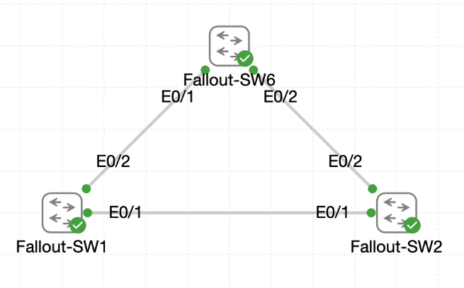

# Lab 033 - Port States and STP Configuration

<p class="back-link">
  <a href="../../Lab-index.html">← Back to Lab Index</a>
</p>

<table>
<tr>
<td colspan="2" valign="top">

<h1>Objective</h1>

<h4>Restore VLANs 10, 20, 30 and 40 across the redundant shelter switching topology.</h4>

<h4>Observe the existing Rapid PVST root bridge and identify forwarding and blocking trunk paths.</h4>

<h4>Reconfigure <code>Fallout-SW1</code> as the spanning-tree root bridge for all shelter VLANs.</h4>

<h4>Verify that <code>Fallout-SW2</code> selects Ethernet0/1 as its root port after the root bridge change.</h4>

<h4>Increase the spanning-tree cost on the redundant Ethernet0/2 path and confirm it remains the alternate blocking link after reconvergence.</h4>

</td>
</tr>

<tr>
<td valign="top">

</td>
</tr>
</table>

---

## Scenario

This lab focuses on Rapid PVST behaviour in a redundant three-switch topology.

The shelter network contains three connected switches: `Fallout-SW1`, `Fallout-SW2` and `Fallout-SW6`. The trunk links were already present, but VLANs 10, 20, 30 and 40 needed to be restored before Rapid PVST had active VLAN instances to evaluate.

The initial spanning-tree state showed `Fallout-SW6` as the root bridge for the shelter VLANs. `Fallout-SW2` reached that root through Ethernet0/2, while its Ethernet0/1 link sat in the alternate blocking role.

The lab then deliberately changed the spanning-tree election by lowering the bridge priority on `Fallout-SW1`. Once `Fallout-SW1` became root, `Fallout-SW2` moved Ethernet0/1 into the root forwarding role and pushed Ethernet0/2 into the alternate blocking role.

The final stage increased the path cost on `Fallout-SW2` Ethernet0/2 and bounced the interface to confirm Rapid PVST reconverged back to the intended steady-state topology.

---

## Devices Used

* Fallout-SW1
* Fallout-SW2
* Fallout-SW6

---

## Live Topology

| Link | Interfaces |
| ---- | ---------- |
| Fallout-SW1 to Fallout-SW2 | Fallout-SW1 Ethernet0/1 to Fallout-SW2 Ethernet0/1 |
| Fallout-SW1 to Fallout-SW6 | Fallout-SW1 Ethernet0/2 to Fallout-SW6 Ethernet0/1 |
| Fallout-SW2 to Fallout-SW6 | Fallout-SW2 Ethernet0/2 to Fallout-SW6 Ethernet0/2 |

---

## VLAN Summary

| VLAN ID | VLAN Name           | Purpose |
| ------: | ------------------- | ------- |
| 10      | Shelter-Operations  | Operations VLAN |
| 20      | Shelter-Logistics   | Logistics VLAN |
| 30      | Shelter-Medical     | Medical VLAN |
| 40      | Shelter-Comms       | Communications VLAN |

> Note: The raw evidence shows a minor capitalisation difference on Fallout-SW1 for VLAN 20: `Shelter-logistics` rather than `Shelter-Logistics`. This does not affect VLAN operation, but standardising the name would make the documentation cleaner.

---

## Configuration Steps

### Step 1 - Restore VLANs on Fallout-SW1

The required VLANs were created first on `Fallout-SW1`.

```bash
enable
configure terminal
vlan 10
name Shelter-Operations
vlan 20
name Shelter-logistics
vlan 30
name Shelter-Medical
vlan 40
name Shelter-Comms
end
```

### Verification

```bash
show vlan brief | include 10  |20  |30  |40
```

### Result

```bash
10   Shelter-Operations               active
20   Shelter-logistics                active
30   Shelter-Medical                  active
40   Shelter-Comms                    active
```

### Explanation

This restored the four VLAN instances on `Fallout-SW1` so Rapid PVST could begin maintaining a separate spanning-tree instance for each VLAN.

---

### Step 2 - Restore VLANs on Fallout-SW2

The same VLAN set was then created on `Fallout-SW2`.

An initial typo occurred:

```bash
valn 10
```

The switch rejected it:

```bash
% Invalid input detected at '^' marker.
```

Because VLAN 10 was not created at that moment, the first filtered VLAN check only showed VLANs 20, 30 and 40.

The missing VLAN was then added correctly:

```bash
configure terminal
vlan 10
name Shelter-Operations
end
```

### Verification

```bash
show vlan brief | include 10  |20  |30  |40
```

### Result

```bash
10   Shelter-Operations               active
20   Shelter-Logistics                active
30   Shelter-Medical                  active
40   Shelter-Comms                    active
```

### Explanation

The VLAN creation issue was corrected and `Fallout-SW2` had all four required VLANs before spanning-tree verification continued.

---

### Step 3 - Restore VLANs on Fallout-SW6

The VLANs were also created on `Fallout-SW6`.

```bash
configure terminal
vlan 10
name Shelter-Operations
vlan 20
name Shelter-Logistics
vlan 30
name Shelter-Medical
vlan 40
name Shelter-Comms
end
```

### Verification

```bash
show vlan brief | include 10  |20  |30  |40
```

### Result

```bash
10   Shelter-Operations               active
20   Shelter-Logistics                active
30   Shelter-Medical                  active
40   Shelter-Comms                    active
```

### Explanation

All three switches now contained the same VLAN IDs, allowing Rapid PVST to evaluate the redundant topology consistently.

---

## Initial Spanning Tree Mapping

### Step 4 - Check Initial Root Bridge for VLAN 10

From `Fallout-SW2`, VLAN 10 spanning-tree state was checked.

```bash
show spanning-tree vlan 10
```

### Result

```bash
Root ID    Priority    28682
           Address     aabb.cc00.0300
           Cost        100
           Port        3 (Ethernet0/2)
```

The interface roles showed:

```bash
Interface           Role Sts Cost      Prio.Nbr Type
------------------- ---- --- --------- -------- --------------------------------
Et0/1               Altn BLK 100       128.2    P2p
Et0/2               Root FWD 100       128.3    P2p
```

### Explanation

This showed that `Fallout-SW6`, using bridge address `aabb.cc00.0300`, was initially the root bridge for VLAN 10.

On `Fallout-SW2`:

* Ethernet0/2 was the root forwarding port towards `Fallout-SW6`.
* Ethernet0/1 was the alternate blocking path.

---

### Step 5 - Check Initial Root Bridge for VLANs 20, 30 and 40

The same check was repeated for VLANs 20, 30 and 40.

```bash
show spanning-tree vlan 20
show spanning-tree vlan 30
show spanning-tree vlan 40
```

### Result

For each VLAN, `Fallout-SW2` showed the root bridge as `aabb.cc00.0300`, reached through Ethernet0/2.

Example for VLAN 20:

```bash
Root ID    Priority    28692
           Address     aabb.cc00.0300
           Cost        100
           Port        3 (Ethernet0/2)
```

Example for VLAN 40:

```bash
Root ID    Priority    28712
           Address     aabb.cc00.0300
           Cost        100
           Port        3 (Ethernet0/2)
```

### Explanation

The initial topology was consistent across all four VLANs:

* `Fallout-SW6` was the root bridge.
* `Fallout-SW2` used Ethernet0/2 as its root forwarding port.
* `Fallout-SW2` kept Ethernet0/1 as an alternate blocking path.

---

### Step 6 - Inspect Initial Interface Detail on Fallout-SW2

The interface detail outputs were used to document the precise port roles.

```bash
show spanning-tree interface ethernet0/1 detail
show spanning-tree interface ethernet0/2 detail
```

### Result

Ethernet0/1 showed alternate blocking behaviour:

```bash
Port 2 (Ethernet0/1) of VLAN0010 is alternate blocking
Port path cost 100
```

Ethernet0/2 showed root forwarding behaviour:

```bash
Port 3 (Ethernet0/2) of VLAN0010 is root forwarding
Port path cost 100
```

### Explanation

This confirmed the starting state before any bridge priority changes were made.

---

## Root Bridge Reconfiguration

### Step 7 - Check Fallout-SW1 Before the Root Change

Before changing bridge priority, `Fallout-SW1` was checked for VLAN 10.

```bash
show spanning-tree vlan 10
```

### Result

```bash
Root ID    Priority    28682
           Address     aabb.cc00.0300
           Cost        100
           Port        3 (Ethernet0/2)
```

`Fallout-SW1` was not yet the root bridge. It also reached the root through Ethernet0/2.

---

### Step 8 - Set Fallout-SW1 as the Root Bridge

`Fallout-SW1` was then assigned a lower spanning-tree priority for VLANs 10, 20, 30 and 40.

```bash
configure terminal
spanning-tree vlan 10,20,30,40 priority 24576
end
```

### Explanation

Lower bridge priority wins the root bridge election.

By setting the priority to `24576`, `Fallout-SW1` became more preferred than the previous root bridge.

---

### Step 9 - Verify Fallout-SW1 as Root for VLAN 10

```bash
show spanning-tree vlan 10
```

### Result

```bash
Root ID    Priority    24586
           Address     aabb.cc00.0100
           This bridge is the root
```

Both local trunk links on `Fallout-SW1` were designated forwarding ports:

```bash
Interface           Role Sts Cost      Prio.Nbr Type
------------------- ---- --- --------- -------- --------------------------------
Et0/1               Desg FWD 100       128.2    P2p
Et0/2               Desg FWD 100       128.3    P2p
```

### Explanation

This confirmed that `Fallout-SW1` had become root for VLAN 10.

As the root bridge, its trunk ports became designated forwarding ports for the VLAN.

---

### Step 10 - Verify Fallout-SW1 as Root for VLAN 20

```bash
show spanning-tree vlan 20
```

### Result

```bash
Root ID    Priority    24596
           Address     aabb.cc00.0100
           This bridge is the root
```

### Explanation

This confirmed `Fallout-SW1` was also the root bridge for VLAN 20.

The later `Fallout-SW2` interface detail output also confirmed that VLANs 30 and 40 used `aabb.cc00.0100` as the root bridge after the priority change.

---

## Post-Root-Change Verification from Fallout-SW2

### Step 11 - Confirm Fallout-SW2's New Root Port

From `Fallout-SW2`, VLAN 10 was checked again.

```bash
show spanning-tree vlan 10
```

### Result

```bash
Root ID    Priority    24586
           Address     aabb.cc00.0100
           Cost        100
           Port        2 (Ethernet0/1)
```

The interface roles changed to:

```bash
Interface           Role Sts Cost      Prio.Nbr Type
------------------- ---- --- --------- -------- --------------------------------
Et0/1               Root FWD 100       128.2    P2p
Et0/2               Altn BLK 100       128.3    P2p
```

### Explanation

`Fallout-SW2` now reached the root bridge through Ethernet0/1, which is the direct link to `Fallout-SW1`.

Ethernet0/2 became the redundant alternate blocking link.

---

### Step 12 - Verify Port Roles Across All VLANs

The interface detail outputs confirmed the same behaviour across the shelter VLANs.

```bash
show spanning-tree interface ethernet0/1 detail
show spanning-tree interface ethernet0/2 detail
```

### Result

Ethernet0/1 became root forwarding for VLANs 10, 20, 30 and 40:

```bash
Port 2 (Ethernet0/1) of VLAN0010 is root forwarding
Port 2 (Ethernet0/1) of VLAN0020 is root forwarding
Port 2 (Ethernet0/1) of VLAN0030 is root forwarding
Port 2 (Ethernet0/1) of VLAN0040 is root forwarding
```

Ethernet0/2 became alternate blocking for VLANs 10, 20, 30 and 40:

```bash
Port 3 (Ethernet0/2) of VLAN0010 is alternate blocking
Port 3 (Ethernet0/2) of VLAN0020 is alternate blocking
Port 3 (Ethernet0/2) of VLAN0030 is alternate blocking
Port 3 (Ethernet0/2) of VLAN0040 is alternate blocking
```

### Explanation

This proved that the root bridge change affected the topology as intended.

`Fallout-SW1` was now the root, `Fallout-SW2` used Ethernet0/1 as the preferred path, and Ethernet0/2 became the backup path.

---

## Cost Tuning and Reconvergence

### Step 13 - Increase the Cost on the Backup Link

The redundant path on `Fallout-SW2` Ethernet0/2 was given a higher spanning-tree cost for each VLAN.

```bash
configure terminal
interface ethernet0/2
spanning-tree vlan 10 cost 300
spanning-tree vlan 20 cost 300
spanning-tree vlan 30 cost 300
spanning-tree vlan 40 cost 300
end
```

### Explanation

The default cost in this lab was `100`. Raising Ethernet0/2 to `300` made the path less preferred and ensured Ethernet0/1 remained the root path towards `Fallout-SW1`.

---

### Step 14 - Verify the New Cost on Ethernet0/2

```bash
show spanning-tree interface ethernet 0/2 detail
```

### Result

For VLAN 10:

```bash
Port 3 (Ethernet0/2) of VLAN0010 is alternate blocking
Port path cost 300
```

For VLAN 20:

```bash
Port 3 (Ethernet0/2) of VLAN0020 is alternate blocking
Port path cost 300
```

For VLAN 30:

```bash
Port 3 (Ethernet0/2) of VLAN0030 is alternate blocking
Port path cost 300
```

For VLAN 40:

```bash
Port 3 (Ethernet0/2) of VLAN0040 is alternate blocking
Port path cost 300
```

### Explanation

The backup link retained its alternate blocking role, now with the explicitly configured higher path cost.

This made the intended topology deterministic and easier to explain:

* Ethernet0/1 is the preferred root path.
* Ethernet0/2 is the higher-cost alternate backup path.

---

### Step 15 - Bounce Ethernet0/2 and Confirm Reconvergence

Ethernet0/2 was shut down and then re-enabled to observe Rapid PVST reconvergence.

```bash
configure terminal
interface ethernet0/2
shutdown
no shutdown
end
```

### Verification

```bash
show spanning-tree interface ethernet 0/2 detail
```

### Result

After the link returned, Ethernet0/2 settled back into alternate blocking for all four VLANs.

Example for VLAN 10:

```bash
Port 3 (Ethernet0/2) of VLAN0010 is alternate blocking
Port path cost 300
```

Example for VLAN 40:

```bash
Port 3 (Ethernet0/2) of VLAN0040 is alternate blocking
Port path cost 300
```

### Explanation

This confirmed that Rapid PVST reconverged back to the planned steady state.

The redundant link came back online, but because it still had a higher path cost, it remained the alternate blocking path rather than replacing Ethernet0/1 as the root port.

---

## Final Spanning Tree State

### Fallout-SW1

`Fallout-SW1` was successfully promoted to root bridge using a priority of `24576` for VLANs 10, 20, 30 and 40.

Evidence captured directly on `Fallout-SW1` showed:

```bash
This bridge is the root
```

for VLANs 10 and 20. Evidence from `Fallout-SW2` then confirmed the same root bridge address, `aabb.cc00.0100`, for VLANs 30 and 40 as well.

### Fallout-SW2

`Fallout-SW2` selected Ethernet0/1 as its root forwarding port:

```bash
Et0/1               Root FWD 100       128.2    P2p
```

Ethernet0/2 became the alternate blocking path:

```bash
Et0/2               Altn BLK 100       128.3    P2p
```

After cost tuning, Ethernet0/2 remained alternate blocking with a path cost of `300`.

---

## Troubleshooting

### Issue 1 - Mistyped VLAN command on Fallout-SW2

#### Problem

The command was entered as:

```bash
valn 10
```

#### Diagnosis

The switch rejected the command:

```bash
% Invalid input detected at '^' marker.
```

Because the switch was not in VLAN configuration mode, the next attempted `name` command also failed.

#### Fix

The correct VLAN command was entered from global configuration mode:

```bash
vlan 10
name Shelter-Operations
```

---

### Issue 2 - VLAN command attempted from privileged EXEC mode

#### Problem

After the first VLAN 10 error, this was entered from privileged EXEC mode:

```bash
vlan 10
```

#### Diagnosis

The switch treated it as an unknown command or hostname lookup attempt:

```bash
% Bad IP address or host name% Unknown command or computer name, or unable to find computer address
```

#### Fix

Configuration mode was entered first:

```bash
configure terminal
vlan 10
```

---

### Issue 3 - VLAN 20 name capitalisation inconsistency

#### Problem

`Fallout-SW1` used:

```bash
Shelter-logistics
```

while `Fallout-SW2` and `Fallout-SW6` used:

```bash
Shelter-Logistics
```

#### Diagnosis

The VLAN ID is what controls traffic segmentation, so the capitalisation difference does not affect Layer 2 operation.

However, it creates a documentation inconsistency.

#### Fix / Recommendation

For cleaner evidence, standardise the name on all switches:

```bash
configure terminal
vlan 20
name Shelter-Logistics
end
```

---

### Issue 4 - Partial spanning-tree detail output for Ethernet0/1

#### Problem

The `show spanning-tree interface ethernet0/1 detail` output in the raw evidence includes VLANs 10, 20 and part of VLAN 30, but not the complete VLAN 40 section.

#### Diagnosis

The later Ethernet0/2 detail output and subsequent post-root checks provide the important final role evidence, but the Ethernet0/1 detail capture itself is not perfectly complete.

#### Fix / Recommendation

For a stronger evidence set, recapture:

```bash
show spanning-tree interface ethernet0/1 detail
```

and allow the full output to complete.

---

### Issue 5 - Fallout-SW1 root verification was only directly shown for VLANs 10 and 20

#### Problem

The raw evidence directly shows `This bridge is the root` on `Fallout-SW1` for VLANs 10 and 20.

It does not include local `Fallout-SW1` output for VLANs 30 and 40.

#### Diagnosis

`Fallout-SW2` later shows the root bridge for VLANs 30 and 40 as `aabb.cc00.0100`, which is `Fallout-SW1`, so the final state is still supported.

#### Fix / Recommendation

For a perfect portfolio evidence set, capture these commands on `Fallout-SW1`:

```bash
show spanning-tree vlan 30
show spanning-tree vlan 40
```

---

## Key Learning Points

* Rapid PVST runs a separate spanning-tree instance per VLAN.
* VLANs must exist before useful per-VLAN STP verification can be performed.
* The root bridge is elected using the lowest bridge ID.
* Bridge ID is made from priority, VLAN system ID extension and MAC address.
* Lowering bridge priority is a deterministic way to control the root bridge election.
* A root bridge has designated forwarding ports rather than root ports.
* A non-root switch uses one root port to reach the root bridge.
* A redundant path can be placed into the alternate blocking role to prevent loops.
* Increasing STP path cost makes a link less preferred.
* Rapid PVST reconverges after a link bounce and returns ports to their calculated roles.
* Documentation evidence is strongest when all VLANs and all relevant interfaces are captured completely.

---

## Completion Check

The lab was completed successfully.

* VLANs 10, 20, 30 and 40 were created on Fallout-SW1.
* VLANs 10, 20, 30 and 40 were created on Fallout-SW2 after correcting an initial typo.
* VLANs 10, 20, 30 and 40 were created on Fallout-SW6.
* Initial STP checks showed Fallout-SW6 as the root bridge.
* Fallout-SW2 initially used Ethernet0/2 as its root forwarding port.
* Fallout-SW2 initially held Ethernet0/1 as an alternate blocking path.
* Fallout-SW1 bridge priority was lowered to `24576` for VLANs 10, 20, 30 and 40.
* Fallout-SW1 became the root bridge for the shelter VLANs.
* Fallout-SW2 changed Ethernet0/1 into the root forwarding port.
* Fallout-SW2 changed Ethernet0/2 into the alternate blocking port.
* Ethernet0/2 on Fallout-SW2 was given STP cost `300` for VLANs 10, 20, 30 and 40.
* Ethernet0/2 remained alternate blocking after the cost change.
* Ethernet0/2 was shut down and re-enabled.
* Rapid PVST reconverged and Ethernet0/2 returned to alternate blocking with cost `300`.
