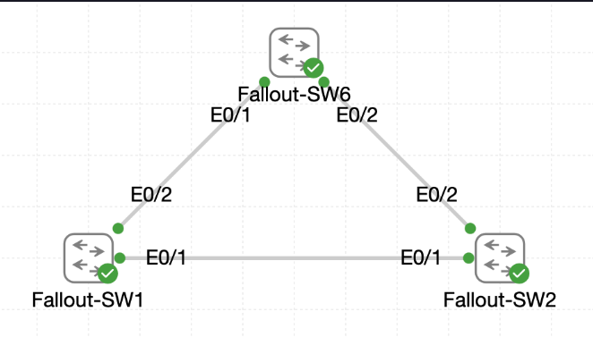

# Lab 034 - Rapid and Multiple Spanning Tree

<p class="back-link">
  <a href="../../Lab-index.html">← Back to Lab Index</a>
</p>

<table>
<tr>
<td colspan="2" valign="top">

<h1>Objective</h1>

<h4>Restore VLANs 10, 20, 30 and 40 on the three-switch fallout shelter topology.</h4>

<h4>Audit the existing legacy PVST behaviour before changing spanning-tree mode.</h4>

<h4>Migrate the switches from classic PVST to Rapid PVST and confirm root and alternate port roles.</h4>

<h4>Test Rapid PVST failover by shutting and restoring a root-path trunk on <code>Fallout-SW2</code>.</h4>

<h4>Configure a shared MST region using region name <code>RYSEN-CORE</code>, revision <code>5</code>, and two VLAN-to-instance mappings.</h4>

<h4>Correct an initial MST mapping mistake and verify that all switches agree on the final MST design.</h4>

</td>
</tr>

<tr>
<td valign="top">

</td>
</tr>
</table>

---

## Scenario

This lab examines how spanning tree behaves as the same redundant three-switch topology is moved through three stages:

* Legacy PVST / IEEE 802.1D behaviour.
* Rapid PVST / RSTP behaviour.
* Multiple Spanning Tree / MST behaviour.

The topology uses a triangle of trunk links between `Fallout-SW1`, `Fallout-SW2` and `Fallout-SW6`. The redundancy is useful, but without spanning tree it could create Layer 2 loops. The lab therefore focuses on how STP elects a root bridge, chooses root and alternate ports, blocks the redundant path, and reconverges when a link is removed and restored.

The final task moves the network into an MST region named `RYSEN-CORE`, where VLANs 10 and 20 are grouped into MST instance 1 and VLANs 30 and 40 are grouped into MST instance 2.

---

## Devices Used

* Fallout-SW1
* Fallout-SW2
* Fallout-SW6

---

## Live Topology

| Link | Interfaces |
| ---- | ---------- |
| Fallout-SW1 to Fallout-SW2 | Fallout-SW1 Ethernet0/1 to Fallout-SW2 Ethernet0/1 |
| Fallout-SW1 to Fallout-SW6 | Fallout-SW1 Ethernet0/2 to Fallout-SW6 Ethernet0/1 |
| Fallout-SW2 to Fallout-SW6 | Fallout-SW2 Ethernet0/2 to Fallout-SW6 Ethernet0/2 |

---

## VLAN Summary

| VLAN ID | VLAN Name          | Purpose                 |
| ------: | ------------------ | ----------------------- |
| 10      | Shelter-Operations | Operations VLAN         |
| 20      | Shelter-Logistics  | Logistics VLAN          |
| 30      | Shelter-Medical    | Medical VLAN            |
| 40      | Shelter-Comms      | Communications VLAN     |

---

## MST Region Plan

| MST Setting | Value |
| ----------- | ----- |
| Region name | RYSEN-CORE |
| Revision | 5 |
| MST instance 1 | VLANs 10, 20 |
| MST instance 2 | VLANs 30, 40 |
| MST instance 0 | All other VLANs |

---

## Configuration Steps

### Step 1 - Restore VLANs on Fallout-SW1

The required VLANs were created on `Fallout-SW1`.

```bash
enable
configure terminal
vlan 10
name Shelter-Operations
vlan 20
name Shelter-Logistics
vlan 30
name Shelter-Medical
vlan 40
name Shelter-Comms
end
```

### Verification

```bash
show vlan brief | include 10  |20  |30  |40
```

### Result

```bash
10   Shelter-Operations               active
20   Shelter-Logistics                active
30   Shelter-Medical                  active
40   Shelter-Comms                    active
```

### Explanation

This restored the required VLAN instances on Fallout-SW1 so spanning tree had VLANs to evaluate.

---

### Step 2 - Restore VLANs on Fallout-SW2

The VLANs were then created on `Fallout-SW2`.

```bash
configure terminal
vlan 10
name Shelter-Operations
vlan 20
name Shelter-Logistics
vlan 30
name Shelter-Medical
vlan 40
name Shelter-Comms
end
```

### Evidence Note

There was a small command mistake while naming VLAN 20:

```bash
Shelter-Logistics
```

The switch rejected it because the `name` keyword was missing.

The command was corrected with:

```bash
name Shelter-Logistics
```

### Result

The later spanning-tree output showed VLANs 10, 20, 30 and 40 all present and active as STP instances on Fallout-SW2.

---

### Step 3 - Restore VLANs on Fallout-SW6

The VLANs were then created on `Fallout-SW6`.

```bash
configure terminal
vlan 10
name Shelter-Operations
vlan 20
name Shelter-Logistics
vlan 30
name Shelter-Medical
vlan 40
name Shelter-Comms
end
```

### Evidence Note

A similar mistake occurred while naming VLAN 30:

```bash
Shelter-Medical
```

The switch rejected the command until the missing `name` keyword was added:

```bash
name Shelter-Medical
```

### Result

The later spanning-tree summary confirmed VLANs 10, 20, 30 and 40 were active on Fallout-SW6.

---

## Legacy PVST Audit

### Step 4 - Confirm Initial STP Mode on Fallout-SW2

The spanning-tree summary was checked from Fallout-SW2.

```bash
show spanning-tree summary
```

### Result

```bash
Switch is in pvst mode
```

The summary showed active STP instances for VLANs 1, 10, 20, 30 and 40.

```bash
Name                   Blocking Listening Learning Forwarding STP Active
---------------------- -------- --------- -------- ---------- ----------
VLAN0001                     0         0        0          4          4
VLAN0010                     1         0        0          1          2
VLAN0020                     1         0        0          1          2
VLAN0030                     1         0        0          1          2
VLAN0040                     1         0        0          1          2
```

### Explanation

This confirmed the starting point: the switch was using legacy PVST rather than Rapid PVST.

Each VLAN had its own STP instance, and one port was blocking for each of the shelter VLANs.

---

### Step 5 - Inspect Legacy PVST Port Roles

`Fallout-SW2` was checked for VLANs 10, 20, 30 and 40.

```bash
show spanning-tree vlan 10
show spanning-tree vlan 20
show spanning-tree vlan 30
show spanning-tree vlan 40
```

### Result

For VLAN 10, Fallout-SW2 showed:

```bash
Spanning tree enabled protocol ieee
Root ID    Priority    4106
           Address     aabb.cc00.0100
           Cost        100
           Port        2 (Ethernet0/1)
```

The port roles showed:

```bash
Et0/1               Root FWD 100       128.2    P2p
Et0/2               Altn BLK 100       128.3    P2p
```

The same pattern was observed across VLANs 20, 30 and 40.

### Explanation

The legacy PVST state showed:

* Fallout-SW1 was already the root bridge for the shelter VLANs.
* Fallout-SW2 used Ethernet0/1 as the root forwarding port.
* Fallout-SW2 kept Ethernet0/2 in the alternate blocking role.
* Legacy PVST still used IEEE 802.1D behaviour, shown by `protocol ieee`.

---

## Rapid PVST Configuration

### Step 6 - Enable Rapid PVST on Fallout-SW1

Rapid PVST was enabled on Fallout-SW1.

```bash
configure terminal
spanning-tree mode rapid-pvst
end
```

### Verification

```bash
show spanning-tree summary
show spanning-tree vlan 10
```

### Result

```bash
Switch is in rapid-pvst mode
Root bridge for: VLAN0001, VLAN0010, VLAN0020, VLAN0030, VLAN0040
```

For VLAN 10:

```bash
Spanning tree enabled protocol rstp
Root ID    Priority    4106
           Address     aabb.cc00.0100
           This bridge is the root
```

### Explanation

Fallout-SW1 successfully moved to Rapid PVST and remained the root bridge.

The important protocol change was from `ieee` to `rstp`.

---

### Step 7 - Enable Rapid PVST on Fallout-SW2

Rapid PVST was enabled on Fallout-SW2.

```bash
configure terminal
spanning-tree mode rapid-pvst
end
```

### Evidence Note

The first attempt used an invalid form:

```bash
spanning-tree mode rapid pvst
```

The switch rejected it. The corrected syntax was:

```bash
spanning-tree mode rapid-pvst
```

### Verification

```bash
show spanning-tree summary
show spanning-tree vlan 10
```

### Result

```bash
Switch is in rapid-pvst mode
```

For VLAN 10:

```bash
Spanning tree enabled protocol rstp
Et0/1               Root FWD 100       128.2    P2p
Et0/2               Altn BLK 100       128.3    P2p Peer(STP)
```

### Explanation

Fallout-SW2 was successfully migrated to Rapid PVST while keeping the same intended topology state:

* Ethernet0/1 remained the root forwarding port.
* Ethernet0/2 remained the alternate blocking path.

---

### Step 8 - Enable Rapid PVST on Fallout-SW6

Rapid PVST was enabled on Fallout-SW6.

```bash
configure terminal
spanning-tree mode rapid-pvst
end
```

### Evidence Note

A show command was first attempted from configuration mode:

```bash
show spanning-tree summary
```

The switch rejected the command until the configuration mode was exited.

### Verification

```bash
show spanning-tree summary
show spanning-tree vlan 10
```

### Result

```bash
Switch is in rapid-pvst mode
```

For VLAN 10, Fallout-SW6 used Ethernet0/1 as its root forwarding port:

```bash
Et0/1               Root FWD 100       128.2    P2p
Et0/2               Desg LRN 100       128.3    P2p
```

### Explanation

All three switches were now running Rapid PVST.

The `Desg LRN` state on Fallout-SW6 showed the topology was still converging briefly when the command was captured. This matched the lab warning that STP information can take a few seconds to settle after changing modes.

---

## Rapid PVST Failover Test

### Step 9 - Shut Down Fallout-SW2 Ethernet0/1

To force the backup path into use, the root port on Fallout-SW2 was shut down.

```bash
configure terminal
interface ethernet0/1
shutdown
end
```

### Verification

```bash
show spanning-tree interface ethernet0/2 detail
```

### Result

Ethernet0/2 immediately became the root forwarding path for VLANs 10, 20, 30 and 40.

Example for VLAN 10:

```bash
Port 3 (Ethernet0/2) of VLAN0010 is root forwarding
Designated root has priority 4106, address aabb.cc00.0100
Number of transitions to forwarding state: 2
```

### Explanation

This proved that Rapid PVST could use the redundant trunk when the preferred root path was removed.

---

### Step 10 - Restore Fallout-SW2 Ethernet0/1

Ethernet0/1 was then restored.

```bash
configure terminal
interface ethernet0/1
no shutdown
end
```

### Verification

```bash
show spanning-tree vlan 10
show spanning-tree interface ethernet 0/1 detail
show spanning-tree interface ethernet 0/2 detail
```

### Result

VLAN 10 returned to the expected steady-state roles:

```bash
Et0/1               Root FWD 100       128.2    P2p
Et0/2               Altn BLK 100       128.3    P2p
```

The detailed interface output confirmed:

```bash
Port 2 (Ethernet0/1) of VLAN0010 is root forwarding
Port 3 (Ethernet0/2) of VLAN0010 is alternate blocking
```

The same root/alternate pattern was shown for VLANs 20, 30 and 40.

### Explanation

This completed the Rapid PVST failover test.

Ethernet0/2 successfully carried traffic while Ethernet0/1 was down, then returned to alternate blocking when the preferred root path came back.

---

## MST Configuration

### Step 11 - Start MST Configuration on Fallout-SW1

The switches were then moved into MST mode.

```bash
configure terminal
spanning-tree mode mst
spanning-tree mst configuration
name RYSEN-CORE
revision 5
instance 1 vlan 10,20
instance 2 vlan 30,40
end
```

### Evidence Note

The first MST attempt on Fallout-SW1 accidentally used instance 1 twice:

```bash
instance 1 vlan 10,20
instance 1 vlan 30,40
```

That mapped VLANs 10, 20, 30 and 40 into instance 1:

```bash
Instance  Vlans mapped
0         1-9,11-19,21-29,31-39,41-4094
1         10,20,30,40
```

This was later corrected by adding instance 2 for VLANs 30 and 40.

---

### Step 12 - Configure MST on Fallout-SW2

MST was configured on Fallout-SW2.

```bash
configure terminal
spanning-tree mode mst
spanning-tree mst configuration
name RYSEN-CORE
revision 5
instance 1 vlan 10,20
instance 2 vlan 30,40
end
```

### Evidence Note

Fallout-SW2 also initially repeated the same instance 1 mapping issue and was later corrected.

Final Fallout-SW2 MST configuration showed:

```bash
Name      [RYSEN-CORE]
Revision  5     Instances configured 3

Instance  Vlans mapped
0         1-9,11-19,21-29,31-39,41-4094
1         10,20
2         30,40
```

---

### Step 13 - Configure MST on Fallout-SW6

MST was configured on Fallout-SW6.

```bash
configure terminal
spanning-tree mode mst
spanning-tree mst configuration
name RYSEN-CORE
revision 5
instance 1 vlan 10,20
instance 2 vlan 30,40
end
```

### Verification

```bash
show spanning-tree mst configuration
show spanning-tree mst
```

### Result

Fallout-SW6 showed the correct final mapping:

```bash
Name      [RYSEN-CORE]
Revision  5     Instances configured 3

Instance  Vlans mapped
0         1-9,11-19,21-29,31-39,41-4094
1         10,20
2         30,40
```

---

### Step 14 - Correct MST Mapping on Fallout-SW2 and Fallout-SW1

After Fallout-SW6 showed the intended mapping, the MST mappings were corrected on Fallout-SW2 and Fallout-SW1.

Corrective commands:

```bash
spanning-tree mst configuration
instance 1 vlan 10,20
instance 2 vlan 30,40
end
```

### Final Result

Fallout-SW1, Fallout-SW2 and Fallout-SW6 all reported the same final MST design:

```bash
Name      [RYSEN-CORE]
Revision  5     Instances configured 3

Instance  Vlans mapped
0         1-9,11-19,21-29,31-39,41-4094
1         10,20
2         30,40
```

### Explanation

For switches to operate in the same MST region, the region name, revision number and VLAN-to-instance mapping must match exactly.

The corrected evidence confirms that all three switches finished with the same MST region plan.

---

## Final Verification

### Rapid PVST Verification

Before moving to MST, all switches were migrated to Rapid PVST.

Fallout-SW1 showed:

```bash
Switch is in rapid-pvst mode
Root bridge for: VLAN0001, VLAN0010, VLAN0020, VLAN0030, VLAN0040
```

Fallout-SW2 showed:

```bash
Switch is in rapid-pvst mode
Et0/1               Root FWD 100
Et0/2               Altn BLK 100
```

Fallout-SW6 showed:

```bash
Switch is in rapid-pvst mode
```

### Rapid Failover Verification

When Fallout-SW2 Ethernet0/1 was shut down, Ethernet0/2 became root forwarding for all four shelter VLANs.

When Ethernet0/1 was restored, the steady-state returned:

```bash
Et0/1               Root FWD 100
Et0/2               Altn BLK 100
```

### MST Verification

Final MST configuration on all three switches matched:

```bash
Name      [RYSEN-CORE]
Revision  5
Instance 1         10,20
Instance 2         30,40
```

### Trunk Verification

Final trunk output confirmed VLANs 10, 20, 30 and 40 remained allowed and forwarding on the active trunks.

Fallout-SW1 final trunk output showed:

```bash
Et0/1          10,20,30,40
Et0/2          10,20,30,40
```

Fallout-SW2 final trunk output showed:

```bash
Et0/1          10,20,30,40
Et0/2          10,20,30,40
```

Fallout-SW6 showed both trunks allowed VLANs 10, 20, 30 and 40, with one redundant link not forwarding at that exact moment:

```bash
Et0/1          10,20,30,40
Et0/2          none
```

---

## Troubleshooting

### Issue 1 - Missing `name` keyword while naming VLANs

#### Problem

On Fallout-SW2 and Fallout-SW6, a VLAN name was entered without the `name` command.

Examples:

```bash
Shelter-Logistics
Shelter-Medical
```

#### Diagnosis

IOS rejected the commands because the CLI was still in VLAN configuration mode and expected a valid VLAN subcommand.

#### Fix

The names were entered correctly:

```bash
name Shelter-Logistics
name Shelter-Medical
```

---

### Issue 2 - `include` filter hid VLAN 10 from verification

#### Problem

The following filter was used on Fallout-SW2 and Fallout-SW6:

```bash
show vlan brief | include vlan 10  |20  |30  |40
```

This did not show VLAN 10 in the captured output.

#### Diagnosis

The filter looked for the text `vlan 10`, but the output line begins with `10`, not `vlan 10`.

#### Fix / Outcome

Later spanning-tree output confirmed VLAN 10 existed as an active STP instance. For cleaner evidence, this command would be better:

```bash
show vlan brief | include 10   |20   |30   |40
```

---

### Issue 3 - Incorrect Rapid PVST syntax

#### Problem

The following command was attempted:

```bash
spanning-tree mode rapid pvst
```

#### Diagnosis

IOS rejected the command because the correct mode keyword contains a hyphen.

#### Fix

The correct command was used:

```bash
spanning-tree mode rapid-pvst
```

---

### Issue 4 - Show command attempted from configuration mode

#### Problem

On Fallout-SW6, `show spanning-tree summary` was attempted from global configuration mode.

#### Diagnosis

The command was rejected in that context.

#### Fix

The switch was returned to privileged EXEC mode with `end`, and the show command was run successfully.

---

### Issue 5 - Temporary convergence state after changing STP mode

#### Problem

After Rapid PVST was enabled, some ports briefly showed learning or blocked states.

Example:

```bash
Et0/2               Desg LRN 100       128.3    P2p
```

#### Diagnosis

This was expected while STP recalculated the topology after the mode change.

#### Fix / Outcome

Later verification showed the expected root and alternate roles.

---

### Issue 6 - Initial MST mapping placed all production VLANs into instance 1

#### Problem

On Fallout-SW1 and Fallout-SW2, the MST instance command was entered as:

```bash
instance 1 vlan 10,20
instance 1 vlan 30,40
```

#### Diagnosis

The second command expanded MST instance 1 to include VLANs 30 and 40 instead of placing them into instance 2.

This produced:

```bash
1         10,20,30,40
```

#### Fix

The intended instance 2 mapping was added:

```bash
instance 2 vlan 30,40
```

The corrected output showed:

```bash
1         10,20
2         30,40
```

---

### Issue 7 - Temporary MST boundary / PVST inconsistency

#### Problem

After one switch was moved into MST before the others matched it, some ports showed boundary or inconsistency states:

```bash
Bound(PVST) *PVST_Inc
```

#### Diagnosis

This occurred because neighbouring switches were not yet in the same MST region/mode.

#### Fix

MST was configured consistently across all switches with the same region name, revision and VLAN-to-instance mapping.

---

## Key Learning Points

* PVST creates a separate spanning-tree instance for each VLAN.
* Classic PVST uses IEEE 802.1D behaviour and shows `protocol ieee`.
* Rapid PVST uses RSTP and shows `protocol rstp`.
* Rapid PVST can quickly move an alternate path into forwarding when the root port fails.
* The root bridge is determined by bridge priority and MAC address.
* The root port is the best path back to the root bridge.
* The alternate port is a loop-prevention backup path.
* STP mode changes should be made carefully because they can temporarily disrupt traffic.
* MST reduces the number of STP instances by grouping VLANs together.
* MST region name, revision and VLAN mapping must match across switches.
* Reusing the wrong MST instance number can silently place VLANs in the wrong instance.
* Temporary boundary or inconsistency states can appear while only part of the topology has been migrated.
* Final verification must check both STP state and trunk forwarding state.

---

## Completion Check

The lab was completed successfully.

* VLANs 10, 20, 30 and 40 were restored on the lab switches.
* Fallout-SW2 initially showed legacy PVST mode.
* Fallout-SW1 was identified as the root bridge for the shelter VLANs.
* Fallout-SW2 used Ethernet0/1 as the root forwarding port.
* Fallout-SW2 kept Ethernet0/2 as the alternate blocking port.
* Fallout-SW1, Fallout-SW2 and Fallout-SW6 were migrated to Rapid PVST.
* Rapid PVST output showed `protocol rstp`.
* Shutting Fallout-SW2 Ethernet0/1 moved Ethernet0/2 into root forwarding.
* Restoring Fallout-SW2 Ethernet0/1 returned Ethernet0/2 to alternate blocking.
* MST mode was configured on all three switches.
* MST region name `RYSEN-CORE` was applied.
* MST revision `5` was applied.
* VLANs 10 and 20 were mapped to MST instance 1.
* VLANs 30 and 40 were mapped to MST instance 2.
* The initial MST mapping error was corrected on Fallout-SW1 and Fallout-SW2.
* Final MST configuration outputs matched across the switches.
* Final trunk checks confirmed VLANs 10, 20, 30 and 40 remained allowed on the trunk links.
