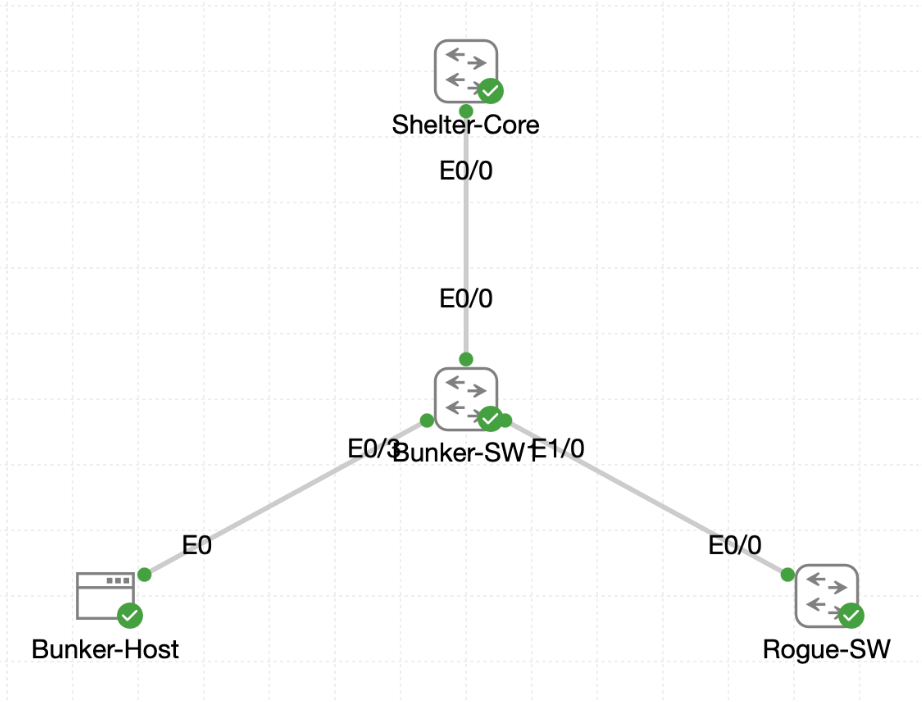

# Lab 035 - The Place of PortFast and BPDU Guard

<p class="back-link">
  <a href="../../Lab-index.html">← Back to Lab Index</a>
</p>

<table>
<tr>
<td colspan="2" valign="top">

<h1>Objective</h1>

<h4>Inspect default Rapid PVST behaviour on a normal access port before PortFast is enabled.</h4>

<h4>Enable PortFast on endpoint-facing access ports while leaving the trunk uplink untouched.</h4>

<h4>Verify that PortFast allows an access port to return to forwarding quickly after a link bounce.</h4>

<h4>Enable BPDU Guard for PortFast-enabled interfaces.</h4>

<h4>Trigger and verify an err-disabled state when a rogue switch sends BPDUs into a protected access port.</h4>

<h4>Recover the protected port safely after shutting down the rogue BPDU source.</h4>

</td>
</tr>

<tr>
<td valign="top">

</td>
</tr>
</table>

---

## Scenario

This lab demonstrates how PortFast and BPDU Guard protect the access edge of a switched network.

`Bunker-SW1` has a trunk uplink to `Shelter-Core`, a legitimate endpoint connected to Ethernet0/3, and a rogue switch connected to Ethernet1/0. The lab first records how a normal Rapid PVST access port behaves when it is bounced without PortFast. It then enables PortFast on the endpoint-facing ports so trusted access ports do not wait through normal spanning-tree transition states.

The final stage enables BPDU Guard for PortFast-enabled interfaces. The rogue switch is bounced so it sends a BPDU into the protected access edge. BPDU Guard detects the BPDU and places the port into an err-disabled state, proving that the rogue switch has been quarantined before it can influence spanning tree.

---

## Devices Used

* Bunker-SW1
* Bunker-Host
* Rogue-SW
* Shelter-Core

---

## Live Interface Map

| Device | Interface | Connection / Purpose |
| ------ | --------- | -------------------- |
| Bunker-SW1 | Ethernet0/0 | Trunk uplink to Shelter-Core |
| Bunker-SW1 | Ethernet0/3 | Access port to Bunker-Host |
| Bunker-SW1 | Ethernet1/0 | Access port to Rogue-SW |
| Rogue-SW | Ethernet0/0 | Connection toward Bunker-SW1 Ethernet1/0 |

---

## Feature Summary

| Feature | Purpose |
| ------- | ------- |
| PortFast | Allows trusted endpoint access ports to move directly to forwarding |
| BPDU Guard | Disables a PortFast-enabled port if it receives a BPDU |
| Err-disabled | Protective shutdown state used when a violation is detected |
| Rapid PVST | Per-VLAN rapid spanning-tree mode already active in the lab |

---

## Configuration Steps

### Step 1 - Inspect the Starting Spanning-Tree Mode

The starting spanning-tree summary was checked on Bunker-SW1.

```bash
show spanning-tree summary
```

### Result

```bash
Switch is in rapid-pvst mode
Root bridge for: VLAN0001, VLAN0010
Portfast Default                        is disabled
PortFast BPDU Guard Default             is disabled
```

The active VLAN summary showed VLAN 1 and VLAN 10 both forwarding:

```bash
Name                   Blocking Listening Learning Forwarding STP Active
---------------------- -------- --------- -------- ---------- ----------
VLAN0001                     0         0        0          3          3
VLAN0010                     0         0        0          3          3
```

### Explanation

This confirmed the baseline:

* The switch was already running Rapid PVST.
* PortFast was not enabled globally by default.
* BPDU Guard was not enabled globally by default.
* The access edge was operating normally before any hardening was applied.

---

### Step 2 - Inspect Bunker-Host Access Port Before PortFast

Ethernet0/3, the port connected to Bunker-Host, was inspected.

```bash
show spanning-tree interface ethernet0/3 detail
```

### Result

```bash
Port 4 (Ethernet0/3) of VLAN0010 is designated forwarding
Port path cost 100, Port priority 128, Port Identifier 128.4.
Number of transitions to forwarding state: 1
Link type is point-to-point by default
BPDU: sent 32, received 0
```

### Explanation

Before PortFast, Ethernet0/3 was a normal designated forwarding access port.

No BPDUs had been received on this host-facing interface, which is expected for a real endpoint.

---

### Step 3 - Bounce Ethernet0/3 Without PortFast

Ethernet0/3 was shut down and brought back up to simulate a user reconnecting a device.

```bash
configure terminal
interface ethernet0/3
shutdown
no shutdown
end
```

### Verification

```bash
show spanning-tree interface ethernet0/3 detail
```

### Result

Immediately after the bounce, the port was caught moving through normal spanning-tree states.

First it appeared as blocking:

```bash
Port 4 (Ethernet0/3) of VLAN0010 is designated blocking
Timers: message age 0, forward delay 9, hold 0
Number of transitions to forwarding state: 0
```

It was then seen in learning:

```bash
Port 4 (Ethernet0/3) of VLAN0010 is designated learning
Timers: message age 0, forward delay 12, hold 0
```

After the timer expired, the port returned to forwarding:

```bash
Port 4 (Ethernet0/3) of VLAN0010 is designated forwarding
Timers: message age 0, forward delay 0, hold 0
Number of transitions to forwarding state: 1
```

### Explanation

This proved the default behaviour before PortFast.

Even though the port connected to an endpoint, it still briefly passed through spanning-tree transition states after the interface bounce. This can delay connectivity for end hosts while the port waits to forward traffic.

---

## PortFast Configuration

### Step 4 - Enable PortFast on the Host Access Port

PortFast was enabled on Ethernet0/3.

```bash
configure terminal
interface ethernet0/3
spanning-tree portfast
```

### Result

IOS displayed the normal PortFast warning:

```bash
%Warning: portfast should only be enabled on ports connected to a single
 host. Connecting hubs, concentrators, switches, bridges, etc... to this
 interface when portfast is enabled, can cause temporary bridging loops.
 Use with CAUTION
```

It also confirmed:

```bash
%Portfast has been configured on Ethernet0/3 but will only
 have effect when the interface is in a non-trunking mode.
```

### Explanation

The warning is expected and important.

PortFast should be used only on access ports connected to trusted end hosts. It should not be enabled on trunk uplinks or links to switches unless a specific design calls for it and the risks are understood.

---

### Step 5 - Enable PortFast on the Rogue-Switch Test Port

PortFast was also enabled on Ethernet1/0 for the controlled rogue-switch test.

```bash
interface ethernet1/0
spanning-tree portfast
```

### Explanation

This was deliberately enabled for the lab so BPDU Guard could be triggered when the rogue switch sent a BPDU into a PortFast-enabled access port.

In production, a port connected to another switch would normally not be treated as a trusted edge port.

---

### Step 6 - Bounce Ethernet0/3 After PortFast

Ethernet0/3 was bounced again.

```bash
interface ethernet0/3
shutdown
no shutdown
end
```

### Verification

```bash
show spanning-tree interface ethernet0/3 detail
```

### Result

The port returned directly to forwarding and reported PortFast mode:

```bash
Port 4 (Ethernet0/3) of VLAN0010 is designated forwarding
Timers: message age 0, forward delay 0, hold 0
Number of transitions to forwarding state: 1
The port is in the portfast mode
BPDU: sent 5, received 0
```

### Explanation

This confirmed PortFast was working on the endpoint access port.

The port no longer showed the same blocking/learning delay captured before PortFast was enabled.

---

### Step 7 - Verify PortFast on Ethernet1/0

The rogue-switch test port was also checked.

```bash
show spanning-tree interface ethernet1/0 detail
```

### Result

```bash
Port 5 (Ethernet1/0) of VLAN0010 is designated forwarding
The port is in the portfast mode
BPDU: sent 230, received 5
```

### Explanation

Ethernet1/0 was in PortFast mode and had received BPDUs, making it the correct interface for the BPDU Guard test.

---

## BPDU Guard Configuration and Test

### Step 8 - Enable BPDU Guard for PortFast Ports

BPDU Guard was enabled globally for all PortFast-enabled ports.

```bash
configure terminal
spanning-tree portfast bpduguard default
end
```

### Explanation

This command protects all PortFast-enabled interfaces.

If a PortFast-enabled port receives a BPDU, the switch assumes another bridge or switch has appeared on what should be an endpoint port. BPDU Guard then disables the port to protect the Layer 2 topology.

---

### Step 9 - Bounce Rogue-SW Ethernet0/0

The rogue switch interface connected to Bunker-SW1 was bounced to make it send a fresh BPDU.

```bash
configure terminal
interface ethernet0/0
shutdown
no shutdown
end
```

### Explanation

This intentionally triggered BPDU transmission from Rogue-SW into Bunker-SW1 Ethernet1/0.

---

### Step 10 - Verify BPDU Guard Err-Disabled the Port

Bunker-SW1 was checked after the rogue switch sent BPDUs.

```bash
show interfaces status | include err-disabled|et1/0|Port
```

### Result

```bash
Port         Name               Status       Vlan       Duplex  Speed Type
Et1/0        Access to Rogue-SW err-disabled 10           full   auto 10/100/1000BaseTX
```

The spanning-tree detail command then showed:

```bash
no spanning tree info available for Ethernet1/0
```

### Explanation

Ethernet1/0 had been removed from normal switching operation by BPDU Guard, so spanning tree no longer had active information for the port.

This confirmed that BPDU Guard had successfully quarantined the rogue switch connection.

---

### Step 11 - Verify the BPDU Guard Log Message

The log was checked.

```bash
show logging | include BPDU|BPDUGUARD|err
```

### Result

```bash
%SPANTREE-2-BLOCK_BPDUGUARD: Received BPDU from bridge aabb.cc00.0600 on port Ethernet1/0 with BPDU Guard enabled. Disabling port.
%PM-4-ERR_DISABLE: bpduguard error detected on Et1/0, putting Et1/0 in err-disable state
```

### Explanation

This was the key proof of the lab.

The switch received a BPDU from the rogue switch and immediately disabled the access port because BPDU Guard was active.

---

## Recovery Procedure

### Step 12 - Shut Down the Rogue BPDU Source

Before recovering the protected port, the rogue source was shut down.

```bash
Rogue-SW#configure terminal
Rogue-SW(config)#interface ethernet0/0
Rogue-SW(config-if)#shutdown
Rogue-SW(config-if)#end
```

### Explanation

This is the safe order of operations.

If the BPDU source is not removed first, the protected access port may immediately err-disable again after recovery.

---

### Step 13 - Recover Bunker-SW1 Ethernet1/0

Bunker-SW1 Ethernet1/0 was then manually reset.

```bash
configure terminal
interface ethernet1/0
shutdown
no shutdown
end
```

### Verification

```bash
show interfaces status | include Et1/0|Port
```

### Result

```bash
Port         Name               Status       Vlan       Duplex  Speed Type
Et1/0        Access to Rogue-SW connected    10           full   auto 10/100/1000BaseTX
```

### Explanation

The port recovered after the rogue BPDU source was shut down and the interface was manually reset.

This completed the BPDU Guard detection and recovery workflow.

---

## Final Verification

### PortFast Verification

Ethernet0/3 showed:

```bash
The port is in the portfast mode
```

Ethernet1/0 also showed:

```bash
The port is in the portfast mode
```

### BPDU Guard Verification

Ethernet1/0 entered err-disabled after receiving a BPDU:

```bash
Et1/0        Access to Rogue-SW err-disabled 10
```

The log confirmed the reason:

```bash
bpduguard error detected on Et1/0, putting Et1/0 in err-disable state
```

### Recovery Verification

After shutting the rogue switch interface and manually resetting Bunker-SW1 Ethernet1/0, the port returned to connected state:

```bash
Et1/0        Access to Rogue-SW connected    10
```

---

## Troubleshooting

### Issue 1 - Connection closed during PortFast configuration

#### Problem

The console connection closed while configuring Ethernet0/3.

```bash
[connection closed]
[reconnecting…]
```

#### Diagnosis

This was a console/session interruption rather than a switch configuration error.

#### Fix

The session was reconnected and the PortFast configuration continued successfully.

---

### Issue 2 - PortFast warning appeared on access ports

#### Problem

IOS displayed a warning when PortFast was enabled.

```bash
%Warning: portfast should only be enabled on ports connected to a single host.
```

#### Diagnosis

This is expected. IOS warns that PortFast is dangerous if used on links to switches, hubs or bridges.

#### Fix / Outcome

The warning was acknowledged. Ethernet0/3 was a real host access port, and Ethernet1/0 was intentionally used for the rogue-switch BPDU Guard test.

---

### Issue 3 - Lowercase include filter missed Et1/0

#### Problem

The first recovery verification used a lowercase filter:

```bash
show interfaces status | include et1/0|Port
```

This returned only the header.

#### Diagnosis

The interface appears in IOS output as `Et1/0`, so the lowercase `et1/0` filter did not match.

#### Fix

The command was repeated with the correct capitalisation:

```bash
show interfaces status | include Et1/0|Port
```

This showed the recovered connected state.

---

### Issue 4 - No spanning-tree information after err-disable

#### Problem

After BPDU Guard triggered, this command returned:

```bash
no spanning tree info available for Ethernet1/0
```

#### Diagnosis

This was expected because the interface had been err-disabled and removed from normal spanning-tree operation.

#### Fix / Outcome

The rogue BPDU source was shut down, then Bunker-SW1 Ethernet1/0 was recovered with `shutdown` and `no shutdown`.

---

## Key Learning Points

* PortFast is designed for trusted edge ports connected to single end hosts.
* Normal STP access ports can briefly pass through blocking and learning before forwarding.
* PortFast allows a trusted access port to move directly to forwarding.
* PortFast should not be enabled on normal switch-to-switch links.
* BPDU Guard protects PortFast-enabled ports from rogue switches.
* A PortFast port receiving a BPDU is treated as a serious edge violation.
* BPDU Guard places the affected port into err-disabled state.
* The correct recovery process is to remove or shut down the rogue BPDU source first.
* After the source is removed, the protected port can be recovered with `shutdown` and `no shutdown`.
* IOS `include` filters can miss expected evidence if the interface abbreviation does not match the displayed output exactly.

---

## Completion Check

The lab was completed successfully.

* Bunker-SW1 was confirmed to be running Rapid PVST.
* PortFast default was initially disabled.
* BPDU Guard default was initially disabled.
* Ethernet0/3 showed normal spanning-tree behaviour before PortFast.
* After bouncing Ethernet0/3 without PortFast, the port was observed in blocking and learning states before forwarding.
* PortFast was enabled on Ethernet0/3.
* PortFast was enabled on Ethernet1/0 for the rogue-switch test.
* Ethernet0/3 returned directly to forwarding after PortFast was enabled.
* Ethernet0/3 reported `The port is in the portfast mode`.
* Ethernet1/0 reported `The port is in the portfast mode`.
* BPDU Guard was enabled globally for PortFast ports.
* Rogue-SW Ethernet0/0 was bounced to generate a BPDU.
* Bunker-SW1 Ethernet1/0 entered err-disabled state.
* The log confirmed BPDU Guard disabled Ethernet1/0 after receiving a BPDU.
* Rogue-SW Ethernet0/0 was shut down before recovery.
* Bunker-SW1 Ethernet1/0 was recovered with `shutdown` and `no shutdown`.
* Final verification showed Ethernet1/0 back in connected state.
