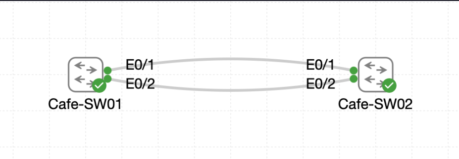

# Lab 038 - Configuring EtherChannel with LACP

<p class="back-link">
  <a href="../../Lab-index.html">← Back to Lab Index</a>
</p>

<table>
<tr>
<td colspan="2" valign="top">

<h1>Objective</h1>

<h4>Inspect the original spanning-tree state between <code>Cafe-SW01</code> and <code>Cafe-SW02</code> before bundling the redundant uplinks.</h4>

<h4>Prepare matching trunk settings on Ethernet0/1 and Ethernet0/2 on both switches.</h4>

<h4>Create an LACP EtherChannel using channel group 1 in active mode.</h4>

<h4>Verify that the physical links bundle into <code>Port-Channel1</code>.</h4>

<h4>Confirm spanning tree treats the bundled links as one logical forwarding path instead of blocking one physical uplink.</h4>

</td>
</tr>

<tr>
<td valign="top">

</td>
</tr>
</table>

---

## Scenario

This lab demonstrates how EtherChannel improves a redundant Layer 2 uplink design.

Before the bundle was created, `Cafe-SW01` and `Cafe-SW02` had two physical links between them. Spanning tree correctly prevented a loop by forwarding over one link and blocking the other. That protected the network, but it also meant one physical uplink was sitting unused from a forwarding perspective.

The goal was to combine Ethernet0/1 and Ethernet0/2 into a single logical LACP EtherChannel. Once the bundle formed, spanning tree no longer saw two separate redundant links. Instead, it saw one logical interface, `Port-Channel1`, which could forward traffic while still using both physical member links underneath.

---

## Devices Used

* Cafe-SW01
* Cafe-SW02

---

## Link Plan

| Switch | Interfaces | Purpose |
| ------ | ---------- | ------- |
| Cafe-SW01 | Ethernet0/1 - Ethernet0/2 | Physical member links for LACP channel group 1 |
| Cafe-SW02 | Ethernet0/1 - Ethernet0/2 | Physical member links for LACP channel group 1 |
| Both switches | Port-Channel1 | Logical bundled trunk formed by Ethernet0/1 and Ethernet0/2 |

---

## EtherChannel Summary

| Setting | Value |
| ------- | ----- |
| EtherChannel protocol | LACP |
| Channel group | 1 |
| Channel mode | active |
| Logical interface | Port-Channel1 |
| Member interfaces | Ethernet0/1, Ethernet0/2 |
| Final role | 802.1Q trunk |
| VLANs allowed | 1-4094 |
| Active VLAN shown in lab | VLAN 1 |

---

## Configuration Steps

### Step 1 - Inspect the Baseline STP State on Cafe-SW01

The spanning-tree state was checked on Cafe-SW01.

```bash
terminal length 0
show spanning-tree
```

### Result

Cafe-SW01 was the root bridge for VLAN 1:

```bash
VLAN0001
  Spanning tree enabled protocol rstp
  Root ID    Priority    4097
             Address     aabb.cc00.0100
             This bridge is the root
```

Its connected ports were forwarding:

```bash
Et0/0               Desg FWD 100       128.1    P2p
Et0/1               Desg FWD 100       128.2    P2p
Et0/2               Desg FWD 100       128.3    P2p
Et0/3               Desg FWD 100       128.4    P2p
```

### Explanation

Cafe-SW01 was already the root bridge, so its inter-switch-facing ports were designated forwarding ports.

---

### Step 2 - Inspect the Baseline STP State on Cafe-SW02

The spanning-tree state was then checked on Cafe-SW02.

```bash
terminal length 0
show spanning-tree
```

### Result

Cafe-SW02 used Ethernet0/1 as its root port and blocked Ethernet0/2 as the alternate path:

```bash
Root ID    Priority    4097
           Address     aabb.cc00.0100
           Cost        100
           Port        2 (Ethernet0/1)
```

```bash
Et0/1               Root FWD 100       128.2    P2p
Et0/2               Altn BLK 100       128.3    P2p
```

### Explanation

This was the baseline condition. Spanning tree was preventing a loop by forwarding one inter-switch link and placing the redundant link into an alternate blocking state.

---

## LACP EtherChannel Configuration

### Step 3 - Prepare and Bundle the Member Interfaces on Cafe-SW01

The two uplinks on Cafe-SW01 were configured with matching trunk settings and added to channel group 1 in LACP active mode.

```bash
configure terminal
interface range ethernet0/1 - 2
switchport trunk encapsulation dot1q
switchport mode trunk
switchport trunk allowed vlan all
channel-group 1 mode active
exit
interface Port-channel1
switchport trunk encapsulation dot1q
switchport mode trunk
switchport trunk allowed vlan all
end
```

### Result

The switch created the logical port-channel interface:

```bash
Creating a port-channel interface Port-channel 1
```

### Evidence Note

At this stage, Cafe-SW02 had not yet been configured for LACP. Cafe-SW01 therefore reported LACP suspension messages:

```bash
%ETC-5-L3DONTBNDL2: Et0/2 suspended: LACP currently not enabled on the remote port.
%ETC-5-L3DONTBNDL2: Et0/1 suspended: LACP currently not enabled on the remote port.
```

### Explanation

This was expected during the half-configured state. EtherChannel requires compatible settings on both sides before member links can bundle successfully.

---

### Step 4 - Prepare and Bundle the Member Interfaces on Cafe-SW02

Cafe-SW02 was then configured to match Cafe-SW01.

```bash
configure terminal
interface range ethernet0/1 - 2
shutdown
switchport trunk encapsulation dot1q
switchport mode trunk
switchport trunk allowed vlan all
channel-group 1 mode active
no shutdown
exit
interface Port-channel1
switchport trunk encapsulation dot1q
switchport mode trunk
switchport trunk allowed vlan all
end
```

### Result

Cafe-SW02 also created Port-Channel1 and the bundle came up:

```bash
Creating a port-channel interface Port-channel 1
%LINK-3-UPDOWN: Interface Port-channel1, changed state to up
%LINEPROTO-5-UPDOWN: Line protocol on Interface Port-channel1, changed state to up
```

### Explanation

Once the remote switch matched the LACP configuration, the suspended state cleared and the port-channel formed successfully.

---

## Verification

### Step 5 - Verify EtherChannel on Cafe-SW01

```bash
show etherchannel summary
```

### Result

```bash
Group  Port-channel  Protocol    Ports
------+-------------+-----------+-----------------------------------------------
1      Po1(SU)         LACP        Et0/1(P)        Et0/2(P)
```

### Explanation

This confirms that Port-Channel1 is a Layer 2 EtherChannel, is in use, uses LACP, and has both Ethernet0/1 and Ethernet0/2 bundled successfully.

---

### Step 6 - Verify STP and Trunking on Cafe-SW01

```bash
show spanning-tree vlan 1
show interfaces port-channel1 status
show interface trunk | begin Port
```

### Result

Spanning tree now saw `Po1` instead of the two individual uplinks:

```bash
Po1                 Desg FWD 56        128.65   P2p
```

Port-Channel1 was connected as a trunk:

```bash
Po1                             connected    trunk        full   auto 10/100/1000BaseTX
```

The trunk table showed VLAN 1 forwarding:

```bash
Po1            on               802.1q         trunking      1
Po1            1
```

### Explanation

The STP cost dropped from the single-link cost of 100 to 56 on the logical bundle, reflecting the improved path through the port-channel.

---

### Step 7 - Verify EtherChannel on Cafe-SW02

```bash
show etherchannel summary
```

### Result

```bash
Group  Port-channel  Protocol    Ports
------+-------------+-----------+-----------------------------------------------
1      Po1(SU)         LACP        Et0/1(P)        Et0/2(P)
```

### Explanation

Cafe-SW02 matched Cafe-SW01. Both Ethernet0/1 and Ethernet0/2 were successfully bundled into Port-Channel1 using LACP.

---

### Step 8 - Verify STP and Trunking on Cafe-SW02

```bash
show spanning-tree vlan 1
show interfaces port-channel1 status
show interface trunk | begin Port
```

### Result

Cafe-SW02 now used Port-Channel1 as the root port:

```bash
Root ID    Priority    4097
           Address     aabb.cc00.0100
           Cost        56
           Port        65 (Port-channel1)
```

The port role table showed:

```bash
Po1                 Root FWD 56        128.65   P2p
```

Port-Channel1 was connected and trunking:

```bash
Po1                             connected    trunk        full   auto 10/100/1000BaseTX
Po1            on               802.1q         trunking      1
```

### Explanation

This was the key improvement. Before the EtherChannel, Cafe-SW02 used Ethernet0/1 as the root port and blocked Ethernet0/2. After the EtherChannel formed, spanning tree saw only Port-Channel1 and used it as one forwarding root port.

---

## Troubleshooting

### Issue 1 - LACP suspension before the remote side was configured

#### Problem

After Cafe-SW01 was configured, the switch reported:

```bash
%ETC-5-L3DONTBNDL2: Et0/2 suspended: LACP currently not enabled on the remote port.
%ETC-5-L3DONTBNDL2: Et0/1 suspended: LACP currently not enabled on the remote port.
```

#### Diagnosis

Cafe-SW01 was ready to negotiate LACP, but Cafe-SW02 had not yet been configured. The local switch suspended the links because the remote side did not match.

#### Fix

Cafe-SW02 was configured with matching trunk settings and the same LACP active channel group.

---

### Issue 2 - Physical links bounced during trunk and channel-group changes

#### Problem

Ethernet0/1 and Ethernet0/2 went down and up during configuration.

#### Diagnosis

This was expected while the interfaces were moved into trunk mode and then added to the port-channel.

#### Fix / Outcome

No additional fix was required. The links stabilised once both sides matched and Port-Channel1 came up.

---

### Issue 3 - Half-built EtherChannel state

#### Problem

Cafe-SW01 created Port-Channel1 before Cafe-SW02 had joined the channel.

#### Diagnosis

EtherChannel is a two-sided configuration. A bundle will not operate correctly until both ends have compatible settings.

#### Fix

The second switch was configured before final verification was performed.

---

## Key Learning Points

* Spanning tree blocks redundant Layer 2 links to prevent loops.
* EtherChannel allows multiple physical links to behave as one logical link.
* LACP is a standards-based negotiation protocol for EtherChannel.
* `mode active` tells the switch to actively negotiate using LACP.
* Member interfaces must have matching Layer 2 settings before they can bundle.
* A remote-side mismatch can suspend member links.
* The logical port-channel should be configured consistently as a trunk.
* After EtherChannel forms, spanning tree sees the port-channel, not the individual member links.
* STP cost can improve when multiple links are bundled.
* `Po1(SU)` with member ports marked `(P)` is strong evidence of a healthy Layer 2 LACP EtherChannel.

---

## Completion Check

The lab was completed successfully.

* Cafe-SW01 was confirmed as the VLAN 1 root bridge before bundling.
* Cafe-SW02 initially used Ethernet0/1 as the root forwarding port.
* Cafe-SW02 initially kept Ethernet0/2 as an alternate blocking port.
* Cafe-SW01 Ethernet0/1 and Ethernet0/2 were configured with matching trunk settings.
* Cafe-SW01 Ethernet0/1 and Ethernet0/2 were added to channel group 1 using LACP active mode.
* Cafe-SW02 Ethernet0/1 and Ethernet0/2 were configured with matching trunk settings.
* Cafe-SW02 Ethernet0/1 and Ethernet0/2 were added to channel group 1 using LACP active mode.
* Port-Channel1 came up on both switches.
* Both switches showed `Po1(SU)` using LACP.
* Both switches showed Ethernet0/1 and Ethernet0/2 as bundled member ports with `(P)`.
* Spanning tree replaced the individual uplinks with `Po1`.
* Cafe-SW02 used `Po1` as the root forwarding port.
* Port-Channel1 was connected as a trunk on both switches.
* VLAN 1 was active and forwarding over Port-Channel1.
