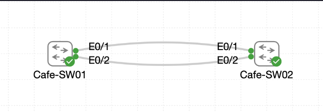

# Lab 039 - Tuning EtherChannel Load Balancing

<p class="back-link">
  <a href="../../Lab-index.html">← Back to Lab Index</a>
</p>

<table>
<tr>
<td colspan="2" valign="top">

<h1>Objective</h1>

<h4>Audit the existing EtherChannel load-balancing algorithm on <code>Cafe-SW01</code>.</h4>

<h4>Change the global EtherChannel hashing method from source-MAC only to source-and-destination MAC.</h4>

<h4>Apply the same load-balancing policy on <code>Cafe-SW02</code> so both ends of the LACP bundle use matching logic.</h4>

<h4>Verify that <code>Port-Channel1</code> remains healthy after the load-balancing change.</h4>

<h4>Confirm both member links remain bundled as active LACP participants.</h4>

</td>
</tr>

<tr>
<td valign="top">

</td>
</tr>
</table>

---

## Scenario

This lab continues from the previous EtherChannel exercise.

`Cafe-SW01` and `Cafe-SW02` already have an LACP EtherChannel built between Ethernet0/1 and Ethernet0/2. The physical links are bundled into the logical interface `Port-Channel1`, which spanning tree treats as a single trunk path.

The purpose of this lab was not to rebuild the EtherChannel, but to tune how traffic is distributed across the bundled member links.

At the start of the lab, `Cafe-SW01` used a source-MAC-only hashing method. This means the switch selected an EtherChannel member link based only on the source MAC address of a frame. The configuration was changed to `src-dst-mac`, which makes the switch consider both the source and destination MAC addresses when choosing a member link.

The same policy was then applied to `Cafe-SW02` so the bundle remained operationally consistent from both sides.

---

## Devices Used

* Cafe-SW01
* Cafe-SW02

---

## EtherChannel Summary

| Setting | Value |
| ------- | ----- |
| EtherChannel protocol | LACP |
| Port-channel | Port-Channel1 |
| Channel group | 1 |
| Member links | Ethernet0/1, Ethernet0/2 |
| Initial load-balancing method | `src-mac` |
| Final load-balancing method | `src-dst-mac` |
| Final Port-Channel state | `Po1(SU)` |
| Final member state | `Et0/1(P)`, `Et0/2(P)` |

---

## Configuration Steps

### Step 1 - Check the Existing Load-Balancing Method on Cafe-SW01

The first task was to inspect the current global EtherChannel load-balancing configuration on `Cafe-SW01`.

```bash
show etherchannel load-balance
```

### Result

```bash
EtherChannel Load-Balancing Configuration:
        src-mac

EtherChannel Load-Balancing Addresses Used Per-Protocol:
Non-IP: Source MAC address
  IPv4: Source MAC address
  IPv6: Source MAC address
```

### Explanation

`Cafe-SW01` was originally using `src-mac` load balancing.

With this algorithm, the switch chooses the EtherChannel member link by hashing the source MAC address. This can work, but it may not spread traffic evenly if many conversations share the same source MAC address.

---

### Step 2 - Change Cafe-SW01 to Source-and-Destination MAC Hashing

The load-balancing method was changed globally on `Cafe-SW01`.

```bash
configure terminal
port-channel load-balance src-dst-mac
end
```

### Result

The switch accepted the change and wrote the configuration event to the log:

```bash
%SYS-5-CONFIG_I: Configured from console by console
```

### Explanation

The command changed the global EtherChannel hashing method.

`src-dst-mac` uses both endpoint MAC addresses when deciding which physical member link should carry a particular flow. This can provide a better traffic spread across the bundle than using only the source MAC address.

---

### Step 3 - Verify the New Load-Balancing Method on Cafe-SW01

The load-balancing configuration was checked again.

```bash
show etherchannel load-balance
```

### Result

```bash
EtherChannel Load-Balancing Configuration:
        src-dst-mac

EtherChannel Load-Balancing Addresses Used Per-Protocol:
Non-IP: Source XOR Destination MAC address
  IPv4: Source XOR Destination MAC address
  IPv6: Source XOR Destination MAC address
```

### Explanation

This confirmed that `Cafe-SW01` had been changed from source-only MAC hashing to source-and-destination MAC hashing.

The important evidence is:

```bash
src-dst-mac
```

and:

```bash
Source XOR Destination MAC address
```

---

### Step 4 - Verify Cafe-SW01 EtherChannel Health

The EtherChannel summary was checked to make sure the policy change did not disrupt the bundle.

```bash
show etherchannel summary
```

### Result

```bash
Group  Port-channel  Protocol    Ports
------+-------------+-----------+-----------------------------------------------
1      Po1(SU)         LACP        Et0/1(P)        Et0/2(P)
```

### Explanation

The port-channel remained healthy.

The output confirms:

* `Po1` is the logical Port-Channel1 interface.
* `S` means Layer 2.
* `U` means the port-channel is in use.
* `LACP` confirms the negotiation protocol.
* `Et0/1(P)` and `Et0/2(P)` confirm both physical member links are bundled in the port-channel.

---

### Step 5 - Apply the Same Load-Balancing Policy on Cafe-SW02

The matching load-balancing method was then configured on `Cafe-SW02`.

```bash
configure terminal
port-channel load-balance src-dst-mac
end
```

### Result

The switch accepted the configuration:

```bash
%SYS-5-CONFIG_I: Configured from console by console
```

### Explanation

Although EtherChannel load balancing is locally significant, using the same hashing method on both switches makes the design easier to understand and verify.

Both switches now use the same source-and-destination MAC hashing policy.

---

### Step 6 - Verify the New Load-Balancing Method on Cafe-SW02

The active load-balancing method was checked on `Cafe-SW02`.

```bash
show etherchannel load-balance
```

### Result

```bash
EtherChannel Load-Balancing Configuration:
        src-dst-mac

EtherChannel Load-Balancing Addresses Used Per-Protocol:
Non-IP: Source XOR Destination MAC address
  IPv4: Source XOR Destination MAC address
  IPv6: Source XOR Destination MAC address
```

### Explanation

This confirmed that `Cafe-SW02` matched `Cafe-SW01`.

Both switches now use `src-dst-mac` as the EtherChannel load-balancing algorithm.

---

### Step 7 - Verify Cafe-SW02 EtherChannel Health

The EtherChannel summary was checked on `Cafe-SW02`.

```bash
show etherchannel summary
```

### Result

```bash
Group  Port-channel  Protocol    Ports
------+-------------+-----------+-----------------------------------------------
1      Po1(SU)         LACP        Et0/1(P)        Et0/2(P)
```

### Explanation

The port-channel remained stable after the load-balancing policy change.

Both physical links were still active LACP members of `Port-Channel1`.

---

## Final Verification

### Cafe-SW01

`Cafe-SW01` reported the final load-balancing method as:

```bash
EtherChannel Load-Balancing Configuration:
        src-dst-mac
```

It also confirmed the source-and-destination MAC hashing behaviour:

```bash
Non-IP: Source XOR Destination MAC address
  IPv4: Source XOR Destination MAC address
  IPv6: Source XOR Destination MAC address
```

The bundle remained healthy:

```bash
1      Po1(SU)         LACP        Et0/1(P)        Et0/2(P)
```

### Cafe-SW02

`Cafe-SW02` reported the same final load-balancing method:

```bash
EtherChannel Load-Balancing Configuration:
        src-dst-mac
```

It also confirmed:

```bash
Non-IP: Source XOR Destination MAC address
  IPv4: Source XOR Destination MAC address
  IPv6: Source XOR Destination MAC address
```

The EtherChannel remained bundled:

```bash
1      Po1(SU)         LACP        Et0/1(P)        Et0/2(P)
```

---

## Troubleshooting

### Issue 1 - No EtherChannel failure after changing load balancing

#### Observation

Changing the global EtherChannel load-balancing method did not cause the bundle to drop.

#### Evidence

Both switches still showed:

```bash
Po1(SU)
Et0/1(P)
Et0/2(P)
```

#### Explanation

This is expected. Changing the hashing algorithm changes how new traffic flows are assigned to member links, but it does not remove the member links from the bundle.

---

### Issue 2 - PnP messages appeared during Cafe-SW02 configuration

#### Observation

The output included PnP messages while configuring `Cafe-SW02`:

```bash
%PNP-6-PNP_TECH_SUMMARY_SAVED_OK
%PNP-6-PNP_DISCOVERY_STOPPED
```

#### Explanation

These were background Plug and Play discovery messages from the lab environment. They did not indicate an EtherChannel problem and did not prevent the load-balancing configuration from being applied.

---

## Key Learning Points

* EtherChannel load balancing is controlled by a global switch setting.
* The default or existing algorithm may not always be the best fit for the traffic pattern.
* `src-mac` uses only the source MAC address when selecting a member link.
* `src-dst-mac` uses both the source and destination MAC addresses.
* Source-and-destination hashing can provide a better spread across member links when traffic has varied endpoints.
* Changing the load-balancing algorithm does not rebuild the EtherChannel.
* `show etherchannel load-balance` verifies the active hashing method.
* `show etherchannel summary` verifies that the port-channel and member links remain healthy.
* `Po1(SU)` confirms a Layer 2 port-channel is up and in use.
* `Et0/1(P)` and `Et0/2(P)` confirm the physical interfaces are bundled members.

---

## Completion Check

The lab was completed successfully.

* The original `Cafe-SW01` load-balancing method was captured as `src-mac`.
* `Cafe-SW01` was changed to `src-dst-mac`.
* `Cafe-SW01` confirmed source-and-destination MAC hashing for Non-IP, IPv4 and IPv6 traffic.
* `Cafe-SW01` retained `Po1(SU)` status.
* `Cafe-SW01` retained Ethernet0/1 and Ethernet0/2 as bundled member links.
* `Cafe-SW02` was configured with the matching `src-dst-mac` policy.
* `Cafe-SW02` confirmed source-and-destination MAC hashing for Non-IP, IPv4 and IPv6 traffic.
* `Cafe-SW02` retained `Po1(SU)` status.
* `Cafe-SW02` retained Ethernet0/1 and Ethernet0/2 as bundled member links.
* Both switches ended with matching EtherChannel load-balancing policy and a healthy LACP bundle.
