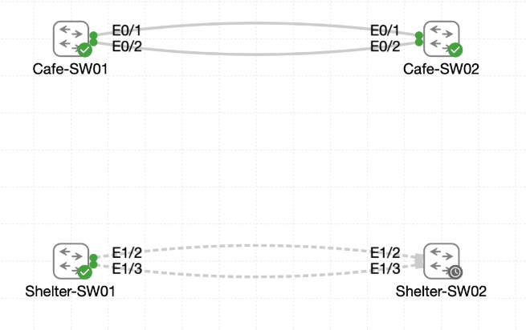

# Lab 040 - Deploying EtherChannel at Castle Rysen Coffee

<p class="back-link">
  <a href="../../Lab-index.html">← Back to Lab Index</a>
</p>

<table>
<tr>
<td colspan="2" valign="top">

<h1>Objective</h1>

<h4>Inspect the existing uplink configuration on the cafe and shelter switch pairs before bundling.</h4>

<h4>Build LACP EtherChannels between the cafe switches and the shelter switches.</h4>

<h4>Replace individually managed redundant Ethernet trunks with logical <code>Port-Channel1</code> interfaces.</h4>

<h4>Verify that spanning tree references the logical port-channel rather than blocking one of the physical uplinks.</h4>

<h4>Tune the EtherChannel load-balancing method to use source and destination MAC address hashing.</h4>

<h4>Document bundle health, trunk forwarding, spanning-tree behaviour and any incomplete verification evidence.</h4>

</td>
</tr>

<tr>
<td valign="top">

</td>
</tr>
</table>

---

## Scenario

This lab extends the previous EtherChannel work into a larger Castle Rysen switching design.

The cafe switches, `Cafe-SW01` and `Cafe-SW02`, originally had two separate physical links between them. Spanning tree could protect the topology from loops, but without EtherChannel it would treat the redundant Ethernet links as separate paths and may block one of them.

The objective was to convert the paired links into a single LACP bundle. The same approach was then repeated between `Shelter-SW01` and `Shelter-SW02` using their matching Ethernet1/2 and Ethernet1/3 uplinks.

After the bundles were created, the load-balancing policy was tuned so conversations are distributed using both the source and destination MAC addresses.

---

## Devices Used

* Cafe-SW01
* Cafe-SW02
* Shelter-SW01
* Shelter-SW02

---

## Link Plan

| Switch Pair | Physical Member Links | Logical Interface | Protocol |
| ----------- | --------------------- | ----------------- | -------- |
| Cafe-SW01 to Cafe-SW02 | Ethernet0/1 and Ethernet0/2 | Port-Channel1 | LACP |
| Shelter-SW01 to Shelter-SW02 | Ethernet1/2 and Ethernet1/3 | Port-Channel1 | LACP |

---

## EtherChannel Configuration Summary

| Setting | Value |
| ------- | ----- |
| Channel group | 1 |
| Negotiation protocol | LACP |
| Channel mode | active |
| Logical interface | Port-Channel1 |
| Port-channel type | Layer 2 |
| Trunk encapsulation | 802.1Q |
| Allowed VLANs | all |
| Final cafe load-balancing method | src-dst-mac |
| Intended shelter load-balancing method | src-dst-mac |

---

## Configuration Steps

### Step 1 - Inspect Cafe-SW01 Uplink Configuration

The running configuration was checked on `Cafe-SW01`.

```bash
terminal length 0
show running-config
show running-config interface ethernet0/1
show running-config interface ethernet0/2
```

### Result

Ethernet0/1 and Ethernet0/2 had matching descriptions but no trunk or channel-group configuration yet:

```bash
interface Ethernet0/1
 description Cafe uplink to Cafe-SW02 (Link A)
```

```bash
interface Ethernet0/2
 description Cafe uplink to Cafe-SW02 (Link B)
```

`show interface trunk` returned no active trunks at this point.

### Explanation

This confirmed the starting point. The uplink pair was physically present and consistently described, but the ports had not yet been converted into trunks or bundled into an EtherChannel.

---

### Step 2 - Check the Cafe Baseline Spanning-Tree State

The VLAN 1 spanning-tree state was checked on Cafe-SW01.

```bash
show spanning-tree vlan 1
```

### Result

Cafe-SW01 was the root bridge for VLAN 1:

```bash
Root ID    Priority    32769
           Address     aabb.cc00.0100
           This bridge is the root
```

The physical uplinks were shown individually:

```bash
Et0/1               Desg FWD 100       128.2    P2p
Et0/2               Desg FWD 100       128.3    P2p
```

### Explanation

Before EtherChannel was configured, spanning tree saw Ethernet0/1 and Ethernet0/2 as separate physical interfaces.

The goal was to replace those separate STP entries with a single logical `Port-Channel1`.

---

## Cafe EtherChannel Deployment

### Step 3 - Configure Cafe-SW01 Member Links

The two cafe uplinks on Cafe-SW01 were configured as matching trunks and added to LACP channel group 1.

```bash
configure terminal
interface range ethernet0/1 - 2
switchport trunk encapsulation dot1q
switchport mode trunk
switchport trunk allowed vlan all
channel-group 1 mode active
exit
```

### Result

The switch created the logical port-channel:

```bash
Creating a port-channel interface Port-channel 1
```

### Explanation

`channel-group 1 mode active` enables LACP and actively negotiates the bundle.

Both member interfaces must have identical Layer 2 settings before the channel can form correctly.

---

### Step 4 - Configure Cafe-SW01 Port-Channel1

The logical port-channel on Cafe-SW01 was configured as a trunk.

```bash
interface Port-channel1
switchport trunk encapsulation dot1q
switchport mode trunk
switchport trunk allowed vlan all
end
```

### Evidence Note

At this point, Cafe-SW02 had not yet been configured. Cafe-SW01 therefore reported LACP suspension messages:

```bash
%ETC-5-L3DONTBNDL2: Et0/1 suspended: LACP currently not enabled on the remote port.
%ETC-5-L3DONTBNDL2: Et0/2 suspended: LACP currently not enabled on the remote port.
```

`show etherchannel summary` showed:

```bash
1      Po1(SD)         LACP        Et0/1(s)        Et0/2(s)
```

### Explanation

This was an expected half-built EtherChannel state.

`Po1(SD)` means the Layer 2 port-channel existed but was down, and `(s)` means the member links were suspended. The reason was clear from the log: the remote switch had not yet enabled LACP on its matching ports.

---

### Step 5 - Correct a Trunk Command Typo

One command was entered with a missing space:

```bash
switchport trunk allowedvlan all
```

IOS rejected it:

```bash
% Invalid input detected at '^' marker.
```

The command was corrected:

```bash
switchport trunk allowed vlan all
```

### Explanation

This was a simple CLI syntax error and was corrected immediately.

---

### Step 6 - Configure Cafe-SW02 Member Links

Cafe-SW02 was configured with the same trunk and LACP settings.

```bash
configure terminal
interface range ethernet0/1 - 2
switchport trunk encapsulation dot1q
switchport mode trunk
switchport trunk allowed vlan all
channel-group 1 mode active
exit
```

### Result

Cafe-SW02 created `Port-channel1`, and the port-channel came up:

```bash
Creating a port-channel interface Port-channel 1
%LINK-3-UPDOWN: Interface Port-channel1, changed state to up
%LINEPROTO-5-UPDOWN: Line protocol on Interface Port-channel1, changed state to up
```

### Explanation

Once both ends had compatible LACP settings, the EtherChannel negotiated successfully.

---

### Step 7 - Configure Cafe-SW02 Port-Channel1

The logical port-channel on Cafe-SW02 was configured as a trunk.

```bash
interface Port-channel1
switchport trunk encapsulation dot1q
switchport mode trunk
switchport trunk allowed vlan all
end
```

### Verification

```bash
show etherchannel summary
show interface trunk
show spanning-tree vlan 1
```

### Result

Cafe-SW02 showed a healthy LACP bundle:

```bash
1      Po1(SU)         LACP        Et0/1(P)        Et0/2(P)
```

The port-channel was trunking:

```bash
Port           Mode             Encapsulation  Status        Native vlan
Po1            on               802.1q         trunking      1
```

Spanning tree used `Port-Channel1` as the root port:

```bash
Root ID    Priority    32769
           Address     aabb.cc00.0100
           Cost        56
           Port        65 (Port-channel1)
```

```bash
Po1                 Root FWD 56        128.65   P2p
```

### Explanation

This confirmed that the cafe EtherChannel was operational.

Spanning tree no longer saw two separate physical uplinks. It saw the logical `Port-Channel1` and used that bundle as the forwarding path.

---

## Shelter EtherChannel Deployment

### Step 8 - Inspect Shelter-SW01 Uplink Configuration

The shelter uplinks on Shelter-SW01 were checked first.

```bash
terminal length 0
show running-config interface ethernet1/2
show running-config interface ethernet1/3
```

### Result

The two uplinks had matching descriptions:

```bash
interface Ethernet1/2
 description Shelter uplink to Shelter-SW02 (Link A)
```

```bash
interface Ethernet1/3
 description Shelter uplink to Shelter-SW02 (Link B)
```

### Explanation

Ethernet1/2 and Ethernet1/3 were confirmed as the intended shelter bundle members.

---

### Step 9 - Configure Shelter-SW01 Member Links

The shelter uplinks on Shelter-SW01 were configured as matching trunks and added to LACP channel group 1.

```bash
configure terminal
interface range ethernet1/2-3
switchport trunk encapsulation dot1q
switchport mode trunk
switchport trunk allowed vlan all
channel-group 1 mode active
exit
```

### Result

The switch created Port-Channel1:

```bash
Creating a port-channel interface Port-channel 1
```

### Evidence Note

As with the cafe pair, Shelter-SW01 showed suspension while the remote side was not yet configured:

```bash
%ETC-5-L3DONTBNDL2: Et1/2 suspended: LACP currently not enabled on the remote port.
%ETC-5-L3DONTBNDL2: Et1/3 suspended: LACP currently not enabled on the remote port.
```

`show etherchannel summary` showed:

```bash
1      Po1(SD)         LACP        Et1/2(s)        Et1/3(s)
```

### Explanation

This was the expected intermediate state. The local switch was ready for LACP, but the peer had not yet been configured.

---

### Step 10 - Configure Shelter-SW01 Port-Channel1

The logical shelter port-channel was configured as a trunk.

```bash
interface Port-channel1
switchport trunk encapsulation dot1q
switchport mode trunk
switchport trunk allowed vlan all
end
```

### Explanation

This ensured the logical interface would carry the same trunk behaviour as the member links once the remote side joined the channel.

---

### Step 11 - Inspect Shelter-SW02 Uplink Configuration

The matching uplinks on Shelter-SW02 were checked.

```bash
terminal length 0
show running-config interface ethernet1/2
show running-config interface ethernet1/3
```

### Result

The peer links were clearly identified:

```bash
interface Ethernet1/2
 description Shelter uplink to Shelter-SW01 (Link A)
```

```bash
interface Ethernet1/3
 description Shelter uplink to Shelter-SW01 (Link B)
```

### Explanation

This confirmed that Shelter-SW02 Ethernet1/2 and Ethernet1/3 were the correct peer interfaces for the bundle.

---

### Step 12 - Configure Shelter-SW02 Member Links and Port-Channel1

Shelter-SW02 was configured to match Shelter-SW01.

```bash
configure terminal
interface range ethernet1/2-3
switchport trunk encapsulation dot1q
switchport mode trunk
switchport trunk allowed vlan all
channel-group 1 mode active
exit

interface Port-channel1
switchport trunk encapsulation dot1q
switchport mode trunk
switchport trunk allowed vlan all
end
```

### Verification

```bash
show etherchannel summary
show interface trunk
show spanning-tree vlan 1
```

### Result

Shelter-SW02 showed a healthy LACP bundle:

```bash
1      Po1(SU)         LACP        Et1/2(P)        Et1/3(P)
```

The port-channel was trunking:

```bash
Port           Mode             Encapsulation  Status        Native vlan
Po1            on               802.1q         trunking      1
```

Spanning tree used Port-Channel1 as the root path:

```bash
Root ID    Priority    32769
           Address     aabb.cc00.0300
           Cost        56
           Port        65 (Port-channel1)
```

```bash
Po1                 Root FWD 56        128.65   P2p
```

### Explanation

The shelter EtherChannel formed successfully once both switches had matching LACP configuration.

---

## EtherChannel Load-Balancing Tuning

### Step 13 - Tune Load Balancing on Cafe-SW01

The load-balancing method was changed to source-and-destination MAC hashing.

```bash
configure terminal
port-channel load-balance src-dst-mac
end
```

### Verification

```bash
show etherchannel load-balance
show etherchannel summary
```

### Result

Cafe-SW01 reported:

```bash
EtherChannel Load-Balancing Configuration:
        src-dst-mac
```

The addresses used per protocol showed:

```bash
Non-IP: Source XOR Destination MAC address
  IPv4: Source XOR Destination MAC address
  IPv6: Source XOR Destination MAC address
```

The channel remained healthy:

```bash
1      Po1(SU)         LACP        Et0/1(P)        Et0/2(P)
```

### Explanation

The load-balancing policy now considers both endpoints' MAC addresses when selecting a member link.

This can distribute conversations more evenly than a single-field hash in environments where many flows share the same source or destination.

---

### Step 14 - Tune Load Balancing on Cafe-SW02

Cafe-SW02 was checked and then configured to match.

Initial check:

```bash
show etherchannel load-balance
```

Initial result:

```bash
EtherChannel Load-Balancing Configuration:
        src-dst-ip
```

The load-balancing method was changed:

```bash
configure terminal
port-channel load-balance src-dst-mac
end
```

Final verification showed:

```bash
EtherChannel Load-Balancing Configuration:
        src-dst-mac
```

The port-channel remained bundled:

```bash
1      Po1(SU)         LACP        Et0/1(P)        Et0/2(P)
```

### Explanation

Cafe-SW02 now matched Cafe-SW01 with the same `src-dst-mac` policy.

---

## Final Verification

### Cafe-SW01

Cafe-SW01 final verification showed:

```bash
EtherChannel Load-Balancing Configuration:
        src-dst-mac
```

```bash
1      Po1(SU)         LACP        Et0/1(P)        Et0/2(P)
```

### Cafe-SW02

Cafe-SW02 final verification showed:

```bash
EtherChannel Load-Balancing Configuration:
        src-dst-mac
```

```bash
1      Po1(SU)         LACP        Et0/1(P)        Et0/2(P)
```

### Shelter-SW02

Shelter-SW02 final verification showed:

```bash
1      Po1(SU)         LACP        Et1/2(P)        Et1/3(P)
```

Its trunk table showed:

```bash
Po1            on               802.1q         trunking      1
```

Spanning tree used Port-Channel1 as the root path:

```bash
Po1                 Root FWD 56        128.65   P2p
```

### Evidence Gap

The supplied raw output confirms the final healthy shelter bundle on Shelter-SW02, but does not include a later `show etherchannel summary` recapture from Shelter-SW01 after Shelter-SW02 was configured.

The supplied raw output also confirms the final `src-dst-mac` load-balancing setting on Cafe-SW01 and Cafe-SW02, but it does not include equivalent final load-balancing verification for Shelter-SW01 and Shelter-SW02.

For a perfect completion set, the following commands should be captured on both shelter switches:

```bash
show etherchannel summary
show etherchannel load-balance
show interface trunk
show spanning-tree vlan 1
```

---

## Troubleshooting

### Issue 1 - LACP suspension while only one side was configured

#### Problem

After channel group 1 was configured on Cafe-SW01 and Shelter-SW01, both switches reported suspension messages.

Cafe-SW01:

```bash
%ETC-5-L3DONTBNDL2: Et0/1 suspended: LACP currently not enabled on the remote port.
%ETC-5-L3DONTBNDL2: Et0/2 suspended: LACP currently not enabled on the remote port.
```

Shelter-SW01:

```bash
%ETC-5-L3DONTBNDL2: Et1/2 suspended: LACP currently not enabled on the remote port.
%ETC-5-L3DONTBNDL2: Et1/3 suspended: LACP currently not enabled on the remote port.
```

#### Diagnosis

This happened because the local switch had LACP enabled, but the remote switch had not yet been configured to participate in the same channel group.

#### Fix

The peer switches were configured with matching trunk settings and `channel-group 1 mode active`.

---

### Issue 2 - Port-channel showed `Po1(SD)` during the half-built state

#### Problem

Before the remote side joined the bundle, the local switches showed:

```bash
Po1(SD)
```

with suspended member links:

```bash
Et0/1(s)        Et0/2(s)
Et1/2(s)        Et1/3(s)
```

#### Diagnosis

`S` indicates a Layer 2 port-channel. `D` indicates the port-channel was down. The member ports were suspended because LACP could not negotiate with the remote side yet.

#### Fix

Once the peer switch was configured, the bundle changed to:

```bash
Po1(SU)
```

with member ports marked:

```bash
(P)
```

---

### Issue 3 - Typo in trunk allowed VLAN command

#### Problem

This command was entered incorrectly:

```bash
switchport trunk allowedvlan all
```

#### Diagnosis

IOS rejected the command because `allowedvlan` is not valid syntax.

#### Fix

The correct command was entered:

```bash
switchport trunk allowed vlan all
```

---

### Issue 4 - Shelter-side final verification was incomplete in the captured evidence

#### Problem

The task asked for load-balancing validation across all four switches, but the supplied CLI only shows `show etherchannel load-balance` after the change on the two cafe switches.

#### Diagnosis

The shelter EtherChannel configuration was captured, and Shelter-SW02 showed a healthy `Po1(SU)` bundle, but the final shelter load-balancing checks are not present in the evidence.

#### Fix / Recommendation

Capture the missing shelter verification commands:

```bash
show etherchannel load-balance
show etherchannel summary
```

on both Shelter-SW01 and Shelter-SW02.

---

## Key Learning Points

* EtherChannel turns multiple physical links into one logical interface.
* LACP requires both sides to participate with compatible settings.
* A half-configured LACP bundle can place member links into suspended state.
* The logical `Port-Channel1` should be configured as a trunk, not just the physical member links.
* Spanning tree sees the port-channel as one logical path.
* EtherChannel can reduce STP blocking of parallel physical links while still preserving loop prevention.
* `Po1(SU)` means the Layer 2 port-channel is up and in use.
* Member ports marked `(P)` are bundled successfully.
* `src-dst-mac` load balancing hashes using both source and destination MAC addresses.
* Changing the global load-balancing algorithm should be followed by EtherChannel health verification.
* Portfolio evidence should distinguish between completed configuration and missing final verification captures.

---

## Completion Check

The lab was mostly completed, with one evidence gap noted.

* Cafe-SW01 Ethernet0/1 and Ethernet0/2 were inspected before bundling.
* Cafe-SW01 initially had no active trunk output.
* Cafe-SW01 showed Ethernet0/1 and Ethernet0/2 as separate STP interfaces before bundling.
* Cafe-SW01 Ethernet0/1 and Ethernet0/2 were configured as trunk members of channel group 1.
* Cafe-SW02 Ethernet0/1 and Ethernet0/2 were configured as matching trunk members of channel group 1.
* Cafe-SW02 showed `Po1(SU)` with `Et0/1(P)` and `Et0/2(P)`.
* Cafe-SW02 showed Port-Channel1 trunking and forwarding VLAN 1.
* Cafe-SW02 spanning tree referenced Port-Channel1 as the root forwarding path.
* Shelter-SW01 Ethernet1/2 and Ethernet1/3 were inspected before bundling.
* Shelter-SW01 Ethernet1/2 and Ethernet1/3 were configured as trunk members of channel group 1.
* Shelter-SW02 Ethernet1/2 and Ethernet1/3 were configured as matching trunk members of channel group 1.
* Shelter-SW02 showed `Po1(SU)` with `Et1/2(P)` and `Et1/3(P)`.
* Shelter-SW02 showed Port-Channel1 trunking and forwarding VLAN 1.
* Shelter-SW02 spanning tree referenced Port-Channel1 as the root forwarding path.
* Cafe-SW01 was changed to `src-dst-mac` load balancing.
* Cafe-SW02 was changed to `src-dst-mac` load balancing.
* Cafe-SW01 and Cafe-SW02 both confirmed healthy `Po1(SU)` bundles after the load-balancing change.
* Recommended follow-up: recapture `show etherchannel load-balance` and `show etherchannel summary` on both shelter switches to fully satisfy the all-four-switch load-balancing completion check.
