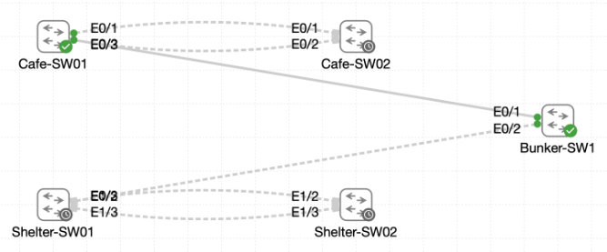

# Lab 041 - Increasing Bandwidth Using EtherChannel

<p class="back-link">
  <a href="../../Lab-index.html">← Back to Lab Index</a>
</p>

<table>
<tr>
<td colspan="2" valign="top">

<h1>Objective</h1>

<h4>Assess the existing redundant cafe and shelter uplinks before changing the topology.</h4>

<h4>Build an LACP EtherChannel between <code>Cafe-SW01</code> and <code>Cafe-SW02</code> using Ethernet0/1 and Ethernet0/2.</h4>

<h4>Build an LACP EtherChannel between <code>Shelter-SW01</code> and <code>Shelter-SW02</code> using the live Ethernet1/2 and Ethernet1/3 interfaces.</h4>

<h4>Verify that <code>Port-Channel1</code> replaces the individual Ethernet links in spanning-tree output.</h4>

<h4>Standardise EtherChannel load balancing to <code>src-dst-mac</code> on all four distribution switches.</h4>

<h4>Test single-member link failure and recovery while keeping the logical port-channel operational.</h4>

</td>
</tr>

<tr>
<td valign="top">

</td>
</tr>
</table>

---

## Scenario

This lab extends the Castle Rysen EtherChannel work into a full skill-lab deployment.

The cafe pair and the shelter pair both started with redundant physical links. Spanning tree protected the topology, but those separate links could leave bandwidth unused because one redundant path may be blocked. The goal was to convert each redundant pair into a single LACP bundle so the switches could use two physical links as one logical trunk.

The lab also tuned EtherChannel load balancing. Each switch was changed from the starting `src-dst-ip` policy to `src-dst-mac`, so the bundle hashes traffic using both the source and destination MAC addresses.

Finally, each port channel was tested by shutting down one member link and confirming that the logical bundle stayed up with the remaining member. The failed link was then restored and verified back in the bundle.

---

## Devices Used

* Cafe-SW01
* Cafe-SW02
* Shelter-SW01
* Shelter-SW02
* Bunker-SW1 / monitoring hub reference in the scenario

---

## Live Interface Plan

| Switch Pair | Physical Member Links Used | Logical Interface | Notes |
| ----------- | -------------------------- | ----------------- | ----- |
| Cafe-SW01 to Cafe-SW02 | Ethernet0/1 and Ethernet0/2 | Port-Channel1 | Cafe LACP bundle |
| Shelter-SW01 to Shelter-SW02 | Ethernet1/2 and Ethernet1/3 | Port-Channel1 | Live lab used Ethernet1/2-1/3 rather than the guide's Ethernet0/6-0/7 labels |

---

## EtherChannel Design Summary

| Setting | Value |
| ------- | ----- |
| EtherChannel protocol | LACP |
| Channel group | 1 |
| LACP mode | active |
| Port-channel interface | Port-Channel1 |
| Port-channel type | Layer 2 |
| Trunk encapsulation | 802.1Q |
| Allowed VLANs | all / 1-4094 |
| Active VLAN shown in evidence | VLAN 1 |
| Final load-balancing method | src-dst-mac |

---

## Configuration Steps

### Step 1 - Assess Cafe-SW01 Before EtherChannel

The initial spanning-tree state and EtherChannel state were checked on Cafe-SW01.

```bash
terminal length 0
show spanning-tree
show spanning-tree interface ethernet0/1
show spanning-tree interface ethernet0/2
show interface trunk
show etherchannel summary
```

### Result

Cafe-SW01 had no port channels configured:

```bash
Number of channel-groups in use: 0
Number of aggregators:           0
```

Ethernet0/1 and Ethernet0/2 were standalone spanning-tree interfaces:

```bash
VLAN0001            Desg FWD 100       128.2    P2p
VLAN0001            Desg FWD 100       128.3    P2p
```

### Explanation

This established the baseline before bundling. The physical links were separate Ethernet interfaces, and there was no logical `Port-Channel1` yet.

---

### Step 2 - Assess Cafe-SW02 Before EtherChannel

Cafe-SW02 was checked next.

```bash
show spanning-tree
show vlan
show interfaces trunk
show etherchannel summary
```

### Result

Cafe-SW02 also had no EtherChannel configured:

```bash
Number of channel-groups in use: 0
Number of aggregators:           0
```

Spanning tree showed one cafe uplink forwarding and one alternate blocking:

```bash
Et0/1               Root FWD 100       128.2    P2p
Et0/2               Altn BLK 100       128.3    P2p
```

### Explanation

This showed the limitation EtherChannel was intended to fix. Spanning tree was protecting the network by blocking one redundant link, but that meant the second physical uplink was not forwarding traffic as an independent path.

---

### Step 3 - Assess Shelter-SW01 Before EtherChannel

Shelter-SW01 was checked before bundling.

```bash
terminal length 0
show spanning-tree
show vlan
show etherchannel summary
show interfaces trunk
```

### Result

No port channel was present:

```bash
Number of channel-groups in use: 0
Number of aggregators:           0
```

Ethernet1/2 and Ethernet1/3 appeared as normal individual spanning-tree interfaces.

### Explanation

The shelter pair also began with standalone links rather than an LACP bundle.

---

### Step 4 - Assess Shelter-SW02 Before EtherChannel

Shelter-SW02 was checked next.

```bash
show spanning-tree
show vlan
show etherchannel summary
show interfaces trunk
```

### Result

No port channel was present:

```bash
Number of channel-groups in use: 0
Number of aggregators:           0
```

The redundant shelter pair showed one path forwarding and one alternate blocking:

```bash
Et1/2               Root FWD 100       128.7    P2p
Et1/3               Altn BLK 100       128.8    P2p
```

### Explanation

This confirmed that spanning tree was preventing a loop by blocking one of the redundant shelter links. After EtherChannel, both physical members should participate inside one logical forwarding path.

---

## Cafe EtherChannel Deployment

### Step 5 - Configure Cafe-SW01 Member Links

Ethernet0/1 and Ethernet0/2 were configured as matching trunks and added to LACP channel group 1.

```bash
configure terminal
interface range ethernet0/1 - 2
switchport trunk encapsulation dot1q
switchport mode trunk
switchport trunk allowed vlan all
channel-group 1 mode active
exit
```

### Result

The switch created Port-Channel1:

```bash
Creating a port-channel interface Port-channel 1
```

At this stage the peer switch had not yet been configured, so Cafe-SW01 reported LACP suspension messages:

```bash
%ETC-5-L3DONTBNDL2: Et0/1 suspended: LACP currently not enabled on the remote port.
%ETC-5-L3DONTBNDL2: Et0/2 suspended: LACP currently not enabled on the remote port.
```

The intermediate state showed:

```bash
1      Po1(SD)         LACP        Et0/1(s)        Et0/2(s)
```

### Explanation

This was expected while only one side of the EtherChannel was configured. LACP needs matching configuration on both ends before the member interfaces can bundle.

---

### Step 6 - Configure Cafe-SW01 Port-Channel1

The logical interface was configured as a trunk.

```bash
interface Port-channel1
switchport trunk encapsulation dot1q
switchport mode trunk
switchport trunk allowed vlan all
end
```

### Explanation

The port-channel itself must be configured with the intended trunk behaviour. The logical interface is what spanning tree and the switching fabric use once the physical links are bundled.

---

### Step 7 - Configure Cafe-SW02 and Complete the Cafe Bundle

The same member-link and port-channel configuration was applied on Cafe-SW02.

```bash
configure terminal
interface range ethernet0/1 - 2
switchport trunk encapsulation dot1q
switchport mode trunk
switchport trunk allowed vlan all
channel-group 1 mode active
exit

interface Port-channel1
switchport trunk encapsulation dot1q
switchport mode trunk
switchport trunk allowed vlan all
end
```

### Verification

```bash
show etherchannel summary
show spanning-tree
```

### Result

Cafe-SW02 showed the bundle up and in use:

```bash
1      Po1(SU)         LACP        Et0/1(P)        Et0/2(P)
```

Spanning tree now used Port-Channel1 as the forwarding path:

```bash
Po1                 Root FWD 56        128.65   P2p
```

Cafe-SW01 was then rechecked and also showed a healthy bundle:

```bash
1      Po1(SU)         LACP        Et0/1(P)        Et0/2(P)
```

### Explanation

The cafe EtherChannel formed successfully after both switches were configured. The physical member links were no longer treated as separate STP paths; they were now part of one logical `Port-Channel1`.

---

## Shelter EtherChannel Deployment

### Step 8 - Configure Shelter-SW01 Member Links

The shelter pair used the live Ethernet1/2 and Ethernet1/3 interfaces.

```bash
configure terminal
interface range ethernet1/2 - 3
switchport trunk encapsulation dot1q
switchport mode trunk
switchport trunk allowed vlan all
channel-group 1 mode active
exit
```

### Result

Port-Channel1 was created, but Shelter-SW01 initially showed the expected half-built state:

```bash
%ETC-5-L3DONTBNDL2: Et1/2 suspended: LACP currently not enabled on the remote port.
%ETC-5-L3DONTBNDL2: Et1/3 suspended: LACP currently not enabled on the remote port.
```

### Explanation

As with the cafe side, LACP could not complete the bundle until the remote shelter switch was configured.

---

### Step 9 - Configure Shelter-SW01 Port-Channel1

The logical interface was configured as a trunk.

```bash
interface Port-channel1
switchport trunk encapsulation dot1q
switchport mode trunk
switchport trunk allowed vlan all
end
```

### Evidence Note

An invalid command was attempted from port-channel interface mode:

```bash
channel-group 1 mode active
```

IOS rejected it because `channel-group` is applied to the physical member interfaces, not the logical port-channel interface.

---

### Step 10 - Configure Shelter-SW02 and Complete the Shelter Bundle

Shelter-SW02 was configured to match Shelter-SW01.

```bash
configure terminal
interface range ethernet1/2 - 3
switchport trunk encapsulation dot1q
switchport mode trunk
switchport trunk allowed vlan all
channel-group 1 mode active
exit

interface Port-channel1
switchport trunk encapsulation dot1q
switchport mode trunk
switchport trunk allowed vlan all
end
```

### Verification

```bash
show etherchannel summary
show spanning-tree
```

### Result

Shelter-SW02 showed:

```bash
1      Po1(SU)         LACP        Et1/2(P)        Et1/3(P)
```

Spanning tree referenced Port-Channel1:

```bash
Po1                 Root FWD 56        128.65   P2p
```

Shelter-SW01 also later showed a healthy bundle:

```bash
1      Po1(SU)         LACP        Et1/2(P)        Et1/3(P)
```

### Explanation

The shelter EtherChannel formed successfully after both ends were configured. The individual Ethernet links became bundled members of `Port-Channel1`.

---

## Load-Balancing Standardisation

### Step 11 - Change Load Balancing on Cafe-SW01

The starting algorithm was checked.

```bash
show etherchannel load-balance
```

### Result

Cafe-SW01 initially used:

```bash
EtherChannel Load-Balancing Configuration:
        src-dst-ip
```

The policy was changed to source-and-destination MAC hashing:

```bash
configure terminal
port-channel load-balance src-dst-mac
end
```

Final verification showed:

```bash
EtherChannel Load-Balancing Configuration:
        src-dst-mac
```

The bundle remained healthy:

```bash
1      Po1(SU)         LACP        Et0/1(P)        Et0/2(P)
```

---

### Step 12 - Change Load Balancing on Cafe-SW02

Cafe-SW02 was changed in the same way.

```bash
configure terminal
port-channel load-balance src-dst-mac
end
```

Final verification showed:

```bash
EtherChannel Load-Balancing Configuration:
        src-dst-mac
```

The channel remained healthy:

```bash
1      Po1(SU)         LACP        Et0/1(P)        Et0/2(P)
```

---

### Step 13 - Change Load Balancing on Shelter-SW01

Shelter-SW01 also began with `src-dst-ip` and was changed to `src-dst-mac`.

```bash
configure terminal
port-channel load-balance src-dst-mac
end
```

Final verification showed:

```bash
EtherChannel Load-Balancing Configuration:
        src-dst-mac
```

The bundle remained healthy:

```bash
1      Po1(SU)         LACP        Et1/2(P)        Et1/3(P)
```

---

### Step 14 - Change Load Balancing on Shelter-SW02

Shelter-SW02 was changed to the same policy.

```bash
configure terminal
port-channel load-balance src-dst-mac
end
```

Final verification showed:

```bash
EtherChannel Load-Balancing Configuration:
        src-dst-mac
```

The channel remained healthy:

```bash
1      Po1(SU)         LACP        Et1/2(P)        Et1/3(P)
```

### Explanation

All four distribution switches now used the same EtherChannel hashing policy. This consistency is useful because it makes traffic distribution behaviour predictable across the deployment.

---

## Resilience Testing

### Step 15 - Test Cafe Member Failure

Cafe-SW01 Ethernet0/1 was shut down to simulate a single member failure.

```bash
configure terminal
interface ethernet0/1
shutdown
end
```

### Result

The port-channel stayed up while one member went down:

```bash
1      Po1(SU)         LACP        Et0/1(D)        Et0/2(P)
```

The load-balancing policy remained in place:

```bash
EtherChannel Load-Balancing Configuration:
        src-dst-mac
```

Ethernet0/1 was then restored:

```bash
configure terminal
interface ethernet0/1
no shutdown
end
```

Final verification showed both members bundled again:

```bash
1      Po1(SU)         LACP        Et0/1(P)        Et0/2(P)
```

### Explanation

This proved that the logical port-channel remained operational during a single-member outage and recovered cleanly when the failed member returned.

---

### Step 16 - Test Shelter Member Failure

Shelter-SW01 Ethernet1/2 was shut down to simulate a shelter member failure.

```bash
configure terminal
interface ethernet1/2
shutdown
end
```

### Result

The shelter port-channel also stayed up with one failed member:

```bash
1      Po1(SU)         LACP        Et1/2(D)        Et1/3(P)
```

Spanning-tree summary still showed VLAN 1 forwarding without blocking or learning states:

```bash
VLAN0001                     0         0        0          7          7
```

Ethernet1/2 was restored:

```bash
configure terminal
interface ethernet1/2
no shutdown
end
```

Final verification showed both shelter members bundled again:

```bash
1      Po1(SU)         LACP        Et1/2(P)        Et1/3(P)
```

### Explanation

The shelter test confirmed the same resilience behaviour as the cafe side.

---

## Final Verification

### Cafe-SW01

Final checks confirmed:

```bash
1      Po1(SU)         LACP        Et0/1(P)        Et0/2(P)
```

```bash
EtherChannel Load-Balancing Configuration:
        src-dst-mac
```

`show interfaces Port-channel1` confirmed:

```bash
Port-channel1 is up, line protocol is up (connected)
Members in this channel: Et0/1 Et0/2
```

---

### Cafe-SW02

Final checks confirmed:

```bash
1      Po1(SU)         LACP        Et0/1(P)        Et0/2(P)
```

```bash
EtherChannel Load-Balancing Configuration:
        src-dst-mac
```

Port-Channel1 was the root forwarding path:

```bash
Po1                 Root FWD 56        128.65   P2p
```

---

### Shelter-SW01

Final checks confirmed:

```bash
1      Po1(SU)         LACP        Et1/2(P)        Et1/3(P)
```

```bash
EtherChannel Load-Balancing Configuration:
        src-dst-mac
```

Port-Channel1 was forwarding in spanning tree:

```bash
Po1                 Desg FWD 56        128.65   P2p
```

---

### Shelter-SW02

Final checks confirmed:

```bash
1      Po1(SU)         LACP        Et1/2(P)        Et1/3(P)
```

```bash
EtherChannel Load-Balancing Configuration:
        src-dst-mac
```

Port-Channel1 was the root forwarding path:

```bash
Po1                 Root FWD 56        128.65   P2p
```

---

## Troubleshooting

### Issue 1 - Initial login timeout

#### Problem

The first Cafe-SW01 username prompt timed out.

```bash
% Username:  timeout expired!
```

#### Fix

The correct username and password were entered and the login succeeded.

---

### Issue 2 - Mistyped show command

#### Problem

On Cafe-SW02, this command was mistyped:

```bash
show spaning-tree
```

#### Fix

The correct command was used:

```bash
show spanning-tree
```

---

### Issue 3 - LACP suspension while only one side was configured

#### Problem

The first switch in each pair showed messages such as:

```bash
%ETC-5-L3DONTBNDL2: Et0/1 suspended: LACP currently not enabled on the remote port.
%ETC-5-L3DONTBNDL2: Et1/2 suspended: LACP currently not enabled on the remote port.
```

#### Diagnosis

The local switch had been configured for LACP, but the peer switch had not yet been configured.

#### Fix

The peer switches were configured with matching trunk and channel-group settings. The suspended members then recovered into a bundled `(P)` state.

---

### Issue 4 - Attempted `channel-group` under Port-Channel1

#### Problem

This command was attempted under the logical interface:

```bash
interface Port-channel1
channel-group 1 mode active
```

#### Diagnosis

`channel-group` belongs on the physical member interfaces, not the logical port-channel interface.

#### Fix

The physical member links had already been placed into channel group 1. Port-Channel1 only needed trunk settings.

---

### Issue 5 - Mistyped `show running-config` command

#### Problem

The command was entered as:

```bash
how running-config interface port-channel1
```

IOS rejected it.

#### Fix

The correct form is:

```bash
show running-config interface port-channel1
```

---

### Issue 6 - Guide interface labels differed from the live lab

#### Problem

The written guide referred to shelter Ethernet0/6 and Ethernet0/7.

#### Diagnosis

The live lab used Ethernet1/2 and Ethernet1/3 for the shelter LACP bundle.

#### Fix

The live interface map was followed:

```bash
interface range ethernet1/2 - 3
```

---

### Issue 7 - Utilisation snapshots were limited

#### Problem

The task requested interface utilisation snapshots to demonstrate load distribution.

#### Evidence Captured

The lab did capture `show interfaces Port-channel1` output showing the logical interface was up, the members were present, and counters were clean.

#### Limitation

There was very little traffic in the lab environment, so five-minute input/output rates were mostly `0 bits/sec`. This proves interface health more than balanced traffic distribution under real load.

---

## Key Learning Points

* LACP bundles multiple physical links into a single logical link.
* EtherChannel reduces the need for spanning tree to block one of several parallel links.
* Both sides of an LACP bundle must be configured before the channel forms.
* Suspended member links are expected while only one side is configured.
* `Po1(SU)` means the Layer 2 port-channel is up and in use.
* Member links marked `(P)` are successfully bundled.
* Member links marked `(D)` are down, but the logical bundle can remain up if another member survives.
* The port-channel interface should carry the trunk settings used by the bundle.
* Spanning tree sees the logical port-channel rather than the individual member links.
* `src-dst-mac` hashes using both endpoint MAC addresses.
* Single-member failure tests are useful proof that the logical port-channel survives link loss.
* Live lab interface labels should be trusted over older written guide labels.

---

## Completion Check

The lab was completed successfully.

* Cafe-SW01 and Cafe-SW02 were assessed before EtherChannel configuration.
* Shelter-SW01 and Shelter-SW02 were assessed before EtherChannel configuration.
* No port channels existed at the start of the lab.
* Cafe-SW01 Ethernet0/1 and Ethernet0/2 were bundled into Port-Channel1.
* Cafe-SW02 Ethernet0/1 and Ethernet0/2 were bundled into Port-Channel1.
* Cafe-SW01 and Cafe-SW02 both showed `Po1(SU)` with `Et0/1(P)` and `Et0/2(P)`.
* Shelter-SW01 Ethernet1/2 and Ethernet1/3 were bundled into Port-Channel1.
* Shelter-SW02 Ethernet1/2 and Ethernet1/3 were bundled into Port-Channel1.
* Shelter-SW01 and Shelter-SW02 both showed `Po1(SU)` with `Et1/2(P)` and `Et1/3(P)`.
* Port-Channel1 was shown as a trunk using 802.1Q.
* Spanning tree referenced `Po1` as the forwarding logical path.
* All four switches were changed to `src-dst-mac` EtherChannel load balancing.
* All four switches retained healthy EtherChannel summaries after the load-balancing change.
* The cafe single-member failure test kept `Po1(SU)` active with one member down.
* The cafe bundle recovered to both members bundled.
* The shelter single-member failure test kept `Po1(SU)` active with one member down.
* The shelter bundle recovered to both members bundled.
* Interface counters showed clean port-channel operation, although the lab did not generate enough live traffic to demonstrate meaningful throughput distribution.
