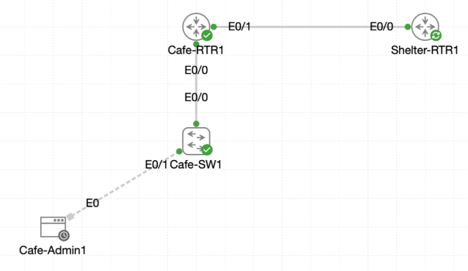

# Lab 042 - Understanding the Network Command

<p class="back-link">
  <a href="../../Lab-index.html">← Back to Lab Index</a>
</p>

<table>
<tr>
<td colspan="2" valign="top">

<h1>Objective</h1>

<h4>Inventory the active interfaces on <code>Cafe-RTR1</code> before enabling OSPF.</h4>

<h4>Understand how the OSPF <code>network</code> command selects interfaces using subnet and wildcard matching.</h4>

<h4>Add the shelter transit link to OSPF area 0 and verify a full neighbour adjacency.</h4>

<h4>Advertise the cafe admin VLAN into OSPF using the correct wildcard mask.</h4>

<h4>Use a passive interface to advertise a non-transit subnet without sending unnecessary OSPF hellos.</h4>

<h4>Document the evidence gap where the admin VLAN network command was not captured before the passive-interface check.</h4>

</td>
</tr>

<tr>
<td valign="top">

</td>
</tr>
</table>

---

## Scenario

This lab focuses on one of the most important OSPF configuration tools: the `network` command.

`Cafe-RTR1` has an admin VLAN subinterface and a routed transit link toward `Shelter-RTR1`. OSPF will not automatically participate on those interfaces simply because they have IP addresses. The routing process needs to be told which address ranges to include.

The lab demonstrates how to:

* inspect active routed interfaces,
* convert subnet masks into wildcard masks,
* add interfaces to OSPF area 0 using `network` statements,
* verify neighbour formation across a transit link,
* keep a LAN-facing interface advertised while preventing unnecessary neighbour attempts.

The supplied evidence proves the transit link was successfully added to OSPF and that the neighbour reached a full state. It also shows an important troubleshooting lesson: the admin VLAN was meant to be added to OSPF, but the captured configuration does not show the matching `network 10.0.18.0 0.0.0.31 area 0` command before the passive-interface verification. Because of that, the router correctly reported that OSPF was not enabled on `Ethernet0/0.10`.

---

## Devices Used

* Cafe-RTR1
* Shelter-RTR1

---

## Interface and Addressing Summary

| Device | Interface | Purpose | IP Address | Subnet Mask | Wildcard Mask |
| ------ | --------- | ------- | ---------- | ----------- | ------------- |
| Cafe-RTR1 | Ethernet0/0.10 | Cafe admin VLAN | 10.0.18.1 | 255.255.255.224 | 0.0.0.31 |
| Cafe-RTR1 | Ethernet0/1 | Transit to Shelter-RTR1 | 192.168.10.2 | 255.255.255.252 | 0.0.0.3 |
| Shelter-RTR1 | Ethernet0/0 | Transit to Cafe-RTR1 | 192.168.10.1 | 255.255.255.252 | 0.0.0.3 |
| Shelter-RTR1 | Loopback | Shelter loopback route | 172.16.50.1 | /32 | 0.0.0.0 |

---

## OSPF Plan

| OSPF Setting | Value |
| ------------ | ----- |
| OSPF process ID | 15 |
| OSPF area | 0 |
| Admin VLAN network | 10.0.18.0/27 |
| Admin VLAN wildcard | 0.0.0.31 |
| Transit network | 192.168.10.0/30 |
| Transit wildcard | 0.0.0.3 |
| Passive interface target | Ethernet0/0.10 |
| Active neighbour interface | Ethernet0/1 |

---

## Configuration Steps

### Step 1 - Inspect Active Interfaces on Cafe-RTR1

The interface summary was captured first.

```bash
terminal length 0
show ip int brief
```

### Result

```bash
Interface              IP-Address      OK? Method Status                Protocol
Ethernet0/0            unassigned      YES TFTP   up                    up
Ethernet0/0.10         10.0.18.1       YES TFTP   up                    up
Ethernet0/1            192.168.10.2    YES TFTP   up                    up
Ethernet0/2            unassigned      YES unset  administratively down down
Ethernet0/3            unassigned      YES unset  administratively down down
```

### Explanation

The two interfaces relevant to OSPF were:

* `Ethernet0/0.10` for the cafe admin VLAN.
* `Ethernet0/1` for the point-to-point transit link to Shelter-RTR1.

---

### Step 2 - Inspect the Admin VLAN Subinterface

The admin VLAN subinterface was checked.

```bash
show running-config interface ethernet0/0.10
```

### Result

```bash
interface Ethernet0/0.10
 description Cafe Admin VLAN
 encapsulation dot1Q 10
 ip address 10.0.18.1 255.255.255.224
```

### Wildcard Calculation

The subnet mask was:

```bash
255.255.255.224
```

The wildcard mask is the inverse:

```bash
0.0.0.31
```

### Intended OSPF Network Command

```bash
router ospf 15
network 10.0.18.0 0.0.0.31 area 0
```

### Explanation

The admin VLAN subnet is `10.0.18.0/27`. Adding it to OSPF would allow Cafe-RTR1 to advertise that connected subnet to OSPF neighbours.

Because this is a LAN-facing user/admin segment, it should later be made passive. That allows the network to be advertised without sending OSPF hellos into the cafe VLAN.

---

### Step 3 - Inspect the Transit Link to Shelter-RTR1

The transit interface was checked.

```bash
show running-config interface ethernet0/1
```

### Result

```bash
interface Ethernet0/1
 description Transit to Shelter-RTR1
 ip address 192.168.10.2 255.255.255.252
```

### Wildcard Calculation

The subnet mask was:

```bash
255.255.255.252
```

The wildcard mask is:

```bash
0.0.0.3
```

### OSPF Network Command

```bash
router ospf 15
network 192.168.10.0 0.0.0.3 area 0
```

### Explanation

The transit network is `192.168.10.0/30`.

This is the interface where OSPF neighbour formation should occur, because it directly connects Cafe-RTR1 to Shelter-RTR1.

---

### Step 4 - Confirm No OSPF Neighbours Before Configuration

Before adding the network command, the neighbour table was checked.

```bash
show ip ospf neighbor
```

### Result

No OSPF neighbours were present.

### Explanation

This confirmed the baseline. OSPF was not yet forming an adjacency across the transit link.

---

## OSPF Transit Configuration

### Step 5 - Add the Shelter Transit Link to OSPF

The OSPF process was opened and the transit network was added to area 0.

```bash
configure terminal
router ospf 15
network 192.168.10.0 0.0.0.3 area 0
end
```

### Result

The OSPF adjacency formed:

```bash
%OSPF-5-ADJCHG: Process 15, Nbr 15.15.15.2 on Ethernet0/1 from LOADING to FULL, Loading Done
```

### Explanation

This proved the `network` command matched `Ethernet0/1`, enabled OSPF on that interface, and allowed hellos to be exchanged with Shelter-RTR1.

---

### Step 6 - Verify the OSPF Neighbour

The neighbour table was checked again.

```bash
show ip ospf neighbor
```

### Result

```bash
Neighbor ID     Pri   State           Dead Time   Address         Interface
15.15.15.2        1   FULL/DR         00:00:38    192.168.10.1    Ethernet0/1
```

### Explanation

Cafe-RTR1 formed a full OSPF adjacency with Shelter-RTR1 over Ethernet0/1.

The neighbour state `FULL/DR` confirms the adjacency was operational.

---

### Step 7 - Verify the Learned OSPF Route on Cafe-RTR1

The OSPF routes were checked.

```bash
show ip route ospf
```

### Result

```bash
O        172.16.50.1 [110/11] via 192.168.10.1, 00:00:26, Ethernet0/1
```

### Explanation

Cafe-RTR1 learned Shelter-RTR1's loopback through OSPF.

This proves routing information was successfully exchanged across the OSPF adjacency.

---

## Passive Interface Configuration

### Step 8 - Attempt Passive Interface Configuration

The first passive-interface command was incomplete.

```bash
passive-interface
```

IOS rejected it:

```bash
% Incomplete command.
```

The command was then completed correctly:

```bash
router ospf 15
passive-interface ethernet0/0.10
end
```

### Explanation

A specific interface must be supplied. The intended goal was to stop OSPF hellos on the admin VLAN while still advertising the admin subnet.

---

### Step 9 - Check OSPF on Ethernet0/0.10

The OSPF interface state was checked.

```bash
show ip ospf interface ethernet0/0.10
```

### Result

```bash
%OSPF: OSPF not enabled on Ethernet0/0.10
```

### Explanation

This is the most important troubleshooting point in the evidence.

The lab objective expected Ethernet0/0.10 to be in OSPF area 0 and then marked passive. However, the captured CLI does not show the admin VLAN network command being entered:

```bash
network 10.0.18.0 0.0.0.31 area 0
```

Because that network command was not captured before the passive verification, OSPF was not enabled on `Ethernet0/0.10`. As a result, the interface could not show the expected passive OSPF output.

The correct fix would be:

```bash
configure terminal
router ospf 15
network 10.0.18.0 0.0.0.31 area 0
passive-interface ethernet0/0.10
end
```

Then verify with:

```bash
show ip ospf interface ethernet0/0.10
```

Expected evidence would include:

```bash
No Hellos (Passive interface)
```

---

### Step 10 - Confirm the Shelter Neighbour Remained Full

The neighbour table was checked after the passive-interface change.

```bash
show ip ospf neighbor
```

### Result

```bash
Neighbor ID     Pri   State           Dead Time   Address         Interface
15.15.15.2        1   FULL/DR         00:00:36    192.168.10.1    Ethernet0/1
```

### Explanation

The shelter adjacency remained stable.

This confirms that making the admin VLAN passive did not affect the active OSPF neighbour relationship over the transit link.

---

### Step 11 - Verify the Neighbour from Shelter-RTR1

The neighbour table was also checked from Shelter-RTR1.

```bash
show ip ospf neighbor
```

### Result

```bash
Neighbor ID     Pri   State           Dead Time   Address         Interface
15.15.15.1        1   FULL/BDR        00:00:33    192.168.10.2    Ethernet0/0
```

### Explanation

Shelter-RTR1 saw Cafe-RTR1 as a full OSPF neighbour across the transit link.

This confirms the adjacency from both sides.

---

## Final Verification

### Confirmed from the Supplied Evidence

| Check | Result |
| ----- | ------ |
| Cafe-RTR1 Ethernet0/0.10 was up/up | Confirmed |
| Cafe-RTR1 Ethernet0/1 was up/up | Confirmed |
| Transit link was added to OSPF area 0 | Confirmed |
| Cafe-RTR1 formed a FULL adjacency with Shelter-RTR1 | Confirmed |
| Cafe-RTR1 learned Shelter-RTR1 loopback by OSPF | Confirmed |
| Shelter-RTR1 saw Cafe-RTR1 as a FULL neighbour | Confirmed |
| Passive-interface command was entered for Ethernet0/0.10 | Confirmed |

### Not Fully Proven in the Captured Evidence

| Expected Check | Evidence Status |
| -------------- | --------------- |
| Ethernet0/0.10 listed in OSPF area 0 | Not proven |
| Ethernet0/0.10 shows `No Hellos (Passive interface)` | Not proven |
| Shelter-RTR1 learns `10.0.18.0/27` via OSPF | Not shown |

### Why These Were Not Proven

The raw output shows this message:

```bash
%OSPF: OSPF not enabled on Ethernet0/0.10
```

That means the admin VLAN was not actually active in OSPF at the time of verification. The likely missing command is:

```bash
network 10.0.18.0 0.0.0.31 area 0
```

---

## Troubleshooting

### Issue 1 - Typo in `show running-config`

#### Problem

The command was mistyped:

```bash
shwo running-config interface ethernet0/0.10
```

IOS rejected it:

```bash
% Invalid input detected at '^' marker.
```

#### Fix

The command was corrected:

```bash
show running-config interface ethernet0/0.10
```

---

### Issue 2 - No OSPF neighbours before adding the transit network

#### Problem

`show ip ospf neighbor` initially returned no neighbours.

#### Diagnosis

The transit interface had not yet been added to the OSPF process.

#### Fix

The transit network was added:

```bash
router ospf 15
network 192.168.10.0 0.0.0.3 area 0
```

The neighbour then reached full state.

---

### Issue 3 - Incomplete passive-interface command

#### Problem

The command was entered without specifying an interface:

```bash
passive-interface
```

IOS returned:

```bash
% Incomplete command.
```

#### Fix

The full command was entered:

```bash
passive-interface ethernet0/0.10
```

---

### Issue 4 - Admin VLAN was not enabled in OSPF before passive verification

#### Problem

The router reported:

```bash
%OSPF: OSPF not enabled on Ethernet0/0.10
```

#### Diagnosis

The evidence does not show the admin VLAN network command being entered. A passive interface still needs to be part of the OSPF process; passive only stops hello packets. It does not add the interface to OSPF by itself.

#### Fix

Add the admin subnet to OSPF, then keep the interface passive:

```bash
configure terminal
router ospf 15
network 10.0.18.0 0.0.0.31 area 0
passive-interface ethernet0/0.10
end
```

Recommended follow-up verification:

```bash
show ip ospf interface ethernet0/0.10
show ip route ospf
```

From Shelter-RTR1, confirm the cafe admin route:

```bash
show ip route ospf
```

Expected route:

```bash
O 10.0.18.0 [110/20] via 192.168.10.2, Ethernet0/0
```

---

## Key Learning Points

* OSPF does not use interface IP addresses automatically; interfaces must be matched by a `network` command or enabled directly.
* The `network` command uses wildcard masks, not subnet masks.
* A `/27` subnet mask of `255.255.255.224` becomes wildcard `0.0.0.31`.
* A `/30` subnet mask of `255.255.255.252` becomes wildcard `0.0.0.3`.
* Adding a transit link to OSPF allows neighbour discovery and route exchange.
* Passive interfaces still advertise their connected networks but do not send OSPF hello packets.
* A passive-interface command does not add an interface to OSPF by itself.
* If `show ip ospf interface` says OSPF is not enabled, check whether the interface matched any OSPF network statement.
* The neighbour table should show transit links only, not user VLANs.
* A good lab write-up should distinguish between intended configuration and what the captured evidence actually proves.

---

## Completion Check

The lab was partially completed and the key OSPF transit behaviour was proven.

* Cafe-RTR1 active interfaces were inventoried.
* Ethernet0/0.10 was confirmed as `10.0.18.1/27`.
* Ethernet0/1 was confirmed as `192.168.10.2/30`.
* The `/27` wildcard was identified as `0.0.0.31`.
* The `/30` wildcard was identified as `0.0.0.3`.
* OSPF process 15 was used.
* The transit network `192.168.10.0/30` was added to OSPF area 0.
* Cafe-RTR1 formed a full OSPF adjacency with Shelter-RTR1 on Ethernet0/1.
* Cafe-RTR1 learned `172.16.50.1/32` from Shelter-RTR1 via OSPF.
* Shelter-RTR1 confirmed a full neighbour relationship back to Cafe-RTR1.
* `passive-interface ethernet0/0.10` was configured.
* The final evidence shows the admin VLAN was not actually enabled in OSPF at the time of checking.
* Recommended correction: add `network 10.0.18.0 0.0.0.31 area 0` under `router ospf 15`, then recheck the passive interface and the cafe admin route from Shelter-RTR1.
