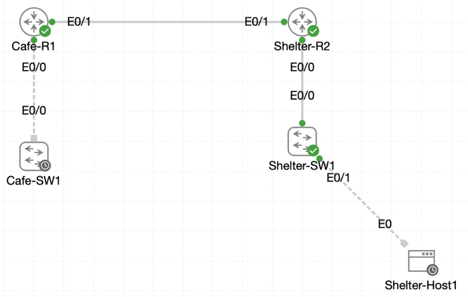

# Lab 043 - Castle Rysen: Implementing OSPF Routing Protocol

<p class="back-link">
  <a href="../../Lab-index.html">← Back to Lab Index</a>
</p>

<table>
<tr>
<td colspan="2" valign="top">

<h1>Objective</h1>

<h4>Confirm the placeholder OSPF process on both routers before adding network statements.</h4>

<h4>Enable OSPF area 0 between the cafe router and fallout shelter router.</h4>

<h4>Advertise the cafe admin VLAN while keeping the user-facing VLAN interface passive.</h4>

<h4>Advertise the fallout shelter VLAN networks from Shelter-R2 using an efficient wildcard statement.</h4>

<h4>Verify OSPF neighbour formation, route learning and end-to-end ICMP reachability between the two sites.</h4>

</td>
</tr>

<tr>
<td valign="top">

</td>
</tr>
</table>

---

## Scenario

This lab configures OSPF routing between the Castle Rysen cafe router and the fallout shelter router.

The network already had a routed WAN link between the two routers, and both devices contained placeholder OSPF processes with router IDs already set. The task was to add accurate OSPF `network` statements, advertise only the required networks, suppress unnecessary hello traffic on user-facing VLAN interfaces, and prove that both routers could learn and reach each other's networks.

The final result was a working OSPF adjacency between `Cafe-R1` and `Shelter-R2`, with successful route exchange and successful pings between the cafe admin gateway and both shelter VLAN gateways.

---

## Devices Used

* Cafe-R1
* Shelter-R2

---

## Addressing Summary

| Device | Interface | IP Address | Purpose |
| ------ | --------- | ---------- | ------- |
| Cafe-R1 | Ethernet0/0.10 | 10.0.18.1/27 | Cafe admin VLAN gateway |
| Cafe-R1 | Ethernet0/1 | 172.16.0.1/30 | WAN link to Shelter-R2 |
| Shelter-R2 | Ethernet0/0.10 | 10.0.16.1/24 | Shelter VLAN gateway |
| Shelter-R2 | Ethernet0/0.20 | 10.0.17.1/24 | Shelter VLAN gateway |
| Shelter-R2 | Ethernet0/1 | 172.16.0.2/30 | WAN link to Cafe-R1 |

---

## OSPF Plan

| Device | OSPF Process | Router ID | Advertised Networks | Passive Interfaces |
| ------ | ------------ | --------- | ------------------- | ------------------ |
| Cafe-R1 | 1 | 1.1.1.1 | 10.0.18.1/32 match, 172.16.0.1/32 match | Ethernet0/0.10 |
| Shelter-R2 | 1 | 2.2.2.2 | 172.16.0.2/32 match, 10.0.16.0 range | Ethernet0/0.10, Ethernet0/0.20 |

---

## Configuration Steps

### Step 1 - Confirm the Placeholder OSPF Process on Cafe-R1

The existing OSPF process was checked.

```bash
show running-config | section router
```

### Result

```bash
router ospf 1
 router-id 1.1.1.1
```

### Explanation

This confirmed that OSPF process 1 already existed on Cafe-R1 with router ID `1.1.1.1`.

No network statements were present yet, so OSPF was not actively advertising or forming neighbours.

---

### Step 2 - Confirm Cafe-R1 Interface Readiness

Cafe-R1's interface table was checked.

```bash
show ip interface brief
```

### Result

```bash
Interface              IP-Address      OK? Method Status                Protocol
Ethernet0/0            unassigned      YES TFTP   up                    up
Ethernet0/0.10         10.0.18.1       YES TFTP   up                    up
Ethernet0/1            172.16.0.1      YES TFTP   up                    up
Ethernet0/2            unassigned      YES unset  administratively down down
Ethernet0/3            unassigned      YES unset  administratively down down
```

### Explanation

The required Cafe-R1 interfaces were up/up:

* `Ethernet0/0.10` for the cafe admin VLAN.
* `Ethernet0/1` for the WAN link to Shelter-R2.

---

### Step 3 - Confirm the Placeholder OSPF Process on Shelter-R2

Shelter-R2's OSPF process was checked.

```bash
show running-config | section router
```

### Result

```bash
router ospf 1
 router-id 2.2.2.2
```

### Explanation

Shelter-R2 also had a placeholder OSPF process ready, using router ID `2.2.2.2`.

---

### Step 4 - Confirm Shelter-R2 Interface Readiness

Shelter-R2's interface summary was checked.

```bash
show ip interface brief
```

### Result

```bash
Interface              IP-Address      OK? Method Status                Protocol
Ethernet0/0            unassigned      YES TFTP   up                    up
Ethernet0/0.10         10.0.16.1       YES TFTP   up                    up
Ethernet0/0.20         10.0.17.1       YES TFTP   up                    up
Ethernet0/1            172.16.0.2      YES TFTP   up                    up
Ethernet0/2            unassigned      YES unset  administratively down down
Ethernet0/3            unassigned      YES unset  administratively down down
```

### Explanation

Shelter-R2 had three active routed interfaces required for the lab:

* `Ethernet0/0.10` for the `10.0.16.0/24` shelter VLAN.
* `Ethernet0/0.20` for the `10.0.17.0/24` shelter VLAN.
* `Ethernet0/1` for the WAN link to Cafe-R1.

---

## Cafe-R1 OSPF Configuration

### Step 5 - Add Cafe-R1 Interfaces to OSPF Area 0

Cafe-R1 was configured to include the admin VLAN and WAN interface in OSPF process 1.

```bash
configure terminal
router ospf 1
network 10.0.18.1 0.0.0.0 area 0
network 172.16.0.1 0.0.0.0 area 0
passive-interface ethernet0/0.10
end
```

### Explanation

The network statements used host-specific wildcard masks:

* `10.0.18.1 0.0.0.0 area 0` matched only the admin VLAN subinterface address.
* `172.16.0.1 0.0.0.0 area 0` matched only the Cafe-R1 WAN interface.

The admin VLAN subinterface was then made passive. This allows the admin network to be advertised, while preventing OSPF hello packets from being sent toward end hosts.

---

### Step 6 - Verify Cafe-R1 WAN OSPF Interface

The WAN-facing OSPF interface was checked.

```bash
show ip ospf interface ethernet0/1
```

### Result

```bash
Ethernet0/1 is up, line protocol is up
  Internet Address 172.16.0.1/30, Interface ID 3, Area 0
  Attached via Network Statement
  Process ID 1, Router ID 1.1.1.1, Network Type BROADCAST, Cost: 10
  State WAITING, Priority 1
  Neighbor Count is 0, Adjacent neighbor count is 0
```

### Explanation

At this point, Cafe-R1 had correctly enabled OSPF on the WAN interface, but the neighbour had not yet fully formed because Shelter-R2 had not completed its side of the configuration.

---

## Shelter-R2 OSPF Configuration

### Step 7 - Add Shelter-R2 Interfaces to OSPF Area 0

Shelter-R2 was configured to include the WAN link and the shelter VLAN interfaces in area 0.

```bash
configure terminal
router ospf 1
network 172.16.0.2 0.0.0.0 area 0
network 10.0.16.8 0.0.1.255 area 0
passive-interface ethernet0/0.10
passive-interface ethernet0/0.20
end
```

### Result

During configuration, the OSPF adjacency came up:

```bash
%OSPF-5-ADJCHG: Process 1, Nbr 1.1.1.1 on Ethernet0/1 from LOADING to FULL, Loading Done
```

### Explanation

The WAN interface was added to OSPF so that Shelter-R2 could form a neighbour relationship with Cafe-R1.

The wildcard statement:

```bash
network 10.0.16.8 0.0.1.255 area 0
```

matched the connected shelter VLAN interfaces in the `10.0.16.0` to `10.0.17.255` range. OSPF then advertised each interface using its real interface mask.

The two shelter VLAN subinterfaces were marked passive so they would be advertised without trying to form OSPF neighbours with end devices.

---

### Step 8 - Verify Shelter-R2 OSPF Interfaces

Shelter-R2's OSPF interface brief was checked.

```bash
show ip ospf interface brief
```

### Result

```bash
Interface    PID   Area            IP Address/Mask    Cost  State Nbrs F/C
Et0/0.20     1     0               10.0.17.1/24       10    WAIT  0/0
Et0/0.10     1     0               10.0.16.1/24       10    WAIT  0/0
Et0/1        1     0               172.16.0.2/30      10    BDR   1/1
```

### Explanation

This confirmed all three required Shelter-R2 interfaces were in OSPF area 0.

The WAN interface had one fully adjacent neighbour, while the two user-facing VLAN subinterfaces had no neighbours, as expected.

---

## OSPF Neighbour Verification

### Step 9 - Verify Neighbour State from Cafe-R1

```bash
show ip ospf neighbor
```

### Result

```bash
Neighbor ID     Pri   State           Dead Time   Address         Interface
2.2.2.2           1   FULL/BDR        00:00:35    172.16.0.2      Ethernet0/1
```

### Explanation

Cafe-R1 successfully formed a full OSPF adjacency with Shelter-R2 over `Ethernet0/1`.

---

### Step 10 - Verify Neighbour State from Shelter-R2

```bash
show ip ospf neighbor
```

### Result

```bash
Neighbor ID     Pri   State           Dead Time   Address         Interface
1.1.1.1           1   FULL/DR         00:00:32    172.16.0.1      Ethernet0/1
```

### Explanation

Shelter-R2 also saw the adjacency as full, proving that both routers had formed a stable OSPF neighbour relationship across the WAN link.

---

## Route Verification

### Step 11 - Verify OSPF Routes on Cafe-R1

Cafe-R1's OSPF routes were checked.

```bash
show ip route ospf
```

### Result

```bash
O        10.0.16.0/24 [110/20] via 172.16.0.2, 00:02:22, Ethernet0/1
O        10.0.17.0/24 [110/20] via 172.16.0.2, 00:02:22, Ethernet0/1
```

### Explanation

Cafe-R1 successfully learned the two shelter VLAN networks from Shelter-R2 through OSPF.

---

### Step 12 - Verify OSPF Routes on Shelter-R2

Shelter-R2's OSPF routes were checked.

```bash
show ip route ospf
```

### Result

```bash
O        10.0.18.0/27 [110/20] via 172.16.0.1, 00:04:41, Ethernet0/1
```

### Explanation

Shelter-R2 successfully learned the cafe admin VLAN from Cafe-R1.

This confirmed that the passive admin VLAN was still being advertised even though it was not sending OSPF hellos.

---

## Connectivity Verification

### Step 13 - Ping Shelter VLAN Gateways from Cafe-R1

Cafe-R1 tested reachability to both shelter VLAN gateways.

```bash
ping 10.0.16.1
ping 10.0.17.1
```

### Result

```bash
Success rate is 100 percent (5/5), round-trip min/avg/max = 1/1/1 ms
```

Both tests succeeded.

### Explanation

The cafe router could reach both shelter VLAN gateways through the newly learned OSPF routes.

---

### Step 14 - Ping Cafe Admin Gateway from Shelter-R2

Shelter-R2 tested reachability to the cafe admin gateway.

```bash
ping 10.0.18.1
```

### Result

```bash
Success rate is 100 percent (5/5), round-trip min/avg/max = 1/1/1 ms
```

### Explanation

The shelter router could reach the cafe admin gateway through the OSPF route learned from Cafe-R1.

---

## Final Verification

### Cafe-R1

Cafe-R1 showed a full OSPF neighbour relationship with Shelter-R2:

```bash
2.2.2.2           1   FULL/BDR        00:00:35    172.16.0.2      Ethernet0/1
```

Cafe-R1 learned both shelter networks:

```bash
O        10.0.16.0/24 [110/20] via 172.16.0.2, Ethernet0/1
O        10.0.17.0/24 [110/20] via 172.16.0.2, Ethernet0/1
```

Cafe-R1 successfully reached both shelter VLAN gateways:

```bash
ping 10.0.16.1
ping 10.0.17.1
```

Both returned 100 percent success.

---

### Shelter-R2

Shelter-R2 showed a full OSPF neighbour relationship with Cafe-R1:

```bash
1.1.1.1           1   FULL/DR        00:00:32    172.16.0.1      Ethernet0/1
```

Shelter-R2 learned the cafe admin network:

```bash
O        10.0.18.0/27 [110/20] via 172.16.0.1, Ethernet0/1
```

Shelter-R2 successfully reached the cafe admin gateway:

```bash
ping 10.0.18.1
```

The test returned 100 percent success.

---

## Troubleshooting

### Issue 1 - Incomplete command while setting terminal length

#### Problem

The command was initially started as:

```bash
terminal length
```

#### Diagnosis

The command needed a value.

#### Fix

The completed command was entered:

```bash
terminal length 0
```

This prevented paginated output during evidence capture.

---

### Issue 2 - Interface filter returned no output

#### Problem

These filters returned no useful output:

```bash
show ip interface brief | include ethernet0
show ip interface brief | include ethernet0/0.10
```

#### Diagnosis

The IOS output used capitalised interface names such as `Ethernet0/0.10`, so the lowercase filter did not match.

#### Fix

The unfiltered command was used:

```bash
show ip interface brief
```

This confirmed the required interface addressing.

---

### Issue 3 - Typo in spanning-tree command not relevant to OSPF

#### Problem

No spanning-tree issue affected this lab, but similar CLI typos appeared in previous switching labs. In this OSPF evidence, the relevant errors were partial or mistyped OSPF network statements.

---

### Issue 4 - Mistyped Shelter-R2 network statements

#### Problem

During Shelter-R2 configuration, the following entries appeared:

```bash
network 172.16.0.02 0.0.0.0 area 0
network 172.16. 0.0.0.0 area 0
```

#### Diagnosis

These were input mistakes while entering the WAN network statement.

The adjacency message later proved that the WAN interface was successfully included in OSPF:

```bash
%OSPF-5-ADJCHG: Process 1, Nbr 1.1.1.1 on Ethernet0/1 from LOADING to FULL, Loading Done
```

#### Fix / Outcome

The final routing and neighbour tables confirmed the WAN link was correctly participating in OSPF despite the visible command-entry mistakes.

---

### Issue 5 - Host wildcard statements used instead of subnet wildcard statements

#### Observation

Cafe-R1 used host-specific OSPF network statements:

```bash
network 10.0.18.1 0.0.0.0 area 0
network 172.16.0.1 0.0.0.0 area 0
```

#### Explanation

This is valid because an OSPF network statement selects interfaces, not routes directly.

Using `0.0.0.0` matched only the exact interface IP addresses. OSPF then advertised the connected networks using the actual interface masks.

This is why Shelter-R2 learned:

```bash
O        10.0.18.0/27 [110/20] via 172.16.0.1, Ethernet0/1
```

rather than a host route.

---

## Key Learning Points

* OSPF network statements select interfaces for OSPF participation.
* The wildcard mask controls which local interface IP addresses match the OSPF process.
* A host wildcard of `0.0.0.0` can be used to match one exact interface address.
* OSPF advertises the connected network using the interface's real subnet mask.
* Passive interfaces still advertise their networks but do not send OSPF hellos.
* Only transit interfaces should normally form OSPF neighbours.
* User-facing VLAN interfaces should usually be passive.
* A full OSPF neighbour state proves the routers have exchanged link-state information successfully.
* `show ip route ospf` confirms whether routes were learned dynamically.
* End-to-end pings prove that routing works in both directions.

---

## Completion Check

The lab was completed successfully.

* Cafe-R1 had OSPF process 1 with router ID `1.1.1.1`.
* Shelter-R2 had OSPF process 1 with router ID `2.2.2.2`.
* Cafe-R1 Ethernet0/0.10 was confirmed as `10.0.18.1/27`.
* Cafe-R1 Ethernet0/1 was confirmed as `172.16.0.1/30`.
* Shelter-R2 Ethernet0/0.10 was confirmed as `10.0.16.1/24`.
* Shelter-R2 Ethernet0/0.20 was confirmed as `10.0.17.1/24`.
* Shelter-R2 Ethernet0/1 was confirmed as `172.16.0.2/30`.
* Cafe-R1 advertised its admin VLAN and WAN link into OSPF area 0.
* Cafe-R1 made Ethernet0/0.10 passive.
* Shelter-R2 advertised its WAN link and shelter VLAN interfaces into OSPF area 0.
* Shelter-R2 made Ethernet0/0.10 and Ethernet0/0.20 passive.
* Cafe-R1 formed a FULL OSPF adjacency with Shelter-R2.
* Shelter-R2 formed a FULL OSPF adjacency with Cafe-R1.
* Cafe-R1 learned `10.0.16.0/24` through OSPF.
* Cafe-R1 learned `10.0.17.0/24` through OSPF.
* Shelter-R2 learned `10.0.18.0/27` through OSPF.
* Cafe-R1 successfully pinged `10.0.16.1`.
* Cafe-R1 successfully pinged `10.0.17.1`.
* Shelter-R2 successfully pinged `10.0.18.1`.
