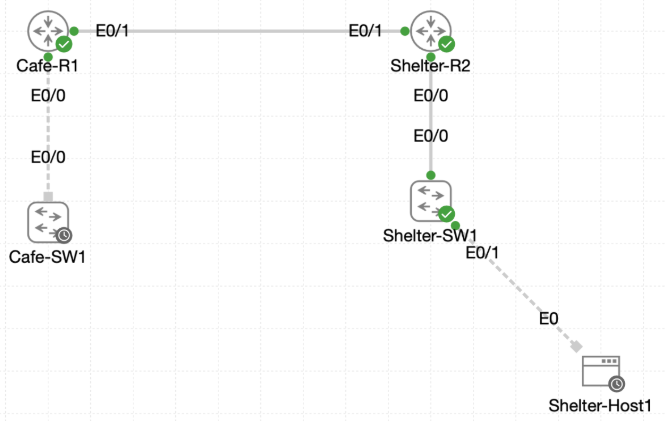

# Lab 044 - Castle Rysen: OSPF Communication Troubleshooting

<p class="back-link">
  <a href="../../Lab-index.html">← Back to Lab Index</a>
</p>

<table>
<tr>
<td colspan="2" valign="top">

<h1>Objective</h1>

<h4>Diagnose a failed OSPF neighbour relationship between <code>Cafe-R1</code> and <code>Shelter-R2</code>.</h4>

<h4>Compare hello/dead timers and OSPF network types on the shared WAN link.</h4>

<h4>Restore Cafe-R1 Ethernet0/1 to default 10/40 OSPF timers.</h4>

<h4>Correct the Cafe-R1 OSPF network type from point-to-point back to broadcast.</h4>

<h4>Verify the adjacency reaches FULL and that OSPF routes are restored between the cafe and shelter networks.</h4>

<h4>Confirm end-to-end reachability with successful ICMP tests.</h4>

</td>
</tr>

<tr>
<td valign="top">

</td>
</tr>
</table>

---

## Scenario

This lab focuses on troubleshooting an OSPF adjacency failure between the Castle Rysen cafe router and the fallout shelter router.

The routers were already connected over a WAN link, but the OSPF neighbour relationship was not working correctly. The troubleshooting process involved comparing the OSPF interface settings on both routers, identifying mismatched timers and a mismatched network type, correcting the configuration on `Cafe-R1`, and then validating that the OSPF database, route table and end-to-end pings recovered.

This was a useful lab because it showed that an OSPF problem is not always caused by missing network statements. Even when both routers are in the correct area, mismatched hello/dead timers or network types can stop the adjacency from forming cleanly.

---

## Devices Used

* Cafe-R1
* Shelter-R2

---

## Addressing Summary

| Device | Interface | IP Address | Purpose |
| ------ | --------- | ---------- | ------- |
| Cafe-R1 | Ethernet0/1 | 172.16.0.1/30 | WAN link to Shelter-R2 |
| Shelter-R2 | Ethernet0/1 | 172.16.0.2/30 | WAN link to Cafe-R1 |
| Cafe-R1 | Ethernet0/0.10 | 10.0.18.1/27 | Cafe admin network |
| Shelter-R2 | VLAN network | 10.0.16.0/24 | Shelter VLAN learned by Cafe-R1 |
| Shelter-R2 | VLAN network | 10.0.17.0/24 | Shelter VLAN learned by Cafe-R1 |

---

## Fault Summary

| Check | Shelter-R2 | Cafe-R1 | Problem |
| ----- | ---------- | ------- | ------- |
| OSPF network type | Broadcast | Point-to-point | Mismatch |
| Hello interval | 10 seconds | 5 seconds | Mismatch |
| Dead interval | 40 seconds | 20 seconds | Mismatch |
| Initial neighbour count | 0 | 0 | No working adjacency |

---

## Configuration and Troubleshooting Steps

### Step 1 - Check Shelter-R2 OSPF Neighbour State

The neighbour table was checked first on Shelter-R2.

```bash
show ip ospf neighbor
```

### Result

No neighbour was listed.

### Explanation

This confirmed that Shelter-R2 was not forming a working OSPF adjacency with Cafe-R1.

In some OSPF faults, a neighbour may appear stuck in a partial state. In this case, the neighbour table was empty because the mismatch was severe enough to prevent the routers from progressing normally.

---

### Step 2 - Inspect Shelter-R2 Ethernet0/1 OSPF Settings

The detailed OSPF interface output was checked on Shelter-R2.

```bash
show ip ospf interface ethernet0/1
```

### Result

Shelter-R2 showed:

```bash
Internet Address 172.16.0.2/30, Interface ID 3, Area 0
Process ID 1, Router ID 2.2.2.2, Network Type BROADCAST, Cost: 10
State DR, Priority 1
Timer intervals configured, Hello 10, Dead 40, Wait 40, Retransmit 5
Neighbor Count is 0, Adjacent neighbor count is 0
```

The brief view confirmed:

```bash
Et0/1        1     0               172.16.0.2/30      10    DR    0/0
```

### Explanation

Shelter-R2 was using default broadcast-style OSPF behaviour on Ethernet0/1:

* Network type: `BROADCAST`
* Hello timer: `10`
* Dead timer: `40`
* State: `DR`
* Neighbours: `0/0`

This gave the expected reference point for comparing Cafe-R1.

---

### Step 3 - Inspect Cafe-R1 Ethernet0/1 OSPF Settings

Cafe-R1's OSPF interface settings were checked next.

```bash
show ip ospf interface ethernet0/1
```

### Result

Cafe-R1 showed:

```bash
Internet Address 172.16.0.1/30, Interface ID 3, Area 0
Process ID 1, Router ID 1.1.1.1, Network Type POINT_TO_POINT, Cost: 10
State POINT_TO_POINT
Timer intervals configured, Hello 5, Dead 20, Wait 20, Retransmit 5
Neighbor Count is 0, Adjacent neighbor count is 0
```

The brief view confirmed:

```bash
Et0/1        1     0               172.16.0.1/30      10    P2P   0/0
```

### Explanation

Cafe-R1 had two mismatches compared with Shelter-R2:

* Cafe-R1 used `POINT_TO_POINT`; Shelter-R2 used `BROADCAST`.
* Cafe-R1 used 5/20 timers; Shelter-R2 used 10/40 timers.

The first fix was to return Cafe-R1 to the standard OSPF timer values.

---

### Step 4 - Remove Custom OSPF Timers on Cafe-R1

Cafe-R1 Ethernet0/1 was returned to the default hello and dead intervals.

```bash
configure terminal
interface ethernet0/1
no ip ospf hello-interval
no ip ospf dead-interval
end
```

### Result

After the timer fix, IOS reported a network type mismatch warning but also showed the neighbour coming up:

```bash
%OSPF-4-NET_TYPE_MISMATCH: Received Hello from 2.2.2.2 on Ethernet0/1 indicating a potential network type mismatch
%OSPF-5-ADJCHG: Process 1, Nbr 2.2.2.2 on Ethernet0/1 from LOADING to FULL, Loading Done
```

The OSPF process was then reset to force a fresh negotiation:

```bash
clear ip ospf process
```

### Explanation

Removing the custom timers fixed the hello/dead mismatch. Cafe-R1 now used the same 10/40 timer set as Shelter-R2.

However, the log message proved that the network type mismatch still needed to be corrected.

---

### Step 5 - Verify Timer Fix on Cafe-R1

Cafe-R1's OSPF interface was checked again.

```bash
show ip ospf interface ethernet0/1
```

### Result

Cafe-R1 now showed default timers:

```bash
Network Type POINT_TO_POINT, Cost: 10
Timer intervals configured, Hello 10, Dead 40, Wait 40, Retransmit 5
Neighbor Count is 1, Adjacent neighbor count is 1
Adjacent with neighbor 2.2.2.2
```

The neighbour table showed:

```bash
Neighbor ID     Pri   State           Dead Time   Address         Interface
2.2.2.2           0   FULL/  -        00:00:34    172.16.0.2      Ethernet0/1
```

### Explanation

The adjacency had formed, but the state still reflected a point-to-point OSPF relationship. The neighbour priority appeared as `0`, and there was no DR/BDR role because Cafe-R1 was still using point-to-point mode.

The next step was to make Cafe-R1 match Shelter-R2's broadcast network type.

---

### Step 6 - Remove Point-to-Point OSPF Network Type on Cafe-R1

Cafe-R1 Ethernet0/1 was changed back from point-to-point to the default broadcast network type.

```bash
configure terminal
interface ethernet0/1
no ip ospf network point-to-point
end
```

The OSPF process was reset again to force a clean restart:

```bash
clear ip ospf process
```

### Result

The adjacency briefly dropped and then came back:

```bash
%OSPF-5-ADJCHG: Process 1, Nbr 2.2.2.2 on Ethernet0/1 from FULL to DOWN, Neighbor Down: Interface down or detached
%OSPF-5-ADJCHG: Process 1, Nbr 2.2.2.2 on Ethernet0/1 from LOADING to FULL, Loading Done
```

### Explanation

This cleared the remaining mismatch. Both routers now treated the Ethernet0/1 segment as a broadcast OSPF network.

---

## Final Verification

### Step 7 - Verify Cafe-R1 Ethernet0/1 After Both Fixes

```bash
show ip ospf interface ethernet0/1
```

### Result

Cafe-R1 now showed:

```bash
Network Type BROADCAST, Cost: 10
State BDR, Priority 1
Designated Router (ID) 2.2.2.2, Interface address 172.16.0.2
Backup Designated router (ID) 1.1.1.1, Interface address 172.16.0.1
Timer intervals configured, Hello 10, Dead 40, Wait 40, Retransmit 5
Neighbor Count is 1, Adjacent neighbor count is 1
Adjacent with neighbor 2.2.2.2  (Designated Router)
```

The neighbour table showed:

```bash
Neighbor ID     Pri   State           Dead Time   Address         Interface
2.2.2.2           1   FULL/DR         00:00:31    172.16.0.2      Ethernet0/1
```

### Explanation

This confirmed Cafe-R1 had returned to the correct OSPF broadcast behaviour.

The adjacency was now fully formed, and the DR/BDR roles were aligned:

* Shelter-R2: DR
* Cafe-R1: BDR

---

### Step 8 - Verify OSPF Database on Cafe-R1

The OSPF database was checked to confirm that router LSAs were present.

```bash
show ip ospf database router
```

### Result

Cafe-R1 showed router LSAs for both routers.

Cafe-R1 advertised the cafe admin network:

```bash
Link connected to: a Stub Network
 (Link ID) Network/subnet number: 10.0.18.0
 (Link Data) Network Mask: 255.255.255.224
```

Shelter-R2 advertised the shelter networks:

```bash
Link connected to: a Stub Network
 (Link ID) Network/subnet number: 10.0.17.0
 (Link Data) Network Mask: 255.255.255.0
```

```bash
Link connected to: a Stub Network
 (Link ID) Network/subnet number: 10.0.16.0
 (Link Data) Network Mask: 255.255.255.0
```

### Explanation

The LSDB showed that both routers were sharing link-state information successfully.

---

### Step 9 - Verify OSPF Routes on Cafe-R1

Cafe-R1's OSPF route table was checked.

```bash
show ip route ospf
```

### Result

Cafe-R1 learned both shelter VLAN networks:

```bash
O        10.0.16.0/24 [110/20] via 172.16.0.2, 00:01:43, Ethernet0/1
O        10.0.17.0/24 [110/20] via 172.16.0.2, 00:01:43, Ethernet0/1
```

### Explanation

The cafe router was now receiving the shelter networks via OSPF.

---

### Step 10 - Verify Reachability from Cafe-R1

Cafe-R1 pinged the shelter VLAN gateway.

```bash
ping 10.0.16.1
```

### Result

```bash
Success rate is 100 percent (5/5), round-trip min/avg/max = 1/1/1 ms
```

### Explanation

The successful ping confirmed that the OSPF route from Cafe-R1 to the shelter network was usable.

---

### Step 11 - Verify Shelter-R2 After the Fix

Shelter-R2's OSPF interface state was checked.

```bash
show ip ospf interface Ethernet0/1
```

### Result

Shelter-R2 showed matching broadcast behaviour and matching timers:

```bash
Network Type BROADCAST, Cost: 10
State DR, Priority 1
Designated Router (ID) 2.2.2.2, Interface address 172.16.0.2
Backup Designated router (ID) 1.1.1.1, Interface address 172.16.0.1
Timer intervals configured, Hello 10, Dead 40, Wait 40, Retransmit 5
Neighbor Count is 1, Adjacent neighbor count is 1
Adjacent with neighbor 1.1.1.1  (Backup Designated Router)
```

The neighbour table showed:

```bash
Neighbor ID     Pri   State           Dead Time   Address         Interface
1.1.1.1           1   FULL/BDR        00:00:37    172.16.0.1      Ethernet0/1
```

### Explanation

Shelter-R2 agreed with Cafe-R1 on the broadcast network type and the DR/BDR election.

---

### Step 12 - Verify OSPF Routes on Shelter-R2

Shelter-R2's OSPF routes were checked.

```bash
show ip route ospf
```

### Result

Shelter-R2 learned the cafe admin network:

```bash
O        10.0.18.0/27 [110/20] via 172.16.0.1, 00:05:20, Ethernet0/1
```

### Explanation

The shelter router was now receiving the cafe admin route through OSPF.

---

### Step 13 - Verify Reachability from Shelter-R2

Shelter-R2 pinged the cafe admin gateway.

```bash
ping 10.0.18.1
```

### Result

```bash
Success rate is 100 percent (5/5), round-trip min/avg/max = 1/1/1 ms
```

### Explanation

The return path was working, proving that OSPF routing was restored in both directions.

---

## Troubleshooting

### Issue 1 - Shelter-R2 neighbour table was empty

#### Problem

`show ip ospf neighbor` on Shelter-R2 returned no neighbour.

#### Diagnosis

The interface detail showed Shelter-R2 using broadcast mode with 10/40 timers, but Cafe-R1 was later shown to be using point-to-point mode with 5/20 timers.

#### Fix

Cafe-R1 was corrected to match the default 10/40 timers and broadcast network type.

---

### Issue 2 - Cafe-R1 had mismatched OSPF timers

#### Problem

Cafe-R1 showed:

```bash
Timer intervals configured, Hello 5, Dead 20, Wait 20, Retransmit 5
```

Shelter-R2 showed:

```bash
Timer intervals configured, Hello 10, Dead 40, Wait 40, Retransmit 5
```

#### Fix

On Cafe-R1 Ethernet0/1:

```bash
no ip ospf hello-interval
no ip ospf dead-interval
```

#### Result

Cafe-R1 returned to:

```bash
Hello 10, Dead 40, Wait 40
```

---

### Issue 3 - Cafe-R1 had mismatched OSPF network type

#### Problem

Cafe-R1 showed:

```bash
Network Type POINT_TO_POINT
```

Shelter-R2 showed:

```bash
Network Type BROADCAST
```

IOS also reported:

```bash
%OSPF-4-NET_TYPE_MISMATCH
```

#### Fix

On Cafe-R1 Ethernet0/1:

```bash
no ip ospf network point-to-point
```

#### Result

Cafe-R1 returned to broadcast mode and took the BDR role:

```bash
Network Type BROADCAST
State BDR
```

---

### Issue 4 - OSPF process reset briefly dropped the neighbour

#### Problem

The command below was used to force a clean renegotiation:

```bash
clear ip ospf process
```

The adjacency briefly dropped:

```bash
from FULL to DOWN
```

#### Explanation

This was expected. Clearing the OSPF process restarts neighbour formation. In this lab, the adjacency quickly returned to FULL after each reset.

---

### Issue 5 - Case-sensitive include filter

#### Problem

This command returned no output:

```bash
show ip ospf interface brief | include et0/1
```

#### Fix

The command was repeated using the displayed interface abbreviation:

```bash
show ip ospf interface brief | include Et0/1
```

### Result

```bash
Et0/1        1     0               172.16.0.1/30      10    P2P   0/0
```

---

## Key Learning Points

* OSPF neighbours must agree on hello and dead intervals.
* A timer mismatch can prevent OSPF from forming a usable neighbour relationship.
* OSPF network type affects DR/BDR election behaviour.
* Broadcast OSPF networks elect a DR and BDR.
* Point-to-point OSPF networks do not use DR/BDR roles.
* A network type mismatch can produce neighbour instability or warning messages.
* `show ip ospf interface` is one of the best commands for spotting timer and network type mismatches.
* `clear ip ospf process` can force a fresh adjacency negotiation, but it briefly tears down OSPF relationships.
* `show ip route ospf` proves whether routes are being learned after the adjacency is restored.
* Successful pings prove the learned routes are usable in both directions.

---

## Completion Check

The lab was completed successfully.

* Shelter-R2 initially showed no OSPF neighbour on Ethernet0/1.
* Shelter-R2 was confirmed as broadcast network type with 10/40 timers.
* Cafe-R1 was confirmed as point-to-point network type with 5/20 timers.
* Cafe-R1 custom hello and dead timers were removed.
* Cafe-R1 returned to 10/40 timers.
* Cafe-R1 point-to-point OSPF network type was removed.
* Cafe-R1 returned to broadcast OSPF network type.
* Cafe-R1 showed Shelter-R2 as `FULL/DR`.
* Shelter-R2 showed Cafe-R1 as `FULL/BDR`.
* Cafe-R1 learned `10.0.16.0/24` through OSPF.
* Cafe-R1 learned `10.0.17.0/24` through OSPF.
* Shelter-R2 learned `10.0.18.0/27` through OSPF.
* Cafe-R1 successfully pinged `10.0.16.1`.
* Shelter-R2 successfully pinged `10.0.18.1`.
