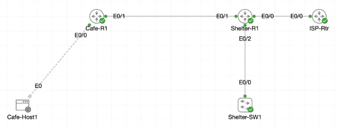

# Lab 045 - Castle Rysen: Scaling OSPF for the Fallout Grid

<p class="back-link">
  <a href="../../Lab-index.html">← Back to Lab Index</a>
</p>

<table>
<tr>
<td colspan="2" valign="top">

<h1>Objective</h1>

<h4>Convert the Castle Rysen OSPF design from a single-area layout into a multi-area design.</h4>

<h4>Promote <code>Shelter-R1</code> into an Area Border Router by keeping shelter VLANs in Area 0 and moving the cafe-facing link into Area 1.</h4>

<h4>Move <code>Cafe-R1</code> networks into Area 1 and restore the OSPF adjacency with <code>Shelter-R1</code>.</h4>

<h4>Summarise the shelter VLAN block so the cafe receives a single inter-area route instead of multiple specific routes.</h4>

<h4>Originate the shelter's static default route into OSPF so the cafe installs an external default route toward the ISP.</h4>

<h4>Verify OSPF areas, summary routes, default route propagation and reachability to the ISP next hop.</h4>

</td>
</tr>

<tr>
<td valign="top">

</td>
</tr>
</table>

---

## Scenario

This lab scales the Castle Rysen OSPF design from a simple single-area deployment into a multi-area topology.

The shelter router, `Shelter-R1`, becomes the Area Border Router. Its internal shelter VLAN interfaces remain in Area 0, while the link toward the cafe moves into Area 1. The cafe router, `Cafe-R1`, then moves its local cafe network and shelter-facing link into Area 1 so the OSPF adjacency can return.

Once the areas are split correctly, `Shelter-R1` summarises the shelter VLAN range toward Area 1. This allows the cafe to learn one clean inter-area route for the shelter block rather than tracking multiple individual VLAN routes.

Finally, `Shelter-R1` originates its static default route toward the ISP into OSPF. `Cafe-R1` then learns that default route and successfully reaches the ISP next-hop address.

---

## Devices Used

* Shelter-R1
* Cafe-R1
* ISP next-hop gateway

---

## Addressing and Area Plan

| Device | Interface / Network | Addressing | OSPF Area | Purpose |
| ------ | ------------------- | ---------- | --------- | ------- |
| Shelter-R1 | Ethernet0/2.10 | 10.0.16.1/24 | Area 0 | Shelter VLAN 10 |
| Shelter-R1 | Ethernet0/2.20 | 10.0.17.1/24 | Area 0 | Shelter VLAN 20 |
| Shelter-R1 | Ethernet0/1 | 172.16.0.2/30 | Area 1 | Link to Cafe-R1 |
| Cafe-R1 | Ethernet0/1 | 172.16.0.1/30 | Area 1 | Link to Shelter-R1 |
| Cafe-R1 | Cafe LAN | 10.0.18.0/26 | Area 1 | Cafe network |
| Shelter-R1 | Ethernet0/0 | 216.0.5.2/30 | Outside OSPF LAN | Link toward ISP |
| ISP next hop | Gateway | 216.0.5.1 | External | Default-route next hop |

---

## OSPF Design Summary

| OSPF Feature | Configuration / Result |
| ------------ | ---------------------- |
| Shelter internal area | Area 0 |
| Cafe area | Area 1 |
| ABR | Shelter-R1 |
| Inter-area summary | 10.0.16.0/22 |
| Static default on Shelter-R1 | 0.0.0.0/0 via 216.0.5.1 |
| Default route originated into OSPF | `default-information originate` |
| Cafe default route learned | `O*E2 0.0.0.0/0 via 172.16.0.2` |

---

## Configuration Steps

### Step 1 - Inspect the Starting OSPF Area Assignments on Shelter-R1

The current OSPF interface assignments were checked on Shelter-R1.

```bash
show ip ospf interface brief
```

### Result

```bash
Interface    PID   Area            IP Address/Mask    Cost  State Nbrs F/C
Et0/1        1     0               172.16.0.2/30      10    DR    1/1
Et0/2.20     1     0               10.0.17.1/24       10    DR    0/0
Et0/2.10     1     0               10.0.16.1/24       10    DR    0/0
```

### Explanation

At the start, all three OSPF-enabled interfaces were in Area 0. This meant Shelter-R1 was not yet acting as an Area Border Router.

To create a multi-area design, the internal shelter VLAN interfaces needed to stay in Area 0, while the cafe-facing transit link needed to move to Area 1.

---

### Step 2 - Move Shelter-R1's Cafe-Facing Link into Area 1

The original Area 0 statement for the 172.16.0.0/30 link was removed and replaced with an Area 1 statement.

```bash
configure terminal
router ospf 1
no network 172.16.0.0 0.0.0.3 area 0
network 172.16.0.0 0.0.0.3 area 1
end
```

### Result

The neighbour relationship dropped as soon as the link was removed from Area 0:

```bash
%OSPF-5-ADJCHG: Process 1, Nbr 1.1.1.1 on Ethernet0/1 from FULL to DOWN, Neighbor Down: Interface down or detached
```

Shelter-R1 then started receiving area mismatch errors:

```bash
%OSPF-4-ERRRCV: Received invalid packet: mismatched area ID from backbone area from 172.16.0.1, Ethernet0/1
```

The interface brief confirmed Ethernet0/1 had moved to Area 1:

```bash
Et0/2.20     1     0               10.0.17.1/24       10    DR    0/0
Et0/2.10     1     0               10.0.16.1/24       10    DR    0/0
Et0/1        1     1               172.16.0.2/30      10    WAIT  0/0
```

### Explanation

The area mismatch was expected during the transition. Shelter-R1 had been moved to Area 1 on the transit link, but Cafe-R1 was still sending OSPF hellos for that link in Area 0.

OSPF neighbours must agree on the area for the shared link before they can form an adjacency.

---

### Step 3 - Move Cafe-R1 into Area 1

Cafe-R1 was then updated so both the transit link and cafe network were moved from Area 0 into Area 1.

```bash
configure terminal
router ospf 1
no network 172.16.0.0 0.0.0.3 area 0
no network 10.0.18.0 0.0.0.63 area 0
network 172.16.0.0 0.0.0.3 area 1
network 10.0.18.0 0.0.0.63 area 1
end
```

### Result

The OSPF adjacency returned to FULL:

```bash
%OSPF-5-ADJCHG: Process 1, Nbr 2.2.2.2 on Ethernet0/1 from LOADING to FULL, Loading Done
```

Cafe-R1 confirmed the neighbour state:

```bash
Neighbor ID     Pri   State           Dead Time   Address         Interface
2.2.2.2           1   FULL/DR         00:00:37    172.16.0.2      Ethernet0/1
```

`show ip protocols` confirmed Cafe-R1 now had one OSPF area and both of its network statements were in Area 1:

```bash
Routing Protocol is "ospf 1"
  Router ID 1.1.1.1
  Number of areas in this router is 1. 1 normal 0 stub 0 nssa
  Routing for Networks:
    10.0.18.0 0.0.0.63 area 1
    172.16.0.0 0.0.0.3 area 1
```

### Explanation

Once both sides agreed that the 172.16.0.0/30 link belonged to Area 1, the adjacency formed again.

Shelter-R1 was now positioned as the ABR because it had interfaces in both Area 0 and Area 1.

---

## OSPF Summarisation

### Step 4 - Confirm Shelter-R1 as the ABR

Shelter-R1's OSPF interface brief was checked again.

```bash
show ip ospf interface brief
```

### Result

```bash
Interface    PID   Area            IP Address/Mask    Cost  State Nbrs F/C
Et0/2.20     1     0               10.0.17.1/24       10    DR    0/0
Et0/2.10     1     0               10.0.16.1/24       10    DR    0/0
Et0/1        1     1               172.16.0.2/30      10    DR    1/1
```

### Explanation

This was the key ABR verification.

Shelter-R1 now had:

* Area 0 interfaces for the shelter VLANs.
* An Area 1 interface toward the cafe.
* One OSPF neighbour on the Area 1 transit link.

---

### Step 5 - Summarise the Shelter VLAN Block

The shelter VLANs were summarised from Area 0 toward Area 1.

```bash
configure terminal
router ospf 1
area 0 range 10.0.16.0 255.255.252.0
end
```

### Explanation

The summary route `10.0.16.0/22` covers the address range from `10.0.16.0` through `10.0.19.255`.

This includes the shelter VLANs shown in the lab, such as:

* `10.0.16.0/24`
* `10.0.17.0/24`

The goal was to reduce the number of specific inter-area routes advertised into Area 1.

---

### Step 6 - Verify the Summary LSA

The summary database was checked on Shelter-R1.

```bash
show ip ospf database summary
```

### Result

Area 1 contained the new summary route:

```bash
Summary Net Link States (Area 1)

Link State ID: 10.0.16.0 (summary Network Number)
Advertising Router: 2.2.2.2
Network Mask: /22
Metric: 10
```

Shelter-R1 also installed the summary route to Null0 locally:

```bash
O        10.0.16.0/22 is a summary, 00:00:30, Null0
```

### Explanation

The Null0 summary route is expected behaviour. It prevents routing loops for addresses inside the summary range that do not have a more specific match.

---

### Step 7 - Verify the Summary Route on Cafe-R1

Cafe-R1's OSPF routing table was checked.

```bash
show ip route ospf
```

### Result

```bash
O IA     10.0.16.0/22 [110/20] via 172.16.0.2, 00:01:27, Ethernet0/1
```

### Explanation

Cafe-R1 successfully received one inter-area summary route instead of individual detailed shelter routes.

The `O IA` code means the route was learned through OSPF as an inter-area route.

---

## Default Route Origination

### Step 8 - Confirm Shelter-R1 Has a Static Default Route

Shelter-R1's static routes were checked.

```bash
show ip route static
```

### Result

```bash
Gateway of last resort is 216.0.5.1 to network 0.0.0.0
S*    0.0.0.0/0 [1/0] via 216.0.5.1
```

### Explanation

Shelter-R1 already had a static default route pointing toward the ISP next hop at `216.0.5.1`.

This route could now be advertised into OSPF so the cafe would learn an automatic gateway of last resort.

---

### Step 9 - Originate the Default Route into OSPF

Default route origination was enabled under the OSPF process.

```bash
configure terminal
router ospf 1
default-information originate
end
```

### Explanation

`default-information originate` tells OSPF to advertise a default route when the local router already has a default route in its routing table.

Because Shelter-R1 had a static default route to `216.0.5.1`, it could originate that route into OSPF.

---

### Step 10 - Verify the External Default LSA

The OSPF external database was checked on Shelter-R1.

```bash
show ip ospf database external
```

### Result

```bash
Type-5 AS External Link States

Link State ID: 0.0.0.0 (External Network Number )
Advertising Router: 2.2.2.2
Network Mask: /0
Metric Type: 2
Metric: 1
Forward Address: 0.0.0.0
```

### Explanation

This confirmed that Shelter-R1 was originating an external OSPF default route.

The default route appeared as a Type 5 AS External LSA.

---

### Step 11 - Verify Cafe-R1 Receives the Default Route

Cafe-R1's external OSPF database and route table were checked.

```bash
show ip ospf database external
show ip route | include 0.0.0.0
```

### Result

Cafe-R1 saw the external default LSA from Shelter-R1:

```bash
Link State ID: 0.0.0.0 (External Network Number )
Advertising Router: 2.2.2.2
Network Mask: /0
Metric Type: 2
Metric: 1
```

Cafe-R1 installed the OSPF external default route:

```bash
Gateway of last resort is 172.16.0.2 to network 0.0.0.0
O*E2  0.0.0.0/0 [110/1] via 172.16.0.2, 00:02:02, Ethernet0/1
```

### Explanation

This was the key default-route result.

Cafe-R1 now used Shelter-R1 as its gateway of last resort for destinations outside the known OSPF routing domain.

---

## Connectivity Verification

### Step 12 - Ping the ISP Next Hop from Cafe-R1

Cafe-R1 tested reachability to the ISP next-hop address.

```bash
ping 216.0.5.1
```

### Result

```bash
Sending 5, 100-byte ICMP Echos to 216.0.5.1, timeout is 2 seconds:
!!!!!
Success rate is 100 percent (5/5), round-trip min/avg/max = 1/1/1 ms
```

### Explanation

This confirmed that Cafe-R1 could use the OSPF-learned default route through Shelter-R1 to reach the outside next hop.

---

## Final Verification

### Shelter-R1 Area Split

Shelter-R1 showed its shelter VLANs in Area 0 and its cafe-facing link in Area 1:

```bash
Et0/2.20     1     0               10.0.17.1/24       10    DR    0/0
Et0/2.10     1     0               10.0.16.1/24       10    DR    0/0
Et0/1        1     1               172.16.0.2/30      10    DR    1/1
```

### Cafe-R1 Area 1 Membership

Cafe-R1 showed both OSPF network statements in Area 1:

```bash
10.0.18.0 0.0.0.63 area 1
172.16.0.0 0.0.0.3 area 1
```

### OSPF Neighbour State

Cafe-R1 showed a full adjacency to Shelter-R1:

```bash
2.2.2.2           1   FULL/DR         00:00:37    172.16.0.2      Ethernet0/1
```

### Summary Route

Cafe-R1 received the Area 0 summary from Shelter-R1:

```bash
O IA     10.0.16.0/22 [110/20] via 172.16.0.2, Ethernet0/1
```

### Default Route

Cafe-R1 installed the external OSPF default route:

```bash
O*E2  0.0.0.0/0 [110/1] via 172.16.0.2, Ethernet0/1
```

### ISP Reachability

Cafe-R1 successfully reached the ISP next hop:

```bash
ping 216.0.5.1
Success rate is 100 percent (5/5)
```

---

## Troubleshooting

### Issue 1 - OSPF area mismatch during migration

#### Problem

After Shelter-R1's Ethernet0/1 link was moved into Area 1, the neighbour relationship dropped and logs showed:

```bash
%OSPF-4-ERRRCV: Received invalid packet: mismatched area ID from backbone area from 172.16.0.1, Ethernet0/1
```

#### Diagnosis

Shelter-R1 had moved the 172.16.0.0/30 link into Area 1, but Cafe-R1 was still sending hellos for that link in Area 0.

#### Fix

Cafe-R1 was also moved into Area 1 for the transit link:

```bash
no network 172.16.0.0 0.0.0.3 area 0
network 172.16.0.0 0.0.0.3 area 1
```

The neighbour then returned to FULL.

---

### Issue 2 - Repeated `no network` command on Shelter-R1

#### Problem

The same removal command was entered twice:

```bash
no network 172.16.0.0 0.0.0.3 area 0
no network 172.16.0.0 0.0.0.3 area 0
```

#### Diagnosis

The duplicate command was harmless. It simply attempted to remove a statement that had already been removed.

#### Fix / Outcome

No additional correction was needed. The correct Area 1 network statement was added afterwards.

---

### Issue 3 - Incorrect expectation until both sides were changed

#### Problem

After only Shelter-R1 was moved, Ethernet0/1 showed Area 1 but had no neighbour:

```bash
Et0/1        1     1               172.16.0.2/30      10    WAIT  0/0
```

#### Diagnosis

OSPF area membership must match on both sides of a link.

#### Fix

Cafe-R1 was updated to Area 1 for both its cafe LAN and transit link. The adjacency then returned:

```bash
2.2.2.2           1   FULL/DR         00:00:37    172.16.0.2      Ethernet0/1
```

---

### Issue 4 - Summary route creates a Null0 route on the ABR

#### Observation

Shelter-R1 showed:

```bash
O        10.0.16.0/22 is a summary, Null0
```

#### Explanation

This is normal behaviour when an OSPF area range is configured. The router installs a discard route for the summary to prevent loops for unused addresses inside the summarised range.

---

### Issue 5 - Cafe-R1 initially had no gateway of last resort

#### Problem

Before default route origination, Cafe-R1 showed:

```bash
Gateway of last resort is not set
```

#### Diagnosis

Shelter-R1 had a static default route, but it had not yet been advertised into OSPF.

#### Fix

`default-information originate` was configured on Shelter-R1:

```bash
router ospf 1
default-information originate
```

Cafe-R1 then installed:

```bash
O*E2  0.0.0.0/0 [110/1] via 172.16.0.2
```

---

## Key Learning Points

* Multi-area OSPF uses ABRs to connect different OSPF areas.
* A router becomes an ABR when it has OSPF interfaces in more than one area.
* OSPF neighbours on a shared link must agree on the area ID.
* Moving only one side of an adjacency to a new area causes area mismatch errors.
* Inter-area routes are marked with `O IA`.
* OSPF area summarisation is configured on the ABR with `area <area-id> range`.
* A summary route may create a local Null0 route to prevent loops.
* `default-information originate` advertises a default route into OSPF when the router already has a default route.
* An external OSPF default route appears as `O*E2` by default.
* Successful pings to the ISP next hop prove that the OSPF-learned default path works.

---

## Completion Check

The lab was completed successfully.

* Shelter-R1 was converted into an Area Border Router.
* Shelter-R1 kept Ethernet0/2.10 in Area 0.
* Shelter-R1 kept Ethernet0/2.20 in Area 0.
* Shelter-R1 moved Ethernet0/1 into Area 1.
* Cafe-R1 moved its transit link into Area 1.
* Cafe-R1 moved its cafe network into Area 1.
* The temporary OSPF area mismatch was identified and resolved.
* The Cafe-R1/Shelter-R1 adjacency returned to FULL.
* Shelter-R1 summarised the shelter VLAN block as `10.0.16.0/22`.
* Cafe-R1 received `O IA 10.0.16.0/22` through Shelter-R1.
* Shelter-R1 retained its static default route via `216.0.5.1`.
* Shelter-R1 originated the default route into OSPF.
* Cafe-R1 received `O*E2 0.0.0.0/0` via `172.16.0.2`.
* Cafe-R1 successfully pinged `216.0.5.1`.
