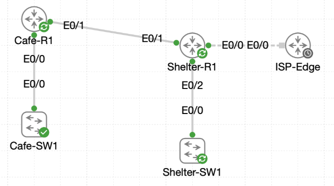

# Lab 046 - Deploying the OSPF Routing Protocol

<p class="back-link">
  <a href="../../Lab-index.html">← Back to Lab Index</a>
</p>

<table>
<tr>
<td colspan="2" valign="top">

<h1>Objective</h1>

<h4>Clean legacy dynamic routing from Cafe-R1 and Shelter-R1 before rebuilding OSPF.</h4>

<h4>Deploy OSPF process 1 between the cafe admin VLAN, the shelter VLAN stack and the intersite transit link.</h4>

<h4>Harden the OSPF adjacency by correcting timer and network-type drift on Ethernet0/1.</h4>

<h4>Move the cafe into Area 1 and promote Shelter-R1 into an Area Border Router.</h4>

<h4>Summarise the bunker VLANs toward the cafe and originate the shelter default route into OSPF.</h4>

<h4>Verify the final design with neighbour, route, database and reachability evidence.</h4>

</td>
</tr>

<tr>
<td valign="top">

</td>
</tr>
</table>

---

## Scenario

This lab pulls together the OSPF skills from the previous Castle Rysen routing labs into one larger deployment.

The cafe and fallout shelter routers initially contained legacy dynamic routing configuration and static reachability. The task was to clean the routers, rebuild OSPF, stabilise the neighbour relationship, split the routing domain into areas, summarise the shelter VLAN block, and share the shelter's default route toward the cafe.

The final design uses `Shelter-R1` as both the Area Border Router and the default-route originator. The bunker VLANs remain in Area 0, the cafe operates in Area 1, and `Cafe-R1` receives a single summary route plus an OSPF external default route through the shelter.

---

## Devices Used

* Cafe-R1
* Cafe-SW1
* Shelter-R1
* Shelter-SW1
* ISP-Edge

---

## Addressing Summary

| Device | Interface | IP Address | Purpose |
| ------ | --------- | ---------- | ------- |
| Cafe-R1 | Ethernet0/0.10 | 10.0.18.1/27 | Cafe admin VLAN gateway |
| Cafe-R1 | Ethernet0/1 | 172.16.0.1/30 | Transit link to Shelter-R1 |
| Shelter-R1 | Ethernet0/0 | 216.0.5.2/30 | ISP-facing link |
| Shelter-R1 | Ethernet0/1 | 172.16.0.2/30 | Transit link to Cafe-R1 |
| Shelter-R1 | Ethernet0/2.110 | 10.0.16.1/24 | Bunker VLAN gateway |
| Shelter-R1 | Ethernet0/2.120 | 10.0.17.1/24 | Bunker VLAN gateway |
| ISP-Edge | Connected next hop | 216.0.5.1 | Upstream default-route target |

---

## Final OSPF Design

| Device | OSPF Process | Router ID Observed | Area 0 Interfaces | Area 1 Interfaces | Passive Design |
| ------ | ------------ | ------------------ | ----------------- | ----------------- | -------------- |
| Cafe-R1 | 1 | 172.16.0.1 | None in final design | Ethernet0/1, Ethernet0/0.10 | Passive default, Ethernet0/1 active |
| Shelter-R1 | 1 | 216.0.5.2 | Ethernet0/2.110, Ethernet0/2.120 | Ethernet0/1 | Passive default, Ethernet0/1 active |

---

## Configuration Steps

### Step 1 - Audit Legacy Routing on Cafe-R1

Cafe-R1 initially contained both EIGRP and an older OSPF process.

```bash
show running-config | section router
```

### Result

```bash
router eigrp 15
 network 10.0.18.0 0.0.0.255
router ospf 99
 router-id 15.15.15.10
 passive-interface default
 network 10.0.18.0 0.0.0.255 area 0
 network 172.16.0.0 0.0.0.3 area 0
```

Cafe-R1 also had a static route to the shelter block:

```bash
ip route 10.0.16.0 255.255.254.0 172.16.0.2
```

### Explanation

Before rebuilding OSPF, the legacy dynamic routing processes needed to be removed so the lab could start from a clean, controlled routing state.

---

### Step 2 - Confirm Cafe-R1 Interface State

```bash
show ip int brief
```

### Result

```bash
Interface              IP-Address      OK? Method Status                Protocol
Ethernet0/0            unassigned      YES TFTP   up                    up
Ethernet0/0.10         10.0.18.1       YES TFTP   up                    up
Ethernet0/1            172.16.0.1      YES TFTP   up                    up
Ethernet0/2            unassigned      YES unset  administratively down down
Ethernet0/3            unassigned      YES unset  administratively down down
```

### Explanation

The required cafe interfaces were up/up:

* `Ethernet0/0.10` for the cafe admin VLAN.
* `Ethernet0/1` for the intersite transit link.

---

### Step 3 - Audit Legacy Routing on Shelter-R1

Shelter-R1 also contained legacy EIGRP and OSPF configuration.

```bash
show running-config | section router
```

### Result

```bash
router eigrp 12
 network 10.0.16.0 0.0.0.255
 network 10.0.17.0 0.0.0.255
 passive-interface default
router ospf 50
 router-id 25.25.25.25
 passive-interface Ethernet0/2.110
 passive-interface Ethernet0/2.120
 network 10.0.16.0 0.0.0.255 area 0
 network 10.0.17.0 0.0.0.255 area 0
 network 172.16.0.0 0.0.0.3 area 0
```

Shelter-R1 already had its ISP default route:

```bash
ip route 0.0.0.0 0.0.0.0 216.0.5.1
```

### Explanation

The default route was required later for OSPF default-route origination, but the legacy dynamic routing processes needed to be removed before building the new OSPF design.

---

### Step 4 - Confirm Shelter-R1 Interface State

```bash
show ip int brief
```

### Result

```bash
Interface              IP-Address      OK? Method Status                Protocol
Ethernet0/0            216.0.5.2       YES TFTP   up                    up
Ethernet0/1            172.16.0.2      YES TFTP   up                    up
Ethernet0/2            unassigned      YES TFTP   up                    up
Ethernet0/2.110        10.0.16.1       YES TFTP   up                    up
Ethernet0/2.120        10.0.17.1       YES TFTP   up                    up
Ethernet0/3            unassigned      YES unset  administratively down down
```

### Explanation

The ISP link, cafe transit link and shelter VLAN subinterfaces were all operational before OSPF was rebuilt.

---

## Router Cleanup

### Step 5 - Remove Legacy Dynamic Routing

On Cafe-R1:

```bash
configure terminal
no router eigrp 15
no router ospf 99
end
```

On Shelter-R1:

```bash
configure terminal
no router eigrp 12
no router ospf 50
end
```

### Verification

```bash
show running-config | section ^router
show ip protocols
```

### Result

After cleanup, no EIGRP or OSPF routing process remained. `show ip protocols` only displayed the default application routing process.

### Explanation

This created a clean baseline. Static routes and directly connected networks remained, but dynamic routing was removed before OSPF process 1 was deployed.

---

## Baseline OSPF Deployment

### Step 6 - Configure OSPF on Cafe-R1

Cafe-R1 was configured with OSPF process 1, passive default behaviour and the correct area 0 network statements.

```bash
configure terminal
router ospf 1
 passive-interface default
 no passive-interface Ethernet0/1
 network 10.0.18.0 0.0.0.31 area 0
 network 172.16.0.0 0.0.0.3 area 0
end
```

### Verification

```bash
show running-config | section ^router ospf
show ip ospf interface brief
```

### Result

```bash
router ospf 1
 passive-interface default
 no passive-interface Ethernet0/1
 network 10.0.18.0 0.0.0.31 area 0
 network 172.16.0.0 0.0.0.3 area 0
```

```bash
Interface    PID   Area            IP Address/Mask    Cost  State Nbrs F/C
Et0/1        1     0               172.16.0.1/30      10    P2P   0/0
Et0/0.10     1     0               10.0.18.1/27       10    DR    0/0
```

### Explanation

The cafe admin subnet and the intersite transit were added to OSPF. `passive-interface default` suppressed OSPF hellos everywhere by default, and `no passive-interface Ethernet0/1` allowed only the transit link to form an adjacency.

---

### Step 7 - Configure OSPF on Shelter-R1

An initial mistake advertised the cafe admin network on Shelter-R1. This was corrected by removing the wrong statement and adding the shelter VLANs instead.

```bash
configure terminal
router ospf 1
passive-interface default
no passive-interface ethernet0/1
no network 10.0.18.0 0.0.0.31 area 0
no network 172.16.0.0 0.0.0.3 area 0
network 172.16.0.0 0.0.0.3 area 0
network 10.0.16.0 0.0.0.255 area 0
network 10.0.17.0 0.0.0.255 area 0
end
```

### Verification

```bash
show running-config | section ^router ospf
show ip ospf interface brief
```

### Result

```bash
router ospf 1
 passive-interface default
 no passive-interface Ethernet0/1
 network 10.0.16.0 0.0.0.255 area 0
 network 10.0.17.0 0.0.0.255 area 0
 network 172.16.0.0 0.0.0.3 area 0
```

```bash
Interface    PID   Area            IP Address/Mask    Cost  State Nbrs F/C
Et0/2.120    1     0               10.0.17.1/24       10    DR    0/0
Et0/2.110    1     0               10.0.16.1/24       10    DR    0/0
Et0/1        1     0               172.16.0.2/30      10    DR    0/0
```

### Explanation

The shelter VLANs and the transit link were now inside OSPF area 0. The VLAN interfaces stayed passive, while `Ethernet0/1` remained active for neighbour formation.

---

## OSPF Adjacency Hardening

### Step 8 - Identify Timer and Network-Type Drift

Cafe-R1 showed a point-to-point OSPF network type and custom timers on Ethernet0/1:

```bash
ip ospf network point-to-point
ip ospf dead-interval 20
ip ospf hello-interval 5
```

The detailed interface view confirmed:

```bash
Network Type POINT_TO_POINT
Timer intervals configured, Hello 5, Dead 20, Wait 20, Retransmit 5
Neighbor Count is 0, Adjacent neighbor count is 0
```

### Explanation

This explained why the adjacency was not stable. OSPF neighbours must agree on key interface parameters, including hello/dead timers. Network-type mismatch can also stop the routers from agreeing on the correct adjacency behaviour.

---

### Step 9 - Reset Cafe-R1 Timers

```bash
configure terminal
interface Ethernet0/1
 no ip ospf hello-interval
 no ip ospf dead-interval
end
```

### Result

The adjacency came up after the timer fix:

```bash
%OSPF-5-ADJCHG: Process 1, Nbr 216.0.5.2 on Ethernet0/1 from LOADING to FULL, Loading Done
```

The neighbour table showed:

```bash
Neighbor ID     Pri   State           Dead Time   Address         Interface
216.0.5.2         0   FULL/  -        00:00:31    172.16.0.2      Ethernet0/1
```

### Explanation

The timers were corrected to the standard 10/40 values. At this point the link was still point-to-point, which is why the neighbour output did not show a DR/BDR role.

---

### Step 10 - Remove Point-to-Point Overrides and Return to Broadcast

Cafe-R1 was corrected first:

```bash
configure terminal
interface Ethernet0/1
 no ip ospf hello-interval
 no ip ospf dead-interval
 no ip ospf network point-to-point
end
```

Shelter-R1 was corrected to match:

```bash
configure terminal
interface Ethernet0/1
 no ip ospf hello-interval
 no ip ospf dead-interval
 no ip ospf network point-to-point
end
```

### Debug Evidence

The OSPF debug captured the neighbour progressing through the expected states:

```bash
2 Way Communication to 216.0.5.2, state 2WAY
Nbr 216.0.5.2: Prepare dbase exchange
Rcv DBD from 216.0.5.2 ... state EXSTART
Exchange Done with 216.0.5.2
Synchronized with 216.0.5.2, state FULL
```

### Verification

Cafe-R1:

```bash
Network Type BROADCAST
State BDR
Designated Router (ID) 216.0.5.2, Interface address 172.16.0.2
Backup Designated router (ID) 172.16.0.1, Interface address 172.16.0.1
Timer intervals configured, Hello 10, Dead 40, Wait 40, Retransmit 5
```

Shelter-R1:

```bash
Network Type BROADCAST
State DR
Designated Router (ID) 216.0.5.2, Interface address 172.16.0.2
Backup Designated router (ID) 172.16.0.1, Interface address 172.16.0.1
Timer intervals configured, Hello 10, Dead 40, Wait 40, Retransmit 5
```

### Explanation

Both sides now agreed on broadcast network type and standard OSPF timers. The link formed a normal DR/BDR election, with Shelter-R1 as DR and Cafe-R1 as BDR.

---

### Step 11 - Remove Temporary Static Routes and Verify Dynamic Learning

Once OSPF was stable, the temporary static routes were removed.

On Cafe-R1:

```bash
no ip route 10.0.16.0 255.255.254.0 172.16.0.2
```

On Shelter-R1:

```bash
no ip route 10.0.18.0 255.255.255.224 172.16.0.1
```

### Verification

Cafe-R1 learned the shelter VLANs dynamically:

```bash
O        10.0.16.0/24 [110/20] via 172.16.0.2, Ethernet0/1
O        10.0.17.0/24 [110/20] via 172.16.0.2, Ethernet0/1
```

Shelter-R1 learned the cafe admin subnet dynamically:

```bash
O        10.0.18.0/27 [110/20] via 172.16.0.1, Ethernet0/1
```

### Explanation

This proved that the routes were being learned through OSPF rather than being carried by the temporary static routes.

---

## Re-Draw the OSPF Area Boundary

### Step 12 - Move Cafe-R1 into Area 1

Cafe-R1 was rebuilt so both the cafe admin VLAN and the transit interface were in Area 1.

```bash
configure terminal
no router ospf 1
router ospf 1
 passive-interface default
 no passive-interface Ethernet0/1
 network 10.0.18.0 0.0.0.31 area 1
 network 172.16.0.0 0.0.0.3 area 1
end
```

### Interim Result

Cafe-R1 correctly showed both interfaces in Area 1:

```bash
Interface    PID   Area            IP Address/Mask    Cost  State Nbrs F/C
Et0/1        1     1               172.16.0.1/30      10    WAIT  0/0
Et0/0.10     1     1               10.0.18.1/27       10    WAIT  0/0
```

However, until Shelter-R1 was also moved, the link reported an area mismatch:

```bash
%OSPF-4-ERRRCV: Received invalid packet: mismatched area ID from backbone area from 172.16.0.2, Ethernet0/1
```

### Explanation

This was expected during the transition. OSPF neighbours on the same link must agree on the area ID.

---

### Step 13 - Move Shelter-R1 Transit into Area 1

Shelter-R1 was then rebuilt as an ABR: the bunker VLANs stayed in Area 0, while the transit link moved into Area 1.

```bash
configure terminal
no router ospf 1
router ospf 1
 passive-interface default
 no passive-interface Ethernet0/1
 network 10.0.16.0 0.0.0.255 area 0
 network 10.0.17.0 0.0.0.255 area 0
 network 172.16.0.0 0.0.0.3 area 1
end
```

### Verification

```bash
show ip ospf interface brief
show ip ospf neighbor
show ip ospf
```

### Result

```bash
Interface    PID   Area            IP Address/Mask    Cost  State Nbrs F/C
Et0/2.120    1     0               10.0.17.1/24       10    WAIT  0/0
Et0/2.110    1     0               10.0.16.1/24       10    WAIT  0/0
Et0/1        1     1               172.16.0.2/30      10    BDR   1/1
```

```bash
Neighbor ID     Pri   State           Dead Time   Address         Interface
172.16.0.1        1   FULL/DR         00:00:36    172.16.0.1      Ethernet0/1
```

`show ip ospf` confirmed:

```bash
It is an area border router
Number of areas in this router is 2. 2 normal 0 stub 0 nssa
```

### Explanation

Shelter-R1 was now operating as the Area Border Router between Area 0 and Area 1.

---

## Summarisation and Default Route Origination

### Step 14 - Summarise the Bunker VLANs Toward Area 1

Shelter-R1 was configured to summarise the bunker block.

```bash
configure terminal
router ospf 1
 area 0 range 10.0.16.0 255.255.252.0
end
```

### Verification on Shelter-R1

```bash
show running-config | section ^router ospf
show ip ospf database summary
```

### Result

```bash
router ospf 1
 area 0 range 10.0.16.0 255.255.252.0
 passive-interface default
 no passive-interface Ethernet0/1
 network 10.0.16.0 0.0.0.255 area 0
 network 10.0.17.0 0.0.0.255 area 0
 network 172.16.0.0 0.0.0.3 area 1
```

The summary LSA was visible in Area 1:

```bash
Link State ID: 10.0.16.0 (summary Network Number)
Network Mask: /22
Metric: 10
```

### Verification on Cafe-R1

```bash
show ip route ospf
show ip route 10.0.16.0
show ip route 10.0.17.1
```

### Result

```bash
O IA     10.0.16.0/22 [110/20] via 172.16.0.2, Ethernet0/1
```

Detailed checks for both `10.0.16.0` and `10.0.17.1` matched the same `10.0.16.0/22` summary route.

### Explanation

The individual shelter routes were collapsed into a single inter-area route on Cafe-R1. This reduces the number of inter-area LSAs the cafe needs to track.

---

### Step 15 - Confirm the Static Default Route on Shelter-R1

```bash
show running-config | include ^ip route
show ip route 0.0.0.0
ping 216.0.5.1
```

### Result

```bash
ip route 0.0.0.0 0.0.0.0 216.0.5.1
```

```bash
Routing entry for 0.0.0.0/0, supernet
  Known via "static", distance 1, metric 0, candidate default path
  Routing Descriptor Blocks:
  * 216.0.5.1
```

The ISP next hop responded successfully:

```bash
Success rate is 100 percent (5/5), round-trip min/avg/max = 1/1/1 ms
```

### Explanation

Shelter-R1 had a valid static default route toward the ISP, so it could safely originate a default route into OSPF.

---

### Step 16 - Originate the Default Route into OSPF

```bash
configure terminal
router ospf 1
 default-information originate
end
```

### Verification on Shelter-R1

```bash
show running-config | section ^router ospf
show ip ospf database external
show ip ospf
```

### Result

```bash
router ospf 1
 area 0 range 10.0.16.0 255.255.252.0
 passive-interface default
 no passive-interface Ethernet0/1
 network 10.0.16.0 0.0.0.255 area 0
 network 10.0.17.0 0.0.0.255 area 0
 network 172.16.0.0 0.0.0.3 area 1
 default-information originate
```

The external database contained the default LSA:

```bash
LS Type: AS External Link
Link State ID: 0.0.0.0 (External Network Number )
Advertising Router: 216.0.5.2
Network Mask: /0
Metric Type: 2
Metric: 1
```

`show ip ospf` also confirmed Shelter-R1 had become both an area border router and an autonomous system boundary router.

### Explanation

`default-information originate` advertised the static default route into OSPF as an external Type 5 LSA.

---

### Step 17 - Verify Cafe-R1 Receives the Summary and Default

Cafe-R1's routing table showed both the inter-area summary and the external default route.

```bash
show ip route ospf
show ip route 0.0.0.0
show ip ospf database external
```

### Result

```bash
Gateway of last resort is 172.16.0.2 to network 0.0.0.0

O*E2  0.0.0.0/0 [110/1] via 172.16.0.2, Ethernet0/1
O IA     10.0.16.0/22 [110/20] via 172.16.0.2, Ethernet0/1
```

The external database showed the default LSA originated by Shelter-R1:

```bash
Link State ID: 0.0.0.0 (External Network Number )
Advertising Router: 216.0.5.2
Network Mask: /0
Metric Type: 2
Metric: 1
```

### Explanation

Cafe-R1 now had a clean routing table: one summary route for the bunker networks and one external default route toward Shelter-R1.

---

## Reachability Testing

### Cafe to Bunker VLAN

```bash
ping 10.0.16.1 source 10.0.18.1
```

### Result

```bash
Packet sent with a source address of 10.0.18.1
!!!!!
Success rate is 100 percent (5/5), round-trip min/avg/max = 1/1/1 ms
```

### Cafe to ISP Next Hop

```bash
ping 216.0.5.1
ping 216.0.5.1 source 10.0.18.1
```

### Result

Both tests succeeded with 100 percent success.

### Explanation

The final pings proved that Cafe-R1 could use OSPF to reach both the summarised bunker networks and the ISP next hop via Shelter-R1.

---

## Final Verification

### Cafe-R1

Cafe-R1 final neighbour evidence showed:

```bash
Neighbor ID     Pri   State           Dead Time   Address         Interface
216.0.5.2         1   FULL/BDR        00:00:36    172.16.0.2      Ethernet0/1
```

Cafe-R1 final route evidence showed:

```bash
Gateway of last resort is 172.16.0.2 to network 0.0.0.0
O*E2  0.0.0.0/0 [110/1] via 172.16.0.2, Ethernet0/1
O IA     10.0.16.0/22 [110/20] via 172.16.0.2, Ethernet0/1
```

### Shelter-R1

Shelter-R1 final interface and neighbour evidence showed:

```bash
Et0/2.120    1     0               10.0.17.1/24       10    DR    0/0
Et0/2.110    1     0               10.0.16.1/24       10    DR    0/0
Et0/1        1     1               172.16.0.2/30      10    BDR   1/1
```

```bash
Neighbor ID     Pri   State           Dead Time   Address         Interface
172.16.0.1        1   FULL/DR         00:00:36    172.16.0.1      Ethernet0/1
```

Shelter-R1 final OSPF configuration showed:

```bash
router ospf 1
 area 0 range 10.0.16.0 255.255.252.0
 passive-interface default
 no passive-interface Ethernet0/1
 network 10.0.16.0 0.0.0.255 area 0
 network 10.0.17.0 0.0.0.255 area 0
 network 172.16.0.0 0.0.0.3 area 1
 default-information originate
```

---

## Troubleshooting

### Issue 1 - Invalid source address during early ping tests

#### Problem

Cafe-R1 attempted to source a ping from addresses it did not own:

```bash
ping 10.0.18.1 source 10.0.16.1
ping 10.0.18.1 source 10.0.17.1
```

IOS returned:

```bash
% Invalid source address- IP address not on any of our up interfaces
```

#### Fix

The correct test direction was later used from Shelter-R1, sourcing from `10.0.16.1`, and from Cafe-R1, sourcing from `10.0.18.1`.

---

### Issue 2 - Static route entered in the wrong mode

#### Problem

This route was entered from privileged EXEC mode:

```bash
ip route 10.0.18.0 255.255.255.224 172.16.0.1
```

IOS rejected it with an invalid input marker.

#### Fix

The command was entered from global configuration mode:

```bash
configure terminal
ip route 10.0.18.0 255.255.255.224 172.16.0.1
```

---

### Issue 3 - Typo in passive-interface syntax

#### Problem

The command was entered as:

```bash
passive interface default
```

#### Diagnosis

IOS requires a hyphen between `passive` and `interface`.

#### Fix

```bash
passive-interface default
```

---

### Issue 4 - Wrong OSPF network statement on Shelter-R1

#### Problem

Shelter-R1 briefly had a cafe admin network statement:

```bash
network 10.0.18.0 0.0.0.31 area 0
```

#### Diagnosis

That subnet belongs behind Cafe-R1, not as a directly connected network on Shelter-R1.

#### Fix

The incorrect statement was removed and replaced with the shelter VLAN networks:

```bash
network 10.0.16.0 0.0.0.255 area 0
network 10.0.17.0 0.0.0.255 area 0
```

---

### Issue 5 - Timer mismatch on Cafe-R1

#### Problem

Cafe-R1 had custom OSPF timers:

```bash
ip ospf hello-interval 5
ip ospf dead-interval 20
```

#### Fix

```bash
interface Ethernet0/1
 no ip ospf hello-interval
 no ip ospf dead-interval
```

This returned the interface to the standard 10/40 timer cadence.

---

### Issue 6 - OSPF network type needed to return to broadcast

#### Problem

The transit link was temporarily configured as point-to-point:

```bash
ip ospf network point-to-point
```

#### Fix

The override was removed on both routers:

```bash
interface Ethernet0/1
 no ip ospf network point-to-point
```

The final interface output then showed `Network Type BROADCAST` with DR/BDR roles.

---

### Issue 7 - Area mismatch during migration to Area 1

#### Problem

After Cafe-R1 was moved into Area 1 before Shelter-R1 was fully aligned, OSPF reported:

```bash
%OSPF-4-ERRRCV: Received invalid packet: mismatched area ID from backbone area from 172.16.0.2, Ethernet0/1
```

#### Fix

Shelter-R1's transit link was also moved into Area 1. The adjacency then returned to FULL.

---

### Issue 8 - Minor command typos during verification

#### Examples

```bash
show ospf neighbors
show ip ospf neighbors
how ip ospf interface brief
how ip ospf database external
```

#### Fix

The correct forms were used:

```bash
show ip ospf neighbor
show ip ospf interface brief
show ip ospf database external
```

---

## Key Learning Points

* OSPF `network` statements select interfaces based on matching IP addresses and wildcard masks.
* `passive-interface default` is a safe starting point because it suppresses unnecessary hello packets.
* Transit links must be made non-passive if they need to form OSPF adjacencies.
* Hello and dead timers must match for OSPF neighbours to form reliably.
* OSPF network type affects DR/BDR behaviour and must be consistent across the shared link.
* Temporary static routes are useful during staged migration but should be removed once OSPF is verified.
* Moving only one side of a link into a new OSPF area creates an area mismatch.
* An ABR connects multiple OSPF areas and can summarise routes between them.
* `area 0 range` is used on the ABR to summarise routes from Area 0 into another area.
* `default-information originate` advertises an existing default route into OSPF.
* `O IA` identifies an inter-area OSPF route.
* `O*E2` identifies an OSPF external default route.
* Final verification should include neighbour state, interface area, route table, OSPF database and ping evidence.

---

## Completion Check

The lab was completed successfully.

* Legacy EIGRP and OSPF processes were removed from Cafe-R1.
* Legacy EIGRP and OSPF processes were removed from Shelter-R1.
* Cafe-R1 Ethernet0/0.10 was confirmed as `10.0.18.1/27` and up/up.
* Cafe-R1 Ethernet0/1 was confirmed as `172.16.0.1/30` and up/up.
* Shelter-R1 Ethernet0/0 was confirmed as `216.0.5.2` and up/up.
* Shelter-R1 Ethernet0/1 was confirmed as `172.16.0.2/30` and up/up.
* Shelter-R1 Ethernet0/2.110 was confirmed as `10.0.16.1` and up/up.
* Shelter-R1 Ethernet0/2.120 was confirmed as `10.0.17.1` and up/up.
* OSPF process 1 was deployed on both routers.
* Cafe-R1 advertised the cafe admin VLAN and the intersite transit.
* Shelter-R1 advertised the shelter VLANs and the intersite transit.
* User-facing OSPF interfaces were kept passive.
* Ethernet0/1 remained active for neighbour formation.
* Timer drift was corrected back to hello/dead 10/40.
* Point-to-point network type overrides were removed.
* The transit link returned to broadcast OSPF network type.
* The OSPF adjacency reached FULL.
* Cafe-R1 learned `10.0.16.0/24` and `10.0.17.0/24` during the baseline area 0 phase.
* Shelter-R1 learned `10.0.18.0/27` during the baseline area 0 phase.
* Cafe-R1 and Shelter-R1 were migrated into the final multi-area design.
* Shelter-R1 became the ABR between Area 0 and Area 1.
* Shelter-R1 summarised the bunker VLANs as `10.0.16.0/22`.
* Cafe-R1 learned `O IA 10.0.16.0/22` through Shelter-R1.
* Shelter-R1 retained its static default route to `216.0.5.1`.
* Shelter-R1 originated the default route into OSPF.
* Cafe-R1 installed `O*E2 0.0.0.0/0` via `172.16.0.2`.
* Cafe-R1 successfully reached `10.0.16.1` using source `10.0.18.1`.
* Cafe-R1 successfully reached the ISP next hop `216.0.5.1`.
* Running configurations were saved on both routers.
