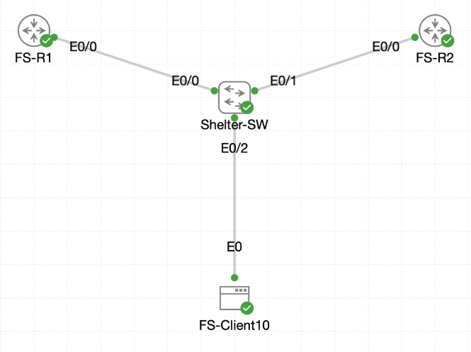

# Lab 047 - Castle Rysen: Configuring HSRPv2

<p class="back-link">
  <a href="../../Lab-index.html">← Back to Lab Index</a>
</p>

<table>
<tr>
<td colspan="2" valign="top">

<h1>Objective</h1>

<h4>Prepare the fallout shelter switch so VLANs 10, 20, 30 and 40 are active across both router trunks.</h4>

<h4>Move FS-R1's physical gateway addresses away from the first usable host address so those addresses can become HSRP virtual gateways.</h4>

<h4>Configure FS-R1 as the preferred active router using HSRPv2, priority 105 and preemption.</h4>

<h4>Configure FS-R2 as the standby router using matching HSRPv2 groups and virtual gateway addresses.</h4>

<h4>Simulate a failure of FS-R1 and prove that FS-R2 takes over the virtual gateways without breaking client reachability.</h4>

<h4>Restore FS-R1 and confirm preemption returns the active role to the preferred router.</h4>

</td>
</tr>

<tr>
<td valign="top">

</td>
</tr>
</table>

---

## Scenario

This lab introduces first-hop redundancy using HSRPv2.

The fallout shelter has two routers, `FS-R1` and `FS-R2`, connected to `Shelter-SW` over 802.1Q trunks. The client VLANs need a resilient default gateway so that hosts can keep using the same gateway IP address even if one router fails.

The solution was to configure HSRPv2 on four routed VLAN subinterfaces. `FS-R1` was made the preferred active router by assigning it the second usable IP address in each subnet, setting HSRP priority to 105, and enabling preemption. `FS-R2` kept the third usable IP address in each subnet and joined the same HSRP groups as the standby router.

The first usable address in each subnet became the virtual gateway IP shared by the HSRP pair.

---

## Devices Used

* Shelter-SW
* FS-R1
* FS-R2
* FS-Client10

---

## VLAN and HSRP Plan

| VLAN | Subnet | Virtual Gateway | FS-R1 Address | FS-R2 Address | HSRP Group |
| ---- | ------ | --------------- | ------------- | ------------- | ---------- |
| 10 | 10.0.16.0/27 | 10.0.16.1 | 10.0.16.2 | 10.0.16.3 | 10 |
| 20 | 10.0.16.128/27 | 10.0.16.129 | 10.0.16.130 | 10.0.16.131 | 20 |
| 30 | 10.0.17.0/27 | 10.0.17.1 | 10.0.17.2 | 10.0.17.3 | 30 |
| 40 | 10.0.17.128/27 | 10.0.17.129 | 10.0.17.130 | 10.0.17.131 | 40 |

---

## Role Plan

| Router | Intended HSRP Role | Priority | Preemption |
| ------ | ------------------ | -------- | ---------- |
| FS-R1 | Active | 105 | Enabled |
| FS-R2 | Standby | 100 default | Enabled |

---

## Configuration Steps

### Step 1 - Create the Remaining Shelter VLANs

VLANs 20, 30 and 40 were created on `Shelter-SW`.

```bash
configure terminal
vlan 20
name Shelter-Logistics
vlan 30
name Shelter-Engineering
vlan 40
name Shelter-Security
end
```

### Verification

```bash
show vlan brief
```

### Result

```bash
10   VLAN0010                         active    Et0/2
20   Shelter-Logistics                active
30   Shelter-Engineering              active
40   Shelter-Security                 active
```

### Explanation

VLAN 10 already existed for the client port. VLANs 20, 30 and 40 were created so the switch could carry all HSRP VLANs across the router trunks.

---

### Step 2 - Verify Trunk VLAN Forwarding on Shelter-SW

The router-facing trunks were checked.

```bash
show interfaces trunk
```

### Result

```bash
Port           Mode             Encapsulation  Status        Native vlan
Et0/0          on               802.1q         trunking      1
Et0/1          on               802.1q         trunking      1
```

Allowed VLANs:

```bash
Et0/0          10,20,30,40
Et0/1          10,20,30,40
```

Forwarding VLANs:

```bash
Et0/0          10,20,30,40
Et0/1          10,20,30,40
```

### Explanation

Both router trunks were carrying all four shelter VLANs and spanning tree was forwarding them. This meant the two routers could exchange HSRP messages on each VLAN.

---

## FS-R1 Configuration

### Step 3 - Bring Up the FS-R1 Router Trunk

The physical trunk interface was enabled on `FS-R1`.

```bash
configure terminal
interface ethernet0/0
no shutdown
```

### Result

```bash
%LINK-3-UPDOWN: Interface Ethernet0/0, changed state to up
%LINEPROTO-5-UPDOWN: Line protocol on Interface Ethernet0/0, changed state to up
```

### Explanation

The physical router interface had to be up before the VLAN subinterfaces could pass traffic.

---

### Step 4 - Move FS-R1 to the Second Usable IP in Each VLAN

The subinterface IP addresses on `FS-R1` were changed so the first usable IP could be reserved for HSRP.

```bash
interface ethernet0/0.10
no ip address
ip address 10.0.16.2 255.255.255.224

interface ethernet0/0.20
no ip address
ip address 10.0.16.130 255.255.255.224

interface ethernet0/0.30
no ip address
ip address 10.0.17.2 255.255.255.224

interface ethernet0/0.40
no ip address
ip address 10.0.17.130 255.255.255.224
end
```

### Verification

```bash
show ip interface brief | include Ethernet0/0
```

### Result

```bash
Ethernet0/0            unassigned      YES unset  up                    up
Ethernet0/0.10         10.0.16.2       YES manual up                    up
Ethernet0/0.20         10.0.16.130     YES manual up                    up
Ethernet0/0.30         10.0.17.2       YES manual up                    up
Ethernet0/0.40         10.0.17.130     YES manual up                    up
```

### Explanation

`FS-R1` now used the second usable IP address in each subnet. This freed the first usable IP address to become the shared virtual gateway.

---

### Step 5 - Configure HSRPv2 on FS-R1

HSRP version 2 was enabled under each subinterface. The group number matched the VLAN ID.

```bash
interface ethernet0/0.10
standby version 2
standby 10 ip 10.0.16.1
standby 10 priority 105
standby 10 preempt

interface ethernet0/0.20
standby version 2
standby 20 ip 10.0.16.129
standby 20 priority 105
standby 20 preempt

interface ethernet0/0.30
standby version 2
standby 30 ip 10.0.17.1
standby 30 priority 105
standby 30 preempt

interface ethernet0/0.40
standby version 2
standby 40 ip 10.0.17.129
standby 40 priority 105
standby 40 preempt
end
```

### Verification

```bash
show standby brief
```

### Result

```bash
Interface   Grp  Pri P State   Active          Standby         Virtual IP
Et0/0.10    10   105 P Active  local           unknown         10.0.16.1
Et0/0.20    20   105 P Active  local           unknown         10.0.16.129
Et0/0.30    30   105 P Active  local           unknown         10.0.17.1
Et0/0.40    40   105 P Active  local           unknown         10.0.17.129
```

### Explanation

At this point `FS-R1` became active for all four HSRP groups. The standby router was still unknown because `FS-R2` had not yet joined the groups.

---

## FS-R2 Configuration

### Step 6 - Bring Up the FS-R2 Router Trunk

The physical trunk interface was enabled on `FS-R2`.

```bash
configure terminal
interface ethernet0/0
no shutdown
```

### Result

```bash
%LINK-3-UPDOWN: Interface Ethernet0/0, changed state to up
%LINEPROTO-5-UPDOWN: Line protocol on Interface Ethernet0/0, changed state to up
```

---

### Step 7 - Configure FS-R2 Interface Addresses and HSRPv2 Groups

`FS-R2` was configured with the third usable address in each subnet and joined the same HSRP groups.

```bash
interface ethernet0/0.10
ip address 10.0.16.3 255.255.255.224
standby version 2
standby 10 ip 10.0.16.1
standby 10 preempt

interface ethernet0/0.20
ip address 10.0.16.131 255.255.255.224
standby version 2
standby 20 ip 10.0.16.129
standby 20 preempt

interface ethernet0/0.30
ip address 10.0.17.3 255.255.255.224
standby version 2
standby 30 ip 10.0.17.1
standby 30 preempt

interface ethernet0/0.40
ip address 10.0.17.131 255.255.255.224
standby version 2
standby 40 ip 10.0.17.129
standby 40 preempt
end
```

### Verification

```bash
show standby brief
```

### Result

```bash
Interface   Grp  Pri P State   Active          Standby         Virtual IP
Et0/0.10    10   100 P Standby 10.0.16.2       local           10.0.16.1
Et0/0.20    20   100 P Standby 10.0.16.130     local           10.0.16.129
Et0/0.30    30   100 P Standby 10.0.17.2       local           10.0.17.1
Et0/0.40    40   100 P Standby 10.0.17.130     local           10.0.17.129
```

### Explanation

`FS-R2` successfully joined all four HSRP groups as the standby router.

The default HSRP priority is 100, so `FS-R1` remained active because it had the higher configured priority of 105.

---

## Failover Test

### Step 8 - Simulate Failure of FS-R1

The physical trunk on `FS-R1` was shut down to simulate a router uplink failure.

```bash
configure terminal
interface ethernet0/0
shutdown
end
```

### Result

```bash
%HSRP-5-STATECHANGE: Ethernet0/0.10 Grp 10 state Active -> Init
%HSRP-5-STATECHANGE: Ethernet0/0.20 Grp 20 state Active -> Init
%HSRP-5-STATECHANGE: Ethernet0/0.30 Grp 30 state Active -> Init
%HSRP-5-STATECHANGE: Ethernet0/0.40 Grp 40 state Active -> Init
%LINK-5-CHANGED: Interface Ethernet0/0, changed state to administratively down
%LINEPROTO-5-UPDOWN: Line protocol on Interface Ethernet0/0, changed state to down
```

### Explanation

Shutting down the parent trunk removed all of FS-R1's VLAN subinterfaces from operation, forcing HSRP to move the active role to the remaining router.

---

### Step 9 - Verify FS-R2 Becomes Active

`FS-R2` was checked after FS-R1 was taken offline.

```bash
show standby brief
```

### Result

```bash
Interface   Grp  Pri P State   Active          Standby         Virtual IP
Et0/0.10    10   100 P Active  local           unknown         10.0.16.1
Et0/0.20    20   100 P Active  local           unknown         10.0.16.129
Et0/0.30    30   100 P Active  local           unknown         10.0.17.1
Et0/0.40    40   100 P Active  local           unknown         10.0.17.129
```

### Explanation

`FS-R2` successfully took over all four virtual gateways.

---

### Step 10 - Configure the Linux Client for VLAN 10 Testing

The client was configured with an address in VLAN 10 and a default gateway pointing to the HSRP virtual IP.

```bash
sudo ifconfig eth0 10.0.16.10 netmask 255.255.255.224 up
sudo route del default 2>/dev/null
sudo route add default gw 10.0.16.1 eth0
```

### Explanation

The client is a Linux host, so Linux commands were used rather than IOS syntax.

`10.0.16.1` was the HSRP virtual gateway, meaning the client did not need to know which physical router was active.

---

### Step 11 - Test Client Reachability During the Outage

The client tested reachability to the HSRP virtual gateway while FS-R1 was offline.

```bash
ping -c 5 10.0.16.1
```

### Result

```bash
5 packets transmitted, 5 packets received, 0% packet loss
round-trip min/avg/max = 0.732/1.032/1.660 ms
```

### Explanation

The client successfully reached the virtual gateway while `FS-R2` was active. This proved the failover worked for VLAN 10.

---

### Step 12 - Restore FS-R1 and Verify Preemption

The physical trunk on FS-R1 was brought back online.

```bash
configure terminal
interface ethernet0/0
no shutdown
end
```

### Result

```bash
%LINK-3-UPDOWN: Interface Ethernet0/0, changed state to up
%HSRP-5-STATECHANGE: Ethernet0/0.40 Grp 40 state Listen -> Active
%HSRP-5-STATECHANGE: Ethernet0/0.10 Grp 10 state Listen -> Active
%HSRP-5-STATECHANGE: Ethernet0/0.20 Grp 20 state Listen -> Active
%HSRP-5-STATECHANGE: Ethernet0/0.30 Grp 30 state Listen -> Active
%LINEPROTO-5-UPDOWN: Line protocol on Interface Ethernet0/0, changed state to up
```

Final `show standby brief` on FS-R1 showed:

```bash
Interface   Grp  Pri P State   Active          Standby         Virtual IP
Et0/0.10    10   105 P Active  local           10.0.16.3       10.0.16.1
Et0/0.20    20   105 P Active  local           10.0.16.131     10.0.16.129
Et0/0.30    30   105 P Active  local           unknown         10.0.17.1
Et0/0.40    40   105 P Active  local           10.0.17.131     10.0.17.129
```

### Explanation

Because FS-R1 had the higher priority and preemption enabled, it reclaimed the active role after its trunk was restored.

The final capture showed FS-R1 active for all four groups. Group 30 showed the standby as `unknown` at the instant captured, so a later recapture would be useful to prove the backup relationship had fully settled again for that group.

---

## Final Verification

### Shelter-SW

The switch had VLANs 10, 20, 30 and 40 active:

```bash
10   VLAN0010                         active    Et0/2
20   Shelter-Logistics                active
30   Shelter-Engineering              active
40   Shelter-Security                 active
```

Both router trunks were forwarding all four VLANs:

```bash
Et0/0          10,20,30,40
Et0/1          10,20,30,40
```

---

### FS-R1

FS-R1 used the second usable address in each subnet:

```bash
Ethernet0/0.10         10.0.16.2       YES manual up                    up
Ethernet0/0.20         10.0.16.130     YES manual up                    up
Ethernet0/0.30         10.0.17.2       YES manual up                    up
Ethernet0/0.40         10.0.17.130     YES manual up                    up
```

FS-R1 became active for all four HSRP groups with priority 105 and preemption enabled.

---

### FS-R2

FS-R2 joined all four HSRP groups as standby:

```bash
Et0/0.10    10   100 P Standby 10.0.16.2       local           10.0.16.1
Et0/0.20    20   100 P Standby 10.0.16.130     local           10.0.16.129
Et0/0.30    30   100 P Standby 10.0.17.2       local           10.0.17.1
Et0/0.40    40   100 P Standby 10.0.17.130     local           10.0.17.129
```

---

### Failover

When FS-R1 was shut down, FS-R2 became active for all four groups:

```bash
Et0/0.10    10   100 P Active  local           unknown         10.0.16.1
Et0/0.20    20   100 P Active  local           unknown         10.0.16.129
Et0/0.30    30   100 P Active  local           unknown         10.0.17.1
Et0/0.40    40   100 P Active  local           unknown         10.0.17.129
```

The Linux client successfully pinged the VLAN 10 virtual gateway with no packet loss:

```bash
5 packets transmitted, 5 packets received, 0% packet loss
```

---

## Troubleshooting

### Issue 1 - Abbreviated interface command failed

#### Problem

The following command was entered while configuring FS-R1:

```bash
inteth0/0.10
```

IOS rejected it:

```bash
% Invalid input detected at '^' marker.
```

#### Fix

The full interface command was used:

```bash
interface ethernet0/0.10
```

---

### Issue 2 - Lowercase include filter missed the interface output

#### Problem

This filter returned no output:

```bash
show ip interface brief | include ethernet0/0
```

#### Diagnosis

The interface names in the output began with uppercase `Ethernet`, so the lowercase filter did not match.

#### Fix

The filter was repeated using the correct case:

```bash
show ip interface brief | include Ethernet0/0
```

---

### Issue 3 - Incorrect prompt text was pasted into Linux commands

#### Problem

Some commands on `FS-Client10` accidentally included the shell prompt text:

```bash
cisco@fs-client10:~$ sudo ifconfig eth0 10.0.16.10 netmask 255.255.255.224 up
```

The shell treated the prompt text as a command and returned:

```bash
-sh: cisco@fs-client10:~$: not found
```

#### Fix

The commands were re-entered without the prompt text:

```bash
sudo ifconfig eth0 10.0.16.10 netmask 255.255.255.224 up
sudo route add default gw 10.0.16.1 eth0
ping -c 5 10.0.16.1
```

---

### Issue 4 - Typo while entering the default route command

#### Problem

The route command was split as `et` and `h0` during the first attempt.

#### Fix

It was corrected to:

```bash
sudo route add default gw 10.0.16.1 eth0
```

---

### Issue 5 - Final group 30 standby field had not repopulated yet

#### Observation

After FS-R1 was restored, it reclaimed Active state for all four groups. The final FS-R1 capture showed groups 10, 20 and 40 listing FS-R2 as standby, while group 30 still showed `unknown`:

```bash
Et0/0.30    30   105 P Active  local           unknown         10.0.17.1
```

#### Recommendation

A later `show standby brief` on both routers would be useful to prove that group 30 had fully repopulated the standby field after convergence. Earlier evidence already showed FS-R2 was correctly Standby for group 30 before the outage.

---

## Key Learning Points

* HSRP provides a shared virtual gateway IP for end hosts.
* HSRPv2 is enabled per interface with `standby version 2`.
* The HSRP group number can be matched to the VLAN ID for readability.
* The physical router addresses must not conflict with the virtual gateway address.
* The first usable IP can be reserved as the virtual gateway, while routers use later host addresses.
* Higher HSRP priority controls which router becomes Active.
* Preemption allows the preferred router to reclaim Active status after recovery.
* If the active router fails, the standby router can take over the virtual gateway.
* Clients should point at the virtual gateway, not at either router's physical address.
* Linux hosts require Linux network commands, such as `ifconfig`, `route`, and `ping -c`.

---

## Completion Check

The lab was completed successfully.

* `Shelter-SW` had VLANs 10, 20, 30 and 40 active.
* `Shelter-SW` forwarded VLANs 10, 20, 30 and 40 on trunks Ethernet0/0 and Ethernet0/1.
* `FS-R1` Ethernet0/0 was brought up.
* `FS-R1` subinterfaces were moved to the second usable IP address in each VLAN subnet.
* `FS-R1` ran HSRPv2 on groups 10, 20, 30 and 40.
* `FS-R1` used virtual gateway addresses 10.0.16.1, 10.0.16.129, 10.0.17.1 and 10.0.17.129.
* `FS-R1` used priority 105 and preemption.
* `FS-R2` Ethernet0/0 was brought up.
* `FS-R2` joined HSRPv2 groups 10, 20, 30 and 40.
* `FS-R2` used the third usable IP address in each VLAN subnet.
* `FS-R2` initially reported Standby state for all four groups.
* Shutting down FS-R1 caused FS-R2 to become Active for all four groups.
* `FS-Client10` successfully pinged the HSRP virtual gateway `10.0.16.1` during the outage.
* Restoring FS-R1 caused it to preempt back to Active for all four groups.
* A later standby recapture for group 30 would make the final evidence set even cleaner.
