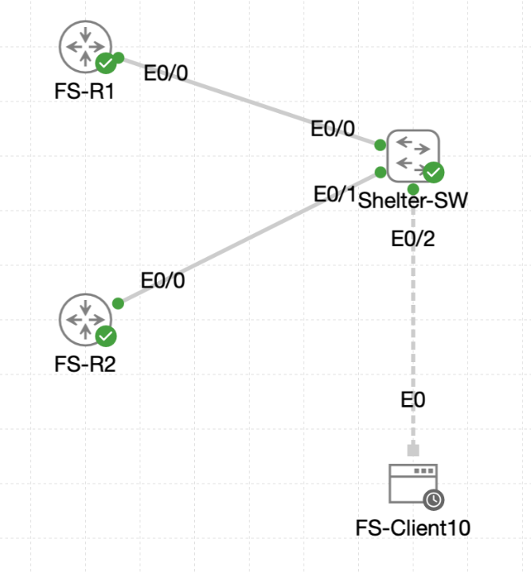

# Lab 048 - Deploying First Hop Redundancy Protocols

<p class="back-link">
  <a href="../../Lab-index.html">← Back to Lab Index</a>
</p>

<table>
<tr>
<td colspan="2" valign="top">

# Objective

#### Deploy HSRPv2 across the Castle Rysen shelter VLANs.
#### Reserve the first usable address in each user subnet as the virtual default gateway.
#### Configure FS-R1 as the preferred active router with higher priority and preemption.
#### Configure FS-R2 as the hot standby router using matching HSRP groups and virtual IPs.
#### Prove that client gateway reachability survives failover and returns to FS-R1 after recovery.

</td>
</tr>

<tr>
<td valign="top">

</td>
</tr>
</table>

---

## Scenario

This lab implements first-hop redundancy for the Castle Rysen Aurora District shelter.

The shelter uses two routers, `FS-R1` and `FS-R2`, connected through `Shelter-SW`. Instead of clients depending on a single physical router IP as their default gateway, HSRPv2 provides a shared virtual gateway address for each VLAN. If the active router fails, the standby router takes over the same virtual gateway IP, allowing hosts to keep using the same default gateway.

The lab focused on VLANs 10, 20, 30 and 40. `FS-R1` was configured as the preferred active router using priority `105`, while `FS-R2` was configured as the standby router using the default priority `100`.

---

## Devices Used

- FS-R1
- FS-R2
- Shelter-SW
- FS-Client10

---

## Addressing and HSRP Plan

| VLAN | Subnet | Virtual Gateway | FS-R1 Real IP | FS-R2 Real IP | HSRP Group |
| --- | --- | --- | --- | --- | --- |
| 10 | 10.0.16.0/27 | 10.0.16.1 | 10.0.16.2 | 10.0.16.3 | 10 |
| 20 | 10.0.16.128/27 | 10.0.16.129 | 10.0.16.130 | 10.0.16.131 | 20 |
| 30 | 10.0.17.0/27 | 10.0.17.1 | 10.0.17.2 | 10.0.17.3 | 30 |
| 40 | 10.0.17.128/27 | 10.0.17.129 | 10.0.17.130 | 10.0.17.131 | 40 |

---

## Configuration Steps

### Step 1 - Reposition FS-R1 Real Gateway Addresses

FS-R1 was moved away from the first usable address in each subnet so that those addresses could be used as HSRP virtual gateways.

```bash
configure terminal
interface ethernet0/0
 no shutdown

interface ethernet0/0.10
 no ip address
 ip address 10.0.16.2 255.255.255.224

interface ethernet0/0.20
 no ip address
 ip address 10.0.16.130 255.255.255.224

interface ethernet0/0.30
 no ip address
 ip address 10.0.17.2 255.255.255.224

interface ethernet0/0.40
 no ip address
 ip address 10.0.17.130 255.255.255.224
end
```

Verification confirmed the physical interface and all four subinterfaces were up/up:

```bash
Ethernet0/0            unassigned      YES unset  up                    up
Ethernet0/0.10         10.0.16.2       YES manual up                    up
Ethernet0/0.20         10.0.16.130     YES manual up                    up
Ethernet0/0.30         10.0.17.2       YES manual up                    up
Ethernet0/0.40         10.0.17.130     YES manual up                    up
```

### Step 2 - Configure FS-R1 as the Preferred Active HSRP Router

HSRP version 2 was enabled on each FS-R1 subinterface. The HSRP group numbers were aligned to the VLAN IDs, and FS-R1 was given priority `105` with preemption.

```bash
interface ethernet0/0.10
 standby version 2
 standby 10 ip 10.0.16.1
 standby 10 priority 105
 standby 10 preempt

interface ethernet0/0.20
 standby version 2
 standby 20 ip 10.0.16.129
 standby 20 priority 105
 standby 20 preempt

interface ethernet0/0.30
 standby version 2
 standby 30 ip 10.0.17.1
 standby 30 priority 105
 standby 30 preempt

interface ethernet0/0.40
 standby version 2
 standby 40 ip 10.0.17.129
 standby 40 priority 105
 standby 40 preempt
```

FS-R1 became active for all groups:

```bash
Interface   Grp  Pri P State   Active          Standby         Virtual IP
Et0/0.10    10   105 P Active  local           unknown         10.0.16.1
Et0/0.20    20   105 P Active  local           unknown         10.0.16.129
Et0/0.30    30   105 P Active  local           unknown         10.0.17.1
Et0/0.40    40   105 P Active  local           unknown         10.0.17.129
```

At this point the standby peer was still unknown because FS-R2 had not fully joined the HSRP groups.

### Step 3 - Correct the FS-R1 VLAN 30 HSRP Group

During configuration, VLAN 30 was briefly placed into HSRP group 20 by mistake:

```bash
standby 20 ip 10.0.17.1
```

That incorrect group was removed and replaced with the intended group 30 configuration:

```bash
no standby 20 ip 10.0.17.1
standby 30 ip 10.0.17.1
standby 30 priority 105
standby 30 preempt
```

This restored the intended group-to-VLAN mapping.

### Step 4 - Configure FS-R2 as the Hot Standby Router

FS-R2 was configured with the third usable host address in each subnet and the same virtual gateway addresses.

```bash
interface ethernet0/0
 no shutdown

interface ethernet0/0.10
 ip address 10.0.16.3 255.255.255.224
 standby version 2
 standby 10 ip 10.0.16.1
 standby 10 preempt

interface ethernet0/0.20
 ip address 10.0.16.131 255.255.255.224
 standby version 2
 standby 20 ip 10.0.16.129
 standby 20 preempt

interface ethernet0/0.30
 ip address 10.0.17.3 255.255.255.224
 standby version 2
 standby 30 ip 10.0.17.1
 standby 30 preempt

interface ethernet0/0.40
 ip address 10.0.17.131 255.255.255.224
 standby version 2
 standby 40 ip 10.0.17.129
 standby 40 preempt
```

The first check showed VLAN 10 working as expected, but VLANs 20, 30 and 40 showed FS-R2 as Active rather than Standby:

```bash
Et0/0.10    10   100 P Standby 10.0.16.2       local           10.0.16.1
Et0/0.20    20   100 P Active  local           unknown         10.0.16.129
Et0/0.30    30   100 P Active  local           unknown         10.0.17.1
Et0/0.40    40   100 P Active  local           unknown         10.0.17.129
```

This indicated a Layer 2 issue preventing HSRP messages from being exchanged in VLANs 20, 30 and 40.

---

## Switch Trunk and VLAN Correction

### Step 5 - Verify Shelter-SW Trunk State

The switch trunks allowed VLANs 10, 20, 30 and 40, but only VLAN 10 was active and forwarding:

```bash
Port           Vlans allowed on trunk
Et0/0          10,20,30,40
Et0/1          10,20,30,40

Port           Vlans allowed and active in management domain
Et0/0          10
Et0/1          10

Port           Vlans in spanning tree forwarding state and not pruned
Et0/0          10
Et0/1          10
```

This showed the VLANs were permitted by trunk configuration but did not exist in the switch VLAN database.

### Step 6 - Create VLANs 20, 30 and 40

The missing VLANs were created on Shelter-SW:

```bash
configure terminal
vlan 20
 name VLAN20
vlan 30
 name VLAN30
vlan 40
 name VLAN40
end
```

After this, all VLANs were active and forwarding on both trunks:

```bash
Port           Vlans allowed and active in management domain
Et0/0          10,20,30,40
Et0/1          10,20,30,40

Port           Vlans in spanning tree forwarding state and not pruned
Et0/0          10,20,30,40
Et0/1          10,20,30,40
```

### Step 7 - Confirm FS-R2 Standby Role

Once the missing VLANs existed on the switch, FS-R2 settled into the correct Standby role for every group:

```bash
Interface   Grp  Pri P State   Active          Standby         Virtual IP
Et0/0.10    10   100 P Standby 10.0.16.2       local           10.0.16.1
Et0/0.20    20   100 P Standby 10.0.16.130     local           10.0.16.129
Et0/0.30    30   100 P Standby 10.0.17.2       local           10.0.17.1
Et0/0.40    40   100 P Standby 10.0.17.130     local           10.0.17.129
```

---

## Client Validation

### Step 8 - Readdress FS-Client10

The TinyCore Linux client initially sat in the wrong VLAN 10 subnet range:

```bash
inet addr:10.0.16.50  Bcast:10.0.16.63  Mask:255.255.255.224
```

It was moved into the correct VLAN 10 subnet and pointed at the HSRP virtual gateway:

```bash
sudo ifconfig eth0 10.0.16.10 netmask 255.255.255.224 broadcast 10.0.16.31 up
sudo route add default gw 10.0.16.1 eth0
```

Verification showed the correct IP and default route:

```bash
inet addr:10.0.16.10  Bcast:10.0.16.31  Mask:255.255.255.224
```

```bash
0.0.0.0         10.0.16.1       0.0.0.0         UG    0      0        0 eth0
```

### Step 9 - Test Reachability Before Failover

The client successfully reached the HSRP virtual gateway and both physical router IPs:

```bash
ping -c 5 10.0.16.1
ping -c 5 10.0.16.2
ping -c 5 10.0.16.3
```

The long-running ping to the virtual gateway also showed stable connectivity:

```bash
57 packets transmitted, 57 packets received, 0% packet loss
```

---

## Failover and Recovery Testing

### Step 10 - Simulate FS-R1 Failure

Before the outage, FS-R1 was Active for all HSRP groups:

```bash
Et0/0.10    10   105 P Active  local           10.0.16.3       10.0.16.1
Et0/0.20    20   105 P Active  local           10.0.16.131     10.0.16.129
Et0/0.30    30   105 P Active  local           10.0.17.3       10.0.17.1
Et0/0.40    40   105 P Active  local           10.0.17.131     10.0.17.129
```

FS-R1's trunk was shut down:

```bash
configure terminal
interface ethernet0/0
 shutdown
end
```

FS-R1 moved its groups to Init:

```bash
%HSRP-5-STATECHANGE: Ethernet0/0.10 Grp 10 state Active -> Init
%HSRP-5-STATECHANGE: Ethernet0/0.20 Grp 20 state Active -> Init
%HSRP-5-STATECHANGE: Ethernet0/0.30 Grp 30 state Active -> Init
%HSRP-5-STATECHANGE: Ethernet0/0.40 Grp 40 state Active -> Init
```

FS-R2 immediately took over as Active:

```bash
%HSRP-5-STATECHANGE: Ethernet0/0.10 Grp 10 state Standby -> Active
%HSRP-5-STATECHANGE: Ethernet0/0.20 Grp 20 state Standby -> Active
%HSRP-5-STATECHANGE: Ethernet0/0.30 Grp 30 state Standby -> Active
%HSRP-5-STATECHANGE: Ethernet0/0.40 Grp 40 state Standby -> Active
```

### Step 11 - Validate Client Reachability During Failover

A client ping during the failover window showed the gateway remained reachable, with a brief packet loss event:

```bash
5 packets transmitted, 4 packets received, 20% packet loss
```

This was acceptable for the lab because it demonstrated a short convergence interruption while still proving the standby router took over.

### Step 12 - Restore FS-R1 and Confirm Preemption

FS-R1's trunk was restored:

```bash
configure terminal
interface ethernet0/0
 no shutdown
end
```

FS-R1 returned to Active:

```bash
%HSRP-5-STATECHANGE: Ethernet0/0.40 Grp 40 state Listen -> Active
%HSRP-5-STATECHANGE: Ethernet0/0.20 Grp 20 state Listen -> Active
%HSRP-5-STATECHANGE: Ethernet0/0.30 Grp 30 state Listen -> Active
%HSRP-5-STATECHANGE: Ethernet0/0.10 Grp 10 state Listen -> Active
```

FS-R2 returned to Standby:

```bash
Interface   Grp  Pri P State   Active          Standby         Virtual IP
Et0/0.10    10   100 P Standby 10.0.16.2       local           10.0.16.1
Et0/0.20    20   100 P Standby 10.0.16.130     local           10.0.16.129
Et0/0.30    30   100 P Standby 10.0.17.2       local           10.0.17.1
Et0/0.40    40   100 P Standby 10.0.17.130     local           10.0.17.129
```

---

## Troubleshooting

### VLANs Were Allowed but Not Active

The most important issue in this lab was that VLANs 20, 30 and 40 were allowed on the trunks but not active in the switch VLAN database. This caused FS-R2 to become Active for those groups because it could not hear FS-R1's HSRP advertisements.

Creating VLANs 20, 30 and 40 fixed the HSRP split-brain behaviour.

### Incorrect HSRP Group on FS-R1

VLAN 30 was briefly configured under HSRP group 20. This was removed and replaced with group 30 so that the group number matched the VLAN ID.

### FS-R2 Address Entry Mistakes

Several FS-R2 addresses were entered incorrectly and then corrected. The final standby output confirmed the correct addresses were in place.

### Router vs Switch Command Context

`show interface trunk` was attempted on FS-R2, but that command belongs on the switch. The correct device for trunk verification was `Shelter-SW`.

### TinyCore Linux Command Limitations

The client did not support the modern `ip` command, so `ifconfig` and `route -n` were used instead.

---

## Key Learning Points

- HSRP allows clients to use a virtual default gateway rather than a physical router address.
- HSRPv2 is enabled with `standby version 2`.
- A higher HSRP priority makes a router preferred for the Active role.
- Preemption allows the preferred router to reclaim Active status after recovery.
- The virtual IP must not be assigned as a physical address on either router.
- HSRP hellos must be exchanged inside the correct VLAN.
- A VLAN can be allowed on a trunk but still fail to forward if it is missing from the VLAN database.
- Router subinterfaces can participate in HSRP just like physical interfaces.
- Client gateways should point to the HSRP virtual IP.
- Short packet loss can occur during failover, but the standby router should take over automatically.

---

## Completion Check

The lab was completed successfully.

- FS-R1 was moved to the second usable host address in each VLAN subnet.
- FS-R1 was configured with HSRPv2 groups 10, 20, 30 and 40.
- FS-R1 priority was set to 105 with preemption enabled.
- FS-R2 was configured with the third usable host address in each VLAN subnet.
- FS-R2 joined the same HSRPv2 groups using the same virtual IP addresses.
- Shelter-SW trunks carried VLANs 10, 20, 30 and 40.
- VLANs 20, 30 and 40 were created on the switch so they became active and forwarding.
- FS-R2 settled into Standby for all groups during normal operation.
- FS-Client10 was configured in VLAN 10 with default gateway 10.0.16.1.
- FS-Client10 successfully reached the HSRP virtual gateway.
- Shutting down FS-R1 caused FS-R2 to become Active.
- Restoring FS-R1 caused FS-R1 to reclaim Active status through preemption.
- FS-R2 returned to Standby after FS-R1 recovered.
