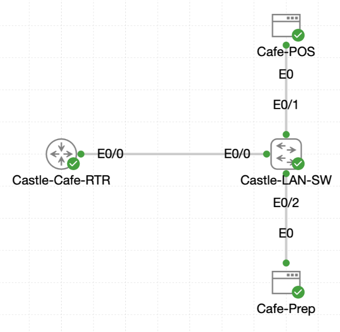

# Lab 049 - Configuring IPv6 Overlay at Castle Rysen Cafe

<p class="back-link">
  <a href="../../Lab-index.html">← Back to Lab Index</a>
</p>

<table>
<tr>
<td colspan="2" valign="top">

<h1>Objective</h1>

<h4>Survey the existing IPv4 router-on-a-stick configuration on Castle-Cafe-RTR.</h4>

<h4>Bring the physical Ethernet trunk online so the existing VLAN 10 and VLAN 20 subinterfaces are operational.</h4>

<h4>Enable IPv6 unicast routing to prepare the router for dual-stack forwarding.</h4>

<h4>Apply IPv6 /64 overlay addresses to the existing VLAN 10 and VLAN 20 subinterfaces.</h4>

<h4>Verify that the router reports both IPv6 overlays as up/up and ready for cafe traffic.</h4>

</td>
</tr>

<tr>
<td valign="top">

</td>
</tr>
</table>

---

## Scenario

This lab adds an IPv6 overlay to the existing Castle Rysen cafe router-on-a-stick design.

The cafe already had IPv4 addressing on two VLAN subinterfaces, but IPv6 was not yet enabled. The goal was to preserve the existing IPv4 segmentation and layer IPv6 addresses onto the same logical interfaces so the router could support dual-stack operation.

During the initial survey, the physical trunk `Ethernet0/0` was administratively down, which meant both VLAN subinterfaces were also down. The trunk was enabled first, then IPv6 routing was activated globally, and finally IPv6 /64 addresses were applied to the VLAN 10 and VLAN 20 subinterfaces.

---

## Devices Used

* Castle-Cafe-RTR

---

## Addressing Plan

| VLAN | Interface | Existing IPv4 Address | IPv6 Overlay Address | Purpose |
| ---- | --------- | --------------------- | -------------------- | ------- |
| 10 | Ethernet0/0.10 | 10.0.18.1/26 | 2001:DB8:1:1::1/64 | Cafe Service VLAN |
| 20 | Ethernet0/0.20 | 10.0.18.65/26 | 2001:DB8:1:2::1/64 | Cafe Operations VLAN |

---

## Configuration Steps

### Step 1 - Survey the IPv4 Baseline

The current IPv4 state of the cafe router was checked first.

```bash
show ip interface brief | include Ethernet0/0
```

### Initial Result

```bash
Ethernet0/0            unassigned      YES unset  administratively down down
Ethernet0/0.10         10.0.18.1       YES TFTP   administratively down down
Ethernet0/0.20         10.0.18.65      YES TFTP   administratively down down
```

### Explanation

The subinterfaces already had the expected IPv4 addresses, but the physical trunk was administratively down. Because router-on-a-stick subinterfaces depend on the parent interface, both VLAN subinterfaces were also down.

Before adding IPv6, the parent interface had to be brought up.

---

### Step 2 - Enable the Physical Trunk

The parent interface was enabled.

```bash
configure terminal
interface ethernet0/0
no shutdown
end
```

### Verification

```bash
show ip interface brief | include Ethernet0/0
```

### Result

```bash
Ethernet0/0            unassigned      YES unset  up                    up
Ethernet0/0.10         10.0.18.1       YES TFTP   up                    up
Ethernet0/0.20         10.0.18.65      YES TFTP   up                    up
```

### Explanation

Once `Ethernet0/0` came up, both subinterfaces also came up. This confirmed the IPv4 baseline was healthy enough for the IPv6 overlay to be added.

---

### Step 3 - Confirm Existing Subinterface Configuration

The running configuration for each subinterface was checked.

```bash
show running-config interface Ethernet0/0.10
show running-config interface Ethernet0/0.20
```

### VLAN 10 Result

```bash
interface Ethernet0/0.10
 description VLAN 10 Cafe Service
 encapsulation dot1Q 10
 ip address 10.0.18.1 255.255.255.192
```

### VLAN 20 Result

```bash
interface Ethernet0/0.20
 description VLAN 20 Cafe Operations
 encapsulation dot1Q 20
 ip address 10.0.18.65 255.255.255.192
```

### Explanation

This confirmed that VLAN 10 and VLAN 20 were already correctly separated with 802.1Q subinterfaces. The IPv6 overlay could therefore be applied directly to the same logical interfaces.

---

### Step 4 - Enable IPv6 Routing

IPv6 routing was enabled globally.

```bash
configure terminal
ipv6 unicast-routing
end
```

### Verification

```bash
show ipv6 interface brief
```

### Result

```bash
Ethernet0/0            [up/up]
    unassigned
Ethernet0/0.10         [up/up]
    unassigned
Ethernet0/0.20         [up/up]
    unassigned
Ethernet0/1            [administratively down/down]
    unassigned
Ethernet0/2            [administratively down/down]
    unassigned
Ethernet0/3            [administratively down/down]
    unassigned
```

### Explanation

The router was now IPv6-capable, but no global IPv6 addresses had been assigned yet. The summary confirmed that the relevant interfaces were active and ready for IPv6 addressing.

---

### Step 5 - Note the IPv6 Summary Filter Issue

A filtered command was attempted:

```bash
show ipv6 interface brief| include Ethernet0/0
```

IOS rejected the version without spacing around the pipe:

```bash
% Invalid input detected at '^' marker.
```

The spaced version worked:

```bash
show ipv6 interface brief | include Ethernet0/0
```

but only displayed the interface header lines:

```bash
Ethernet0/0            [up/up]
Ethernet0/0.10         [up/up]
Ethernet0/0.20         [up/up]
```

### Explanation

For `show ipv6 interface brief`, the IPv6 addresses are printed on the following indented lines. Filtering only for `Ethernet0/0` hides those address lines.

For this reason, the unfiltered command is better evidence when proving the assigned IPv6 addresses.

---

### Step 6 - Apply IPv6 Overlay Addresses

The IPv6 /64 addresses were added to the existing VLAN subinterfaces.

```bash
configure terminal
interface Ethernet0/0.10
ipv6 address 2001:DB8:1:1::1/64
exit
interface Ethernet0/0.20
ipv6 address 2001:DB8:1:2::1/64
end
```

### Explanation

Each VLAN received its own /64 prefix:

* VLAN 10 uses `2001:DB8:1:1::/64`.
* VLAN 20 uses `2001:DB8:1:2::/64`.

The router uses the `::1` address in each subnet as the gateway address for that VLAN.

---

## Verification

### Step 7 - Verify IPv6 Interface Summary

The unfiltered IPv6 interface summary was captured.

```bash
show ipv6 interface brief
```

### Result

```bash
Ethernet0/0            [up/up]
    unassigned
Ethernet0/0.10         [up/up]
    FE80::A8BB:CCFF:FE00:200
    2001:DB8:1:1::1
Ethernet0/0.20         [up/up]
    FE80::A8BB:CCFF:FE00:200
    2001:DB8:1:2::1
Ethernet0/1            [administratively down/down]
    unassigned
Ethernet0/2            [administratively down/down]
    unassigned
Ethernet0/3            [administratively down/down]
    unassigned
```

### Explanation

This confirmed both VLAN subinterfaces were up/up and had their assigned IPv6 global unicast addresses.

The `FE80::` address is the link-local address automatically generated for IPv6 operation on the interface.

---

### Step 8 - Verify Detailed IPv6 Status on VLAN 10

The detailed IPv6 interface output was checked for VLAN 10.

```bash
show ipv6 interface Ethernet0/0.10
```

### Result

```bash
Ethernet0/0.10 is up, line protocol is up
  IPv6 is enabled, link-local address is FE80::A8BB:CCFF:FE00:200
  Description: VLAN 10 Cafe Service
  Global unicast address(es):
    2001:DB8:1:1::1, subnet is 2001:DB8:1:1::/64
```

### Explanation

This confirmed VLAN 10 was fully dual-stack ready, with IPv6 enabled and the expected `/64` prefix active.

---

## Evidence Note

The supplied raw output includes detailed `show ipv6 interface Ethernet0/0.10` evidence for VLAN 10.

It also confirms the VLAN 20 IPv6 address in the unfiltered IPv6 interface summary:

```bash
Ethernet0/0.20         [up/up]
    FE80::A8BB:CCFF:FE00:200
    2001:DB8:1:2::1
```

For a perfect evidence set, the following command should also be captured for VLAN 20:

```bash
show ipv6 interface Ethernet0/0.20
```

Expected confirmation would include:

```bash
2001:DB8:1:2::1, subnet is 2001:DB8:1:2::/64
```

---

## Troubleshooting

### Issue 1 - Parent interface was administratively down

#### Problem

The initial interface summary showed:

```bash
Ethernet0/0            unassigned      YES unset  administratively down down
Ethernet0/0.10         10.0.18.1       YES TFTP   administratively down down
Ethernet0/0.20         10.0.18.65      YES TFTP   administratively down down
```

#### Cause

The parent trunk interface was shut down. Router-on-a-stick subinterfaces cannot come up if the parent physical interface is down.

#### Fix

```bash
interface ethernet0/0
no shutdown
```

After this, the parent interface and both subinterfaces moved to up/up.

---

### Issue 2 - Lowercase interface filter returned no output

#### Problem

This command returned no output:

```bash
show ip interface brief | include ethernet0/0
```

#### Cause

The IOS output used capitalised interface names such as `Ethernet0/0`, so the lowercase filter did not match.

#### Fix

The filter was re-run with matching capitalisation:

```bash
show ip interface brief | include Ethernet0/0
```

---

### Issue 3 - IPv6 summary filter hid address lines

#### Problem

This command only showed the interface header lines:

```bash
show ipv6 interface brief | include Ethernet0/0
```

#### Cause

The actual IPv6 addresses appear on separate indented lines below the interface name, so the filter hides them.

#### Fix

Use the unfiltered command when capturing IPv6 address evidence:

```bash
show ipv6 interface brief
```

---

## Key Learning Points

* IPv6 can be layered onto existing IPv4 interfaces to create a dual-stack design.
* `ipv6 unicast-routing` is required before the router forwards IPv6 traffic.
* Router-on-a-stick subinterfaces depend on the parent physical interface being up.
* IPv4 and IPv6 addresses can coexist on the same subinterface.
* Each IPv6 VLAN segment should normally receive its own /64 prefix.
* The router's `::1` address is commonly used as the gateway address inside a VLAN prefix.
* Link-local `FE80::` addresses appear automatically when IPv6 is enabled on an interface.
* Filtered output can accidentally hide important evidence, especially when command output spans multiple lines.
* Detailed `show ipv6 interface <interface>` output confirms the exact IPv6 prefix assigned to an interface.

---

## Completion Check

The lab was completed with one minor evidence recommendation noted.

* Castle-Cafe-RTR's VLAN 10 and VLAN 20 IPv4 baseline was inspected.
* Ethernet0/0 was found administratively down at the start.
* Ethernet0/0 was enabled with `no shutdown`.
* Ethernet0/0, Ethernet0/0.10 and Ethernet0/0.20 moved to up/up.
* VLAN 10 was confirmed as `10.0.18.1/26` on Ethernet0/0.10.
* VLAN 20 was confirmed as `10.0.18.65/26` on Ethernet0/0.20.
* IPv6 unicast routing was enabled globally.
* Ethernet0/0.10 was assigned `2001:DB8:1:1::1/64`.
* Ethernet0/0.20 was assigned `2001:DB8:1:2::1/64`.
* The unfiltered IPv6 interface summary showed both subinterfaces up/up with their IPv6 addresses.
* Detailed IPv6 evidence confirmed Ethernet0/0.10 advertised `2001:DB8:1:1::/64`.
* Recommended follow-up: capture `show ipv6 interface Ethernet0/0.20` to complete the detailed VLAN 20 evidence.
