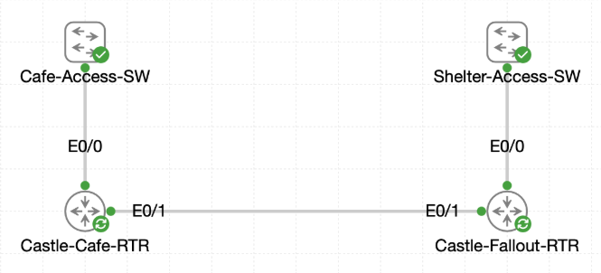

# Lab 050 - Configuring IPv6 at Castle Rysen Fallout Shelter

<p class="back-link">
  <a href="../../Lab-index.html">← Back to Lab Index</a>
</p>

<table>
<tr>
<td colspan="2" valign="top">

# Objective

#### Confirm Castle-Fallout-RTR is ready to forward IPv6 traffic.

#### Enable the shelter VLAN IPv6 overlays using EUI-64 addressing.

#### Configure the IPv6 uplink between Castle-Fallout-RTR and Castle-Cafe-RTR.

#### Add static IPv6 routes so the cafe and fallout shelter overlays can reach each other.

#### Verify the corrected IPv6 path with routing-table evidence and successful IPv6 reachability testing.

</td>
</tr>

<tr>
<td valign="top">

</td>
</tr>
</table>

---

## Scenario

This lab extends the Castle Rysen IPv6 overlay from the cafe router into the fallout shelter.

The cafe already had IPv6 addressing for its VLAN overlays. The next task was to bring `Castle-Fallout-RTR` online with IPv6, assign EUI-64 addresses to the shelter VLAN subinterfaces, configure the IPv6 WAN link back to the cafe, and then use static routes to connect both sites.

The lab also exposed an important troubleshooting point: the cafe-side uplink address was present in the configuration, but the interface carrying it was administratively down. Static routes that depend on a next hop will not install if the router cannot resolve a path to that next hop. Once the cafe uplink was placed on the correct active interface, the connected route appeared and the IPv6 ping to the fallout router succeeded.

---

## Devices Used

* Castle-Fallout-RTR
* Castle-Cafe-RTR

---

## IPv6 Addressing Plan

| Device | Interface | IPv6 Addressing | Purpose |
| ------ | --------- | --------------- | ------- |
| Castle-Cafe-RTR | Ethernet0/0.10 | 2001:DB8:1:1::1/64 | Cafe VLAN overlay |
| Castle-Cafe-RTR | Ethernet0/0.20 | 2001:DB8:1:2::1/64 | Cafe VLAN overlay |
| Castle-Cafe-RTR | Ethernet0/1 | 2001:DB8:1:3::1/64 | Uplink to fallout router |
| Castle-Fallout-RTR | Ethernet0/1 | 2001:DB8:1:3::2/64 | Uplink to cafe router |
| Castle-Fallout-RTR | Ethernet0/0.10 | 2001:DB8:1:4::/64 EUI-64 | Shelter VLAN 10 overlay |
| Castle-Fallout-RTR | Ethernet0/0.20 | 2001:DB8:1:5::/64 EUI-64 | Shelter VLAN 20 overlay |
| Castle-Fallout-RTR | Ethernet0/0.30 | 2001:DB8:1:6::/64 EUI-64 | Shelter VLAN 30 overlay |
| Castle-Fallout-RTR | Ethernet0/0.40 | 2001:DB8:1:7::/64 EUI-64 | Shelter VLAN 40 overlay |

---

## Static Routing Plan

| Router | Destination Prefix | Next Hop |
| ------ | ------------------ | -------- |
| Castle-Fallout-RTR | 2001:DB8:1:1::/64 | 2001:DB8:1:3::1 |
| Castle-Fallout-RTR | 2001:DB8:1:2::/64 | 2001:DB8:1:3::1 |
| Castle-Cafe-RTR | 2001:DB8:1:4::/64 | 2001:DB8:1:3::2 |
| Castle-Cafe-RTR | 2001:DB8:1:5::/64 | 2001:DB8:1:3::2 |
| Castle-Cafe-RTR | 2001:DB8:1:6::/64 | 2001:DB8:1:3::2 |
| Castle-Cafe-RTR | 2001:DB8:1:7::/64 | 2001:DB8:1:3::2 |

---

## Configuration Steps

### Step 1 - Confirm IPv6 Routing on Castle-Fallout-RTR

The first check confirmed that IPv6 unicast routing was already enabled.

```bash
show running-config | include ipv6 unicast-routing
```

### Result

```bash
ipv6 unicast-routing
```

### Explanation

`ipv6 unicast-routing` allows the router to forward IPv6 packets between interfaces. Without this command, IPv6 could be assigned to interfaces, but the router would not route IPv6 traffic between networks.

---

### Step 2 - Check the Initial IPv6 Interface State

The IPv6 interface summary was checked.

```bash
show ipv6 interface brief
```

### Initial Result

```bash
Ethernet0/0            [administratively down/down]
    unassigned
Ethernet0/0.10         [administratively down/down]
    unassigned
Ethernet0/0.20         [administratively down/down]
    unassigned
Ethernet0/0.30         [administratively down/down]
    unassigned
Ethernet0/0.40         [administratively down/down]
    unassigned
Ethernet0/1            [administratively down/down]
    unassigned
```

### Explanation

Both the shelter VLAN trunk and the cafe-facing uplink were administratively down at the start of the lab.

The physical interfaces had to be enabled before the subinterfaces and uplink could carry IPv6 traffic.

---

### Step 3 - Enable the Fallout Router Physical Links

The trunk and uplink were enabled.

```bash
configure terminal
interface Ethernet0/0
no shutdown
interface Ethernet0/1
no shutdown
end
```

### Result

```bash
Ethernet0/0            [up/up]
    unassigned
Ethernet0/0.10         [up/up]
    unassigned
Ethernet0/0.20         [up/up]
    unassigned
Ethernet0/0.30         [up/up]
    unassigned
Ethernet0/0.40         [up/up]
    unassigned
Ethernet0/1            [up/up]
    unassigned
```

### Explanation

Once `Ethernet0/0` was up, the VLAN subinterfaces could come up. Once `Ethernet0/1` was up, the point-to-point IPv6 uplink could be configured and tested.

---

### Step 4 - Configure Shelter VLAN IPv6 Overlays with EUI-64

Each shelter VLAN subinterface was assigned its IPv6 prefix using EUI-64.

```bash
configure terminal
interface Ethernet0/0.10
ipv6 address 2001:DB8:1:4::/64 eui-64
exit
interface Ethernet0/0.20
ipv6 address 2001:DB8:1:5::/64 eui-64
exit
interface Ethernet0/0.30
ipv6 address 2001:DB8:1:6::/64 eui-64
exit
interface Ethernet0/0.40
ipv6 address 2001:DB8:1:7::/64 eui-64
end
```

### Verification

```bash
show ipv6 interface brief
```

### Result

```bash
Ethernet0/0.10         [up/up]
    FE80::A8BB:CCFF:FE00:300
    2001:DB8:1:4:A8BB:CCFF:FE00:300
Ethernet0/0.20         [up/up]
    FE80::A8BB:CCFF:FE00:300
    2001:DB8:1:5:A8BB:CCFF:FE00:300
Ethernet0/0.30         [up/up]
    FE80::A8BB:CCFF:FE00:300
    2001:DB8:1:6:A8BB:CCFF:FE00:300
Ethernet0/0.40         [up/up]
    FE80::A8BB:CCFF:FE00:300
    2001:DB8:1:7:A8BB:CCFF:FE00:300
```

### Explanation

EUI-64 allowed the router to derive the host portion of each IPv6 address automatically.

All four shelter VLANs received global unicast IPv6 addresses and shared the same automatically generated link-local address on their subinterfaces.

---

### Step 5 - Configure the IPv6 Uplink on Castle-Fallout-RTR

The cafe-facing uplink was assigned its global IPv6 address.

```bash
configure terminal
interface Ethernet0/1
ipv6 address 2001:DB8:1:3::2/64
end
```

### Verification

```bash
show ipv6 interface Ethernet0/1
```

### Result

```bash
Ethernet0/1 is up, line protocol is up
  IPv6 is enabled, link-local address is FE80::A8BB:CCFF:FE00:310
  Description: Uplink toward Castle-Cafe-RTR
  Global unicast address(es):
    2001:DB8:1:3::2, subnet is 2001:DB8:1:3::/64
```

### Explanation

This confirmed that the fallout router had a working IPv6 address on the shared uplink network `2001:DB8:1:3::/64`.

---

### Step 6 - Add Static Routes on Castle-Fallout-RTR

Castle-Fallout-RTR was configured with routes back to the cafe IPv6 overlays.

```bash
configure terminal
ipv6 route 2001:DB8:1:1::/64 2001:DB8:1:3::1
ipv6 route 2001:DB8:1:2::/64 2001:DB8:1:3::1
end
```

### Verification

```bash
show ipv6 route static
```

### Result

```bash
S   2001:DB8:1:1::/64 [1/0]
     via 2001:DB8:1:3::1
S   2001:DB8:1:2::/64 [1/0]
     via 2001:DB8:1:3::1
```

### Explanation

These routes told the fallout router how to reach the cafe VLAN overlays through the cafe-side uplink address.

---

### Step 7 - Avoid Self-Referencing Static Routes

An attempt was made to add shelter routes on Castle-Fallout-RTR using its own uplink address as the next hop.

```bash
ipv6 route 2001:DB8:1:4::/64 2001:DB8:1:3::2
```

IOS rejected the route:

```bash
% Not allowed to point static routes through yourself
```

### Explanation

This error was correct. `2001:DB8:1:3::2` belongs to Castle-Fallout-RTR itself, so it cannot be used as a next hop on that same router.

The shelter VLANs are directly connected on Castle-Fallout-RTR, so those routes do not belong there as static routes. They belong on Castle-Cafe-RTR, pointing back toward the fallout router.

---

### Step 8 - Add Static Routes on Castle-Cafe-RTR

The cafe router was configured with routes to all four shelter IPv6 overlays.

```bash
configure terminal
ipv6 route 2001:DB8:1:4::/64 2001:DB8:1:3::2
ipv6 route 2001:DB8:1:5::/64 2001:DB8:1:3::2
ipv6 route 2001:DB8:1:6::/64 2001:DB8:1:3::2
ipv6 route 2001:DB8:1:7::/64 2001:DB8:1:3::2
end
```

### Initial Result

```bash
show ipv6 route static
IPv6 Routing Table - default - 1 entries
```

The static routes did not appear in the active IPv6 routing table.

### Explanation

The routes were configured, but the next hop was not reachable because the cafe-side uplink was administratively down. This meant the router could not resolve `2001:DB8:1:3::2` through an active connected network.

---

### Step 9 - Diagnose the Cafe-Side Uplink Problem

The IPv6 interface summary on Castle-Cafe-RTR showed the problem clearly.

```bash
show ipv6 interface brief
```

### Result

```bash
Ethernet0/0            [administratively down/down]
    unassigned
Ethernet0/0.10         [administratively down/down]
    FE80::A8BB:CCFF:FE00:400
    2001:DB8:1:1::1
Ethernet0/0.20         [administratively down/down]
    FE80::A8BB:CCFF:FE00:400
    2001:DB8:1:2::1
Ethernet0/1            [administratively down/down]
    FE80::A8BB:CCFF:FE00:410
    2001:DB8:1:3::1
```

The running configuration also showed the uplink address on `Ethernet0/1`, but the interface was shut down:

```bash
interface Ethernet0/1
 description Uplink toward Castle-Fallout-RTR
 no ip address
 shutdown
 ipv6 address 2001:DB8:1:3::1/64
```

### Explanation

The cafe router had the correct IPv6 uplink address, but it was on an administratively down interface.

As a result, the route to `2001:DB8:1:3::2` could not be resolved, and IPv6 pings failed with:

```bash
% No valid route for destination
```

---

### Step 10 - Correct the Cafe Uplink Interface

There was a short misstep where the uplink IPv6 address was applied to `Ethernet0/0`, which was the cafe trunk rather than the actual fallout-facing uplink.

IOS warned that the same `/64` was already configured on shutdown `Ethernet0/1`:

```bash
%Ethernet0/0: Informational: 2001:DB8:1:3::1/64 is in use on shutdown Ethernet0/1
```

The correction was to remove the address from `Ethernet0/0` and enable the proper uplink, `Ethernet0/1`.

```bash
configure terminal
interface Ethernet0/0
no ipv6 address 2001:DB8:1:3::1/64
no shutdown
exit
interface Ethernet0/1
no shutdown
end
```

### Final Interface Result

```bash
Ethernet0/1            [up/up]
    FE80::A8BB:CCFF:FE00:410
    2001:DB8:1:3::1
```

### Connected Route Verification

```bash
show ipv6 route connected
```

### Result

```bash
C   2001:DB8:1:1::/64 [0/0]
     via Ethernet0/0.10, directly connected
C   2001:DB8:1:2::/64 [0/0]
     via Ethernet0/0.20, directly connected
C   2001:DB8:1:3::/64 [0/0]
     via Ethernet0/1, directly connected
```

### Explanation

Once `Ethernet0/1` was up/up, the cafe router had a connected route to the WAN prefix `2001:DB8:1:3::/64`. This allowed it to reach the next hop `2001:DB8:1:3::2`.

---

### Step 11 - Verify IPv6 Reachability Across the Uplink

The final ping from Castle-Cafe-RTR to Castle-Fallout-RTR succeeded.

```bash
ping 2001:DB8:1:3::2
```

### Result

```bash
Sending 5, 100-byte ICMP Echos to 2001:DB8:1:3::2, timeout is 2 seconds:
!!!!!
Success rate is 100 percent (5/5), round-trip min/avg/max = 1/1/1 ms
```

### Explanation

This proved that the IPv6 uplink was operational after the interface correction.

The supplied evidence confirms successful reachability to the fallout-side uplink address. It does not include a final successful ping to one of the shelter EUI-64 VLAN addresses after the cafe uplink fix, so that would be the ideal extra capture for a perfect completion record.

---

## Troubleshooting

### Issue 1 - Physical interfaces were administratively down

#### Problem

The first IPv6 summary showed `Ethernet0/0`, all shelter subinterfaces, and `Ethernet0/1` as administratively down.

#### Fix

The physical interfaces were enabled with:

```bash
interface Ethernet0/0
no shutdown
interface Ethernet0/1
no shutdown
```

---

### Issue 2 - Static routes cannot point through the local router's own address

#### Problem

Castle-Fallout-RTR rejected static routes pointing to `2001:DB8:1:3::2`.

```bash
% Not allowed to point static routes through yourself
```

#### Fix

The shelter VLAN routes were correctly placed on Castle-Cafe-RTR, using the fallout router's uplink address as the next hop.

---

### Issue 3 - Cafe-side static routes did not initially appear

#### Problem

Castle-Cafe-RTR had static routes in the running configuration, but `show ipv6 route static` showed no active static routes.

#### Cause

The next-hop address `2001:DB8:1:3::2` was not reachable because the cafe uplink interface was still shut down.

#### Fix

`Ethernet0/1` was enabled on Castle-Cafe-RTR, which restored the connected WAN route and allowed the next hop to become reachable.

---

### Issue 4 - IPv6 address briefly placed on the wrong cafe interface

#### Problem

The WAN IPv6 address was temporarily placed on `Ethernet0/0`, which was the cafe trunk, not the fallout uplink.

#### Fix

The address was removed from `Ethernet0/0`, and `Ethernet0/1` was brought up as the correct uplink interface.

---

### Issue 5 - Mistyped show command

#### Problem

The command below was entered incorrectly:

```bash
how ipv6 route
```

IOS rejected it:

```bash
% Invalid input detected at '^' marker.
```

#### Fix

The correct command was used:

```bash
show ipv6 route
```

---

## Key Learning Points

* `ipv6 unicast-routing` is required for IPv6 forwarding.
* IPv6 addresses can be configured before an interface is up, but routes depending on that interface will not be usable until the interface is operational.
* EUI-64 can generate the host portion of an IPv6 address automatically from the interface identifier.
* Link-local addresses are automatically created when IPv6 is enabled on an interface.
* Static IPv6 routes require a reachable next hop.
* A static route cannot point to the local router's own address.
* `show ipv6 interface brief` should be run unfiltered when the address lines matter.
* `show ipv6 route connected` is useful for confirming whether directly connected IPv6 prefixes are installed.
* The running configuration may contain a static route even when it is not currently installed in the active routing table.
* Interface state is just as important as addressing when troubleshooting IPv6 reachability.

---

## Completion Check

The lab was substantially completed, with one ideal extra verification capture noted.

* Castle-Fallout-RTR had IPv6 unicast routing enabled.
* Castle-Fallout-RTR Ethernet0/0 was enabled.
* Castle-Fallout-RTR Ethernet0/1 was enabled.
* Shelter VLAN subinterfaces came up/up.
* Ethernet0/0.10 received `2001:DB8:1:4::/64` using EUI-64.
* Ethernet0/0.20 received `2001:DB8:1:5::/64` using EUI-64.
* Ethernet0/0.30 received `2001:DB8:1:6::/64` using EUI-64.
* Ethernet0/0.40 received `2001:DB8:1:7::/64` using EUI-64.
* Castle-Fallout-RTR Ethernet0/1 was configured as `2001:DB8:1:3::2/64`.
* Castle-Fallout-RTR had static routes back to cafe overlays `2001:DB8:1:1::/64` and `2001:DB8:1:2::/64`.
* Castle-Cafe-RTR was configured with static routes to shelter overlays `2001:DB8:1:4::/64` through `2001:DB8:1:7::/64`.
* Castle-Cafe-RTR initially failed because its uplink interface was administratively down.
* Castle-Cafe-RTR Ethernet0/1 was corrected and brought up/up.
* Castle-Cafe-RTR installed the connected WAN route through Ethernet0/1.
* Castle-Cafe-RTR successfully pinged Castle-Fallout-RTR at `2001:DB8:1:3::2`.
* Recommended extra evidence: capture a final successful ping from Castle-Cafe-RTR to one of the shelter EUI-64 addresses, such as `2001:DB8:1:4:A8BB:CCFF:FE00:300`, after the uplink correction.
