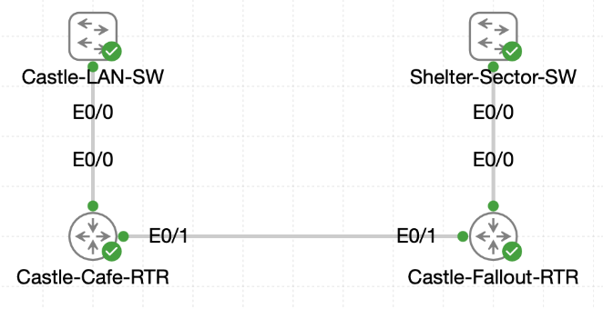

# Lab 051 - IPv6 Overlay Activation for Castle Rysen Field Sites

<p class="back-link">
  <a href="../../Lab-index.html">← Back to Lab Index</a>
</p>

<table>
<tr>
<td colspan="2" valign="top">

# Objective

#### Confirm the existing IPv4 cafe VLAN design before introducing IPv6 overlays.
#### Enable IPv6 routing on the cafe and fallout shelter routers.
#### Apply IPv6 /64 overlays to the cafe VLANs using fixed router addresses.
#### Apply IPv6 /64 overlays to the shelter VLANs using EUI-64 addressing.
#### Build the IPv6 intersite uplink and install reciprocal static routes between the cafe and shelter networks.
#### Capture routing, interface and reachability evidence for the Castle Rysen engineering record.

</td>
</tr>

<tr>
<td valign="top">

</td>
</tr>
</table>

---

## Scenario

This lab brings together the earlier IPv6 overlay work into a wider Castle Rysen field-site deployment.

The cafe already had an IPv4 router-on-a-stick design for VLAN 10 and VLAN 20. The fallout shelter also had multiple VLANs riding across Ethernet subinterfaces. The goal was to preserve the existing IPv4 baseline while layering IPv6 across both sites.

The completed design used fixed IPv6 addresses on the cafe VLAN gateways, EUI-64-generated IPv6 addresses on the shelter VLAN gateways, a dedicated IPv6 /64 intersite uplink between `Castle-Cafe-RTR` and `Castle-Fallout-RTR`, and static IPv6 routes on both routers so each site could reach the other site's overlay networks.

---

## Devices Used

- Castle-Cafe-RTR
- Castle-LAN-SW
- Castle-Fallout-RTR
- Shelter-Sector-SW

---

## IPv4 Baseline Summary

| Device | Interface / VLAN | IPv4 Addressing | Purpose |
| ------ | ---------------- | --------------- | ------- |
| Castle-Cafe-RTR | Ethernet0/0.10 | 10.0.18.1/26 | Cafe VLAN 10 gateway |
| Castle-Cafe-RTR | Ethernet0/0.20 | 10.0.18.65/26 | Cafe VLAN 20 gateway |
| Castle-LAN-SW | VLAN 10 | Active | Cafe service VLAN |
| Castle-LAN-SW | VLAN 20 | Active | Cafe operations VLAN |
| Castle-LAN-SW | Ethernet0/0 | 802.1Q trunk | Trunk toward Castle-Cafe-RTR |

---

## IPv6 Overlay Plan

| Site | Interface | IPv6 Network / Address | Method |
| ---- | --------- | ---------------------- | ------ |
| Cafe | Ethernet0/0.10 | 2001:DB8:1:1::1/64 | Static |
| Cafe | Ethernet0/0.20 | 2001:DB8:1:2::1/64 | Static |
| Intersite uplink | Castle-Cafe-RTR Ethernet0/1 | 2001:DB8:1:3::1/64 | Static |
| Intersite uplink | Castle-Fallout-RTR Ethernet0/1 | 2001:DB8:1:3::2/64 | Static |
| Shelter | Ethernet0/0.10 | 2001:DB8:1:4::/64 | EUI-64 |
| Shelter | Ethernet0/0.20 | 2001:DB8:1:5::/64 | EUI-64 |
| Shelter | Ethernet0/0.30 | 2001:DB8:1:6::/64 | EUI-64 |
| Shelter | Ethernet0/0.40 | 2001:DB8:1:7::/64 | EUI-64 |

---

## Task 1 - Audit the Cafe Baseline

### Step 1 - Check Castle-Cafe-RTR Interface State

The cafe router was checked before IPv6 was added.

```bash
show ip interface brief
```

### Initial Result

```bash
Interface              IP-Address      OK? Method Status                Protocol
Ethernet0/0            unassigned      YES unset  administratively down down
Ethernet0/0.10         10.0.18.1       YES TFTP   administratively down down
Ethernet0/0.20         10.0.18.65      YES TFTP   administratively down down
```

### Explanation

The subinterfaces already had the correct IPv4 addresses, but the physical trunk was administratively down. Because the subinterfaces depend on the physical parent interface, `Ethernet0/0` had to be enabled before the VLAN subinterfaces could come up.

---

### Step 2 - Enable the Cafe Router Trunk

```bash
configure terminal
interface ethernet0/0
no shutdown
end
```

### Verification

```bash
show ip interface brief
```

### Result

```bash
Ethernet0/0            unassigned      YES unset  up                    up
Ethernet0/0.10         10.0.18.1       YES TFTP   up                    up
Ethernet0/0.20         10.0.18.65      YES TFTP   up                    up
```

### Explanation

This confirmed the IPv4 baseline was stable and the cafe router-on-a-stick subinterfaces were operational before the IPv6 overlay was added.

---

### Step 3 - Confirm Cafe Subinterface Configuration

```bash
show running-config interface Ethernet0/0.10
show running-config interface Ethernet0/0.20
```

### Result

```bash
interface Ethernet0/0.10
 description Cafe VLAN 10 Cafe Service
 encapsulation dot1Q 10
 ip address 10.0.18.1 255.255.255.192
```

```bash
interface Ethernet0/0.20
 description Cafe VLAN 20 Operations
 encapsulation dot1Q 20
 ip address 10.0.18.65 255.255.255.192
```

### Explanation

The router subinterfaces matched the existing IPv4 design. VLAN 10 used `10.0.18.1/26`, VLAN 20 used `10.0.18.65/26`, and both used 802.1Q VLAN tagging.

---

### Step 4 - Verify Castle-LAN-SW VLANs and Trunk

The cafe switch was checked to ensure VLANs 10 and 20 were present and the trunk to the router was active.

```bash
show vlan
show interfaces trunk
```

### Result

```bash
10   VLAN0010                         active    Et0/1
20   VLAN0020                         active    Et0/2
```

```bash
Port           Mode             Encapsulation  Status        Native vlan
Et0/0          on               802.1q         trunking      1

Port           Vlans allowed on trunk
Et0/0          10,20

Port           Vlans allowed and active in management domain
Et0/0          10,20

Port           Vlans in spanning tree forwarding state and not pruned
Et0/0          10,20
```

### Explanation

This confirmed that the Layer 2 cafe foundation was ready for dual-stack operation.

---

## Task 2 - Activate the Cafe IPv6 Overlay

### Step 5 - Enable IPv6 Routing

IPv6 forwarding was enabled globally on `Castle-Cafe-RTR`.

```bash
configure terminal
ipv6 unicast-routing
end
```

### Verification

```bash
show ipv6 interface brief
```

### Result

```bash
Ethernet0/0            [up/up]
    unassigned
Ethernet0/0.10         [up/up]
    unassigned
Ethernet0/0.20         [up/up]
    unassigned
```

### Explanation

IPv6 was active on the router, but no global unicast addresses had been assigned yet.

---

### Step 6 - Configure IPv6 on Cafe VLANs

```bash
configure terminal
interface ethernet0/0.10
ipv6 address 2001:DB8:1:1::1/64
exit
interface ethernet0/0.20
ipv6 address 2001:DB8:1:2::1/64
end
```

### Verification

```bash
show ipv6 interface brief
```

### Result

```bash
Ethernet0/0.10         [up/up]
    FE80::A8BB:CCFF:FE00:100
    2001:DB8:1:1::1
Ethernet0/0.20         [up/up]
    FE80::A8BB:CCFF:FE00:100
    2001:DB8:1:2::1
```

### Explanation

The cafe VLANs now had IPv6 overlay addresses:

- VLAN 10: `2001:DB8:1:1::1/64`
- VLAN 20: `2001:DB8:1:2::1/64`

The router also generated link-local addresses for IPv6 neighbour discovery.

---

### Step 7 - Capture Detailed Cafe IPv6 Interface Evidence

```bash
show ipv6 interface Ethernet0/0.10
show ipv6 interface Ethernet0/0.20
```

### Result for VLAN 10

```bash
Ethernet0/0.10 is up, line protocol is up
  IPv6 is enabled, link-local address is FE80::A8BB:CCFF:FE00:100
  Description: Cafe VLAN 10 Cafe Service
  Global unicast address(es):
    2001:DB8:1:1::1, subnet is 2001:DB8:1:1::/64
  MTU is 1500 bytes
  Hosts use stateless autoconfig for addresses.
```

### Result for VLAN 20

```bash
Ethernet0/0.20 is up, line protocol is up
  IPv6 is enabled, link-local address is FE80::A8BB:CCFF:FE00:100
  Description: Cafe VLAN 20 Operations
  Global unicast address(es):
    2001:DB8:1:2::1, subnet is 2001:DB8:1:2::/64
  MTU is 1500 bytes
  Hosts use stateless autoconfig for addresses.
```

### Explanation

This confirmed the cafe VLAN overlays were active, operational and ready for IPv6 host autoconfiguration.

---

## Task 3 - Provision Shelter VLAN Overlays with EUI-64

### Step 8 - Confirm IPv6 Routing on Castle-Fallout-RTR

```bash
show running-config | include ipv6 unicast-routing
```

### Result

```bash
ipv6 unicast-routing
```

### Explanation

IPv6 routing was already enabled on the fallout shelter router.

---

### Step 9 - Enable Shelter Router Interfaces

The parent VLAN trunk and the router uplink initially appeared administratively down.

```bash
show ipv6 interface brief
```

### Initial Result

```bash
Ethernet0/0            [administratively down/down]
Ethernet0/0.10         [administratively down/down]
Ethernet0/0.20         [administratively down/down]
Ethernet0/0.30         [administratively down/down]
Ethernet0/0.40         [administratively down/down]
Ethernet0/1            [administratively down/down]
```

They were enabled:

```bash
configure terminal
interface Ethernet0/0
no shutdown
interface Ethernet0/1
no shutdown
end
```

---

### Step 10 - Configure EUI-64 Shelter VLAN Addresses

```bash
configure terminal
interface ethernet0/0.10
ipv6 address 2001:DB8:1:4::/64 eui-64
exit
interface ethernet0/0.20
ipv6 address 2001:DB8:1:5::/64 eui-64
exit
interface ethernet0/0.30
ipv6 address 2001:DB8:1:6::/64 eui-64
exit
interface ethernet0/0.40
ipv6 address 2001:DB8:1:7::/64 eui-64
exit
end
```

### Verification

```bash
show ipv6 interface brief
```

### Result

```bash
Ethernet0/0.10         [up/up]
    FE80::A8BB:CCFF:FE00:200
    2001:DB8:1:4:A8BB:CCFF:FE00:200
Ethernet0/0.20         [up/up]
    FE80::A8BB:CCFF:FE00:200
    2001:DB8:1:5:A8BB:CCFF:FE00:200
Ethernet0/0.30         [up/up]
    FE80::A8BB:CCFF:FE00:200
    2001:DB8:1:6:A8BB:CCFF:FE00:200
Ethernet0/0.40         [up/up]
    FE80::A8BB:CCFF:FE00:200
    2001:DB8:1:7:A8BB:CCFF:FE00:200
```

### Explanation

The shelter VLANs received IPv6 addresses using EUI-64. This means the network prefix was manually assigned, while the interface identifier was derived automatically from the interface MAC address.

---

### Step 11 - Verify Shelter-Sector-SW Trunk Support

```bash
show interfaces trunk
```

### Result

```bash
Port           Mode             Encapsulation  Status        Native vlan
Et0/0          on               802.1q         trunking      1

Port           Vlans allowed on trunk
Et0/0          10,20,30,40

Port           Vlans allowed and active in management domain
Et0/0          10,20,30,40

Port           Vlans in spanning tree forwarding state and not pruned
Et0/0          10,20,30,40
```

### Explanation

The shelter switch trunk was carrying VLANs 10, 20, 30 and 40. This supported the shelter router subinterfaces used for the IPv6 overlay.

The command `show vlans` returned `No Virtual LANs configured`, but the trunk output confirmed the VLANs were allowed, active and forwarding in the relevant switching context.

---

## Task 4 - Secure the IPv6 Uplink and Static Paths

### Step 12 - Configure the Fallout Router Uplink

```bash
configure terminal
interface ethernet0/1
description IPv6 uplink to Castle-Cafe-RTR
ipv6 address 2001:DB8:1:3::2/64
no shutdown
end
```

### Verification

```bash
show ipv6 interface brief
```

### Result

```bash
Ethernet0/1            [up/up]
    FE80::A8BB:CCFF:FE00:210
    2001:DB8:1:3::2
```

### Explanation

The shelter side of the IPv6 point-to-point link was now active on `2001:DB8:1:3::2/64`.

---

### Step 13 - Configure the Cafe Router Uplink

```bash
configure terminal
interface ethernet0/1
description IPv6 Uplink to Castle-Fallout-RTR
ipv6 address 2001:DB8:1:3::1/64
no shutdown
end
```

### Verification

```bash
show ipv6 interface brief
show ipv6 route 2001:DB8:1:3::/64
```

### Result

```bash
Ethernet0/1            [up/up]
    FE80::A8BB:CCFF:FE00:110
    2001:DB8:1:3::1
```

```bash
Routing entry for 2001:DB8:1:3::/64
  Known via "connected", distance 0, metric 0, type connected
  Routing paths:
    directly connected via Ethernet0/1
```

### Explanation

The cafe side of the uplink was now active and the connected route for `2001:DB8:1:3::/64` pointed through `Ethernet0/1`.

---

### Step 14 - Test Uplink Reachability

From `Castle-Fallout-RTR`:

```bash
ping ipv6 2001:DB8:1:3::1
```

### Result

```bash
Success rate is 100 percent (5/5), round-trip min/avg/max = 1/1/1 ms
```

From `Castle-Cafe-RTR`:

```bash
ping ipv6 2001:DB8:1:3::2
```

### Result

```bash
Success rate is 100 percent (5/5), round-trip min/avg/max = 1/1/3 ms
```

### Explanation

Both routers could reach each other across the IPv6 uplink.

---

### Step 15 - Configure Static Routes on Castle-Fallout-RTR

Static routes were added back toward the cafe VLAN overlays.

```bash
configure terminal
ipv6 route 2001:DB8:1:1::/64 2001:DB8:1:3::1
ipv6 route 2001:DB8:1:2::/64 2001:DB8:1:3::1
end
```

### Verification

```bash
show ipv6 route static
show running-config | include ^ipv6 route
```

### Result

```bash
S   2001:DB8:1:1::/64 [1/0]
     via 2001:DB8:1:3::1
S   2001:DB8:1:2::/64 [1/0]
     via 2001:DB8:1:3::1
```

```bash
ipv6 route 2001:DB8:1:1::/64 2001:DB8:1:3::1
ipv6 route 2001:DB8:1:2::/64 2001:DB8:1:3::1
```

### Explanation

The fallout shelter router now knew to send traffic for the cafe IPv6 VLANs toward the cafe-side uplink address.

---

### Step 16 - Configure Static Routes on Castle-Cafe-RTR

Static routes were added toward the shelter VLAN overlays.

```bash
configure terminal
ipv6 route 2001:DB8:1:4::/64 2001:DB8:1:3::2
ipv6 route 2001:DB8:1:5::/64 2001:DB8:1:3::2
ipv6 route 2001:DB8:1:6::/64 2001:DB8:1:3::2
ipv6 route 2001:DB8:1:7::/64 2001:DB8:1:3::2
end
```

### Verification

```bash
show ipv6 route static
show running-config | include ^ipv6 route
```

### Result

```bash
S   2001:DB8:1:4::/64 [1/0]
     via 2001:DB8:1:3::2
S   2001:DB8:1:5::/64 [1/0]
     via 2001:DB8:1:3::2
S   2001:DB8:1:6::/64 [1/0]
     via 2001:DB8:1:3::2
S   2001:DB8:1:7::/64 [1/0]
     via 2001:DB8:1:3::2
```

```bash
ipv6 route 2001:DB8:1:4::/64 2001:DB8:1:3::2
ipv6 route 2001:DB8:1:5::/64 2001:DB8:1:3::2
ipv6 route 2001:DB8:1:6::/64 2001:DB8:1:3::2
ipv6 route 2001:DB8:1:7::/64 2001:DB8:1:3::2
```

### Explanation

The cafe router now knew to send traffic for all four shelter IPv6 VLANs toward the shelter-side uplink address.

---

## Task 5 - Validate Dual-Stack Readiness

### Connected Route Evidence on Castle-Cafe-RTR

```bash
show ipv6 route connected
```

### Result

```bash
C   2001:DB8:1:1::/64 [0/0]
     via Ethernet0/0.10, directly connected
C   2001:DB8:1:2::/64 [0/0]
     via Ethernet0/0.20, directly connected
C   2001:DB8:1:3::/64 [0/0]
     via Ethernet0/1, directly connected
```

### Connected Route Evidence on Castle-Fallout-RTR

```bash
show ipv6 route connected
```

### Result

```bash
C   2001:DB8:1:3::/64 [0/0]
     via Ethernet0/1, directly connected
C   2001:DB8:1:4::/64 [0/0]
     via Ethernet0/0.10, directly connected
C   2001:DB8:1:5::/64 [0/0]
     via Ethernet0/0.20, directly connected
C   2001:DB8:1:6::/64 [0/0]
     via Ethernet0/0.30, directly connected
C   2001:DB8:1:7::/64 [0/0]
     via Ethernet0/0.40, directly connected
```

### Explanation

Both routers had connected routes for their local IPv6 overlay networks and static routes for the remote overlays.

---

## Troubleshooting and Notes

### Issue 1 - Cafe physical trunk initially down

#### Symptom

```bash
Ethernet0/0            unassigned      YES unset  administratively down down
Ethernet0/0.10         10.0.18.1       YES TFTP   administratively down down
Ethernet0/0.20         10.0.18.65      YES TFTP   administratively down down
```

#### Cause

The physical trunk interface was shut down.

#### Fix

```bash
interface ethernet0/0
no shutdown
```

---

### Issue 2 - Fallout router interfaces initially down

#### Symptom

```bash
Ethernet0/0            [administratively down/down]
Ethernet0/1            [administratively down/down]
```

#### Fix

```bash
interface Ethernet0/0
no shutdown
interface Ethernet0/1
no shutdown
```

---

### Issue 3 - `show vlans` output on Shelter-Sector-SW

#### Observation

```bash
show vlans

No Virtual LANs configured.
```

#### Interpretation

This command output did not provide the useful VLAN database view expected from a normal `show vlan` check. The trunk command gave the relevant evidence instead, showing VLANs 10, 20, 30 and 40 active and forwarding across the router trunk.

---

### Issue 4 - Full end-to-end VLAN ping evidence not captured

#### Observation

The supplied CLI confirms:

- IPv6 overlays on both cafe VLANs.
- EUI-64 overlays on all four shelter VLANs.
- The IPv6 uplink is up/up.
- Both routers can ping each other across the `2001:DB8:1:3::/64` uplink.
- Static IPv6 routes are installed on both routers.

The capture does not show final pings from the cafe router to each shelter VLAN EUI-64 address, or return pings from the shelter router to the cafe VLAN addresses.

#### Recommended Additional Evidence

For a fuller engineering record, capture:

```bash
Castle-Cafe-RTR#ping ipv6 2001:DB8:1:4:A8BB:CCFF:FE00:200
Castle-Cafe-RTR#ping ipv6 2001:DB8:1:5:A8BB:CCFF:FE00:200
Castle-Cafe-RTR#ping ipv6 2001:DB8:1:6:A8BB:CCFF:FE00:200
Castle-Cafe-RTR#ping ipv6 2001:DB8:1:7:A8BB:CCFF:FE00:200

Castle-Fallout-RTR#ping ipv6 2001:DB8:1:1::1
Castle-Fallout-RTR#ping ipv6 2001:DB8:1:2::1
```

---

## Key Learning Points

- IPv6 overlays can be added without removing the existing IPv4 configuration.
- `ipv6 unicast-routing` is required before the router forwards IPv6 traffic.
- Subinterfaces can run dual-stack IPv4 and IPv6 at the same time.
- EUI-64 lets IOS build the interface ID automatically from the hardware address.
- Every IPv6-enabled interface also receives a link-local address.
- Static IPv6 routes require a reachable next-hop address.
- The intersite link must be operational before routes through that next hop become usable.
- `show ipv6 interface brief` is useful for address and line-state evidence.
- `show ipv6 route connected` confirms local overlay networks.
- `show ipv6 route static` confirms manually configured remote reachability.
- Trunk state still matters, even when the lab focus is IPv6.

---

## Completion Check

The lab was largely completed, with one evidence gap noted.

- Castle-Cafe-RTR IPv4 VLAN 10 and VLAN 20 subinterfaces were confirmed.
- Castle-LAN-SW VLANs 10 and 20 were active.
- Castle-LAN-SW trunk Et0/0 carried VLANs 10 and 20.
- IPv6 routing was enabled on Castle-Cafe-RTR.
- Castle-Cafe-RTR Ethernet0/0.10 advertised `2001:DB8:1:1::1/64`.
- Castle-Cafe-RTR Ethernet0/0.20 advertised `2001:DB8:1:2::1/64`.
- IPv6 routing was confirmed on Castle-Fallout-RTR.
- Castle-Fallout-RTR Ethernet0/0.10 advertised `2001:DB8:1:4:A8BB:CCFF:FE00:200`.
- Castle-Fallout-RTR Ethernet0/0.20 advertised `2001:DB8:1:5:A8BB:CCFF:FE00:200`.
- Castle-Fallout-RTR Ethernet0/0.30 advertised `2001:DB8:1:6:A8BB:CCFF:FE00:200`.
- Castle-Fallout-RTR Ethernet0/0.40 advertised `2001:DB8:1:7:A8BB:CCFF:FE00:200`.
- Shelter-Sector-SW trunk carried VLANs 10, 20, 30 and 40.
- Castle-Cafe-RTR Ethernet0/1 advertised `2001:DB8:1:3::1/64`.
- Castle-Fallout-RTR Ethernet0/1 advertised `2001:DB8:1:3::2/64`.
- Both routers successfully pinged across the IPv6 uplink.
- Castle-Fallout-RTR had static routes to `2001:DB8:1:1::/64` and `2001:DB8:1:2::/64`.
- Castle-Cafe-RTR had static routes to `2001:DB8:1:4::/64` through `2001:DB8:1:7::/64`.
- The supplied evidence does not include final VLAN-to-VLAN IPv6 ping tests, so those should be captured separately if required for full portfolio proof.
