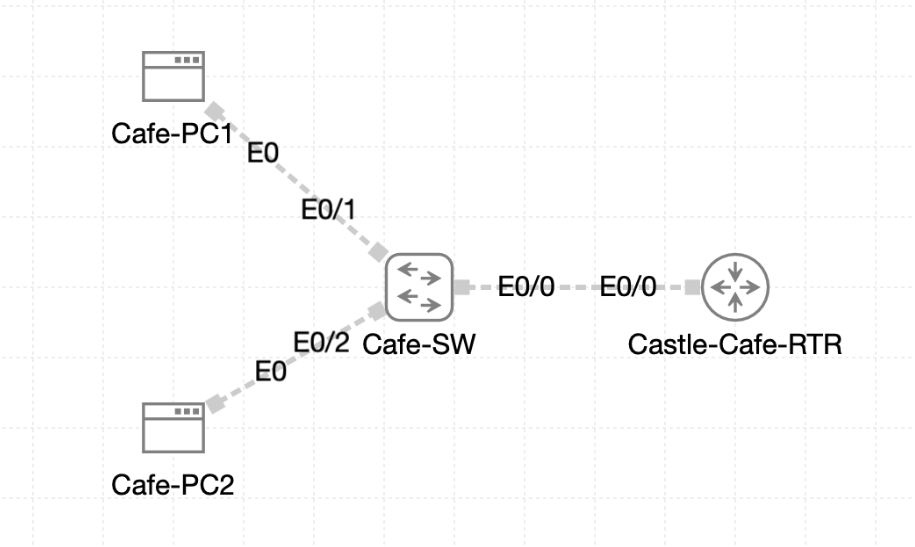

# Lab 052 - Standard ACL Configuration at Castle Rysen

<p class="back-link">
  <a href="../../Lab-index.html">← Back to Lab Index</a>
</p>

<table>
<tr>
<td colspan="2" valign="top">

<h1>Objective</h1>

<h4>Prepare the cafe VLAN path so traffic can flow between the client subnet and the router-on-a-stick gateway.</h4>

<h4>Remove a retired standard ACL from the VTY lines before rebuilding the filtering policy.</h4>

<h4>Create a named standard ACL that blocks Cafe-PC1 while permitting the rest of the cafe subnet.</h4>

<h4>Apply the ACL inbound on the cafe VLAN router subinterface and verify that the intended host is blocked.</h4>

<h4>Confirm another cafe workstation remains permitted, then remove the interface binding to restore normal traffic.</h4>

</td>
</tr>

<tr>
<td valign="top">

</td>
</tr>
</table>

---

## Scenario

This lab focused on standard IPv4 access control lists at the Castle Rysen cafe edge.

A legacy ACL was still referenced under the router VTY lines, so the first part of the lab was to detach that old remote-access filter and remove the stale ACL configuration. The main policy task was then to build a named standard ACL called `PC1-FILTER`, deny traffic sourced from `Cafe-PC1` at `10.0.18.2`, and permit the rest of the cafe network.

The ACL was applied inbound on `Castle-Cafe-RTR` subinterface `Ethernet0/0.10`, which is the router-on-a-stick gateway interface facing the cafe workstation VLAN. Testing showed that `Cafe-PC1` lost reachability to the gateway after the ACL was applied, while `Cafe-PC2` remained able to reach the same gateway.

---

## Devices Used

* Castle-Cafe-RTR
* Cafe-SW
* Cafe-PC1
* Cafe-PC2

---

## Addressing and Policy Summary

| Item | Value |
| ---- | ----- |
| Cafe router physical trunk | Castle-Cafe-RTR Ethernet0/0 |
| Cafe VLAN 10 subinterface | Castle-Cafe-RTR Ethernet0/0.10 |
| Cafe VLAN 10 gateway | 10.0.18.1 |
| Blocked workstation | Cafe-PC1, 10.0.18.2 |
| Permitted workstation evidence | Cafe-PC2 |
| Named ACL | PC1-FILTER |
| ACL direction | Inbound |
| ACL attachment point | Ethernet0/0.10 |
| Legacy ACL removed | ACL 50 from VTY access-class |

---

## Configuration Steps

### Step 1 - Check the Cafe Router Interface State

The router was checked before changing the ACL policy.

```bash
show ip int brief
```

### Initial Result

```bash
Interface              IP-Address      OK? Method Status                Protocol
Ethernet0/0            unassigned      YES unset  administratively down down
Ethernet0/0.10         10.0.18.1       YES TFTP   administratively down down
Ethernet0/1            unassigned      YES unset  administratively down down
Ethernet0/2            unassigned      YES unset  administratively down down
Ethernet0/3            unassigned      YES unset  administratively down down
```

### Explanation

`Ethernet0/0.10` already had the correct gateway address, but it was down because the parent physical interface `Ethernet0/0` was administratively shut down.

Router-on-a-stick subinterfaces depend on the parent interface, so the physical trunk had to be enabled before VLAN 10 could pass traffic.

---

### Step 2 - Enable the Router Trunk

```bash
configure terminal
interface ethernet0/0
no shutdown
```

### Result

```bash
%LINK-3-UPDOWN: Interface Ethernet0/0, changed state to up
%LINEPROTO-5-UPDOWN: Line protocol on Interface Ethernet0/0, changed state to up
```

### Explanation

This brought the physical router trunk online, allowing `Ethernet0/0.10` to become usable for VLAN 10 traffic.

---

### Step 3 - Restore and Verify the Switch Trunk

The switch interface facing the router was configured as an 802.1Q trunk carrying VLAN 10.

```bash
configure terminal
interface ethernet0/0
switchport trunk encapsulation dot1q
switchport mode trunk
switchport trunk allowed vlan 10
spanning-tree portfast trunk
end
```

### Verification

```bash
show interfaces trunk
```

### Result

```bash
Port           Mode             Encapsulation  Status        Native vlan
Et0/0          on               802.1q         trunking      1

Port           Vlans allowed on trunk
Et0/0          10

Port           Vlans allowed and active in management domain
Et0/0          10

Port           Vlans in spanning tree forwarding state and not pruned
Et0/0          10
```

### Explanation

The switch trunk was confirmed as forwarding VLAN 10. This gave the ACL test a working Layer 2 path between the cafe PCs and the router gateway.

---

### Step 4 - Inspect the Legacy VTY ACL Binding

The router VTY section was checked.

```bash
show running-config | section line vty
```

### Result

```bash
line vty 0 4
 access-class 50 in
 password CastleRysen!
 login
 transport input ssh
```

### Explanation

The VTY lines still had ACL 50 applied inbound with `access-class 50 in`. The lab required removing this legacy remote-access filter before rebuilding the new named ACL.

---

### Step 5 - Remove the VTY ACL Binding and Delete ACL 50

```bash
configure terminal
line vty 0 4
no access-class 50 in
exit
no access-list 50
end
```

### Verification

```bash
show running-config | section line vty
```

### Result

```bash
line vty 0 4
 password CastleRysen!
 login
 transport input ssh
```

### Explanation

The VTY lines no longer showed an `access-class` statement, confirming the old ACL binding was removed.

---

## Named Standard ACL Deployment

### Step 6 - Create the Named Standard ACL

```bash
configure terminal
ip access-list standard PC1-FILTER
remark Deny Cafe-PC1 streaming traffic
deny host 10.0.18.2
permit 10.0.18.0 0.0.0.255
exit
end
```

### Verification

```bash
show access-lists PC1-FILTER
```

### Result

```bash
Standard IP access list PC1-FILTER
    10 deny   10.0.18.2
    20 permit 10.0.18.0, wildcard bits 0.0.0.255
```

### Explanation

The ACL used two entries:

* `deny host 10.0.18.2` blocked the problem workstation, Cafe-PC1.
* `permit 10.0.18.0 0.0.0.255` allowed other hosts in the wider `10.0.18.0/24` range.

Because this is a standard ACL, it filters based on source IPv4 address only. It does not filter by destination, protocol, or port.

---

### Step 7 - Confirm Cafe-PC1 Works Before the ACL Is Applied

From `Cafe-PC1`, a baseline ping was sent to the default gateway.

```bash
ping -c 3 10.0.18.1
```

### Result

```bash
3 packets transmitted, 3 packets received, 0% packet loss
round-trip min/avg/max = 0.603/0.930/1.578 ms
```

### Explanation

This proved that Cafe-PC1 could reach the gateway before the ACL was applied.

---

### Step 8 - Apply the ACL Inbound on Ethernet0/0.10

```bash
configure terminal
interface ethernet0/0.10
ip access-group PC1-FILTER in
end
```

### Explanation

The ACL was applied inbound on the router subinterface facing the cafe workstation segment.

This placement means traffic entering the router from VLAN 10 is checked before it is routed further.

---

### Step 9 - Confirm Cafe-PC1 Is Blocked

From `Cafe-PC1`, the gateway ping was repeated.

```bash
ping -c 3 10.0.18.1
```

### Result

```bash
3 packets transmitted, 0 packets received, 100% packet loss
```

### Explanation

The ACL successfully blocked traffic sourced from `10.0.18.2`.

This confirmed that the deny statement matched the intended host.

---

### Step 10 - Confirm Cafe-PC2 Is Still Permitted

From `Cafe-PC2`, the same gateway ping was tested.

```bash
ping -c 3 10.0.18.1
```

### Result

```bash
3 packets transmitted, 3 packets received, 0% packet loss
round-trip min/avg/max = 0.582/0.915/1.543 ms
```

### Explanation

Cafe-PC2 remained able to reach the gateway, proving the ACL was not blocking the whole VLAN.

The permit entry allowed the rest of the subnet to continue passing traffic.

---

### Step 11 - Check ACL Match Counters

```bash
show access-lists PC1-FILTER
```

### Result

```bash
Standard IP access list PC1-FILTER
    10 deny   10.0.18.2 (6 matches)
    20 permit 10.0.18.0, wildcard bits 0.0.0.255 (6 matches)
```

### Explanation

The counters confirmed both policy behaviours:

* The deny line matched Cafe-PC1 traffic.
* The permit line matched permitted cafe traffic.

---

### Step 12 - Remove the ACL from the Interface

The ACL was removed from the subinterface to restore normal service.

```bash
configure terminal
interface ethernet0/0.10
no ip access-group PC1-FILTER in
end
```

### Verification

```bash
show access-lists PC1-FILTER
```

### Result

```bash
Standard IP access list PC1-FILTER
    10 deny   10.0.18.2 (6 matches)
    20 permit 10.0.18.0, wildcard bits 0.0.0.255 (6 matches)
```

### Explanation

The ACL object still existed in the router configuration, but it was no longer bound inbound to `Ethernet0/0.10`.

The supplied evidence shows the interface ACL was removed. A final post-removal ping from Cafe-PC1 was not included in the raw capture, so that would be a useful extra verification step for a fully complete evidence set.

---

## Troubleshooting

### Issue 1 - Router trunk initially administratively down

#### Problem

`Ethernet0/0` and `Ethernet0/0.10` initially showed `administratively down/down`.

#### Fix

```bash
interface ethernet0/0
no shutdown
```

#### Result

The parent trunk came up, allowing the subinterface to become operational.

---

### Issue 2 - Mistyped switch interface command

#### Problem

The command was entered as:

```bash
show ipint brief
```

IOS rejected it.

#### Fix

The corrected command was:

```bash
show ip int brief
```

---

### Issue 3 - VTY 5 to 15 did not exist on this router

#### Problem

The command below was rejected:

```bash
line vty 5 15
```

#### Explanation

This IOS image only showed `line vty 0 4`, so only those VTY lines needed the old access-class removed.

---

### Issue 4 - Permit wildcard was broader than the VLAN subnet

#### Observation

The VLAN gateway was `10.0.18.1`, and the lab traffic was within the cafe VLAN. The ACL permit used:

```bash
permit 10.0.18.0 0.0.0.255
```

#### Explanation

This permits the wider `10.0.18.0/24` range, not just a smaller VLAN segment.

For a stricter VLAN 10-only match, a tighter wildcard such as `10.0.18.0 0.0.0.63` would match a `/26` subnet. However, the ACL in the captured evidence did achieve the lab objective of denying Cafe-PC1 while permitting Cafe-PC2.

---

### Issue 5 - Restoration ping evidence not captured

#### Observation

The ACL was removed from `Ethernet0/0.10`, but the supplied raw output does not include a final Cafe-PC1 ping after removal.

#### Recommended Evidence

```bash
Cafe-PC1$ ping -c 3 10.0.18.1
```

A successful result would close the loop by proving service was restored after removing the interface ACL binding.

---

## Key Learning Points

* A standard ACL filters based on source IPv4 address only.
* Named ACLs are easier to document and maintain than numbered ACLs.
* Remarks make ACL intent clearer for future troubleshooting.
* An ACL can exist in the configuration without affecting traffic until it is applied to an interface or line.
* `access-class` applies an ACL to VTY remote-access lines.
* `ip access-group` applies an ACL to routed interface traffic.
* Inbound ACLs check traffic as it enters the router interface.
* The order of ACL statements matters: specific denies should appear before broad permits.
* Match counters are useful evidence that the ACL is seeing the expected traffic.
* Removing the interface binding restores traffic without deleting the ACL object itself.

---

## Completion Check

The lab was completed with one minor evidence gap noted.

* Castle-Cafe-RTR `Ethernet0/0` was brought up.
* Cafe-SW `Ethernet0/0` was configured as an 802.1Q trunk.
* VLAN 10 was allowed, active and forwarding on the switch trunk.
* The legacy `access-class 50 in` statement was removed from `line vty 0 4`.
* ACL 50 was removed from the configuration.
* Named standard ACL `PC1-FILTER` was created.
* The ACL included a remark documenting its purpose.
* The ACL denied host `10.0.18.2`.
* The ACL permitted other `10.0.18.0` traffic.
* Cafe-PC1 could ping the gateway before the ACL was applied.
* `PC1-FILTER` was applied inbound on `Ethernet0/0.10`.
* Cafe-PC1 was blocked after the ACL was applied.
* Cafe-PC2 remained permitted after the ACL was applied.
* ACL counters showed both deny and permit matches.
* The ACL was removed from `Ethernet0/0.10` to restore normal service.
* A final Cafe-PC1 post-removal ping was not shown in the supplied capture and should be added if strict evidence completeness is required.
