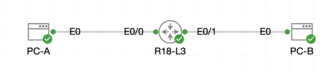

# Lab 053 - Extended ACL Deep Dive

<p class="back-link">
  <a href="../../Lab-index.html">← Back to Lab Index</a>
</p>

<table>
<tr>
<td colspan="2" valign="top">

<h1>Objective</h1>

<h4>Map the baseline connectivity between R18-L3, PC-A and PC-B before applying policy.</h4>

<h4>Create a named extended ACL that allows specific ICMP traffic while denying unwanted echo requests from PC-A.</h4>

<h4>Apply the extended ACL close to the traffic source on Ethernet0/0.</h4>

<h4>Verify that PC-A can still ping PC-B while echo attempts to the router interfaces are blocked.</h4>

<h4>Confirm ACL match counters prove the intended permit and deny statements are being used.</h4>

</td>
</tr>

<tr>
<td valign="top">

</td>
</tr>
</table>

---

## Scenario

This lab focuses on using an extended ACL to control traffic more precisely than a standard ACL.

The network contains router `R18-L3` with two connected Ethernet networks:

* `Ethernet0/0` faces `PC-A` on the `10.18.30.0/24` network.
* `Ethernet0/1` faces `PC-B` on the `10.18.40.0/24` network.

The aim was not to block PC-A completely. Instead, the policy had to allow PC-A to ping PC-B, deny other echo requests from PC-A, and keep other IP traffic available through a final catch-all permit statement.

This demonstrates the main advantage of an extended ACL: it can match source, destination and protocol, allowing much more targeted filtering than a standard ACL.

---

## Devices Used

* R18-L3
* PC-A
* PC-B

---

## Addressing Summary

| Device | Interface | IP Address | Purpose |
| ------ | --------- | ---------- | ------- |
| R18-L3 | Ethernet0/0 | 10.18.30.1/24 | Gateway for PC-A network |
| R18-L3 | Ethernet0/1 | 10.18.40.1/24 | Gateway for PC-B network |
| PC-A | NIC | 10.18.30.10/24 | Roastery floor client |
| PC-B | NIC | 10.18.40.20/24 | Quality Lab client |

---

## ACL Policy Plan

| Sequence | Action | Match | Purpose |
| -------- | ------ | ----- | ------- |
| 10 | Permit | ICMP echo from `10.18.30.10` to `10.18.40.20` | Allow PC-A to ping PC-B |
| 20 | Deny | ICMP echo from `10.18.30.10` to any destination | Block other pings from PC-A |
| 30 | Permit | Any IP traffic | Prevent the ACL from accidentally blocking all other traffic |

---

## Task 0 - Map the Baseline

### Step 1 - Confirm R18-L3 Interface Status

The router interfaces were checked before applying any ACL policy.

```bash
show ip interface brief
```

### Result

```bash
Interface              IP-Address      OK? Method Status                Protocol
Ethernet0/0            10.18.30.1      YES TFTP   up                    up
Ethernet0/1            10.18.40.1      YES TFTP   up                    up
Ethernet0/2            unassigned      YES unset  administratively down down
Ethernet0/3            unassigned      YES unset  administratively down down
```

### Explanation

Both active router interfaces were up/up:

* `Ethernet0/0` was the PC-A side of the router.
* `Ethernet0/1` was the PC-B side of the router.

This confirmed the router was ready for baseline connectivity testing.

---

### Step 2 - Test Baseline Connectivity from PC-A

PC-A was used to test connectivity before the ACL was applied.

```bash
ping -c 3 10.18.30.1
ping -c 3 10.18.40.20
```

### Result

PC-A successfully reached its local gateway:

```bash
3 packets transmitted, 3 packets received, 0% packet loss
round-trip min/avg/max = 0.537/0.572/0.597 ms
```

PC-A also successfully reached PC-B:

```bash
3 packets transmitted, 3 packets received, 0% packet loss
round-trip min/avg/max = 0.830/0.990/1.304 ms
```

### Explanation

This proved that traffic was flowing before the ACL was introduced.

A ping was also attempted to `10.0.18.1`, which failed because that address was not part of this lab topology. The correct local router address for PC-A was `10.18.30.1`.

---

### Step 3 - Test Baseline Connectivity from PC-B

PC-B was used to confirm it could reach its local gateway.

```bash
ping -c 3 10.18.40.1
```

### Result

```bash
3 packets transmitted, 3 packets received, 0% packet loss
round-trip min/avg/max = 0.596/0.625/0.650 ms
```

### Explanation

PC-B successfully reached the router interface on its own subnet.

---

## Task 1 - Craft the Extended ACL

### Step 4 - Build the Named Extended ACL

A named extended ACL was created on `R18-L3`.

```bash
configure terminal
ip access-list extended S18-L03-FILTER
10 permit icmp host 10.18.30.10 host 10.18.40.20 echo
20 deny icmp host 10.18.30.10 any echo
30 permit ip any any
end
```

### Verification

```bash
show ip access-lists S18-L03-FILTER
```

### Result

```bash
Extended IP access list S18-L03-FILTER
    10 permit icmp host 10.18.30.10 host 10.18.40.20 echo
    20 deny icmp host 10.18.30.10 any echo
    30 permit ip any any
```

### Explanation

The ACL was built with a precise order:

1. Permit the specific ping from PC-A to PC-B.
2. Deny all other echo requests from PC-A.
3. Permit all remaining IP traffic.

The order matters because ACLs are processed from top to bottom. If the deny statement had been placed first, the specific PC-A to PC-B ping would also have been blocked.

---

## Task 2 - Deploy and Verify the Filter

### Step 5 - Apply the ACL Inbound on Ethernet0/0

The ACL was applied inbound on the interface closest to PC-A.

```bash
configure terminal
interface ethernet0/0
ip access-group S18-L03-FILTER in
end
```

### Explanation

Extended ACLs are normally placed as close to the source as practical. In this lab, the unwanted traffic originated from PC-A, so the ACL was placed inbound on `Ethernet0/0`.

This means traffic from PC-A is filtered as soon as it enters the router.

---

### Step 6 - Confirm PC-A Can Still Ping PC-B

After the ACL was applied, PC-A tested the permitted destination.

```bash
ping -c 3 10.18.40.20
```

### Result

```bash
3 packets transmitted, 3 packets received, 0% packet loss
round-trip min/avg/max = 0.692/0.776/0.892 ms
```

### Explanation

The ping succeeded because ACL sequence 10 explicitly allowed ICMP echo traffic from PC-A to PC-B.

---

### Step 7 - Confirm PC-A Cannot Ping Router Interfaces

PC-A then tested echo requests that should be denied.

```bash
ping -c 3 10.18.30.1
ping -c 3 10.18.40.1
```

### Result

Ping to `10.18.30.1` failed:

```bash
3 packets transmitted, 0 packets received, 100% packet loss
```

Ping to `10.18.40.1` also failed:

```bash
3 packets transmitted, 0 packets received, 100% packet loss
```

### Explanation

Both pings were denied by sequence 20:

```bash
deny icmp host 10.18.30.10 any echo
```

This statement only denied ICMP echo requests from PC-A. It did not block every protocol because the ACL still ended with:

```bash
permit ip any any
```

---

### Step 8 - Verify ACL Counters

The ACL counters were checked after testing.

```bash
show ip access-lists S18-L03-FILTER
```

### Result

```bash
Extended IP access list S18-L03-FILTER
    10 permit icmp host 10.18.30.10 host 10.18.40.20 echo (3 matches)
    20 deny icmp host 10.18.30.10 any echo (6 matches)
    30 permit ip any any (24 matches)
```

### Explanation

The counters confirmed the ACL was working as intended:

* Sequence 10 matched the three successful PC-A to PC-B pings.
* Sequence 20 matched the six denied pings to the router interfaces.
* Sequence 30 matched other IP traffic that was still allowed.

---

## Troubleshooting and Notes

### Issue 1 - Wrong Baseline Ping Destination

#### Symptom

PC-A initially pinged:

```bash
ping -c 3 10.0.18.1
```

The ping failed with 100% packet loss.

#### Cause

`10.0.18.1` belonged to earlier cafe labs, not this extended ACL lab. The correct local gateway in this topology was `10.18.30.1`.

#### Fix

The correct ping was run:

```bash
ping -c 3 10.18.30.1
```

This succeeded.

---

### Issue 2 - IP Address Entered as a Shell Command

#### Symptom

At the Linux prompt, the address was entered directly:

```bash
10.18.30.1
```

The shell returned:

```bash
-sh: 10.18.30.1: not found
```

#### Cause

An IP address by itself is not a Linux command.

#### Fix

The address was tested with `ping` instead:

```bash
ping -c 3 10.18.30.1
```

---

### Issue 3 - ACL Order Was Critical

The specific permit for PC-A to PC-B had to appear before the broader deny statement.

Correct order:

```bash
10 permit icmp host 10.18.30.10 host 10.18.40.20 echo
20 deny icmp host 10.18.30.10 any echo
30 permit ip any any
```

If sequence 20 had appeared before sequence 10, the PC-A to PC-B ping would have matched the deny statement and failed.

---

## Key Learning Points

* Extended ACLs can filter by source, destination and protocol.
* Named ACLs are easier to read and manage than numbered ACLs.
* ACL sequence numbers control the order in which rules are processed.
* Specific permit statements should be placed before broader deny statements.
* The implicit deny at the end of an ACL can block unexpected traffic if no permit statement is included.
* `permit ip any any` was used here to keep non-denied IP traffic flowing.
* Extended ACLs should usually be placed close to the source of the traffic being filtered.
* Applying the ACL inbound on `Ethernet0/0` stopped PC-A traffic before it crossed the router.
* ACL counters are useful evidence because they prove which rules matched real traffic.
* Linux clients use commands such as `ping -c 3` for controlled ICMP tests.

---

## Completion Check

The lab was completed successfully.

* R18-L3 Ethernet0/0 was confirmed as `10.18.30.1` and up/up.
* R18-L3 Ethernet0/1 was confirmed as `10.18.40.1` and up/up.
* PC-A successfully pinged its default gateway before the ACL was applied.
* PC-A successfully pinged PC-B before the ACL was applied.
* PC-B successfully pinged its default gateway before the ACL was applied.
* Named extended ACL `S18-L03-FILTER` was created.
* Sequence 10 permitted ICMP echo from `10.18.30.10` to `10.18.40.20`.
* Sequence 20 denied other ICMP echo traffic from `10.18.30.10`.
* Sequence 30 permitted all remaining IP traffic.
* The ACL was applied inbound on `R18-L3 Ethernet0/0`.
* PC-A could still ping PC-B after the ACL was applied.
* PC-A could no longer ping `10.18.30.1`.
* PC-A could no longer ping `10.18.40.1`.
* ACL counters showed matches on the permit, deny and catch-all permit statements.
